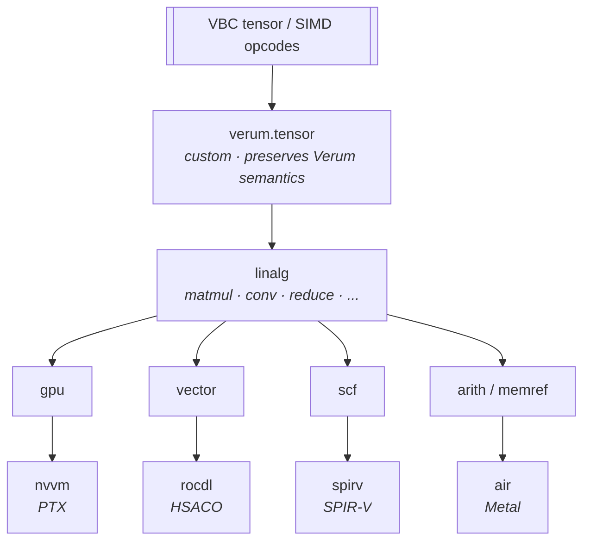

# Code Generation

`verum_codegen` translates VBC bytecode into native machine code via
two backends: **LLVM** for ahead-of-time CPU compilation, and
**MLIR** for the GPU path (`@device(gpu)` functions, tensor
kernels). Neither is a JIT; Verum has two and only two execution
modes, the VBC interpreter and the AOT-lowered native binary.
Everything `verum_codegen` produces is compiled ahead of time.

## LLVM backend

Located in `verum_codegen::llvm`. Organised by concern: instruction
lowering (`instruction.rs`), VBC translation (`vbc_lowering.rs`),
runtime helpers (`runtime.rs`), FFI trampolines (`ffi.rs`), tensor /
SIMD intrinsic mapping (`tensor_ir.rs`, `simd.rs`), platform-specific
IR (`platform_ir.rs`), and target-triple gating
(`target_triple.rs`).

### VBC → LLVM IR

`vbc_lowering.rs` walks VBC functions and emits LLVM IR:

- **Values** become SSA registers.
- **Control flow** maps to LLVM basic blocks + `br` / `br-cond`.
- **Function calls** map to `call` / `invoke` (the latter for
  exception-propagating contexts).
- **CBGR checks** lower to a load-compare-branch sequence, then
  optimised by LLVM's passes.
- **Cubical opcodes** lower to identity / noop (proof erasure).

### Runtime support

`runtime.rs` generates:
- CBGR helper functions (fast-path open-coded inline; slow-path
  emitted as IR helpers in the same module).
- Allocation entry points: every `Heap(...)` lowers to a wrapper
  that calls `verum_os_alloc` / `verum_os_free`, themselves emitted
  by `platform_ir.rs` against `mmap` / `munmap` on Unix and
  `VirtualAlloc` / `VirtualFree` on Windows. There is no libc
  allocator in the dependency chain — see
  **[no-libc architecture](/docs/architecture/no-libc-architecture)**.
- Context stack primitives (push, pop, lookup).
- Panic and unwind machinery.

### FFI trampolines

`ffi.rs` emits trampolines for `extern "C"` functions:
- Argument marshalling (Verum types ↔ C types).
- Return value handling.
- Exception conversion (C errno / return codes → Verum `Result`).
- CBGR guarding of outgoing pointers (wrapped as `&unsafe T`).

### Tensor and SIMD

`tensor_ir.rs` and `simd.rs` map tensor and SIMD opcodes to platform
intrinsics — SSE / AVX / AVX-512 on x86_64, NEON on aarch64, scalar
fallbacks on other targets. Tensor ops that have a fused intrinsic
form on the target (flash attention, layer norm, …) are kept as a
single op all the way down so vendor intrinsics can be emitted
directly rather than reconstructed from primitive linalg.

### GPU (Metal)

`metal_ir.rs` emits Metal shading-language IR for `@gpu.kernel`
functions.

### Inline assembly

`asm.rs` supports `@llvm_only unsafe asm!(...)` for kernels and
drivers. Bitfield layout is handled by `bitfield.rs` for
memory-mapped I/O.

## MLIR backend

Located in `verum_codegen::mlir`. Used for autodiff lowering and the
GPU path (`@device(gpu)` functions and tensor kernels). The LLVM
backend handles CPU AOT; MLIR owns the GPU target family.

MLIR is invoked **only at AOT compile time**. There is no
just-in-time compilation in Verum — GPU kernels are compiled to
their target IR (PTX, HSACO, SPIR-V, Metal AIR) during `verum
build` and embedded into the final executable. The runtime looks a
kernel up by ID and launches it; it never invokes MLIR.

### Dialect stack

VBC lowers progressively through a fixed ladder of dialects:



Passes in `passes/` drive each lowering step. Standard dialects
(`arith`, `cf`, `math`, `memref`) handle the plumbing; `verum.tensor`
keeps high-level shape information alive long enough for fusion
passes to run before dropping to `linalg`.

### VBC → dialect mapping (selected)

| VBC opcode | `verum.tensor` | `linalg` | Target lowering |
|------------|----------------|----------|-----------------|
| `TENSOR_MATMUL` (0xE8) | `verum.matmul` | `linalg.matmul` | `nvvm.mma` / `gpu.wmma` |
| `TENSOR_CONV` (0xEA) | `verum.conv2d` | `linalg.conv_2d_nhwc` | implicit GEMM |
| `TENSOR_SOFTMAX` (0xF4) | `verum.softmax` | `scf.for` + `arith` | online softmax |
| `TENSOR_LAYERNORM` (0xF5) | `verum.layer_norm` | custom | fused kernel |
| `TENSOR_BATCHNORM` (0xF6) | `verum.batch_norm` | custom | fused kernel |
| `TENSOR_EINSUM` (0xEC) | `verum.einsum` | `linalg.generic` | target-specific |
| `TENSOR_FLASH_ATTENTION` (0xFC) | `verum.attention` | — | intrinsic |

Flash attention stays a single op all the way to the target — the
lowering emits vendor intrinsics directly rather than reconstructing
the pattern from `linalg`.

### GPU targets

Four backends share the MLIR pipeline. The canonical mapping is
the `GpuTarget` enum in
`crates/verum_codegen/src/mlir/vbc_lowering.rs` — every row below
is a direct projection of that enum's `target_triple()` /
`dialect()` / `memory_space()` accessors:

| Target | MLIR target triple        | Primary dialect | memref memory space |
|--------|---------------------------|-----------------|:-------------------:|
| CUDA (NVIDIA)               | `nvptx64-nvidia-cuda`     | `nvvm`          | 1 (device global)   |
| ROCm (AMD)                  | `amdgcn-amd-amdhsa`       | `rocdl`         | 1 (device global)   |
| Vulkan                      | `spirv64-unknown-vulkan`  | `spirv`         | 0 (host-shared)     |
| Metal (Apple)               | `air64-apple-macos`       | `metal`         | 0 (host-shared)     |

Two natural partitions on the `GpuTarget` surface:

* **Device-global memory** (`memory_space == 1`): CUDA + ROCm.
  These targets carry a separate device address space; memref
  attributes pin allocations into device global memory.
* **Host-shared memory** (`memory_space == 0`): Vulkan + Metal.
  Address-space 0 is the default; the host-shared model lets
  CPU and GPU access the same allocation without an explicit
  copy. A wrong classification on this axis silently miscompiles
  memref attributes — pinned by the `meta_pin_gpu_target_round_
  trip_unique_and_classification` test in the lowering crate.

Matmul tile sizes are picked per-launch by the
`gpu.lower-matmul-tile` MLIR pass based on detected device
capability rather than declared statically per target — the
numbers vary with CUDA SM version, ROCm CDNA variant, Vulkan
driver, and Metal GPU family, and are not enumerable as a
single-row-per-target table.

### AOT compilation

`aot/` runs the full pass pipeline and emits an object file linked
alongside the LLVM-produced host code. Every GPU kernel in a Verum
binary is produced this way — during `verum build`, never at
runtime. The output is a target-specific binary (PTX, HSACO,
SPIR-V, or Metal AIR) embedded into the executable and loaded by
the runtime on first kernel launch.

### Caching

Compiled kernel binaries are cached keyed by
`(vbc_fingerprint, target, opt_level)` so an incremental rebuild
touches only the kernels whose VBC actually changed. First-build
times vary by target (~50 ms per kernel for NVPTX on modern
hardware) but are paid once per edit, not per program run.

### Why JIT is not a production execution tier

Verum's two **production** execution tiers are the VBC interpreter
(Tier 0) and the AOT-compiled native binary (Tier 1).  An MLIR
`ExecutionEngine`-backed JIT exists as the **experimental
`CompilationMode::MlirJit` mode** (see `pipeline.rs::CompilationMode`
+ `pipeline/mlir.rs::JitEngine`) — its primary use case is hot-reload
during interactive development and incremental rebuild, *not*
shipping production code.

The reasoning for keeping JIT off the production tier list:

  * The interpreter already starts in milliseconds and handles the
    full VBC instruction set (including cubical, HoTT, and autodiff
    opcodes that a JIT would have to recompile every time the type
    checker changes).
  * The AOT path produces native code that matches or beats a JIT's
    peak performance once warmed up — there is no warm-up to avoid
    because the interpreter fills the no-AOT-step role.
  * Promoting JIT to a third production tier would double the
    combinatorial surface of the backend (interpreter × JIT × AOT,
    each with its own CBGR-tier lowerings) without targeting a use
    case that neither of the existing two already covers.

The retained JIT infrastructure under `crates/verum_codegen/src/
mlir/jit/` (engine, hot-reload, incremental, REPL, symbol
resolver) is reachable only by selecting the experimental
`MlirJit` compilation mode explicitly; the canonical
`verum run` / `verum build` flows route through Interpreter /
AOT respectively.

### GPU binaries

`gpu_binary.rs` assembles Metal `.metallib`, SPIR-V modules, or PTX /
HSACO blobs from MLIR-lowered kernels and embeds them into the final
executable via the linker's `__TEXT,__const` section (macOS) or a
dedicated `.rodata.verum_gpu` section (Linux / Windows). The runtime
looks them up by kernel ID at launch time; the launch path has no
dependency on a live MLIR context.

## Autodiff lowering

`@differentiable` functions go through a source-transformation pass
that runs *on the MLIR side* so VJP rules can be expressed over
`linalg` ops rather than bytecode:

1. The primal function is lowered to `verum.tensor` as usual.
2. A reverse-mode pass walks the op graph and emits a companion
   function using VJP rules registered per op.
3. Tape storage (for activations that the backward pass needs) uses
   a stack-allocated `GradientTape` when possible, falling back to
   `Heap<...>` when shapes are dynamic.

The `GradientTape` context sees every `linalg` op, so the backward
pass fuses into the forward kernel whenever the dataflow allows
(saving a materialisation of the primal output).

## Linking

`link.rs` drives the in-tree LLD wrapper (`verum_llvm_sys::lld`) and
applies a **no-libc** linking configuration on every platform:

- **Linux**: `lld` (ELF flavour). No libc, no libm, no libpthread —
  the runtime calls direct syscalls.
- **macOS**: `lld` (Mach-O flavour) linking only `libSystem.B.dylib`,
  Apple's required boundary.
- **Windows**: `lld-link` linking only `ntdll.dll` + `kernel32.dll`
  — no MSVC CRT, no UCRT.
- **FreeBSD**: `lld` (ELF flavour) with direct syscalls.
- **Cross-compilation**: pre-staged sysroots bundled in the `verum`
  binary; every per-platform decision reads the **target** triple,
  never the host's `cfg(target_os)`.

LTO options:
- `thin` (default): fast, good inlining.
- `full`: slower, maximum cross-module optimisation.

See **[no-libc architecture](/docs/architecture/no-libc-architecture)**
for the full ruleset and the per-platform link-audit procedure
(`ldd` / `otool` / `dumpbin`).

## Debug information

- **DWARF** on Linux / macOS.
- **PDB** on Windows.
- Source-level debugging: variables, types, expressions.
- **CBGR header awareness**: debuggers can pretty-print generation and
  epoch.

## Artefact layout

```
target/
├── debug/
│   ├── <name>         (executable or .cog)
│   ├── <name>.vbc     (bytecode, always emitted)
│   └── <name>.dwarf
└── release/
    └── <name>         (LTO'd, stripped)
```

`.cog` is a library artefact: VBC + metadata + optional proof certs.

## See also

- **[VBC bytecode](/docs/architecture/vbc-bytecode)** — the input to
  codegen.
- **[Runtime tiers](/docs/architecture/runtime-tiers)** — when each
  backend runs.
- **[Language → FFI](/docs/language/ffi)** — user-facing FFI boundary.
