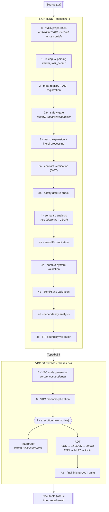
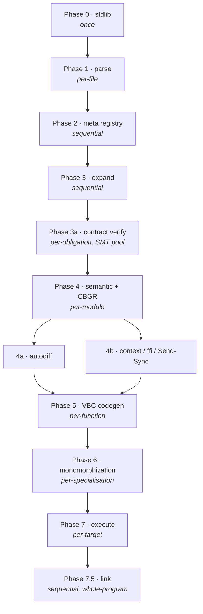

# Compilation Pipeline

The compiler has a **VBC-first architecture**: every program lowers
to VBC bytecode, and VBC is either interpreted (Tier 0) or compiled
to native code via LLVM (Tier 1). Orchestration lives in
`verum_compiler::pipeline::Pipeline`.

## High-level shape



## Phase map

| # | Phase | Parallel? | Key files |
|---|---|---|---|
| 0   | Stdlib preparation                     | once per build         | `phases/phase0_stdlib.rs` |
| 1   | Lexical & parsing                      | per-file               | `verum_lexer`, `verum_fast_parser` |
| 2   | Meta registry & AST registration       | sequential             | `phases/meta_registry_phase.rs` |
| 2.9 | Safety gate                            | per-module             | `phases/safety_gate.rs` — rejects `unsafe` / `@ffi` based on `[safety]` config |
| 3   | Macro expansion & literal processing   | sequential             | `phases/macro_expansion.rs` |
| 3a  | Contract verification (SMT)            | per-obligation         | `phases/contract_verification.rs` (+ `contract_verification_diagnostics.rs`) |
| 3b  | Safety gate re-check                   | per-module             | Same gate as 2.9, re-run inside `phase_type_check` for defense in depth |
| 4   | Semantic analysis (types + CBGR)       | per-module             | `verum_types::infer`, `phases/semantic_analysis.rs` |
| 4a  | Autodiff compilation                   | per `@differentiable`  | `phases/autodiff_compilation.rs` |
| 4b  | Context-system validation              | per-function           | `phases/context_validation.rs` — gated by `[context].enabled` |
| 4c  | Send/Sync validation                   | per-module             | `phases/send_sync_validation.rs` |
| 4d  | Dependency analysis                    | per-module             | `phases/dependency_analysis.rs` — target-profile enforcement (`no_std` / `no_alloc`) |
| 4e  | FFI boundary validation                | per-module             | `phases/ffi_boundary.rs` — gated by `[safety].ffi` |
| 4f  | Entry-point detection                  | once per build         | `phases/entry_detection.rs` — picks `fn main` or the script wrapper |
| 4g  | Verified-contract registration         | once per build         | `phases/verified_contract.rs` (+ `phases/proof_verification.rs` / `proof_erasure.rs` for the proof side) |
| 4h  | Bridge-discharge check                 | per-bridge             | `phases/bridge_discharge_check.rs` — discharges Diakrisis IOU axioms |
| 5   | VBC code generation                    | per-function           | `phases/vbc_codegen.rs`, `verum_vbc::codegen` |
| 5a  | CFG construction                       | per-function           | `phases/cfg_constructor.rs` (verification track only) |
| 5b  | Delegate expansion                     | per-function           | `phases/delegate_expansion.rs` (compilation track) |
| 6   | VBC monomorphization                   | per-specialisation     | `phases/vbc_mono.rs` |
| 6a  | Optimisation (verification track)      | per-function           | `phases/optimization.rs` over `phases/mir_lowering.rs` MIR — bounds-elim / CBGR-elim / SMT-VC obligations live here, NOT on the main path |
| 6b  | Verification phase                     | per-obligation         | `phases/verification_phase.rs` — drives gradual-verification gradient + capability-router dispatch |
| 7   | Execution — Tier 0 (interpret)         | per-target             | `pipeline::phase_interpret` |
| 7   | Execution — Tier 1 (AOT)               | per-target             | `pipeline::run_native_compilation`, `phases/codegen_tiers.rs` |
| 7.5 | Final linking                          | sequential             | `phases/linking.rs` + embedded LLD |

:::note MIR is *not* in the main pipeline
The compiler contains MIR infrastructure, but it is only used by the
**verification** and **advanced optimisation** subsystems (SMT
obligation generation, refinement-aware bounds elimination). The main
compilation path goes **TypedAST → VBC → execution**, never through
MIR.
:::

## Phase 0 — Stdlib preparation

Compiles `core/` modules once per build and caches stdlib metadata
for the type checker and VBC codegen. The persistent disk cache
(`target/.verum-cache/stdlib/`) keys on content hash, so unrelated
edits never invalidate stdlib artefacts. `verum check` skips this
phase entirely — signatures come directly from built-ins.

## Phase 1 — Lexical & parsing

- Tokenisation via `verum_lexer` (logos-generated DFA).
- Recursive-descent parsing via `verum_fast_parser` → a lossless
  green-tree AST preserving comments and whitespace.
- Entry-point discovery (`main`, `@test`, `@bench`).

File-level parsing parallelises across cores.

## Phase 2 — Meta registry & AST registration

Registers every `@derive`, tagged-literal handler, `@verify`
attribute, and user-defined `meta fn` into a global `MetaRegistry`.
This makes Phase 3 order-independent — a macro can refer to a type
defined later in the same file.

## Phase 3 — Macro expansion & literal processing

- Procedural macros (`@derive`, `@meta_macro`-registered functions).
- Tagged-literal parsing (`json#`, `sql#`, `rx#`, `url#`, …). Each
  tag validates its content at compile time; invalid content is a
  **compile error**, not a runtime failure.
- `quote` / splice / `lift` hygiene enforcement (see
  **[metaprogramming](/docs/language/meta/quote-and-hygiene)**).

Contract literals (`contract#"..."`) are parsed here and verified in
Phase 3a.

## Phase 3a — Contract verification

```
contract#"""ensures result >= 0"""  →  SMT-LIB obligation  →  solver  →  verified
```

- Collects contract obligations from `contract#` literals.
- Translates to SMT-LIB via `verum_smt::expr_to_smtlib`.
- Dispatches to a single solver or the portfolio executor per the
  function's `@verify(...)` mode.
- Fails the build with a counter-example on violation.

This runs between Phase 3 and Phase 4 because a contract's proof may
reference `@logic` functions registered in Phase 2 but must be
discharged before the type checker sees the annotated function.

## Phase 4 — Semantic analysis

- **Bidirectional inference** (`verum_types::infer`).
- **Refinement types** — narrowed by flow analysis where possible;
  unresolved predicates become SMT obligations at this phase. The
  `DependentVerifier` runs here, as a sub-step of semantic analysis,
  not as a later phase of its own.
- **Context clauses** — `using [...]` resolved; capability subtyping
  checked.
- **CBGR analysis** — every `&T` receives a tier annotation
  (managed / checked / unsafe) through the multi-module
  reference-analysis suite documented in
  **[cbgr internals](/docs/architecture/cbgr-internals#compile-time-analysis-suite)**.
- **Cubical bridge** — `Type.Eq` values translated via
  `verum_types::cubical_bridge` to cubical terms before unification.

Verification results that feed later phases are produced here as
the **Phase 4 refinement / DependentVerifier sub-step**, which
together with the Phase 3a contract sub-step covers everything
the SMT layer is asked to discharge. See
**[verification pipeline](/docs/architecture/verification-pipeline)**
for the solver-side internals.

## Phase 4a — Autodiff compilation

For every `@differentiable fn`, builds the computational graph and
synthesises a VJP (vector-Jacobian product) companion. See
**[math → autodiff](/docs/stdlib/math#layer-6--automatic-differentiation)**
for the user-facing API; the transformation runs on MLIR
`verum.tensor` ops so VJPs can fuse with the forward kernel.

## Phase 4b — Context-system validation

Validates that every `using [...]` clause has a matching `provide`
on every call path, enforces capability attenuation, and rejects
forbidden contexts declared via `!IO`-style negative constraints.

Also runs Send/Sync enforcement for values crossing `spawn`.

`extern "C"` / `ffi { ... }` contracts are validated here — boundary
contracts (`memory_effects`, `errors_via`, `@ownership`) must be
consistent with the declared signature.

Phases 4a and 4b run in parallel after Phase 4's core type checking.

## Phase 5 — VBC code generation

`phases/vbc_codegen.rs` lowers TypedAST to VBC bytecode function by
function. Every function in the program — stdlib included — ends up
as VBC.

- **Opcodes**: the ~200-opcode VBC instruction set
  (see [vbc bytecode](/docs/architecture/vbc-bytecode)).
- **CBGR opcodes**: Tier-aware lowering emits `Ref` / `RefMut` for
  Tier 0 references, `RefChecked` for Tier 1 (compiler-proven safe),
  and `RefUnsafe` for Tier 2.
- **Cubical erasure**: path, transport, and univalence terms lower
  to identity / no-op (proof erasure is enabled by default via
  `[codegen] proof_erasure = true`).

## Phase 6 — VBC monomorphization

Generic functions specialise per concrete argument types. Duplicate
instantiations dedupe via structural hashing, and the
monomorphisation cache (`[codegen] monomorphization_cache = true`)
reuses specialisations across incremental builds.

## Phase 7 — Execution (two-tier model v2.1)

### Tier 0 — interpretation

`phase_interpret` runs the VBC directly with full safety checks.
Used by `verum run` (default), `verum test`, `verum bench`, the
Playbook TUI, and `meta fn` evaluation inside Phases 2–4.

### Tier 1 — AOT

`run_native_compilation` lowers VBC → LLVM IR via
`verum_codegen::llvm::VbcToLlvmLowering`, runs LLVM's optimisation
pipeline, emits object files, and hands off to **Phase 7.5 linking**
below. Triggered by `verum build`, `verum run --aot`, or
`[profile.release] tier = "1"`.

:::note Worker fence before LLVM
LLVM initialises its back-end pass registry lazily via
function-local statics. To keep that initialisation race-free
across the parallel phase pool, the pipeline initialises the
target on the main thread before any worker is spawned, then
issues a fan-out / fan-in barrier just before codegen so every
worker has finished its prior phase by the time LLVM is touched.
This keeps repeated AOT builds deterministic on every supported
host.
:::

### Dual-path: GPU via MLIR

Functions annotated `@device(GPU)` (or auto-selected when tensor
ops exceed a cost threshold) go through
`verum_codegen::mlir::VbcToMlirGpuLowering` instead: VBC →
`verum.tensor` → `linalg` → `gpu` → PTX / HSACO / SPIR-V / Metal.
**MLIR is only used for GPU** — CPU code always goes through LLVM.

## Phase 7.5 — Final linking (AOT only)

Static linking via **embedded LLD** — Verum ships its own linker.

- **No-libc freestanding**: the runtime is implemented in Verum's
  own intrinsics; no glibc / musl / MSVC CRT dependency. macOS is
  the one exception, where `libSystem.B.dylib` is Apple's stable
  ABI entry point and the only acceptable boundary. See
  **[no-libc architecture](/docs/architecture/no-libc-architecture)**.
- **LLD flavours**: ELF (Linux, FreeBSD), Mach-O (macOS), COFF
  (Windows).
- **LTO**: thin by default (configurable in `[linker]` / `[lto]`).
- **Targets**: x86_64, aarch64, riscv64, wasm32, plus embedded
  profiles such as `thumbv7em` and `riscv32imac`.

## Parallelisation strategy

| Phase  | Work                         | Granularity                          |
|--------|------------------------------|--------------------------------------|
| 0      | stdlib                       | once per build                       |
| 1      | parse                        | per-file                             |
| 2      | meta registry                | sequential                           |
| 3      | expand                       | sequential                           |
| 3a     | contract verify              | per-obligation (SMT pool)            |
| 4      | semantic + CBGR              | per-module                           |
| 4a     | autodiff                     | per `@differentiable` function       |
| 4b     | context / ffi / Send-Sync    | per-function                         |
| 5      | VBC codegen                  | per-function                         |
| 6      | monomorphization             | per-specialisation                   |
| 7      | execute (interp or AOT)      | per-target                           |
| 7.5    | link                         | sequential (LTO needs whole program) |



## Incremental compilation

See **[incremental compilation](/docs/architecture/incremental-compilation)**
for the full strategy. Key points:

- **Fingerprinting**: source + type + dependency + config hash per
  function.
- **Cache location**: `target/.verum-cache/{functions,stdlib,smt}/`.
- **Hit rate**: 10–15× faster rebuild after a one-function edit on
  50 K-LOC projects.

## Pipeline diagnostics

```bash
$ verum build --timings
phase 0   (stdlib)              0.20s  (cache hit)
phase 1   (parse)               0.25s
phase 2   (meta registry)       0.02s
phase 3   (expand)              0.14s
phase 3a  (contracts)           0.09s  (12 obligations, smt-backend)
phase 4   (semantic + cbgr)     0.61s
phase 4a  (autodiff)            0.04s
phase 4b  (context/ffi)         0.02s
phase 5   (vbc codegen)         0.53s
phase 6   (monomorphization)    0.18s
phase 7   (aot: vbc → llvm)     2.11s
phase 7.5 (link)                0.32s
total                           4.51s
```

### Breadcrumbs on failure

Every phase pushes an RAII breadcrumb (`verum_error::breadcrumb`) so
that if the pipeline panics or crashes with a fatal signal, the
emitted report at `~/.verum/crashes/` names the last phase that was
running and its per-phase context (file being compiled, module name,
etc.). See **[Tooling → Crash diagnostics](/docs/tooling/diagnostics)**
for the report layout and the `verum diagnose` workflow.

## See also

- **[Verification pipeline](/docs/architecture/verification-pipeline)**
  — the Phase 3a / Phase 4 SMT internals.
- **[Incremental compilation](/docs/architecture/incremental-compilation)**
  — fingerprinting, cache strategy, performance.
- **[Execution environment (θ+)](/docs/architecture/execution-environment)**
  — how memory / capabilities / recovery / concurrency unify at runtime.
- **[VBC bytecode](/docs/architecture/vbc-bytecode)** — Phase 5 output.
- **[Runtime tiers](/docs/architecture/runtime-tiers)** — the Tier 0 /
  Tier 1 model Phase 7 executes into.
- **[Codegen](/docs/architecture/codegen)** — the LLVM / MLIR detail
  behind Phase 7 AOT.
