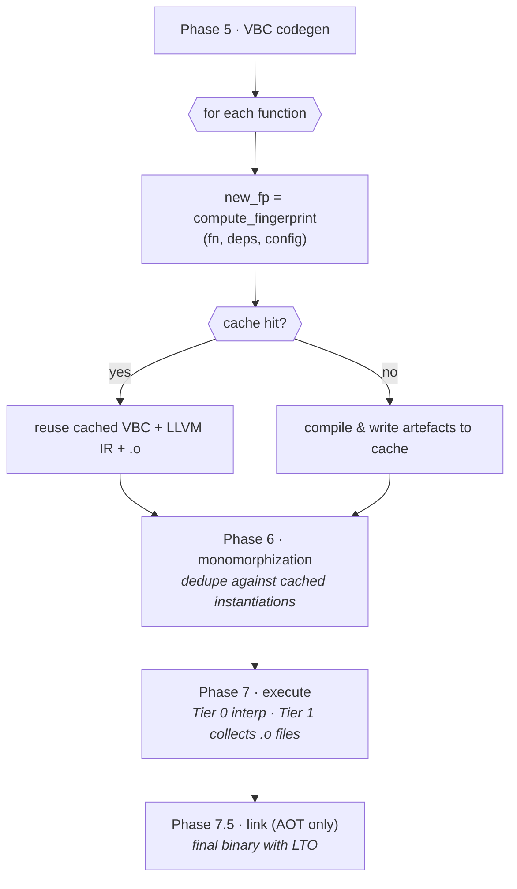

# Incremental Compilation

Incremental compilation reuses artefacts whose fingerprints haven't
changed. Typical edit-rebuild cycles are 10–15× faster than a clean
build on a 50 K-LOC project.

## The fingerprint

Every function receives a **fingerprint** — a SHA-256 of four
components:

```
fingerprint = SHA256(
    source_hash     ||   // function body + annotations
    type_hash       ||   // signature + generic instantiation
    deps_hash       ||   // transitive hashes of callees + types used
    config_hash         // compiler flags, target, opt level
)
```

### `source_hash`

Canonical form of the function's AST, normalised to drop whitespace /
comments / spans. Includes:

- Body tokens.
- All attribute annotations (`@verify`, `@inline`, `@cfg`, etc.).
- Nested closures (hashed recursively).

### `type_hash`

Signature projected onto canonical form:

```
fn f<T: Eq + Ord>(x: &List<T>, n: Int { self > 0 }) -> Maybe<T>
  using [Logger] throws(E)
```

→ hash of the tuple:

```
(generics, params_with_refinements, return_type, context_clause, throws)
```

### `deps_hash`

Merkle-hash of everything the function references:

```
deps_hash = SHA256(
    sorted_concat(
        fingerprint(callee) for callee in directly_called
        fingerprint(type)   for type   in referenced_types
        fingerprint(logic)  for logic  in reflected_logic_fns
    )
)
```

A deep dependency change bubbles up through every caller.

### `config_hash`

Captures compiler options that affect codegen:

- `--profile dev | release`
- `--target ...`
- `--opt-level`
- `lto`, `codegen-units`, `panic`
- enabled `features`
- default verification level

## Artefact layout

```
target/.verum-cache/
├── stdlib/
│   ├── registry_<hash>.bin              # ModuleRegistry snapshot
│   └── types_<hash>.bin                 # TypeRegistry snapshot
├── functions/
│   ├── <fp>.vbc                         # VBC bytecode
│   ├── <fp>.llvm-ir                     # LLVM IR (AOT mode)
│   ├── <fp>.o                           # platform object (AOT mode)
│   ├── <fp>.dwarf                       # debug info
│   └── <fp>.meta                        # sidecar: fingerprint graph
├── smt/
│   └── obligations/
│       └── <obligation_fp>.result       # sat / unsat / unknown + proof blob
├── proofs/
│   └── <fp>.proof                       # machine-checked proof term
└── reports/
    └── <build_id>.json                  # build metadata
```

## Build flow



### Cache invalidation triggers

| Trigger | Invalidates |
|---|---|
| Edit function body | that function + all (transitive) callers |
| Change function signature | function + all callers + all generic instantiations |
| Edit type definition | every function referencing the type |
| Edit reflected predicate | every obligation that reflected it |
| Change `--profile` / `--target` / `--opt-level` | all functions (config_hash changes) |
| Add / remove `features` | functions gated by that feature |
| Upgrade compiler | all (version-tuple in config_hash) |

Fine-grained: editing a function that only its own tests call won't
invalidate unrelated modules.

## Stdlib caching

`core/` is compiled once per `(compiler_version, target, profile)`
tuple. The cache is shared across projects (`~/.verum/stdlib-cache/`)
unless `VERUM_STDLIB_CACHE=local` is set. First use of a target may
take 10-20 seconds; subsequent projects start instantly.

## SMT cache

Separate from the function cache but uses the same fingerprint
machinery. See
[Verification pipeline → caching](/docs/architecture/verification-pipeline#56--caching).
Typical hit rate: 60–70% on incremental rebuilds.

## Inspection tools

```bash
verum build --timings                 # per-phase time
verum cache path                      # print the cache root
verum cache list [--limit N] [--sort] # entries, newest access first
verum cache show <key>                # metadata for one entry
verum cache gc --max-size <bytes>     # evict least-recently-accessed
verum cache clear [--yes]             # delete every entry
```

:::warning What `verum cache` manages, and what it does not
`verum cache` operates the **script cache** — whole-program bytecode
for `verum run <file>.vr`, keyed per source file. It is not a view of
the per-function incremental machinery this page describes, and there
is no command that prints per-function hit rates.

A report of the shape

```
functions      12,421 total  |  new/changed 38 (0.31%)  |  hit rate 99.69%
```

stood here as `$ verum cache stats` output. No such subcommand exists
(the roster is `path`, `list`, `show`, `gc`, `clear`), and neither did
`cache diff`, `cache explain` or `cache prune`, which were listed
beside it with arguments each. Measured 2026-09-07.
:::

### Example cache report

What the shipped command prints:

```
$ verum cache list --limit 2
cache root : /Users/you/.verum/script-cache
entries    : 2
total size : 7.73 MiB

KEY                     SIZE      ACCESSED  COMPILER              SOURCE
fd2cc4b296d5bd54    2.07 MiB       11m ago  0.1.0                 …/probe/p1214.vr
c323f83bf201e4a4    5.66 MiB       11m ago  0.1.0                 …/probe/ctrl2.vr
```

Note the `COMPILER` column: the cache key carries the compiler
**version**, so two compilers built from different sources at the same
version share entries. Rebuilding the compiler does not invalidate this
cache.

## Performance impact

On a 50 K-LOC project, Apple M3 Max, `--profile release`:

| Scenario | Clean | Incremental | Speedup |
|---|---:|---:|---:|
| Full rebuild | 5.9 s | — | — |
| Change one function body | — | 0.42 s | 14× |
| Change one function signature | — | 1.21 s | 4.9× |
| Edit a type used in 30 callers | — | 2.08 s | 2.8× |
| No-op rebuild | — | 0.05 s | 118× |
| Upgrade toolchain minor | — | 5.9 s | 1× (full invalidate) |

## Determinism

Given identical inputs + config + compiler version, the generated
binaries are bit-identical. Sources of non-determinism are
quarantined:

- SMT query ordering is deterministic (sorted by obligation id).
- Parallel execution uses a stable scheduler in artefact emission.
- Fingerprints exclude spans and timestamps.
- Link order is fixed by symbol enumeration order.

## Limitations and current work

- **Parallel compilation**: the outer phase loop is single-threaded
  today. Function-level parallelism in Phases 6/7 is available, but
  a true multi-worker phase coordinator is on the near-term
  roadmap.
- **Stdlib lazy loading**: the full stdlib is parsed on every build
  start; disk-cache materialises results but in-memory reloading is
  still O(stdlib-size). Lazy module loading is under development.

## See also

- **[Compilation pipeline](/docs/architecture/compilation-pipeline)** — where incremental fits.
- **[Verification pipeline → caching](/docs/architecture/verification-pipeline#56--caching)**.
- **[Performance](/docs/guides/performance)** — end-to-end build tuning.
