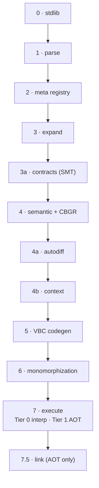
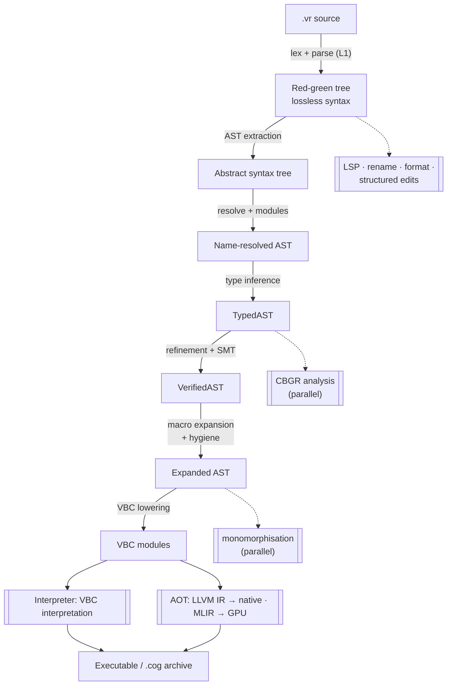

# Architecture Overview

Verum is a **VBC-first** compiler: every program lowers to Verum
Bytecode, and VBC is either interpreted (Tier 0) or compiled to
native code via LLVM (Tier 1). A separate MLIR path emits GPU binaries
for `@device(gpu)` code. The compiler is a Rust workspace organised
into five layers, plus a thin Layer 1.5 of shared protocol-type
definitions to break what would otherwise be a circular dependency
between the type system and the SMT backend.

## Reading paths

Depending on why you're here:

- **Just want to use Verum?** Skip this section. Go to
  [language/overview](/docs/language/overview).
- **Curious about the internals?** Read this page, then
  [compilation pipeline](/docs/architecture/compilation-pipeline),
  then [VBC bytecode](/docs/architecture/vbc-bytecode).
- **Contributing to the compiler?** Read this page, then
  [crate map](/docs/architecture/crate-map),
  then the crate whose area you're touching.
- **Debugging a compiler issue?** Find the likely crate in the
  [crate map](/docs/architecture/crate-map) and follow its `Key files`
  column.
- **Writing a tool (fuzzer, linter, translator)?** Read
  [VBC bytecode](/docs/architecture/vbc-bytecode) — VBC is the
  stable intermediate.

## The big picture

```mermaid
flowchart TD
    SRC[["Source (.vr)"]]

    subgraph L0["Layer 0 — Foundation"]
        L0A[verum_common · verum_error]
    end

    subgraph L1["Layer 1 — Parsing"]
        L1A["verum_lexer (logos) → verum_fast_parser"]
        L1B["verum_ast · verum_syntax<br/>lossless red-green tree"]
    end

    subgraph L15["Layer 1.5 — Shared protocol types"]
        L15A["verum_protocol_types<br/>shared type defs (no logic)"]
    end

    subgraph L2["Layer 2 — Type system + verification"]
        L2A["verum_types<br/>infer · unify · refinement · cubical"]
        L2B["verum_cbgr<br/>reference-analysis suite (escape · NLL · Polonius · …)"]
        L2C["verum_smt<br/>capability-routed SMT layer"]
        L2D["verum_verification<br/>VCGen · Hoare · tactics"]
        L2E["verum_modules<br/>resolver · coherence · parallel loader"]
        L2F["verum_kernel<br/>LCF-style trusted checker"]
        L2G["verum_core<br/>typed pipeline IR"]
    end

    subgraph L3["Layer 3 — Execution (VBC-first)"]
        L3A["verum_vbc<br/>bytecode · interpreter · codegen"]
        L3B["verum_codegen<br/>LLVM (CPU) · MLIR (GPU)"]
    end

    subgraph L4["Layer 4 — Orchestration & tools"]
        L4A["verum_compiler<br/>pipeline · derives · hygiene"]
        L4B["verum_cli · verum_lsp · verum_dap"]
        L4C["verum_interactive<br/>REPL + Playbook TUI"]
        L4D["verum_stdlib_precompiler<br/>build-time stdlib archive"]
    end

    OUT[["Executable / interpreted result"]]

    SRC --> L0 --> L1 --> L15 --> L2
    L2 -- "typed IR" --> L3
    L3 --> L4 --> OUT
```

## Key crates at a glance

| Crate | Role |
|-------|------|
| `verum_common`         | Semantic-type primitives (`List`, `Text`, `Map`, …) and shared layout constants. |
| `verum_fast_parser`    | Main recursive-descent parser — direct-to-AST. |
| `verum_ast`            | AST node definitions. |
| `verum_syntax`         | Lossless red-green tree for the formatter and IDE. |
| `verum_protocol_types` | Shared protocol / GAT / CBGR-predicate type definitions (no logic). |
| `verum_types`          | Inference, unification, refinement, cubical, dependent, exhaustiveness. |
| `verum_cbgr`           | Reference-tier analysis suite (escape, NLL, Polonius, points-to, SMT-alias, …). |
| `verum_smt`            | Capability-routed SMT layer — portfolio executor with cross-validation between solver adapters. |
| `verum_verification`   | Hoare logic, VCGen, tactic evaluator, dependent verifier, certificate replay. |
| `verum_kernel`         | LCF-style trusted kernel — sole member of the TCB. |
| `verum_core`           | Typed pipeline IR — the stable contract between AST and kernel. |
| `verum_modules`        | Module resolution, coherence, parallel loader, cog resolver. |
| `verum_vbc`            | Bytecode, interpreter (Tier 0), VBC codegen, monomorphisation, archive format. |
| `verum_codegen`        | LLVM (CPU) + MLIR (GPU) backends. |
| `verum_compiler`       | Phase orchestration, derives, hygiene, embedded stdlib, incremental compiler. |
| `verum_lsp`            | LSP 3.17 server. |
| `verum_dap`            | Debug Adapter Protocol server. |
| `verum_interactive`    | REPL and Playbook TUI. |
| `verum_cli`            | Command-line frontend (binary `verum`). |

See **[crate map](/docs/architecture/crate-map)** for every crate
with key files and entry points.

## Pipeline summary

MIR is **not** in the main pipeline — it exists only to serve the SMT
verifier and advanced optimisation passes. Full phase detail:
**[compilation pipeline](/docs/architecture/compilation-pipeline)**.

## What's implemented today

### Production-ready

- Bidirectional type inference with dataflow-sensitive narrowing.
- Refinement types with SMT discharge; `@verify(formal|thorough|certified)`.
- Dependent types — Π, Σ, path types, computational univalence.
- Cubical normaliser with HoTT primitives and HITs.
- Capability-routed SMT layer that classifies obligations by theory
  signature and picks the best solver adapter; obligations marked
  high-assurance can be cross-validated by running multiple adapters
  in parallel.
- VBC bytecode with primary + extended opcode tables and a
  dispatch-table interpreter.
- LLVM AOT codegen with tier-aware CBGR lowering
  (`Ref` / `RefChecked` / `RefUnsafe`).
- CBGR memory safety — a multi-module analysis suite (escape, NLL,
  Polonius, points-to, SMT-alias, ownership, lifetime, concurrency, …)
  feeding per-reference tier decisions.
- Module system: 5-level visibility, coherence (orphan + overlap +
  specialisation), cycle-break strategy ranking, parallel loading.
- Structured concurrency: `async`, `await`, `spawn`, `nursery`,
  work-stealing executor.
- LSP 3.17 server, DAP debug server, Playbook notebook TUI, REPL.
- A CLI covering the full project lifecycle (build, run, test,
  check, lint, fmt, audit, bench, doc, doctor, publish, …).

### Newer but validated

- MLIR GPU path (verum.tensor → linalg → gpu → PTX / HSACO / SPIR-V /
  Metal) triggered by `@device(gpu)`.
- Proof-carrying VBC archives with Coq / Lean / Dedukti / Metamath
  export.
- Autodiff (VJP) generation for `@differentiable` functions.
- Coinductive types with productivity analysis.

### Experimental

- CPU path through MLIR (LLVM remains the default for CPU).
- Advanced refinement reflection with quantifier instantiation hints.
- Separation-logic extensions in `verum_verification`.

## What's next

- Parallel-compilation orchestrator end-to-end (per-phase work stealing).
- Proof-carrying modules at the cog-distribution boundary.
- WASM target for the browser playground.
- Incremental proof replay (edit one function, revalidate only the
  affected obligations).

See **[roadmap](/docs/roadmap)** for the full plan.

## Invariants of the system

These invariants hold across every code path and every phase. If you
find an exception, it is almost certainly a bug:

### 1. VBC is the single intermediate

Every source program compiles to VBC. Nothing — not the interpreter,
not LLVM, not the verifier — looks at the AST to produce output.
Bypassing VBC would fragment semantics and is a hard-banned design
direction.

### 2. Verification is monotone up the ladder

If a function passes `@verify(formal)`, it passes every looser
strategy (`static`, `runtime`). Upgrading a function's strategy never
makes it suddenly valid — only invalid. Callers can safely rely on
the tighter guarantees of their callees.

### 3. CBGR demotions are explicit

The compiler may **promote** `&T` to `&checked T` silently (escape
analysis succeeded). It may never **demote** silently — a tier-2
`&unsafe T` always requires an `unsafe` block at the source level.

### 4. Contexts propagate; they are never ambient

A function's `using [...]` clause is authoritative. A callee cannot
acquire a context the caller didn't provide. A spawned task
inherits the parent's context stack by default, but explicit forward
(`spawn using [...]`) drops everything else.

### 5. No hidden allocation

Every allocation is explicit: `Heap(x)`, `Shared.new(x)`, collections
with a `with_capacity(n)` form, or the arena pool API. The compiler
does not insert allocations behind the scenes.

### 6. Exhaustiveness is checked

Every `match` is exhaustive. Non-exhaustive patterns are compile
errors, not runtime panics. Active patterns are opaque — a
catch-all `_ => ...` is required when they're the only alternatives.

### 7. Effects are visible in the type

`async fn`, `throws(E)`, `using [Logger, Database, ...]` — all
effects appear in the function type. A call site can tell exactly
what a function does without opening the body. The type system
refuses to hide them. (Built-in effects like `print` / `assert` /
`panic` don't need a `using` clause; user-defined contexts from
`core/context/standard.vr` — Logger, Database, Clock, Metrics,
RateLimiter — do.)

## Data flow across layers

Each arrow is a compiler phase implemented in the corresponding
crate. The dashed arrows are **parallel passes** that feed into the
main lowering.

## Key design decisions (and why)

### Why VBC as the stable IR?

A stable bytecode gives:
- A **single lowering** from source to execution; no fork between
  interpreted and compiled paths.
- A **tooling surface** for inspectors, disassemblers, fuzzers, and
  cross-crate caches.
- **Proof-carrying distribution** — cogs ship as `.cog` archives
  containing VBC plus optional proof certificates; validators can
  recheck without re-parsing Verum source.

### Why capability-routed SMT?

Different solver implementations have different strengths — some
are stronger on linear arithmetic and quantifier-free fragments,
others on strings, bitvectors with interpretation, finite-model
finding, or specific theory combinations. The capability router
classifies each obligation by its theory signature and dispatches
to the adapter best suited to it. The portfolio executor can also
cross-validate by running multiple adapters in parallel for
high-assurance obligations. The interface is solver-agnostic so
adapters can be swapped without touching the verification
pipeline.

### Why three CBGR tiers?

A single tier forces a trade-off: either pay the 15 ns per-deref
(Rust-style lifetimes + runtime checks) or lean on the programmer
(raw pointers). Three tiers let the compiler promote automatically
where safe, ask the programmer where it can't prove safety, and
charge for safety only where it's actually needed.

### Why unified `verum_compiler` phase orchestrator?

Phases have non-trivial dependencies — CBGR needs types but also
narrowed types from guards; macro expansion can produce new types
that restart inference. A single orchestrator with a declarative
phase DAG is easier to reason about than per-crate phase
implementations.

## Documents in this section

- **[Compilation pipeline](/docs/architecture/compilation-pipeline)**
  — phases 0 through 7.5 in detail.
- **[VBC bytecode](/docs/architecture/vbc-bytecode)** — opcode map,
  module format, interpreter.
- **[Runtime tiers](/docs/architecture/runtime-tiers)** — Tier 0
  interpreter vs Tier 1 AOT, GPU dual-path, async scheduler.
- **[CBGR internals](/docs/architecture/cbgr-internals)** — header
  layout, capability bits, VBC tier opcodes, MLIR dialect.
- **[Codegen](/docs/architecture/codegen)** — LLVM (CPU) and MLIR
  (GPU) backends.
- **[SMT integration](/docs/architecture/smt-integration)** — how solver adapters are wired in.
- **[Verification pipeline](/docs/architecture/verification-pipeline)**
  — Phase 3a + Phase 4 solver internals.
- **[Incremental compilation](/docs/architecture/incremental-compilation)**
  — fingerprinting and cache strategy.
- **[Execution environment (θ+)](/docs/architecture/execution-environment)**
  — per-task unified memory / capabilities / recovery / concurrency.
- **[Crate map](/docs/architecture/crate-map)** — every crate with a
  one-line summary.
