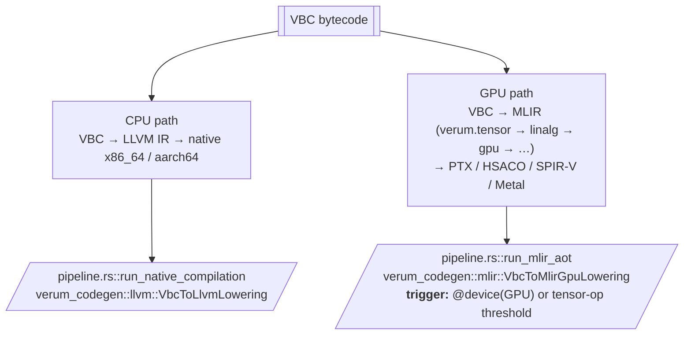

# Runtime Tiers and Profiles

Three independent axes shape how a Verum program runs. They are
often conflated; this page keeps them separate.

| Axis                   | What it selects                                     | Where it lives                          |
|------------------------|------------------------------------------------------|-----------------------------------------|
| **Execution mode**     | interpreted VBC vs ahead-of-time-compiled native     | `--aot` flag, `[build].tier` in manifest |
| **CBGR safety tier**   | how much runtime memory-safety checking is emitted  | `MemoryContext.cbgr_tier` in θ+          |
| **Runtime profile**    | which subset of the runtime your target can support | `@cfg(runtime = "...")` at build time    |

The remainder of the page treats each axis in turn and then
describes how they combine.

## Axis 1 — Execution mode

Two execution modes are supported. A single program can compile to
either; the choice is per-build, not per-function.

| Mode             | What it is                                        | Used for                                                 |
|------------------|---------------------------------------------------|----------------------------------------------------------|
| `Interpreter`    | Direct VBC interpretation                          | `verum run`, REPL, Playbook, tests, `meta fn` evaluation |
| `Aot`            | Ahead-of-time compilation via LLVM                 | `verum build`, production binaries                       |
| `Check` (mode)   | Type-check only, no code emission                  | `verum check`, editor diagnostics                        |

`verum run` is interpreter-first by default — startup is instant,
every VBC opcode is available (including cubical, HoTT, and
autodiff). Pass `--aot` (or set `[build].tier = "aot"` in
`verum.toml`) to compile through LLVM for production-speed
execution.

### Interpreter — VBC

The VBC interpreter (`verum_vbc::interpreter`) is where most
development happens — you get instant startup, full diagnostics, and
no LLVM dependency.

- **Compile time**: seconds (only to VBC).
- **Execution**: ~5–20× slower than native.
- **CBGR**: every check runs (~100 ns/deref); tier optimisation is
  intentionally disabled in the interpreter — safety first.
- **Features**: every VBC opcode, including cubical + HoTT + autodiff.
- **Use when**: iterating, testing, running `meta fn`, the REPL, the
  Playbook TUI.

The interpreter declares its trust assumption at construction.  A
**lenient** load is for bytecode that just came out of the compiler
in this process; a **validated** load runs the per-instruction
bytecode validator plus content- and dependency-hash verification
on bytecode coming from disk, network, or a shared cog archive.
See **[VBC Bytecode → Module-load trust
boundary](/docs/architecture/vbc-bytecode#module-load-trust-boundary)**.

#### Native intercept layer

The interpreter resolves certain stdlib calls natively before
running their bytecode bodies.  Two surface classes flow
through this layer:

  - *Syscall-shaped surfaces* — file I/O, env-var ops, stdin /
    stdout, shell-process spawn, networking.  The interpreter
    services these calls directly against the kernel facilities
    of the host OS, bypassing libSystem / libffi.
  - *Canonical stdlib factories* — well-known constructors
    whose contract is fixed (`Path.new`, `Text.new`,
    `Text.with_capacity`, `Text.from_str`, `Text.from_char`,
    …).  The interpreter returns the canonical value without
    re-walking the stdlib body.

Surfaces currently covered by the native layer:

| Surface           | Examples                                               |
|-------------------|--------------------------------------------------------|
| Shell             | `sh#"..."`, `sh_check`, `sh`                           |
| File system       | `core.io.fs.*` free functions                          |
| Environment       | `core.env.var`, `set_var`, `remove_var`                |
| Stdin             | `read_line`, `read_int`, `read_to_end`                 |
| Path / PathBuf    | `Path.new`, `PathBuf.from`, inherent path methods      |
| Text factories    | `Text.new`, `Text.with_capacity`, `Text.from_str`,  …  |
| Process           | `Process.spawn`, `Command.*`                           |

The native layer is observable only as a performance and
correctness optimisation — every call returns the value that
the bytecode body would have returned, on every observable
boundary.

:::note Interpreter fallback set

By design, the interpreter returns `NotImplemented` for three feature
families that require native toolchains:

- **GPU dispatch** — actual `@device(GPU)` kernel launch. Use
  `verum run --aot --gpu` or `verum build` with the appropriate
  GPU backend (`metal`, `cuda`, `rocm`, `vulkan`).
- **Dynamic FFI resolution** — `dlopen`/`LoadLibrary`-style symbol
  lookup. Static `extern "C"` declarations resolved at link time
  work in AOT.
- **ML `vmap` / `pmap`** — vectorised/parallel-mapped kernel JITs.
  Use AOT with the tensor-op compilation path.

Everything else — async/await, channels, contexts, refinement
checks, CBGR — runs identically in both tiers.

:::

### AOT — LLVM

Ahead-of-time compilation through LLVM — the default for
`verum build --release` and `verum run --aot`.

- **Compile time**: seconds per function, dominated by LLVM.
- **Execution**: 0.85–0.95× of equivalent C.
- **CBGR**: tier-aware. `&T` references emit a CBGR check
  (measured ~0.93 ns on the `production_targets` bench against a
  ≤ 15 ns design target); `&checked T` and `&unsafe T` compile to
  direct loads (0 ns). Escape analysis elides 50–90 % of remaining
  Tier 0 checks.
- **Features**: full LLVM optimisation stack, LTO, PGO, cross-target
  support through MLIR-aware target triples.
- **Use when**: shipping production binaries.
- **Stability**: 96–100 % build success rate (fixed in v0.1.0).
  Stdlib functions with name-arity collisions receive `optnone` +
  `noinline` attributes and trivial return stubs to prevent LLVM
  pass crashes on null Type references.

## Dual-path compilation (CPU vs GPU)

MLIR is not a tier. It is used **only for the GPU path**. CPU code
lowers directly through LLVM:



See **[codegen](/docs/architecture/codegen)** for the MLIR dialect
stack and per-target tile sizes.

## Why only two execution modes

An early design pass evaluated a third, JIT-based tier and removed
it. The reasoning is worth stating because other systems languages
have made a different call:

- The interpreter already starts in milliseconds and handles the
  entire VBC opcode surface (including cubical, HoTT, and autodiff
  ops a JIT would have to recompile on every type-checker edit).
  The interpreter's "start-up latency" is measured in milliseconds,
  not seconds; there is no warm-up to avoid.
- The AOT path produces native code that matches or beats any
  JIT's peak performance, once warmed up. A JIT's usual advantage
  — "no ahead-of-time compile step" — doesn't exist because the
  interpreter fills that role.
- A third tier would double the combinatorial surface of the
  backend (interpreter × JIT × AOT, each with its own CBGR-tier
  lowerings) while targeting a use case that neither of the
  existing two already covers.

Verum ships an interpreter and an AOT compiler. There is no
intermediate JIT tier, and no internal JIT used by the REPL, the
Playbook, or the incremental compilation cache — those all run
through the same interpreter that handles `verum run`.

## Axis 2 — CBGR safety tiers

Independent of execution mode, every managed reference carries a
compile-time **safety tier** that determines what runtime checking
the compiler emits for it. The tier is a per-reference decision
made by CBGR analysis, not a global setting.

Four tiers are defined in `core/runtime/env.vr` as the enum
`ExecutionTier`:

| Variant           | Overhead per deref              | What's checked                             | How it's reached                               |
|-------------------|---------------------------------|--------------------------------------------|------------------------------------------------|
| `Tier0_Full`      | ≤ 15 ns target (measured ~0.93 ns on `production_targets`) | generation + epoch + bounds | default for `&T` when analysis is uncertain    |
| `Tier1_Epoch`     | ~0.93 ns                        | generation + epoch                         | analysis proves bounds safe                    |
| `Tier2_Gen`       | < Tier1_Epoch (design target)    | generation only                            | analysis proves bounds + epoch safe            |
| `Tier3_Unchecked` | 0 ns                            | nothing — caller asserts safety            | explicit `&unsafe T` or proven `&checked T`    |

These are **not** the interpreter/AOT tiers; they are orthogonal.
A reference compiled at `Tier1_Epoch` pays its per-deref cost
whether it is interpreted or AOT-compiled. The `Tier1_Epoch`
measurement above comes directly from
`benches/production_targets.rs` (gen + epoch check fused into the
same cacheline as the pointer itself).

### Tier selection in the compiler

The 11-analysis CBGR suite (`escape`, `nll`, `polonius`,
`points_to`, `dominance`, `type`, `concurrency`, `lifetime`,
`ownership`, `tier`, `array`) tries to prove the strongest tier
possible for each reference. The default is `Tier0_Full`. Three
tier-raising events:

1. **Escape analysis succeeds** — the reference doesn't outlive
   its source; bounds are statically known. Tier lifted to
   `Tier1_Epoch` or `Tier2_Gen`.
2. **`&checked T` annotation** — the programmer asserts the
   reference is compiler-proven safe. The compiler verifies the
   assertion; if verification passes, tier becomes `Tier3_Unchecked`.
3. **`&unsafe T` annotation** — caller accepts responsibility.
   Tier is `Tier3_Unchecked` with no verification.

Tier selection happens once, at compile time; the runtime never
changes tiers.

## Axis 3 — Runtime profiles

The third axis selects **which subset of the runtime** is linked.
Defined in `core/runtime/mod.vr` via `@cfg(runtime = "...")`, five
profiles cover the entire target spectrum from servers to
microcontrollers.

| Profile          | Executor                | Heap              | Threads       | I/O driver              | Use case                             |
|------------------|-------------------------|-------------------|---------------|-------------------------|--------------------------------------|
| `full`           | Work-stealing           | System allocator  | OS threads    | `io_uring` / `kqueue` / IOCP | Servers, CLIs, desktop apps          |
| `single_thread`  | Cooperative             | System allocator  | Current only  | Single-threaded reactor | WASM, browser, embedded single-core  |
| `no_async`       | —                       | System allocator  | OS threads    | Blocking POSIX / Windows | Batch tools, CLIs without futures    |
| `no_heap`        | Cooperative             | Stack only        | Current only  | Polling only            | Real-time, safety-critical           |
| `embedded`       | —                       | Stack only        | Current only  | MMIO / registers only   | Microcontrollers, freestanding       |

A program that uses a feature its profile doesn't support is a
**build-time error**, not a runtime failure. `verum build` refuses
to link `runtime = "no_heap"` against any transitive dependency
that allocates from `Heap<T>`.

Select a profile in `verum.toml`:

```toml
[build]
runtime = "full"        # default
# runtime = "single_thread"
# runtime = "no_async"
# runtime = "no_heap"
# runtime = "embedded"
```

The profile selection also drives which crates in `core/` are even
compiled — the `no_heap` profile, for example, excludes
`core/collections` entirely and falls back to stack-only
replacements in `core/stack`.

## Async scheduler

The runtime uses a work-stealing executor:

- **Per-core worker threads**: number = `num_cpus()` by default
  (`async_worker_threads = 0` in `[runtime]`).
- **Per-worker deque**: local tasks pushed / popped LIFO; stolen FIFO.
- **Global queue**: for tasks spawned from outside the executor.
- **IO reactor**: one thread driving `io_uring` (Linux) / `kqueue`
  (macOS/BSD) / `IOCP` (Windows).

Task context (`ExecutionEnv`, including the capability-context stack)
is saved and restored at each `.await`. Context stacks are cloned on
`spawn` so child tasks inherit the parent's capabilities.

## Memory: unified CBGR arena

Both tiers share the same CBGR-managed heap (the mimalloc-inspired
allocator documented in **[memory
model](/docs/language/memory-model#allocation-internals)**). A value
allocated in the interpreter can be passed into AOT code and back
without copying — the CBGR header makes validity checks consistent
across tiers.

## Selecting the execution mode

### Per-invocation

```bash
verum run          # Interpreter (default)
verum run --aot    # AOT via LLVM
verum build        # AOT, debug profile
verum build --release   # AOT, release profile
```

### Per-project (`verum.toml`)

```toml
[build]
tier = "aot"                     # interpret | aot | check
```

Or override per profile:

```toml
[profile.release]
tier = "aot"

[profile.dev]
tier = "interpret"
```

The CLI flag `--tier interpret|aot|check` overrides both.

## Cost of a CBGR check, by execution mode

The CBGR figures in the table above are AOT costs. The
interpreter pays more because instruction dispatch dominates:

### Interpreter

```
deref(&T) = 1 load (pointer) + 1 load (header) + 1 compare + 1 branch
          ≈ 90–120 ns   (tree-walker overhead dominates)
```

- Full check on every deref regardless of the reference's static tier.
- No elision — safety over speed.
- Fine for REPL / tests / short scripts.

### AOT

**Tier-aware lowering**. Each VBC reference opcode maps to a distinct
code sequence per CBGR safety tier:

- `Ref` / `RefMut` (`Tier0_Full`) → full CBGR validation (≤ 15 ns
  design target; ~0.93 ns measured for the gen + epoch fast path).
- `RefChecked` (`Tier3_Unchecked` after verification) → direct
  `llvm.load`, 0 ns.
- `RefUnsafe` (`Tier3_Unchecked`) → direct `llvm.load`, 0 ns.
- `Tier1_Epoch` / `Tier2_Gen` sit in between with reduced checks.

The hot path for a surviving Tier 0 check compiles to:

```
mov  rax, [rdi]                ; load pointer
mov  ecx, [rax - 16]           ; load header.generation
cmp  ecx, [rdi + 8]            ; compare reference.generation
jne  .use_after_free
```

Typical check-elision rate: 60–80 % at `--profile debug`,
90–98 % at `--profile release` with LTO (whole-program escape
analysis + refinement-informed bounds elimination).

### Cross-tier transitions

Calls between tiers go through a standard ABI — VBC-compatible layout
with CBGR headers. Crossing from interpreter to AOT adds no overhead
beyond a normal C call. Values flowing *from* AOT *into* the
interpreter have their references downgraded to Tier 0 (the
interpreter always validates), so the recipient pays the ~100 ns
check. This is invisible unless you're profiling the interpreter.

## Memory costs across tiers

Allocation is shared across both tiers. What changes is how many
safety checks run versus are proven away at compile time.

| Tier           | Alloc fast path | CBGR deref | Cross-thread free | Notes |
|----------------|-----------------|-----------|-------------------|-------|
| T0 Interpreter | ~80 ns  | ~100 ns (always) | ~70 ns | every check runs; VBC bookkeeping |
| T1 AOT (debug) | ~20 ns  | ~1 ns (surviving checks)  | ~55 ns | 60–80 % of Tier 0 checks elided |
| T1 AOT (release + LTO) | < 20 ns | < 5 ns (or 0 for `&checked`) | ~50 ns | 90–98 % of Tier 0 checks elided |
| GPU path       | device allocator | N/A | N/A | kernel scratchpad only |

Allocator scalability is tier-independent: thread-local heaps stay
contention-free up to roughly 32 threads; beyond that, abandoned-
segment reclamation starts to dominate and cross-thread free latency
rises.

### Shared vs per-tier state

Each tier maintains its own code cache and specialisation state. Both
share **one** allocator, **one** CBGR epoch manager, and **one** task
scheduler. That is what makes cross-tier calls free — no trampolines,
no marshalling, just a normal call through a VBC descriptor.

## See also

- **[VBC bytecode](/docs/architecture/vbc-bytecode)** — the IR both
  tiers share.
- **[Codegen](/docs/architecture/codegen)** — AOT LLVM pipeline plus
  MLIR dual-path GPU.
- **[CBGR internals](/docs/architecture/cbgr-internals)** — references
  across tiers, the 0x70–0x77 opcode row.
- **[Stdlib → runtime](/docs/stdlib/runtime)** — runtime configuration.
- **[Reference → verum.toml](/docs/reference/verum-toml)** —
  `[codegen] tier`, `[profile.*] tier`, `[runtime]`.
