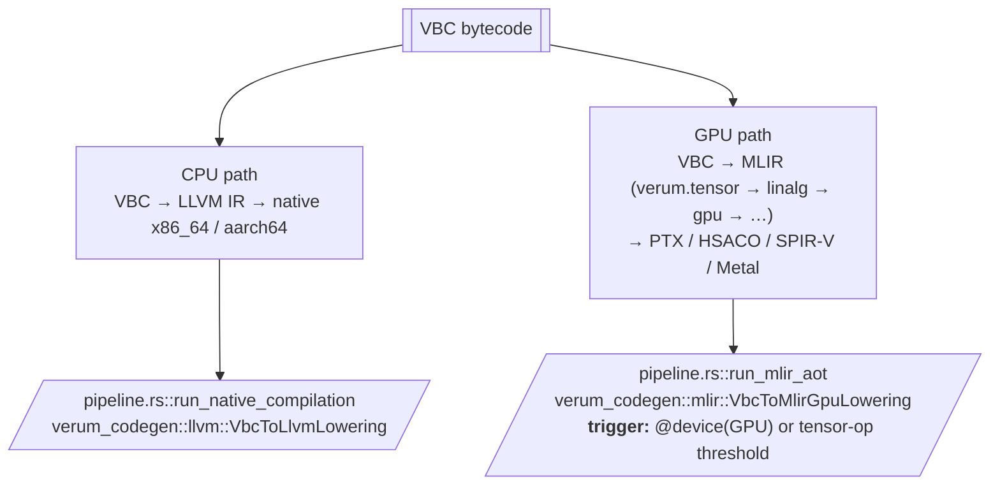

# Runtime Tiers

Verum ships with a **two-tier execution model** (v2.1). A single
program can move values between tiers seamlessly.

| Tier   | Mode          | What it is | Used for |
|--------|---------------|------------|----------|
| **0**  | `Interpreter` | Direct VBC interpretation | `verum run`, REPL, Playbook, tests, `meta fn` evaluation |
| **1**  | `Aot`         | Ahead-of-time compilation via LLVM | `verum build`, production binaries |
| —      | `Check`       | Type check only, no code | `verum check`, editor diagnostics |

`verum run` is interpreter-first by default — startup is instant and
every VBC opcode is supported, including cubical / HoTT. Pass `--aot`
to compile through LLVM for production-speed execution.

## Tier 0 — VBC Interpreter

The VBC interpreter (`verum_vbc::interpreter`) is where most
development happens — you get instant startup, full diagnostics, and
no LLVM dependency.

- **Compile time**: seconds (only to VBC).
- **Execution**: ~5–20× slower than native.
- **CBGR**: every check runs (~100 ns/deref); tier optimisation is
  intentionally disabled in the interpreter — safety first.
- **Features**: every VBC opcode, including cubical + HoTT + autodiff.
- **Use when**: iterating, testing, running `meta fn`, the REPL, the
  Playbook TUI.

## Tier 1 — AOT (LLVM)

Ahead-of-time compilation through LLVM — the default for
`verum build --release` and `verum run --aot`.

- **Compile time**: seconds per function, dominated by LLVM.
- **Execution**: 0.85–0.95× of equivalent C.
- **CBGR**: tier-aware. `&T` references emit the ~15 ns check;
  `&checked T` and `&unsafe T` compile to direct loads (0 ns).
  Escape analysis elides 50–90 % of remaining Tier 0 checks.
- **Features**: full LLVM optimisation stack, LTO, PGO, cross-target
  support through MLIR-aware target triples.
- **Use when**: shipping production binaries.
- **Stability**: 96–100 % build success rate (fixed in v0.1.0).
  Stdlib functions with name-arity collisions receive `optnone` +
  `noinline` attributes and trivial return stubs to prevent LLVM
  pass crashes on null Type references.

## Dual-path compilation (CPU vs GPU)

MLIR is not a tier. It is used **only for the GPU path**. CPU code
lowers directly through LLVM:



See **[codegen](/docs/architecture/codegen)** for the MLIR dialect
stack and per-target tile sizes.

## Internal JIT infrastructure (not a tier)

`verum_codegen` includes ORC-based JIT infrastructure that is used
internally for REPL evaluation, incremental compilation, and hot
reload in dev mode. **It is not exposed as an execution tier** — user
code always runs at Tier 0 or Tier 1. Future versions may promote JIT
to a first-class tier; for now, assume two tiers.

## Async scheduler

The runtime uses a work-stealing executor:

- **Per-core worker threads**: number = `num_cpus()` by default
  (`async_worker_threads = 0` in `[runtime]`).
- **Per-worker deque**: local tasks pushed / popped LIFO; stolen FIFO.
- **Global queue**: for tasks spawned from outside the executor.
- **IO reactor**: one thread driving `io_uring` (Linux) / `kqueue`
  (macOS/BSD) / `IOCP` (Windows).

Task context (`ExecutionEnv`, including the capability-context stack)
is saved and restored at each `.await`. Context stacks are cloned on
`spawn` so child tasks inherit the parent's capabilities.

## Memory: unified CBGR arena

Both tiers share the same CBGR-managed heap (the mimalloc-inspired
allocator documented in **[memory
model](/docs/language/memory-model#allocation-internals)**). A value
allocated in the interpreter can be passed into AOT code and back
without copying — the CBGR header makes validity checks consistent
across tiers.

## Tier selection

### Per-invocation

```bash
verum run          # Tier 0 (interpreter, default)
verum run --aot    # Tier 1 (LLVM AOT)
verum build        # Tier 1 (debug profile)
verum build --release
```

### Per-project (`Verum.toml`)

```toml
[codegen]
tier = "aot"                     # interpret | aot | check
```

Or override per profile:

```toml
[profile.release]
tier = "1"                       # aliases: "aot" | "release" | "native"

[profile.dev]
tier = "0"                       # aliases: "interpreter" | "interp"
```

The CLI flag `--tier 0|1` overrides both.

## CBGR performance across tiers

The `&T` managed-reference check behaves differently per tier and
different amounts of work are elided by analysis.

### Tier 0 — interpreter

```
deref(&T) = 1 load (pointer) + 1 load (header) + 1 compare + 1 branch
          ≈ 90–120 ns   (tree-walker overhead dominates)
```

- Full check on every deref regardless of the reference's static tier.
- No elision — safety over speed.
- Fine for REPL / tests / short scripts.

### Tier 1 — AOT

**Tier-aware lowering**. Each VBC reference opcode maps to a distinct
code sequence:

- `Ref` / `RefMut` (Tier 0) → CBGR validation call, ~15 ns.
- `RefChecked` (Tier 1) → direct `llvm.load`, 0 ns.
- `RefUnsafe` (Tier 2) → direct `llvm.load`, 0 ns.

The hot path for a surviving Tier 0 check compiles to:

```
mov  rax, [rdi]                ; load pointer
mov  ecx, [rax - 16]           ; load header.generation
cmp  ecx, [rdi + 8]            ; compare reference.generation
jne  .use_after_free
```

Typical check-elision rate: 60–80 % at `--profile debug`,
90–98 % at `--profile release` with LTO (whole-program escape
analysis + refinement-informed bounds elimination).

### Cross-tier transitions

Calls between tiers go through a standard ABI — VBC-compatible layout
with CBGR headers. Crossing from interpreter to AOT adds no overhead
beyond a normal C call. Values flowing *from* AOT *into* the
interpreter have their references downgraded to Tier 0 (the
interpreter always validates), so the recipient pays the ~100 ns
check. This is invisible unless you're profiling the interpreter.

## Memory costs across tiers

Allocation is shared across both tiers. What changes is how many
safety checks run versus are proven away at compile time.

| Tier           | Alloc fast path | CBGR deref | Cross-thread free | Notes |
|----------------|-----------------|-----------|-------------------|-------|
| T0 Interpreter | ~80 ns  | ~100 ns (always) | ~70 ns | every check runs; VBC bookkeeping |
| T1 AOT (debug) | ~20 ns  | ~15 ns (surviving checks) | ~55 ns | 60–80 % of Tier 0 checks elided |
| T1 AOT (release + LTO) | < 20 ns | < 5 ns (or 0 for `&checked`) | ~50 ns | 90–98 % of Tier 0 checks elided |
| GPU path       | device allocator | N/A | N/A | kernel scratchpad only |

Allocator scalability is tier-independent: thread-local heaps stay
contention-free up to roughly 32 threads; beyond that, abandoned-
segment reclamation starts to dominate and cross-thread free latency
rises.

### Shared vs per-tier state

Each tier maintains its own code cache and specialisation state. Both
share **one** allocator, **one** CBGR epoch manager, and **one** task
scheduler. That is what makes cross-tier calls free — no trampolines,
no marshalling, just a normal call through a VBC descriptor.

## See also

- **[VBC bytecode](/docs/architecture/vbc-bytecode)** — the IR both
  tiers share.
- **[Codegen](/docs/architecture/codegen)** — AOT LLVM pipeline plus
  MLIR dual-path GPU.
- **[CBGR internals](/docs/architecture/cbgr-internals)** — references
  across tiers, the 0x70–0x77 opcode row.
- **[Stdlib → runtime](/docs/stdlib/runtime)** — runtime configuration.
- **[Reference → verum.toml](/docs/reference/verum-toml)** —
  `[codegen] tier`, `[profile.*] tier`, `[runtime]`.
