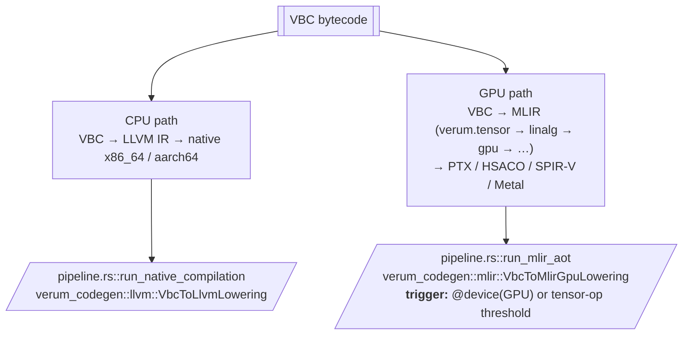

# Runtime Tiers and Profiles

Three independent axes shape how a Verum program runs. They are
often conflated; this page keeps them separate.

| Axis                   | What it selects                                     | Where it lives                          |
|------------------------|------------------------------------------------------|-----------------------------------------|
| **Execution mode**     | interpreted VBC vs ahead-of-time-compiled native     | `--interp` / `--aot`, `[codegen].tier` |
| **CBGR safety tier**   | how much runtime memory-safety checking is emitted  | Reference syntax and compiler analysis          |
| **Runtime profile**    | which subset of the runtime your target can support | `@cfg(runtime = "...")` at build time    |

The remainder of the page treats each axis in turn and then
describes how they combine.

## Axis 1 — Execution mode

Verum offers VBC interpretation and ahead-of-time native compilation.
`verum check` checks source without executing it; it is not a third
execution tier.

| Mode | Command | Result |
|---|---|---|
| Interpreter | `verum run --interp app.vr` | Compile to VBC and execute it in the interpreter. |
| AOT | `verum run --aot app.vr` | Compile a native executable through LLVM and run it. |
| Check only | `verum check app.vr` | Report source diagnostics without running the program. |

For project execution, an explicit CLI mode takes precedence over
`[codegen].tier`. The default project value is `"aot"`, including when
the section or its `tier` key is omitted. Set `tier = "interpret"` or
pass `--interp` to run a project through the interpreter. `--release`
selects build settings; it does not override the configured execution mode.

An explicit file invocation such as `verum run app.vr` defaults to the
interpreter. Use explicit flags when comparing backends.

**Known limitation, measured 2026-10-04:** interpreter and native
behaviour are not fully interchangeable. Generic callable chains,
imported type information, panic handling, and owned-resource cleanup
still have failing cases. A successful interpreter run does not validate
the native program. Pending compiler changes are not a released parity
guarantee.

### Interpreter — VBC

The VBC interpreter executes bytecode without an LLVM compilation step.
It is useful for interactive development, the REPL, and source-level
checks. Startup and execution cost depend on the program and the amount
of standard-library code it loads.

The interpreter declares its trust assumption at construction.  A
**lenient** load is for bytecode that just came out of the compiler
in this process; a **validated** load runs the per-instruction
bytecode validator plus content- and dependency-hash verification
on bytecode coming from disk, network, or a shared cog archive.
See **[VBC Bytecode → Module-load trust
boundary](/docs/architecture/vbc-bytecode#module-load-trust-boundary)**.

#### Native intercept layer

The interpreter resolves certain stdlib calls natively before
running their bytecode bodies.  Two surface classes flow
through this layer:

  - *Syscall-shaped surfaces* — file I/O, env-var ops, stdin /
    stdout, shell-process spawn, networking.  The interpreter
    services these calls directly against the kernel facilities
    of the host OS, bypassing libSystem / libffi.
  - *Canonical stdlib factories* — well-known constructors
    whose contract is fixed (`Path.new`, `Text.new`,
    `Text.with_capacity`, `Text.from_str`, `Text.from_char`,
    …).  The interpreter returns the canonical value without
    re-walking the stdlib body.

Surfaces currently covered by the native layer:

| Surface           | Examples                                               |
|-------------------|--------------------------------------------------------|
| Shell             | `sh#"..."`, `sh_check`, `sh`                           |
| File system       | `core.io.fs.*` free functions                          |
| Environment       | `core.env.var`, `set_var`, `remove_var`                |
| Stdin             | `read_line`, `read_int`, `read_to_end`                 |
| Path / PathBuf    | `Path.new`, `PathBuf.from`, inherent path methods      |
| Text factories    | `Text.new`, `Text.with_capacity`, `Text.from_str`,  …  |
| Process           | `Process.spawn`, `Command.*`                           |

These intercepts are intended to implement the same API contracts as
the bytecode bodies. An interpreter result can nevertheless exercise a
different implementation from native code; validate both when the
distinction matters.

:::note Interpreter fallback set

By design, the interpreter returns `NotImplemented` for three feature
families that require native toolchains:

- **GPU dispatch** — actual `@device(GPU)` kernel launch. Use
  `verum run --aot --gpu` or `verum build` with the appropriate
  GPU backend (`metal`, `cuda`, `rocm`, `vulkan`).
- **Dynamic FFI resolution** — `dlopen`/`LoadLibrary`-style symbol
  lookup. Static `extern "C"` declarations resolved at link time
  work in AOT.
- **ML `vmap` / `pmap`** — vectorised/parallel-mapped kernel JITs.
  Use AOT with the tensor-op compilation path.

Other features also require backend-specific validation. In particular,
see the current [async evaluation contract](/docs/language/async-concurrency#async-functions).

:::

### AOT — LLVM

The native path lowers VBC through LLVM and links an executable.
Use it to assess native deployment, code generation, and resource
behaviour. LLVM optimisation, target support, and link configuration
are described in [codegen](/docs/architecture/codegen).

**Known limitation, measured 2026-10-04:** some CLI builds fall back to
the interpreter after a single-file AOT compilation failure, including
when native execution was requested explicitly. For native acceptance,
confirm that compilation succeeded and that a fresh executable ran;
exit status alone is insufficient on those builds. A diagnostic saying
“Falling back to interpreter” means the native path was not validated.

## Dual-path compilation (CPU vs GPU)

MLIR is not a tier. It is used **only for the GPU path**. CPU code
lowers directly through LLVM:


```mermaid
flowchart TD
    VBC[["VBC bytecode"]]
    CPU["CPU path<br/>VBC → LLVM IR → native x86_64 / aarch64"]
    GPU["GPU path<br/>VBC → MLIR (verum.tensor → linalg → gpu → …)<br/>→ PTX / HSACO / SPIR-V / Metal"]
    CPUIMPL[/"pipeline.rs::run_native_compilation<br/>verum_codegen::llvm::VbcToLlvmLowering"/]
    GPUIMPL[/"pipeline.rs::run_mlir_aot<br/>verum_codegen::mlir::VbcToMlirGpuLowering<br/><b>trigger:</b> @device(GPU) or tensor-op threshold"/]

    VBC --> CPU --> CPUIMPL
    VBC --> GPU --> GPUIMPL
```

See **[codegen](/docs/architecture/codegen)** for the MLIR dialect
stack and per-target tile sizes.

## Why two execution modes

Interpretation provides a development path without native compilation;
AOT produces an executable for the target platform. These are the
supported CLI execution choices. Their availability does not imply
that every language feature has identical backend coverage.

An experimental MLIR JIT is retained for internal development. It is
not a third `--tier` choice. See [codegen](/docs/architecture/codegen)
for the compiler paths and target backends.

## Axis 2 — CBGR safety tiers

Reference safety is independent of interpreter versus native execution.
The compiler's `ReferenceTier` and `CbgrTier` use three variants:

| Reference | Compiler tier | Safety obligation |
|---|---|---|
| `&T`, `&mut T` | Tier 0 | Runtime CBGR validation where static analysis cannot eliminate it. |
| `&checked T`, `&checked mut T` | Tier 1 | Compiler-proven lifetime and access validity. |
| `&unsafe T`, `&unsafe mut T` | Tier 2 | The programmer supplies the safety argument. |

An execution tier named “Tier 1” therefore means native compilation,
while a reference tier named “Tier 1” means a compiler-proven reference.
Selecting AOT does not turn all references into checked references.

The standard library also has a build-wide policy enum in
`core/runtime/env.vr`, exposed through `MemoryContext.cbgr_tier`. Its
four names (`Tier0_Full`, `Tier1_Epoch`, `Tier2_Gen`, and
`Tier3_Unchecked`) belong to that runtime structure. They are not the
compiler's per-reference choices and should not be used to interpret
`&checked T` or `&unsafe T`.

### Tier selection in the compiler

CBGR analysis considers escape, lifetime, aliasing, and control-flow
facts. A managed reference can be promoted when those facts prove its
uses safe. Inconclusive analysis keeps runtime checking.

`&checked T` expresses a proof requirement; `&unsafe T` transfers the
obligation to the programmer. Neither annotation is an ownership or
resource-cleanup guarantee. See [references](/docs/language/references)
for the syntax and the current lifetime limitations.

## Axis 3 — Runtime profiles

The third axis names **which subset of the runtime** a piece of code
is intended to use. The standard library marks these groups with
`@cfg(runtime = "…")` attributes.

:::caution Runtime profile selection

**Known limitation, measured 2026-09-10:** the attributes are written and the stdlib is organised by them. **There
is no way to select a profile yet.** Verified: `@cfg(runtime = "X")` is
not a known cfg key — `TargetConfig::matches` handles `target_os`,
`target_arch`, `target_family`, `target_pointer_width`, `target_endian`,
`target_env`, `target_vendor` and `feature`, and falls through to a
`custom` map for everything else. That map is populated only by
`CompilerOptions::with_cfg_custom`, which nothing in `verum_cli` calls;
there is no `--cfg` flag, and `BuildConfig` — the `[build]` manifest
section — has no `runtime` field (its fields are `target`, `opt_level`,
`incremental`, `lto`, `codegen_units`, `panic`, `subsystem`).

The one place the value has an effect today is the stdlib bake:
`DEFAULT_EXCLUDED_RUNTIMES = ["embedded", "none"]` in
`verum_compiler::module_utils` drops the files carrying those two,
matching the attribute by NAME rather than evaluating it — which is
also why the other four stay in.

So read the table below as the intended taxonomy, and the paragraph
after it about build-time refusal as intent rather than behaviour.
:::

| Profile          | Executor                | Heap              | Threads       | I/O driver              | Use case                             |
|------------------|-------------------------|-------------------|---------------|-------------------------|--------------------------------------|
| `full`           | Work-stealing           | System allocator  | OS threads    | `io_uring` / `kqueue` / IOCP | Servers, CLIs, desktop apps          |
| `single_thread`  | Cooperative             | System allocator  | Current only  | Single-threaded reactor | WASM, browser, embedded single-core  |
| `no_async`       | —                       | System allocator  | OS threads    | Blocking POSIX / Windows | Batch tools, CLIs without futures    |
| `no_heap`        | Cooperative             | Stack only        | Current only  | Polling only            | Real-time, safety-critical           |
| `embedded`       | —                       | Stack only        | Current only  | MMIO / registers only   | Microcontrollers, freestanding       |
| `none`           | —                       | Stack only        | Current only  | None                    | No runtime at all — `core/sys/no_runtime.vr` |

INTENDED, not yet built: a program that uses a feature its profile does
not support should be a **build-time error** rather than a runtime
failure — `verum build` refusing to link `runtime = "no_heap"` against
any transitive dependency that allocates from `Heap<T>`. Nothing
implements that check today.

The `[build] runtime = "…"` key that earlier versions of this page
showed does not exist; writing it into `verum.toml` selects nothing.
Nor is there a `core/stack` module for `no_heap` to fall back to —
`core/collections` is not excluded by any profile.

## Async scheduler

The runtime uses a work-stealing executor:

- **Per-core worker threads**: number = `num_cpus()` by default
  (`async_worker_threads = 0` in `[runtime]`).
- **Per-worker deque**: local tasks pushed / popped LIFO; stolen FIFO.
- **Global queue**: for tasks spawned from outside the executor.
- **IO reactor**: one thread driving `io_uring` (Linux) / `kqueue`
  (macOS/BSD) / `IOCP` (Windows).

The task runtime carries execution context across task boundaries.
Keep this distinct from direct `async fn` evaluation: an eager call does
not become a suspendable task just because it appears next to `.await`.
See [async and concurrency](/docs/language/async-concurrency).

## Memory: unified CBGR arena

The memory-management model uses CBGR metadata to track allocations
and reference validity. Sharing that model does not make arbitrary
interpreter and native values ABI-compatible. Use the declared embedding
or FFI boundary when crossing runtimes. See [allocation
internals](/docs/language/memory-model#allocation-internals).

## Selecting the execution mode

### Per-invocation

```bash
verum run --interp app.vr
verum run --aot app.vr
verum run --tier interpret app.vr
verum run --tier aot app.vr
verum check app.vr
verum build --release             # build the current project
```

`--interp`, `--aot`, and `--tier` are alternative selectors. Accepted
`--tier` names are `interpret` (also `interpreter`) and `aot`.
`--tier check` is rejected: use the `check` command.

### Per-project (`verum.toml`)

```toml
[codegen]
tier = "aot"                     # interpret | aot for verum run
```

An explicit CLI selector overrides this value. Omitting the section or
the `tier` key still selects its default, `"aot"`. The older
`[profile.dev].tier` and `[profile.release].tier` settings are consulted
only when the effective codegen value is not recognised; omitting the
key does not activate that fallback. `[build].tier` is not the
execution-mode setting.

Although the configuration model also recognises `"check"`,
`verum run` refuses `[codegen].tier = "check"` because it cannot execute
a check-only build.

## Cost of a CBGR check, by execution mode

A reference check, bytecode dispatch, and the work performed by the
program are different costs. Measure the whole workload in the selected
backend before deciding whether reference-check elimination matters.

### Interpreter

The interpreter performs instruction dispatch and runtime bookkeeping.
A native microbenchmark of the CBGR fast path does not predict the cost
of an interpreted field access or method call.

### AOT

Tier-aware lowering can omit runtime validation for proven references.
Surviving managed-reference checks still perform validation. The amount
of eliminated work depends on what analysis proves for that program;
it is not a fixed percentage selected by the debug or release profile.

### Cross-tier transitions

Embedding APIs may cross an interpreter/native boundary. Their calling
conventions, value layouts, and reference lifetime rules must agree;
do not infer a zero-cost transition from the fact that both backends
consume VBC.

## Memory costs across tiers

Both backends use Verum's memory-management model, but lowering and
runtime representation affect allocation and access costs. Benchmark
the target platform and workload instead of treating one allocation or
dereference timing as a language guarantee.

### Shared vs per-tier state

Code caches and specialisation state depend on the execution backend.
The chosen API determines which runtime resources are shared. See
[execution environment](/docs/architecture/execution-environment) for
the runtime structures and [memory model](/docs/language/memory-model)
for ownership and allocation.

## See also

- **[VBC bytecode](/docs/architecture/vbc-bytecode)** — the IR both
  tiers share.
- **[Codegen](/docs/architecture/codegen)** — AOT LLVM pipeline plus
  MLIR dual-path GPU.
- **[CBGR internals](/docs/architecture/cbgr-internals)** — references
  across tiers, the 0x70–0x77 opcode row.
- **[Stdlib → runtime](/docs/stdlib/runtime)** — runtime configuration.
- **[Reference → verum.toml](/docs/reference/verum-toml)** —
  `[codegen] tier`, `[profile.*] tier`, `[runtime]`.
