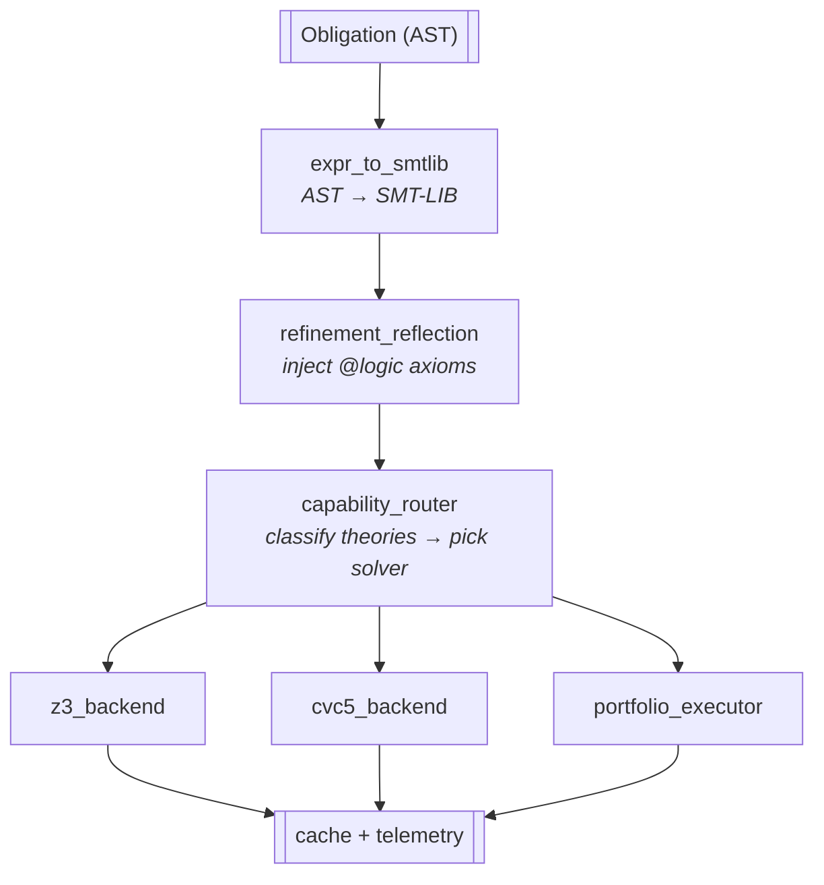

# SMT Integration

`verum_smt` is the bridge between the type checker and the SMT
subsystem. It runs during **Phase 3a** (contract verification) and
the refinement / dependent-verifier sub-step of **Phase 4**
(semantic analysis) — see the **[verification pipeline](/docs/architecture/verification-pipeline)**
for the subsystem-internal stages (5.1–5.7 below are the solver's
own numbering, not public compilation phases).

:::note On the choice of solver
Verum's verification layer is **backend-agnostic** at the language
level. The current release bundles Z3 and CVC5 behind the capability
router; a Verum-native SMT solver is on the roadmap and will slot into
the same interface. Anywhere specific backends are named below, read
them as *the current implementation* — the subsystem's contract with
the rest of the compiler is what is load-bearing, not the specific
solver.
:::

## Architecture



## Translation

`expr_to_smtlib.rs` walks a refinement / contract expression and
emits SMT-LIB:

```
Verum: x > 0 && x < 100
SMT:   (and (> x 0) (< x 100))

Verum: forall i in 0..xs.len(). xs[i] < key
SMT:   (forall ((i Int)) (=> (and (>= i 0) (< i (List.len xs))) (< (List.get xs i) key)))
```

Datatypes, generics, and refinement types are encoded in the solver's
native datatype / sort system.

## Refinement reflection

User `@logic` functions become `define-fun-rec` in SMT-LIB:

```
(define-fun-rec is_sorted ((xs (List Int))) Bool
  (match xs
    ((nil) true)
    ((cons x rest) (match rest
      ((nil) true)
      ((cons y _) (and (<= x y) (is_sorted rest)))))))
```

## Capability routing

`capability_router.rs` classifies each obligation by theory usage:

- LIA, bitvector, array → **Z3**.
- Strings, nonlinear, SyGuS, FMF → **CVC5**.
- Mixed that both support → Z3 (faster on average).
- Mixed only CVC5 supports → CVC5.

Classification is by AST walk: tag nodes with theories, union, look
up in capability table.

## Backend switcher

`backend_switcher.rs` implements four strategies:

- **Manual** — fixed backend.
- **Auto** — router-driven per obligation.
- **Fallback** — try primary, fall back to other on timeout.
- **Portfolio** — both solvers in parallel.

## Portfolio

`portfolio_executor.rs`:

1. Spawn every available SMT backend on the same obligation.
2. Wait for both or timeout.
3. Cross-validate:
   - both unsat → accepted.
   - both sat (counter-example) → rejected, user sees one.
   - one unsat, one sat → **disagreement**; flagged.
   - timeouts handled per policy.

Used for `@verify(thorough)` and `@verify(certified)`.

## Caching

Every obligation has an SMT-LIB fingerprint (SHA-256). Proof results
are cached per project (`target/smt-cache/`). Invalidation:

- Cache hit: verify the saved result against the current obligation.
- Solver upgrade: fingerprints include solver version; upgrades
  invalidate partial.

## Telemetry & routing statistics

Every solver `check()` call records routing choice, outcome (SAT/UNSAT/
unknown), elapsed time, and theory class into a shared
`Arc<RoutingStats>` on the `Session`. The CLI exposes this data:

```bash
verum build --smt-stats      # persist stats to .verum/state/smt-stats.json
verum smt-stats              # print human-readable report
verum smt-stats --json       # machine-readable JSON
verum smt-stats --reset      # clear after printing
```

The `Context` object (verum_smt/context.rs) auto-records on every
`check()` call when a routing-stats collector is installed via
`context.with_routing_stats(arc)`. Both the contract-verification
phase (api.rs) and the refinement verifier (pipeline.rs phase_verify)
wire the session's collector automatically.

## Proof search

`proof_search.rs` (230 K LOC) implements tactics:

- `auto` — call solver with default configuration.
- `omega` — linear integer fragment.
- `ring` — ring-axiom rewriting.
- `simp [rules]` — simplification rewriting.
- `induction` — structural induction.
- `cases` — case split.

Tactics can compose via the `tactics.rs` combinator language.

## Proof extraction

`proof_extraction.rs` (135 K LOC) extracts a proof term from an SMT
unsat response. Each bundled backend emits a proof log; the translator
normalises them to Verum's proof-term representation for machine
checking.

## Cubical tactic

`cubical_tactic.rs` (1058 lines) handles cubical / HoTT obligations
that general SMT cannot discharge:

- Path reduction.
- HIT coherence.
- Transport normalisation.
- Glue / unglue simplification.
- Category-theoretic rewrites (associativity, identity laws, etc.).

It decomposes obligations into smaller fragments, dispatches the
decidable ones to SMT, and applies rewrites for the rest.

## Performance

Typical obligation mix (measured on a 50 KLOC Verum project):

| Theory | Count | Avg time (ms) | p95 |
|--------|------:|--------------:|----:|
| LIA only | 2,100 | 8 | 35 |
| LIA + bv | 940 | 14 | 60 |
| LIA + string | 110 | 45 | 180 |
| Nonlinear | 42 | 320 | 1,800 |
| Cubical | 18 | 120 | 400 |

Overall: ~92% of obligations discharge in under 50 ms.

## Configuration knobs

The verifier exposes the underlying solver configuration through
typed structs, each with a `Default` matching the spec defaults.
Every field listed below is **load-bearing**: changing the value
has an observable effect on the corresponding solver invocation.
The audit recipe is documented under
[scope discipline](#solver-parameter-scope-discipline) — each
field's wiring layer (Z3 global / Config / Solver Params) is
chosen based on which scope Z3 honours for that specific key.

### `RefinementConfig` — refinement-type verification

Used by `RefinementChecker::check_with_smt` and
`verify_refinement_with_assumptions` for refinement subtyping
queries (`T{φ1} <: T{φ2} iff φ1 ⇒ φ2`).

| Field | Default | Effect | Wiring |
|-------|--------:|--------|--------|
| `enable_smt` | `true` | gate the SMT path; when `false`, fall back to syntactic-only subsumption. | direct branch |
| `timeout_ms` | `100` | per-query Z3 budget. | `Params::set_u32("timeout", _)` on every fresh `Solver` |
| `enable_cache` | `true` | cache verification conditions by SHA-256 fingerprint. | direct branch |
| `max_cache_size` | `10 000` | bound on the cache map size; oldest entries evicted on overflow. | `len()`-check + LRU-N |

The timeout reaches Z3 via the `SmtBackend::set_timeout_ms`
trait method (called before every check) and forwarded by
`RefinementZ3Backend` to the inner `SubsumptionChecker`, which
configures Z3's `timeout` solver parameter.

### `QEConfig` — quantifier elimination

Used by `QuantifierEliminator` for invariant synthesis,
weakest-precondition computation, and refinement projection.

| Field | Default | Effect | Wiring |
|-------|--------:|--------|--------|
| `timeout_ms` | `5 000` | per-query Z3 budget. | `Params::set_u32("timeout", _)` |
| `max_iterations` | `10` | (reserved for future iterative QE) | — |
| `use_qe_lite` | `true` | fast-path linear-arithmetic QE. | direct branch |
| `use_qe_sat` | `true` | SAT-preprocessed QE for Boolean-heavy formulas. | direct branch |
| `use_model_projection` | `true` | model-based projection for non-linear cases. | direct branch |
| `use_skolemization` | `true` | Skolemization fallback. | direct branch |
| `simplify_level` | `2` | escalating simplification chain — see below. | `Tactic` chain at construction |

`simplify_level` maps to Z3 tactic chains:

| Level | Tactic chain |
|-------|--------------|
| `0` | `skip` (identity — no rewriting) |
| `1` | `simplify` |
| `2` (default) | `simplify` ∘ `propagate-values` |
| `3+` | `simplify` ∘ `propagate-values` ∘ `ctx-simplify` |

### `InterpolationConfig` — Craig interpolation

Used by `InterpolationEngine` for compositional verification
and inductive-invariant synthesis.

| Field | Default | Effect | Wiring |
|-------|---------|--------|--------|
| `algorithm` | `MBI` | `McMillan` / `Pudlak` / `Dual` / `Symmetric` / `MBI` / `PingPong` / `Pogo`. | algorithm dispatch |
| `strength` | `Balanced` | bias toward stronger (McMillan) or weaker (Pudlak) interpolant. | `dual_interpolate` branch |
| `simplify` | `true` | run Z3's `simplify` on the result. | direct branch |
| `timeout_ms` | `Some(5 000)` | per-query Z3 budget. | folded into `Params` alongside `proof: true` |
| `proof_based` | `false` | (reserved for future fallback when McMillan/Pudlak fail) | — |
| `model_based` | `true` | (reserved for future fallback when MBI fails) | — |
| `quantifier_elimination` | `true` | when `false`, `project_onto_shared` skips QE and returns the original formula. McMillan's `A ⇒ I` half stays sound; the `I ∧ B ⇒ ⊥` half degrades in precision. | direct branch |
| `max_projection_vars` | `100` | reject MBI projection when the elimination set exceeds this — exponential in the number of vars for some theories. | `len() > max` returns typed failure |

### `StaticVerificationConfig` — bounds / safety verification

Used by `StaticVerifier` for compile-time elimination of
runtime checks.

| Field | Default | Effect | Wiring |
|-------|--------:|--------|--------|
| `timeout_ms` | `30 000` | global wall-clock for the verifier. | direct branch |
| `constraint_timeout_ms` | `100` | per-constraint Z3 budget. | `Config::set_timeout_msec` + `Params::set_u32("timeout", _)` |
| `enable_proofs` | `true` | request Z3 proof generation. | `Config::set_proof_generation` |
| `enable_unsat_cores` | `true` | extract minimal unsat cores. | direct branch on result handling |
| `minimize_cores` | `true` | iterate to find a minimal core. | direct branch |
| `enable_caching` | `true` | proof-cache lookups. | direct branch |
| `max_cache_size` | `10 000` | bound on proof cache entries. | passed to `ProofCache::new` |
| `enable_parallel` | `false` | (reserved — Z3 Context is not Send/Sync in 0.19) | — |
| `num_workers` | `cpus()` | (reserved) | — |
| `auto_tactics` | `true` | use Z3's tactic auto-selection. | `create_solver_with_tactic` branch |
| `memory_limit_mb` | `Some(4096)` | process-wide memory ceiling. | `z3::set_global_param("memory_max_size", _)` — see scope discipline |

### `Cvc5Config` — CVC5-specific tuning

Used by `Cvc5Backend` when the router selects CVC5.

| Field | Default | CVC5 option |
|-------|---------|-------------|
| `logic` | `ALL` | `:logic` |
| `timeout_ms` | `Some(30 000)` | `tlimit-per` |
| `incremental` | `true` | `incremental` |
| `produce_models` | `true` | `produce-models` |
| `produce_proofs` | `true` | `produce-proofs` |
| `produce_unsat_cores` | `true` | `produce-unsat-cores` |
| `preprocessing` | `true` | `preprocess-only` (false → run preprocessing AND solving) |
| `quantifier_mode` | `Auto` | `quant-mode` (`none` / `ematching` / `cegqi` / `mbqi`); `Auto` leaves CVC5's heuristic |
| `random_seed` | `None` | `seed` |
| `verbosity` | `0` | `verbosity` (saturated at 5) |

### `Z3Config` — Z3-specific tuning

Used by `Z3ContextManager` for context-level settings.

| Field | Default | Effect | Wiring scope |
|-------|---------|--------|--------------|
| `enable_proofs` | `true` | proof-log generation. | Config |
| `minimize_cores` | `true` | (consumed by `unsat_core` path) | Solver Params |
| `enable_interpolation` | `false` | enable Z3's MBI tactic when interpolating. | tactic dispatch |
| `global_timeout_ms` | `Some(30 000)` | context-level timeout. | `Config::set_timeout_msec` |
| `memory_limit_mb` | `Some(8192)` | process-wide memory ceiling. | **Global param** — `set_global_param("memory_max_size", _)` |
| `enable_mbqi` | `true` | model-based quantifier instantiation. | Solver Params (per-query) |
| `enable_patterns` | `true` | pattern-based quantifier instantiation. | Solver Params (per-query) |
| `random_seed` | `None` | reproducibility. | **Global param** — `set_global_param("smt.random_seed", _)` |
| `num_workers` | `cpus().max(4)` | (forwarded to `ParallelConfig`) | — |
| `auto_tactics` | `true` | tactic auto-selection. | `Config::set_param_value("auto_config", _)` |

### `SubsumptionConfig` — refinement subtyping

Used internally by `SubsumptionChecker`.

| Field | Default | Effect |
|-------|--------:|--------|
| `cache_size` | `10 000` | LRU bound on the subsumption-result cache. |
| `smt_timeout_ms` | `100` | per-query Z3 budget; updated dynamically by `RefinementZ3Backend::set_timeout_ms` so each `RefinementConfig.timeout_ms` change takes effect immediately. |

### `BisimulationConfig` — coinductive bisimulation

Used by `BisimulationChecker` for behavioural equivalence.

| Field | Default | Effect |
|-------|--------:|--------|
| `max_depth` | `100` | hard cap on recursive-destructor unfolding. |
| `timeout_ms` | `30 000` | per-query Z3 budget. |
| `generate_counterexamples` | `true` | when `false`, leave `BisimulationResult::counterexample` as `None` to save formatting work. |
| `infinite_strategy` | `BoundedUnfolding` | `Coinduction` / `Up-to-bisimulation` / `BoundedUnfolding`. |

### `SepLogicConfig` — separation logic

Used by `SepLogicEncoder` for heap-shape verification.

| Field | Default | Effect |
|-------|--------:|--------|
| `entailment_timeout_ms` | `5 000` | per-entailment Z3 budget. |
| `max_unfolding_depth` | `10` | bound on recursive-predicate unfolding. |
| `enable_frame_inference` | `true` | gate `infer_frame`; when `false`, returns typed failure so callers that only need entailment validity can skip the residual computation (~30% encoder reduction on large heaps). |
| `enable_symbolic_execution` | `true` | (reserved — feature not yet enabled by default in encoder) |
| `enable_caching` | `true` | (reserved — encoding cache infrastructure exists but isn't yet read) |

### `UnsatCoreConfig` — minimal unsat-core extraction

Used by `UnsatCoreExtractor`.

| Field | Default | Effect | Wiring |
|-------|--------:|--------|--------|
| `minimize` | `true` | iterate to find a minimal core. | direct branch |
| `quick_extraction` | `false` | trade minimality for speed. | direct branch |
| `max_iterations` | `100` | bound on minimization iteration count. | `for ... in 0..max` |
| `timeout_ms` | `Some(10 000)` | per-extraction Z3 budget. | folded into `Params` alongside `unsat_core: true` |
| `proof_based` | `false` | use Z3's proof API instead of assumption-tracking. | direct branch |

### `ParallelConfig` — portfolio + cube-and-conquer

Used by `ParallelSolver` for multi-strategy / multi-thread solving.

| Field | Default | Effect |
|-------|--------:|--------|
| `num_workers` | `cpus()` | thread count. |
| `strategies` | `default_strategies()` | per-worker strategy list. |
| `timeout_ms` | `Some(30 000)` | global timeout. |
| `enable_sharing` | `true` | **broader gate** — must be true for any cross-worker exchange (currently includes lemma exchange). |
| `enable_lemma_exchange` | `true` | per-feature gate; effective only when `enable_sharing` is also true. |
| `race_mode` | `true` | first-to-finish terminates others. |
| `lemma_exchange_interval_ms` | `500` | how often workers swap learned clauses. |
| `max_lemmas_per_exchange` | `10` | bound on payload size per exchange round. |
| `enable_cube_and_conquer` | `false` | search-space partitioning. |
| `cubes_per_worker` | `4` | partition target. |

### `OptimizerConfig` — MaxSAT / Pareto optimization

Used by `Z3Optimizer` for soft-constraint optimization.

| Field | Default | Effect |
|-------|---------|--------|
| `incremental` | `true` | gates `push` / `pop` scope manipulation. When `false`, push/pop are no-ops (paired so the stack stays balanced). |
| `max_solutions` | `Some(usize::MAX)` | cap for Pareto-front enumeration. |
| `timeout_ms` | `Some(30 000)` | per-query Z3 budget. |
| `enable_cores` | `true` | extract unsat cores for soft-constraint debugging. |
| `method` | `Lexicographic` | `Lexicographic` / `Pareto` / `Box` / `WeightedSum`. |

### `CacheConfig` — verification-result cache

Used by `VerificationCache` for cross-build SMT result reuse.

| Field | Default | Effect |
|-------|--------:|--------|
| `max_size` | `2 000` | LRU entry cap. |
| `max_size_bytes` | `500 MB` | memory cap. |
| `ttl` | `30 days` | result expiry. |
| `statistics_driven` | `true` | (when `false`, cache everything; when `true`, gate inserts on Z3 stats — see below) |
| `min_decisions_to_cache` | `1 000` | ≥ this many SMT decisions → cache. |
| `min_conflicts_to_cache` | `100` | ≥ this many conflicts → cache. |
| `min_solve_time_ms` | `100` | ≥ this elapsed → cache. |
| `distributed_cache` | `None` | (reserved — manifest field consumed; cross-build distributed cache is opt-in) |

Statistics-driven caching only fires for callers that route
through `VerificationCache::insert_with_stats`. The default
`get_or_verify` path uses unconditional `insert` since
`verify_fn` doesn't return stats today.

## Solver parameter scope discipline

Z3 has three distinct parameter scopes that are **not
interchangeable** even for the same param key:

1. **Global** — `z3::set_global_param(key, value)` →
   `Z3_global_param_set`. Process-wide; the most-recent call
   wins. Memory caps and seeds belong here.
2. **Config** — `Config::set_param_value(key, value)` →
   `Z3_set_param_value` on a `Config` struct. Applied at
   context construction. Proof generation, model generation,
   timeouts (via the typed `set_timeout_msec` helper),
   `auto_config`, and `unsat_core` belong here.
3. **Solver Params** — `Params::set_u32 / set_bool / ...` +
   `Solver::set_params(&p)`. Per-solver. Per-query timeouts,
   `unsat_core: true`, and most tuning knobs belong here.

The empirically verified rule:

| Key | Global | Config | Solver |
|-----|:------:|:------:|:------:|
| `memory_max_size` | ✅ | ❌ silent ignore + help dump | ❌ mis-routes |
| `smt.random_seed` | ✅ | partial | ✅ |
| `auto_config` | ✅ | ✅ | ❌ |
| `proof` | ✅ | ✅ (`set_proof_generation`) | ❌ |
| `timeout` | partial | ✅ (`set_timeout_msec`) | ✅ (`set_u32`) |
| `unsat_core` | ❌ | ✅ | ✅ — must fold into the same `Params` value as the timeout (`Solver::set_params` replaces the whole set, so two calls erase the first) |
| `quant-mode` (CVC5) | n/a | n/a | ✅ on the CVC5 solver via `cvc5_solver_set_option` |

When wiring a new param, **empirically verify** at each scope
before committing — Z3's silent-ignore behaviour means an
incorrect scope choice produces a "config seems to work but
has no effect" failure mode that's only visible under stress.

## Wiring layers

The same conceptual setting may need to be wired at multiple
layers because callers can opt out independently. The verifier
follows this hierarchy when threading a tunable through:

```
caller intent (CLI flag / verum.toml / @verify attribute)
    ↓
Session-level options (CompilerOptions)
    ↓
Phase config (e.g. VerificationPhaseConfig)
    ↓
Subsystem config (e.g. RefinementConfig)
    ↓
Backend config (Z3Config / Cvc5Config)
    ↓
Z3 / CVC5 solver param
```

When a knob is documented but a layer in this chain is
missing, the field is **inert** — it appears configurable
but the lower layers ignore the change. The compiler's CI
pinned 30+ such fields by 2026-04-29 (audit recipe in
`vcs/red-team/round-2-implementation.md`); each closure adds
the missing wiring and pin tests for the no-fire / fire
branches.

## See also

- **[Verification → SMT routing](/docs/verification/smt-routing)** —
  user-facing policy.
- **[Verification → refinement reflection](/docs/verification/refinement-reflection)**
  — how `@logic` functions reach the solver.
- **[Verification → proofs](/docs/verification/proofs)** — the
  tactic DSL.
- **[Reference → verum.toml](/docs/reference/verum-toml)** —
  how manifest fields map onto these configs.
