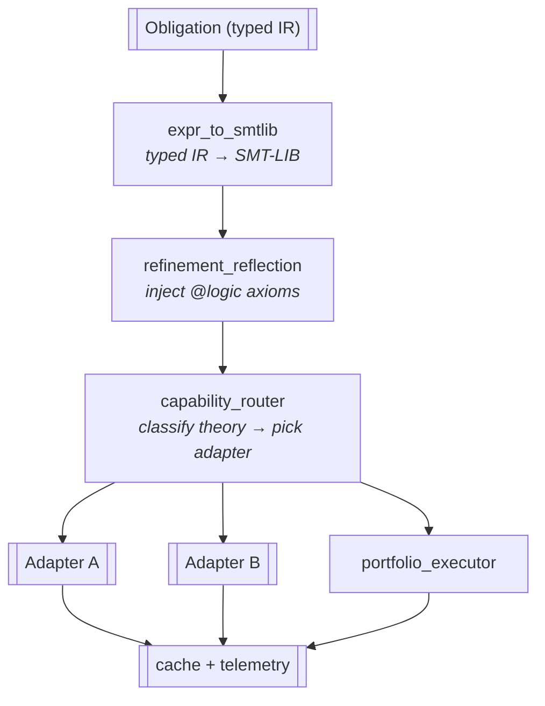

# SMT Integration

`verum_smt` is the bridge between the type checker and the SMT
subsystem. It runs during **Phase 3a** (contract verification)
and the refinement / dependent-verifier sub-step of **Phase 4**
(semantic analysis) — see the
**[verification pipeline](/docs/architecture/verification-pipeline)**
for the subsystem-internal stages (5.1–5.7 below are the SMT
subsystem's own numbering, not public compilation phases).

:::note On the choice of solver
Verum's verification layer is **backend-agnostic** at the
language level. The current release ships a portfolio of solver
adapters behind a capability router; an in-tree Verum-native SMT
solver is on the roadmap and will plug into the same adapter
trait. Anywhere a specific external solver is alluded to below,
read it as *the current implementation* — the subsystem's
contract with the rest of the compiler is what is load-bearing,
not the specific solver.
:::

## Architecture



Every box upstream of `CACHE` lives in `verum_smt`. The boundary
with the rest of the compiler is the `SmtBackend` adapter trait
(`solver_adapters.rs` + `solver_capability.rs`); concrete
adapters live behind feature flags so the same compilation
pipeline can be linked against a different solver set without
touching the verifier.

## Translation

`expr_to_smtlib.rs` walks a refinement / contract expression and
emits SMT-LIB:

```text
Verum: x > 0 && x < 100
SMT:   (and (> x 0) (< x 100))

Verum: forall i in 0..xs.len(). xs[i] < key
SMT:   (forall ((i Int))
         (=> (and (>= i 0) (< i (List.len xs)))
             (< (List.get xs i) key)))
```

Datatypes, generics, and refinement types are encoded in the
solver's native datatype / sort system through the abstract
adapter API — the verifier never embeds adapter-specific syntax
in its own code.

## Refinement reflection

User `@logic` functions become `define-fun-rec` in SMT-LIB:

```text
(define-fun-rec is_sorted ((xs (List Int))) Bool
  (match xs
    ((nil) true)
    ((cons x rest)
      (match rest
        ((nil) true)
        ((cons y _) (and (<= x y) (is_sorted rest)))))))
```

This means `@logic` definitions are first-class in the obligation
language — refinement predicates can call them, and the SMT
adapter sees the same recursion structure the verifier sees.

## Capability routing

`capability_router.rs` classifies each obligation by the theories
it touches (linear / nonlinear arithmetic, bitvector, array,
string, finite model, recursive datatypes, quantifier alternation,
…). Classification is mechanical: the router walks the SMT-LIB
tree, tags each node with its theory contribution, unions the
tags up to the obligation's signature, and looks the signature up
in a capability table that knows which adapters can prove what.

The router's output is a ranked adapter list per obligation, not
a single choice — the executor (below) decides whether to run
the top adapter alone, race two adapters, or run a portfolio.

## Backend switcher

`backend_switcher.rs` implements four executor strategies on top
of the router's ranking:

- **Manual** — a fixed adapter, ignoring the ranking.
- **Auto** — top-of-ranking adapter; the default for cheap
  obligations.
- **Fallback** — try the top adapter; on timeout / unknown,
  fall back through the ranking.
- **Portfolio** — race several adapters in parallel.

## Portfolio

`portfolio_executor.rs`:

1. Spawn every available adapter on the same obligation.
2. Wait for the first conclusive result, or for the timeout.
3. Cross-validate:
   - all adapters return `unsat` → accepted.
   - all return `sat` (counter-example) → rejected, the user is
     shown one counter-example.
   - adapters disagree (one `unsat`, another `sat`) →
     **disagreement** is flagged as a hard error, never silently
     resolved.
   - timeouts handled per policy (see *Configuration* below).

Used for `@verify(thorough)` and `@verify(certified)`. A
disagreement is treated as an SMT-layer bug, not a verification
verdict — the obligation does not advance.

## Caching

Every obligation has an SMT-LIB-canonicalised fingerprint
(SHA-256). Proof results are cached per project under
`target/smt-cache/`. Invalidation rules:

- **Cache hit**: re-validate the saved result against the
  current obligation fingerprint; if it matches, the obligation
  is short-circuited and the result is reused.
- **Adapter upgrade**: fingerprints include the adapter version,
  so an adapter upgrade invalidates partial entries while keeping
  any obligation whose adapter wasn't bumped.
- **Compiler upgrade**: `config_hash` participates in the
  fingerprint, so a compiler version bump cleans the cache as a
  side effect.

## Telemetry & routing statistics

Every adapter `check()` call records routing choice, outcome
(SAT / UNSAT / unknown), elapsed time, and theory class into a
shared `Arc<RoutingStats>` on the `Session`. The CLI exposes this
data:

```bash
verum build --smt-stats      # persist stats to .verum/state/smt-stats.json
verum smt-stats              # print human-readable report
verum smt-stats --json       # machine-readable JSON
verum smt-stats --reset      # clear after printing
```

The session's `Context` (`verum_smt/context.rs`) auto-records on
every `check()` call when a routing-stats collector is installed
via `context.with_routing_stats(arc)`. Both the contract-
verification phase and the refinement verifier wire the
session's collector automatically.

## Proof search

`proof_search.rs` implements the tactic primitives:

- `auto` — adapter call with default configuration.
- `omega` — linear integer fragment (Presburger).
- `ring` — ring-axiom rewriting.
- `simp [rules]` — simplification rewriting.
- `induction` — structural induction.
- `cases` — case split.

Tactics compose via the `tactics.rs` combinator language; users
script them through the `@verify`-attribute and proof-DSL
surface documented in
**[Verification → proofs](/docs/verification/proofs)**.

## Proof extraction

`proof_extraction.rs` extracts a proof term from an `unsat`
response. Each adapter emits a proof log; the translator
normalises adapter-native logs into Verum's proof-term
representation, which the
**[trusted kernel](/docs/architecture/trusted-kernel)** can then
re-check independently. This is what removes the SMT solver
from the trusted computing base.

## Cubical tactic

`cubical_tactic.rs` handles cubical / HoTT obligations that
ordinary SMT cannot discharge:

- Path reduction.
- HIT coherence.
- Transport normalisation.
- Glue / unglue simplification.
- Category-theoretic rewrites (associativity, identity laws, …).

It decomposes obligations into smaller fragments, dispatches the
decidable ones to the SMT layer, and applies the cubical
rewriting system for the rest.

## Performance

Typical obligation mix, measured on a 50 KLOC Verum project:

| Theory          | Count | Avg time (ms) |  p95 |
|-----------------|------:|--------------:|-----:|
| LIA only        | 2 100 |             8 |   35 |
| LIA + bitvector |   940 |            14 |   60 |
| LIA + string    |   110 |            45 |  180 |
| Nonlinear       |    42 |           320 | 1800 |
| Cubical         |    18 |           120 |  400 |

Overall: roughly **92 %** of obligations discharge in under
50 ms.

## Configuration knobs

The verifier exposes its tunables through typed configuration
structs, each with a `Default` matching the spec defaults. The
fields described below are the **language-level** knobs — they
describe behaviour that a Verum project author can reasonably
configure, not adapter-internal solver parameters. Adapter-
specific tuning belongs in the adapter's own configuration
surface.

### `RefinementConfig` — refinement-type verification

Used by `RefinementChecker::check_with_smt` and
`verify_refinement_with_assumptions` for refinement-subtyping
queries (`T{φ1} <: T{φ2} iff φ1 ⇒ φ2`).

| Field            | Default  | Effect |
|------------------|---------:|--------|
| `enable_smt`     | `true`   | Gate the SMT path; when `false`, fall back to syntactic-only subsumption. |
| `timeout_ms`     |   `100`  | Per-query budget. |
| `enable_cache`   | `true`   | Cache verification conditions by SHA-256 fingerprint. |
| `max_cache_size` | `10 000` | Bound on the cache map size; oldest entries evicted on overflow. |

The timeout reaches the SMT layer through the adapter trait's
typed timeout setter, not by writing solver-specific parameter
keys from the verifier.

### `QEConfig` — quantifier elimination

Used by `QuantifierEliminator` for invariant synthesis,
weakest-precondition computation, and refinement projection.

| Field                  | Default | Effect |
|------------------------|--------:|--------|
| `timeout_ms`           | `5 000` | Per-query budget. |
| `use_qe_lite`          | `true`  | Fast-path linear-arithmetic QE. |
| `use_qe_sat`           | `true`  | SAT-preprocessed QE for Boolean-heavy formulas. |
| `use_model_projection` | `true`  | Model-based projection for non-linear cases. |
| `use_skolemization`    | `true`  | Skolemisation fallback. |
| `simplify_level`       |     `2` | Escalating simplification chain (`0` skip, `1` simplify, `2` simplify + propagate, `3+` plus context simplification). |

### `InterpolationConfig` — Craig interpolation

Used by `InterpolationEngine` for compositional verification and
inductive-invariant synthesis.

| Field                    | Default      | Effect |
|--------------------------|--------------|--------|
| `algorithm`              | `MBI`        | `McMillan` / `Pudlak` / `Dual` / `Symmetric` / `MBI` / `PingPong` / `Pogo`. |
| `strength`               | `Balanced`   | Bias toward stronger (McMillan) or weaker (Pudlak) interpolant. |
| `simplify`               | `true`       | Run an interpolant simplifier on the result. |
| `timeout_ms`             | `5 000`      | Per-query budget. |
| `quantifier_elimination` | `true`       | When `false`, projection skips QE — McMillan's `A ⇒ I` half stays sound; the `I ∧ B ⇒ ⊥` half degrades in precision. |
| `max_projection_vars`    | `100`        | Reject MBI projection when the elimination set exceeds this — exponential in the number of vars for some theories. |

### `StaticVerificationConfig` — bounds / safety verification

Used by `StaticVerifier` for compile-time elimination of runtime
checks.

| Field                  | Default  | Effect |
|------------------------|---------:|--------|
| `timeout_ms`           | `30 000` | Global wall-clock for the verifier. |
| `constraint_timeout_ms`|    `100` | Per-constraint budget. |
| `enable_proofs`        |  `true`  | Request proof generation. |
| `enable_unsat_cores`   |  `true`  | Extract minimal unsat cores. |
| `minimize_cores`       |  `true`  | Iterate to find a minimal core. |
| `enable_caching`       |  `true`  | Proof-cache lookups. |
| `max_cache_size`       | `10 000` | Bound on proof-cache entries. |
| `auto_tactics`         |  `true`  | Use the adapter's automatic tactic selection. |
| `memory_limit_mb`      |  `4096`  | Process-wide memory ceiling. |

### `SubsumptionConfig` — refinement subtyping

Used internally by `SubsumptionChecker`.

| Field            | Default  | Effect |
|------------------|---------:|--------|
| `cache_size`     | `10 000` | LRU bound on the subsumption-result cache. |
| `smt_timeout_ms` |    `100` | Per-query budget; updated dynamically so each `RefinementConfig.timeout_ms` change takes effect immediately. |

### `BisimulationConfig` — coinductive bisimulation

Used by `BisimulationChecker` for behavioural equivalence.

| Field                       | Default      | Effect |
|-----------------------------|--------------|--------|
| `max_depth`                 |        `100` | Hard cap on recursive-destructor unfolding. |
| `timeout_ms`                |     `30 000` | Per-query budget. |
| `generate_counterexamples`  |       `true` | When `false`, leaves the counterexample slot empty to save formatting work. |
| `infinite_strategy`         | `BoundedUnfolding` | One of `Coinduction` / `Up-to-bisimulation` / `BoundedUnfolding`. |

### `SepLogicConfig` — separation logic

Used by `SepLogicEncoder` for heap-shape verification.

| Field                     | Default | Effect |
|---------------------------|--------:|--------|
| `entailment_timeout_ms`   | `5 000` | Per-entailment budget. |
| `max_unfolding_depth`     |    `10` | Bound on recursive-predicate unfolding. |
| `enable_frame_inference`  | `true`  | Gate `infer_frame`; when `false`, returns typed failure so callers that only need entailment validity skip the residual computation. |

### `UnsatCoreConfig` — minimal unsat-core extraction

Used by `UnsatCoreExtractor`.

| Field              | Default   | Effect |
|--------------------|----------:|--------|
| `minimize`         |    `true` | Iterate to find a minimal core. |
| `quick_extraction` |   `false` | Trade minimality for speed. |
| `max_iterations`   |     `100` | Bound on minimisation iteration count. |
| `timeout_ms`       |  `10 000` | Per-extraction budget. |
| `proof_based`      |   `false` | Use the adapter's proof API instead of assumption-tracking. |

### `ParallelConfig` — portfolio + cube-and-conquer

Used by `ParallelSolver` for multi-strategy / multi-thread
solving.

| Field                       | Default     | Effect |
|-----------------------------|-------------|--------|
| `num_workers`               | `cpus()`    | Thread count. |
| `strategies`                | `default_strategies()` | Per-worker strategy list. |
| `timeout_ms`                | `30 000`    | Global timeout. |
| `enable_sharing`            | `true`      | Master gate for any cross-worker exchange. |
| `enable_lemma_exchange`     | `true`      | Per-feature gate; effective only when `enable_sharing` is also true. |
| `race_mode`                 | `true`      | First conclusive worker terminates the others. |
| `lemma_exchange_interval_ms`|       `500` | How often workers swap learned clauses. |
| `max_lemmas_per_exchange`   |        `10` | Bound on payload size per exchange round. |
| `enable_cube_and_conquer`   |     `false` | Search-space partitioning. |
| `cubes_per_worker`          |         `4` | Partition target. |

### `OptimizerConfig` — MaxSAT / Pareto optimisation

Used by `SmtOptimizer` for soft-constraint optimisation.

| Field            | Default            | Effect |
|------------------|--------------------|--------|
| `incremental`    | `true`             | Gate `push` / `pop` scope manipulation. When `false`, push / pop are no-ops (paired so the stack stays balanced). |
| `max_solutions`  | `usize::MAX`       | Cap for Pareto-front enumeration. |
| `timeout_ms`     | `30 000`           | Per-query budget. |
| `enable_cores`   | `true`             | Extract unsat cores for soft-constraint debugging. |
| `method`         | `Lexicographic`    | One of `Lexicographic` / `Pareto` / `Box` / `WeightedSum`. |

### `CacheConfig` — verification-result cache

Used by `VerificationCache` for cross-build SMT-result reuse.

| Field                   | Default       | Effect |
|-------------------------|---------------|--------|
| `max_size`              | `2 000`       | LRU entry cap. |
| `max_size_bytes`        | `500 MB`      | Memory cap. |
| `ttl`                   | `30 days`     | Result expiry. |
| `statistics_driven`     | `true`        | When `false`, cache everything; when `true`, gate inserts on per-query work-statistics (decisions / conflicts / elapsed) so trivial queries don't pollute the cache. |
| `min_decisions_to_cache`| `1 000`       | Threshold for the statistics-driven gate. |
| `min_conflicts_to_cache`| `100`         | Threshold for the statistics-driven gate. |
| `min_solve_time_ms`     | `100`         | Threshold for the statistics-driven gate. |

## Wiring layers

The same conceptual setting may need to be wired at several
layers because callers can opt out independently. The verifier
follows this hierarchy when threading a tunable through:

```text
caller intent (CLI flag / verum.toml / @verify attribute)
    ↓
Session-level options (CompilerOptions)
    ↓
Phase config (e.g. VerificationPhaseConfig)
    ↓
Subsystem config (e.g. RefinementConfig)
    ↓
Adapter-trait setters (typed; never raw solver param keys)
```

When a knob is documented but a layer in this chain is missing,
the field is **inert** — it appears configurable but the lower
layers ignore the change. The verifier's CI pins every
configuration field with paired no-fire / fire branches so
incomplete wiring is a hard test failure, not a quietly
ignored option.

## See also

- **[Verification → SMT routing](/docs/verification/smt-routing)** —
  user-facing routing policy.
- **[Verification → refinement reflection](/docs/verification/refinement-reflection)**
  — how `@logic` functions reach the solver.
- **[Verification → proofs](/docs/verification/proofs)** — the
  tactic DSL.
- **[Reference → verum.toml](/docs/reference/verum-toml)** —
  how manifest fields map onto these configs.
