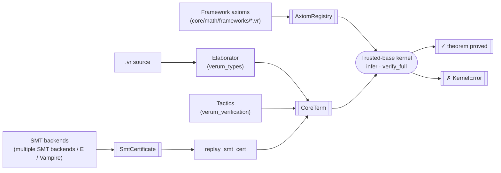

# Trusted Kernel

> Verum's soundness rests on one small crate. Everything else — the
> elaborator, all 22 tactics, every SMT backend, the cubical NbE
> evaluator, the framework-axiom registry — produces proof terms in a
> minimal explicit calculus, and the kernel re-checks them. A bug
> anywhere outside the kernel fails as "refused a valid program" or
> "certificate replay failed", **never** as "false theorem accepted".

The kernel is held to a **single-reviewer / single-session** audit
budget: the entire trusted base — the explicit calculus, every
typing rule, the normaliser, the substitution algorithm, the
`AxiomRegistry`, the `InductiveRegistry`, the `SmtCertificate`
replay surface — is one Rust crate that lives end-to-end inside a
single afternoon's review. It currently reaches every `CoreTerm`
constructor with a real typing rule (the only `NotImplemented`
arm is `SmtProof`, which dispatches to per-backend replay) and
ships an extensive lib-test suite (`cargo test -p verum_kernel
--lib`) plus a tri-prover external corpus (Lean 4, Coq,
Isabelle/HOL).

## Where the kernel sits



All pre-kernel boxes live outside the trusted computing base. The
kernel's job is to turn *every other box* into something that cannot
lie:

- **Elaborator out of TCB.** A bug in elaboration manifests as
  "refuses to elaborate a legal program" or as a `CoreTerm` that
  `infer` rejects — never as an accepted false theorem.
- **Tactics out of TCB.** Every tactic — `auto`, `simp`, `ring`,
  `omega`, `induction`, `cases`, `apply`, `exact`, ..., every user-
  defined tactic — produces a `CoreTerm` that the kernel re-checks.
  A buggy tactic fails construction or fails re-check.
- **SMT out of TCB.** Each backend produces an `SmtCertificate`,
  and the kernel's `replay_smt_cert` re-derives a `CoreTerm` witness
  from the trace. A solver that emits a spurious proof fails the
  replay here.

## The CoreTerm calculus

`CoreTerm` is the explicit typed language the kernel checks. It
covers every language feature Verum's surface needs: dependent
functions, dependent pairs, cubical paths with `hcomp` / `transp` /
`Glue`, refinement types, user / stdlib / higher inductive types,
SMT-certificate witnesses, and registered axioms.

```rust
pub enum CoreTerm {
    // Identifiers and universes
    Var(Text),
    Universe(UniverseLevel),

    // Dependent functions
    Pi  { binder, domain, codomain },
    Lam { binder, domain, body },
    App(Heap<CoreTerm>, Heap<CoreTerm>),

    // Dependent pairs
    Sigma { binder, fst_ty, snd_ty },
    Pair(Heap<CoreTerm>, Heap<CoreTerm>),
    Fst(Heap<CoreTerm>),
    Snd(Heap<CoreTerm>),

    // Cubical HoTT
    PathTy   { carrier, lhs, rhs },
    Refl(Heap<CoreTerm>),
    PathOver { motive, path, lhs, rhs },
    HComp    { phi, walls, base },
    Transp   { path, regular, value },
    Glue     { carrier, phi, fiber, equiv },

    // Refinement
    Refine { base, binder, predicate },

    // Quotient (HIT / set-quotient)
    Quotient { carrier, relation },
    QuotIntro(Heap<CoreTerm>),
    QuotElim { quot, motive, case, coh },

    // Inductive types + elimination
    Inductive { path, args },
    Elim      { scrutinee, motive, cases },

    // External witnesses
    SmtProof(SmtCertificate),
    Axiom    { name, ty, framework },

    // Diakrisis (Actic dual): ε / α tokens
    EpsilonOf(Heap<CoreTerm>),
    AlphaOf(Heap<CoreTerm>),

    // Modal operators
    ModalBox(Heap<CoreTerm>),
    ModalDiamond(Heap<CoreTerm>),
    ModalBigAnd(List<Heap<CoreTerm>>),

    // Cohesive modalities (∫ ♭ ♯)
    Shape(Heap<CoreTerm>),
    Flat(Heap<CoreTerm>),
    Sharp(Heap<CoreTerm>),
}
```

`UniverseLevel` is `Concrete(u32) | Variable(Text) | Succ(box) |
Max(box, box) | Prop`, with `checked_add` on every `Succ` step
so the level lattice cannot wrap silently in release builds.

## Typing rules

Every rule is one concrete clause of the kernel's `infer`
relation.  The column "Status" says *real* when the rule checks
the full shape (both sides of every binder) and *bring-up* when
the rule produces a well-formed result but defers a sub-check
until a richer proof-term format reaches the kernel.

| Constructor      | Rule                                                                                         | Status   |
|------------------|----------------------------------------------------------------------------------------------|----------|
| `Var x`          | lookup in `ctx`; unbound → `KernelError::UnboundVariable`                                    | real     |
| `Universe l`     | `Type(l) : Type(l + 1)`, `Prop : Type(0)`                                                    | real     |
| `Pi (x:A) B`     | `A : Universe(u₁)`, `B : Universe(u₂)` under extended ctx → result `Universe(max(u₁, u₂))`   | real     |
| `Lam (x:A) b`    | `b : B` under ctx ∪ `x:A` → result `Pi (x:A) B` with the exact codomain                      | real     |
| `App f a`        | `f : Pi (x:A) B`, `a : A` → result `B[x := a]` via capture-avoiding `substitute`             | real     |
| `Sigma (x:A) B`  | same shape as `Pi`; result `Universe(max(u₁, u₂))`                                           | real     |
| `Pair (a, b)`    | synthesise `a:A`, `b:B`; result is the non-dependent `Sigma (_ : A) B`                       | real (non-dependent — dependent-Σ introduction waits for bidirectional check-mode) |
| `Fst pair`       | `pair : Sigma (x:A) B` → result `A`                                                          | real     |
| `Snd pair`       | `pair : Sigma (x:A) B` → result `B[x := fst(pair)]`                                          | real     |
| `PathTy A a b`   | `A : Universe(u)`, `a : A`, `b : A` → result `Universe(u)`; endpoint mismatch → `TypeMismatch` | real   |
| `Refl x`         | `x : A` → `Path<A>(x, x)` with both endpoints identified                                     | real     |
| `Refine B x P`   | `B : Universe(u)`, `P` well-typed under ctx ∪ `x:B` → result `Universe(u)`                   | real (full `P : Bool` gate lands when Bool is canonically registered) |
| `Inductive p args` | result is `Universe(i)` for `i` registered with `InductiveRegistry`; arity / universe-bound checks fire on every `args` element | real |
| `HComp φ W b`    | `b : A`, walls well-typed under face `φ` → result `A`; Kan-fibrancy reductions (`φ = ⊥`, `φ = ⊤`) fire in `normalize_core` | real |
| `Transp p r v`   | `p : PathTy(A, lhs, rhs)`, `v : lhs` → result `rhs`; reductions to `v` fire when `p = Refl` or the carrier is constant in `i` | real |
| `Glue A φ T e`   | `A : Universe(u)`, `T` partial in `φ`, `e` an equivalence → result `A`'s universe; face reductions (`φ = ⊥`/`φ = ⊤`) fire in `normalize_core` | real |
| `Elim e μ cs`    | result `μ(e)`; HIT-elim β fires on point-ctor scrutinees with recursor calls inserted for self-referential arguments | real |
| `Quotient A R`   | `A : Universe(u)`, `R : A → A → Universe(0)` → result `Universe(u)` | real |
| `QuotIntro a`    | `a : A` → result `Quotient(A, R)` for the matching `Quotient` parent | real |
| `QuotElim q μ c k` | dependent eliminator with coherence obligation `k` discharged via SMT cert | real |
| `Axiom name ty`  | `name` must be in `AxiomRegistry`; transparent (body = `Some(_)`) entries δ-unfold under `normalize_with_axioms`, opaque entries stay neutral | real |
| `SmtProof cert`  | dispatched to `replay_smt_cert`; verdict shapes: clean / iou-only / hard-error / not-available | per-backend replay |

The only constructor that delegates outside the structural rules
is `SmtProof`, whose dedicated replay path lives in
`replay_smt_cert` and is implemented per-backend. The `Axiom`
arm has its own audit channel: every accepted axiom is enumerable
via `verum audit --framework-axioms` together with its
`FrameworkId { framework, citation }`, and the trust-extension
report (`--trust-extension-report`, see [Soundness gates](/docs/verification/soundness-gates))
breaks the surface down into Proved / DischargedByFramework /
Admitted buckets.

## The substitute function

`App` reduces the codomain via the capture-avoiding substitution
`B[x := a]`. The kernel implements **Barendregt-complete**
substitution: when a binder shadows the substitution target *or*
when its name appears in the free variables of the value being
substituted, the binder is α-renamed to a fresh name (via
`fresh_binder_name`) before the body is descended.

```rust
pub fn substitute(term: &CoreTerm, name: &str, value: &CoreTerm)
    -> CoreTerm {
    // For every binder constructor (Pi / Lam / Sigma / Refine):
    //   1. If the binder name == `name`: stop — the inner body
    //      shadows the substitution target.
    //   2. Else if `binder ∈ free_vars(value)`: α-rename the
    //      binder to a fresh name (avoiding both `free_vars(body)`
    //      and `free_vars(value) ∪ {name}`), then substitute under
    //      the renamed binder.
    //   3. Else: descend with `name` unchanged.
}
```

The three Barendregt cases (no clash, shadow stop, capture-avoiding
α-rename) are uniformly handled across all four binder
constructors. Pin tests in `support::tests` cover capture-avoidance
for each binder type plus the `substituted_value_free_vars_remain_free`
invariant — i.e. variables free in the substituted value remain
free after the rewrite.

Two tightly-related helpers share the same canonical implementation:

- `var_occurs_free(term, name)` — early-exits on every `CoreTerm`
  variant (no fallback to a full free-variable set construction);
  this is the predicate that drives the `transp-const` cubical
  reduction and the body-uses-binder check (which is now a
  one-line wrapper).
- `subst_binder_body` — handles cases 1–3 above as a single match,
  shared by all four binder cases of `substitute`.

## Definitional equality

`definitional_eq(a, b)` is the kernel's conversion check. It runs
both sides through `normalize_core` (β + Σ-projection-β + the
three cubical reductions + PathOver-degenerate + QuotElim β) and
compares the normal forms structurally. The fast-path
short-circuits when the two structural hashes (`StructuralHash`)
agree — the dominant case during stdlib re-use.

`definitional_eq_with_axioms(a, b, axioms)` is the δ-aware
variant: same driver, but transparent definitions (entries in
`AxiomRegistry` whose `body` is `Some(_)`) are also unfolded.
Opaque postulates (`body = None`) stay neutral by design.

A single private `normalize_core(&mut NormaliseCtx)` routine
underwrites all four public entry points (`normalize`,
`normalize_full`, `normalize_with_axioms`,
`normalize_with_inductives`) — the `NormaliseCtx` carries
`Option<&AxiomRegistry>` and `Option<&InductiveRegistry>` so
δ-unfolding and HIT-eliminator β fire only when the corresponding
registry is supplied. Every other reduction (β, the three cubical
reductions, etc.) fires unconditionally. This means a term
provably equal under one entry point is provably equal under all
four — the previous parallel-implementation drift (axiom-aware
and inductive-aware variants silently dropping cubical
reductions) has been removed.

## `AxiomRegistry`

The only implicit-trust extension point in the kernel. Every
registration stores a `FrameworkId { framework, citation }` so
`verum audit --framework-axioms` can enumerate the full set.
Duplicate registration is refused — the kernel will not silently
accept two axioms sharing a name.

```rust
pub struct AxiomRegistry { entries: List<RegisteredAxiom> }

impl AxiomRegistry {
    pub fn register(&mut self, name: Text, ty: CoreTerm,
                    framework: FrameworkId)
        -> Result<(), KernelError>;

    pub fn get(&self, name: &str) -> Maybe<&RegisteredAxiom>;
    pub fn all(&self) -> &List<RegisteredAxiom>;
}
```

`RegisteredAxiom { name, ty, framework }` is the wire format for
both the `verum audit --framework-axioms` CLI and the
`.verum-cert` exporter — a single source of truth for the trusted
boundary.

## The SMT certificate

```rust
pub struct SmtCertificate {
    pub backend: Text,             // "backend-a", "backend-b", "e", "vampire", ...
    pub backend_version: Text,     // pinned per-cert to the exact solver
    pub trace: List<u8>,           // normalized proof trace
    pub obligation_hash: Text,     // content-addressed obligation ID
}
```

The certificate format is backend-neutral. Each backend's native
proof trace is normalized by `verum_smt::proof_extraction` into the
common shape, so the kernel's `replay_smt_cert` knows only "parse a
trace per backend name", not "every backend's bespoke format".

When replay succeeds the kernel synthesises a corresponding
`CoreTerm` witness and re-checks it with `infer`. A solver bug that
produced a spurious "proof" fails at this gate — its falsehood
cannot leak into an accepted theorem.

## TCB enumeration

Verum's trusted computing base is exactly:

1. The Rust compiler and its linked dependencies (unavoidable).
2. The trusted-base kernel's `infer` / `verify` / `verify_full`
   entry points and their subroutines (`substitute`,
   `definitional_eq`, `normalize_core`, `universe_level`,
   `replay_smt_cert`).
3. Every axiom registered via `AxiomRegistry::register`, each
   carrying its `FrameworkId` attribution.
4. The **IOU axiom registry** (`iou_axiom_specs`) — kernel-rule
   templates whose discharge has been factored to a structural
   premises form (Proved), to a framework citation
   (DischargedByFramework), or remains an open obligation
   (Admitted). The current state is **29 Proved + 9
   DischargedByFramework + 0 Admitted**, so
   `#print axioms kernel_soundness` enumerates exactly the 9
   framework citations.

The first two are fixed. The third and fourth are enumerable from
the kernel itself — every exported proof certificate carries the
union of (3) + the IOU-status snapshot at certification time. No
hidden axioms, no implicit extensions, and no kernel-rule whose
discharge is an unaudited "trust me".

## Test coverage

The kernel ships with an extensive lib-test suite pinning every
typing rule plus the supporting primitives (`substitute`,
`definitional_eq`, `normalize_core`, `replay_smt_cert`,
`AxiomRegistry::register`, `InductiveRegistry`, the IOU registry,
universe-level projection, the cubical face/interval helpers,
α-renaming, capture-avoidance under each binder, and the
trust-extension audit report). Run them with:

```bash
cargo test -p verum_kernel --lib
```

New rules and new defects are added only together with a
dedicated pin test — the kernel's rule set and its known
weaknesses grow strictly monotonically.

## See also

- **[Architecture → verification pipeline](/docs/architecture/verification-pipeline#trusted-kernel)**
  — how the kernel sits under the full SMT verification subsystem.
- **[Verification → gradual verification](/docs/verification/gradual-verification)**
  — the two-layer user-facing model (`VerificationLevel` coarse
  gradient + `VerifyStrategy` operational strategy).
- **[Verification → framework axioms](/docs/verification/framework-axioms)**
  — the `@framework(name, "citation")` attribute that populates the
  `AxiomRegistry`.
- **[SMT routing](/docs/verification/smt-routing)** — the capability
  router in front of the SMT backends that produce
  `SmtCertificate` values.
