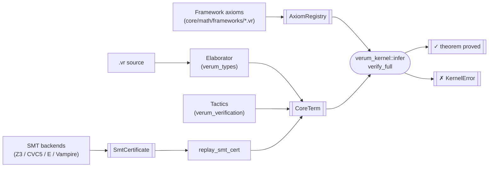

# Trusted Kernel

> Verum's soundness rests on one small crate. Everything else — the
> elaborator, all 22 tactics, every SMT backend, the cubical NbE
> evaluator, the framework-axiom registry — produces proof terms in a
> minimal explicit calculus, and the kernel re-checks them. A bug
> anywhere outside the kernel fails as "refused a valid program" or
> "certificate replay failed", **never** as "false theorem accepted".

The target size of `verum_kernel` at completion is **under 5 000
lines of Rust**, audit-able by a single reviewer in one session. The
current implementation is 1 180 LOC with 18 of 19 `CoreTerm`
constructors backed by real typing rules and 30 unit tests pinning
the behaviour.

## Where the kernel sits



All pre-kernel boxes live outside the trusted computing base. The
kernel's job is to turn *every other box* into something that cannot
lie:

- **Elaborator out of TCB.** A bug in elaboration manifests as
  "refuses to elaborate a legal program" or as a `CoreTerm` that
  `infer` rejects — never as an accepted false theorem.
- **Tactics out of TCB.** Every tactic — `auto`, `simp`, `ring`,
  `omega`, `induction`, `cases`, `apply`, `exact`, ..., every user-
  defined tactic — produces a `CoreTerm` that the kernel re-checks.
  A buggy tactic fails construction or fails re-check.
- **SMT out of TCB.** Each backend produces an `SmtCertificate`,
  and the kernel's `replay_smt_cert` re-derives a `CoreTerm` witness
  from the trace. A solver that emits a spurious proof fails the
  replay here.

## The CoreTerm calculus

`CoreTerm` is the explicit typed language the kernel checks. It
covers every language feature Verum's surface needs: dependent
functions, dependent pairs, cubical paths with `hcomp` / `transp` /
`Glue`, refinement types, user / stdlib / higher inductive types,
SMT-certificate witnesses, and registered axioms.

```rust
pub enum CoreTerm {
    // Identifiers and universes
    Var(Text),
    Universe(UniverseLevel),

    // Dependent functions
    Pi        { binder, domain, codomain },
    Lam       { binder, domain, body },
    App(Heap<CoreTerm>, Heap<CoreTerm>),

    // Dependent pairs
    Sigma     { binder, fst_ty, snd_ty },
    Pair(Heap<CoreTerm>, Heap<CoreTerm>),
    Fst(Heap<CoreTerm>),
    Snd(Heap<CoreTerm>),

    // Cubical HoTT
    PathTy    { carrier, lhs, rhs },
    Refl(Heap<CoreTerm>),
    HComp     { phi, walls, base },
    Transp    { path, regular, value },
    Glue      { carrier, phi, fiber, equiv },

    // Refinement
    Refine    { base, binder, predicate },

    // Inductive types + elimination
    Inductive { path, args },
    Elim      { scrutinee, motive, cases },

    // External witnesses
    SmtProof(SmtCertificate),
    Axiom     { name, ty, framework },
}
```

`UniverseLevel` is `Concrete(u32) | Variable(Text) | Succ | Max |
Prop`, enough for the predicative + propositional universes used by
every downstream pass today.

## Typing rules

Every rule is one concrete clause in the match statement in
`verum_kernel::infer`. The column "Status" says *real* when the
rule checks the full shape (both sides of every binder) and
*bring-up* when the rule produces a well-formed result but defers
a sub-check until a richer proof-term format reaches the kernel.

| Constructor      | Rule                                                                                         | Status   |
|------------------|----------------------------------------------------------------------------------------------|----------|
| `Var x`          | lookup in `ctx`; unbound → `KernelError::UnboundVariable`                                    | real     |
| `Universe l`     | `Type(l) : Type(l + 1)`, `Prop : Type(0)`                                                    | real     |
| `Pi (x:A) B`     | `A : Universe(u₁)`, `B : Universe(u₂)` under extended ctx → result `Universe(max(u₁, u₂))`   | real     |
| `Lam (x:A) b`    | `b : B` under ctx ∪ `x:A` → result `Pi (x:A) B` with the exact codomain                      | real     |
| `App f a`        | `f : Pi (x:A) B`, `a : A` → result `B[x := a]` via capture-avoiding `substitute`             | real     |
| `Sigma (x:A) B`  | same shape as `Pi`; result `Universe(max(u₁, u₂))`                                           | real     |
| `Pair (a, b)`    | synthesise `a:A`, `b:B`; result is the non-dependent `Sigma (_ : A) B`                       | real (non-dependent — dependent-Σ introduction waits for bidirectional check-mode) |
| `Fst pair`       | `pair : Sigma (x:A) B` → result `A`                                                          | real     |
| `Snd pair`       | `pair : Sigma (x:A) B` → result `B[x := fst(pair)]`                                          | real     |
| `PathTy A a b`   | `A : Universe(u)`, `a : A`, `b : A` → result `Universe(u)`; endpoint mismatch → `TypeMismatch` | real   |
| `Refl x`         | `x : A` → `Path<A>(x, x)` with both endpoints identified                                     | real     |
| `Refine B x P`   | `B : Universe(u)`, `P` well-typed under ctx ∪ `x:B` → result `Universe(u)`                   | real (full `P : Bool` gate lands when Bool is canonically registered) |
| `Inductive p []` | result `Type(0)`; universe annotations arrive with the type-registry bridge                  | bring-up |
| `HComp φ W b`    | result is `b`'s type; cubical reductions (Kan filler) land on top                            | bring-up |
| `Transp p r v`   | `p : PathTy(A, lhs, rhs)` → result `rhs`                                                     | real (for non-neutral paths; neutral-path fallback returns `v`'s type) |
| `Glue A φ T e`   | result `A`'s universe                                                                        | bring-up |
| `Elim e μ cs`    | result `μ(e)`; per-case well-formedness lands with the induction-principle pass              | bring-up |
| `Axiom name ty`  | `name` must be in `AxiomRegistry`; result is the registered type                             | real     |
| `SmtProof cert`  | dispatched to `replay_smt_cert`                                                              | per-backend replay |

The only constructor that still returns `KernelError::NotImplemented`
is `SmtProof`, whose dedicated replay path lives in
`replay_smt_cert` and lands per-backend in follow-up commits (Z3
proof format first, then CVC5, E, Vampire, Alt-Ergo).

## The substitute function

`App` reduces the codomain via the capture-avoiding substitution
`B[x := a]`. The kernel ships a shadow-stop strategy:

```rust
pub fn substitute(term: &CoreTerm, name: &str, value: &CoreTerm)
    -> CoreTerm {
    // recursive clone that:
    //   - replaces `Var name` with `value` clones,
    //   - descends into Pi / Sigma / Lam / Refine children but does
    //     NOT cross a binder whose name shadows `name`.
}
```

Shadow-stop is sound for the current rule set because every rule
that reaches `substitute` (the App rule and the Snd rule) is guarded
by a well-formedness check on the binder name. Full alpha-renaming
lands together with de Bruijn indices in the upcoming bring-up pass;
the user-facing surface and the test corpus are unchanged.

## Structural equality

The kernel's conversion check is structural (`a == b` on the
derived `PartialEq`) at bring-up. Real definitional equality with
beta / eta / iota / cubical transport reductions lands as dedicated
rules on top of this scaffold — each reduction gets a unit test that
certifies it preserves typing, so the TCB grows strictly
monotonically.

## `AxiomRegistry`

The only implicit-trust extension point in the kernel. Every
registration stores a `FrameworkId { framework, citation }` so
`verum audit --framework-axioms` can enumerate the full set.
Duplicate registration is refused — the kernel will not silently
accept two axioms sharing a name.

```rust
pub struct AxiomRegistry { entries: List<RegisteredAxiom> }

impl AxiomRegistry {
    pub fn register(&mut self, name: Text, ty: CoreTerm,
                    framework: FrameworkId)
        -> Result<(), KernelError>;

    pub fn get(&self, name: &str) -> Maybe<&RegisteredAxiom>;
    pub fn all(&self) -> &List<RegisteredAxiom>;
}
```

`RegisteredAxiom { name, ty, framework }` is the wire format for
both the `verum audit --framework-axioms` CLI and the
`.verum-cert` exporter — a single source of truth for the trusted
boundary.

## The SMT certificate

```rust
pub struct SmtCertificate {
    pub backend: Text,             // "z3", "cvc5", "e", "vampire", ...
    pub backend_version: Text,     // pinned per-cert to the exact solver
    pub trace: List<u8>,           // normalized proof trace
    pub obligation_hash: Text,     // content-addressed obligation ID
}
```

The certificate format is backend-neutral. Each backend's native
proof trace is normalized by `verum_smt::proof_extraction` into the
common shape, so the kernel's `replay_smt_cert` knows only "parse a
trace per backend name", not "every backend's bespoke format".

When replay succeeds the kernel synthesises a corresponding
`CoreTerm` witness and re-checks it with `infer`. A solver bug that
produced a spurious "proof" fails at this gate — its falsehood
cannot leak into an accepted theorem.

## TCB enumeration

After the kernel lands, Verum's trusted computing base is exactly:

1. The Rust compiler and its linked dependencies (unavoidable).
2. `verum_kernel::{check, infer, verify_full}` and their subroutines
   (`substitute`, `structural_eq`, `universe_level`).
3. Every axiom registered via `AxiomRegistry::register`, each
   carrying its `FrameworkId` attribution.

The first two are fixed. The third is enumerable with a one-line
command and is carried in every exported proof certificate. That's
the whole trust story — no hidden axioms, no implicit extensions.

## Test coverage

The kernel ships with 30 unit tests pinning every typing rule plus
the supporting primitives (`substitute`, `structural_eq`,
`AxiomRegistry::register`, `shape_of`, universe-level projection).
Run them with:

```bash
cargo test -p verum_kernel
```

30 / 30 pass today. New rules are added only together with a
dedicated unit test — the kernel's rule set grows strictly
monotonically so that every bring-up session shrinks, not expands,
the space of behaviours that are only asserted in prose.

## See also

- **[Architecture → verification pipeline](/docs/architecture/verification-pipeline#trusted-kernel)**
  — how the kernel sits under the full SMT verification subsystem.
- **[Verification → gradual verification](/docs/verification/gradual-verification)**
  — the two-layer user-facing model (`VerificationLevel` coarse
  gradient + `VerifyStrategy` operational strategy).
- **[Verification → framework axioms](/docs/verification/framework-axioms)**
  — the `@framework(name, "citation")` attribute that populates the
  `AxiomRegistry`.
- **[SMT routing](/docs/verification/smt-routing)** — the capability
  router in front of the SMT backends that produce
  `SmtCertificate` values.
