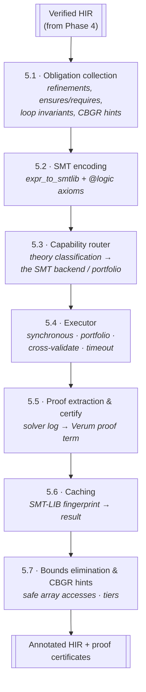

# Verification Pipeline

This page documents the internal architecture of Verum's **SMT
verification subsystem** for compiler developers. The subsystem has
two invocation points in the compilation pipeline:

:::note Solver choice is an implementation detail
The language layer talks to an abstract SMT backend. The current
release dispatches to multiple SMT backends through the capability router; a
Verum-native solver is on the roadmap. Specific solver names below
are notes about the current implementation, not part of Verum's
language contract.
:::

- **Phase 3a — contract verification** — discharges
  `contract#"..."` literals before the type checker sees the
  annotated function.
- **Phase 4 — refinement / dependent verification** — runs as a
  sub-step of semantic analysis (the `DependentVerifier`), collecting
  refinement-type obligations, `ensures` / `requires` clauses, and
  loop invariants.

Results from both flow into Phase 5 VBC codegen as tier-promotion
and bounds-elimination hints. For the user-facing model, see
**[Gradual verification](/docs/verification/gradual-verification)**;
for the solver-selection policy, see **[SMT routing](/docs/verification/smt-routing)**.

## Sub-phase overview

The internal numbering (5.1–5.7) below is the subsystem's own
internal stages — the solver work, not the public pipeline phases.

| Sub-phase | Stage                         | Summary                                                                     |
|-----------|-------------------------------|-----------------------------------------------------------------------------|
| **5.1**   | Obligation collection         | refinement types, `requires` / `ensures`, loop invariants, CBGR hints       |
| **5.2**   | SMT encoding                  | `verum_smt::expr_to_smtlib` + `@logic` axiom injection                      |
| **5.3**   | Capability router             | theory classification → the SMT backend / portfolio                               |
| **5.4**   | Executor                      | synchronous / portfolio / cross-validate, per-obligation timeout            |
| **5.5**   | Proof extraction & certify    | solver log → Verum proof term (machine-checked if `@verify(certified)`)     |
| **5.6**   | Caching                       | SMT-LIB fingerprint → result, `target/smt-cache/`                           |
| **5.7**   | Bounds elim. & CBGR hints     | inform Phase 6 about provably-safe array accesses and reference tiers       |



## 5.1 — Obligation collection

Walks the typed HIR and emits one `VerificationObligation` per
logical claim that must hold:

```rust
type VerificationObligation is {
    id:          ObligationId,
    kind:        ObligationKind,
    context:     List<Binding>,      // in-scope bindings
    goal:        Expression,         // predicate that must hold
    source:      Span,
    verify_mode: VerifyMode,         // runtime | static | smt | portfolio | certified
}

enum ObligationKind {
    RefinementWellFormed,            // from `Int { self > 0 }`
    RefinementSubsumption,           // narrowing / subtyping boundary
    Precondition,                    // where requires
    Postcondition,                   // where ensures
    LoopInvariant,                   // invariant clause
    LoopTermination,                 // decreases clause
    ArrayBounds,                     // xs[i] with unknown i
    ContextCapability,               // capability subsumption
    ReferencePromotion,              // &T -> &checked T safe?
    PatternExhaustiveness,           // match completeness
}
```

Sources: `verum_compiler::phases::verification_phase::collect_obligations`
plus hooks in `verum_types::infer` that emit obligations during flow
analysis.

## 5.2 — SMT encoding

`verum_smt::expr_to_smtlib` translates Verum expressions to SMT-LIB
2.6. The translator handles:

- Primitive types → SMT sorts (`Int`, `Real`, `Bool`, `Bitvector N`).
- Algebraic data types → SMT `declare-datatypes`.
- `@logic` functions → `define-fun-rec` with termination measure.
- Generic instantiations → monomorphised SMT sorts.
- Cubical / path types → projected to their computational content.

`@logic` axiom injection: the subset of `@logic fn`s reachable from
the current obligation is collected (via transitive closure), and
their bodies emitted as `(define-fun-rec …)` before the obligation's
`(assert (not goal))`.

## 5.3 — Capability router

`verum_smt::capability_router` classifies each obligation by theory
usage:

```rust
fn classify(obligation: &Obligation) -> TheorySet {
    let mut ts = TheorySet::empty();
    for node in obligation.goal.walk() {
        match node {
            Add(_,_) | Sub(_,_) | Mul(_,_)           => ts |= LIA,
            Mul(a,b) if !a.is_const() && !b.is_const() => ts |= NIA,
            BitAnd(_,_) | BitOr(_,_) | Shl(_,_)      => ts |= BV,
            Index(_,_) | Length(_)                    => ts |= Array,
            Concat(_,_) | Matches(_,_)                => ts |= String,
            Forall(_,_) | Exists(_,_)                 => ts |= Quant,
            _ => (),
        }
    }
    ts
}

fn route(theories: TheorySet) -> SolverChoice {
    match theories {
        ts if ts <= (LIA | BV | Array | Quant)         => the SMT backend,
        ts if ts.contains(String) || ts.contains(NIA)   => the SMT backend,
        ts if ts.contains(FiniteModelFinding)           => the SMT backend,
        _ if in_portfolio_mode()                        => Portfolio { primary: true, complementary: true },
        _                                                => the SMT backend,    // default bias
    }
}
```

## 5.4 — Executor

Three execution strategies:

| Mode | Behaviour | Trigger |
|---|---|---|
| **Single** | Dispatch to the router's choice of solver; wait for result | `@verify(formal)` |
| **Portfolio** | Both solvers plus proof search in parallel; first answer wins | `@verify(thorough)` / `@verify(reliable)` |
| **Cross-validate** | Portfolio plus an orthogonal technique; require agreement; error on disagreement | `@verify(certified)` |

Timeout: default 5 s per obligation, configurable via
`verum.toml [verify] solver_timeout_ms`. On timeout, the fallback
strategy (`other-solver` by default) retries with the non-preferred
solver.

## 5.5 — Proof extraction & certification

For `@verify(certified)` obligations:

1. The solver is asked to emit a proof log (`(set-option :produce-proofs true)`).
2. The log is parsed into an AST of inference steps.
3. Steps are normalised into Verum's `ProofTerm` enum:

```verum
type ProofTerm is
    | ByAssumption(obligation_id: UInt64)
    | ByReflexivity
    | BySymmetry(Heap<ProofTerm>)
    | ByTransitivity { left: Heap<ProofTerm>, right: Heap<ProofTerm> }
    | ByInduction    { base: Heap<ProofTerm>, step: Heap<ProofTerm> }
    | ByTactic       { name: Text, args: List<ProofTerm> }
    | ByAxiom        { axiom: Text }
    | BySubst        { lhs: Expr, rhs: Expr, proof: Heap<ProofTerm> }
    | ByCase         { scrutinee: Expr, arms: List<ProofTerm> };
```

4. A verifier checks each step against the axioms + context — this is
   the machine check.
5. On success, the proof term is serialised into the VBC archive's
   `proof_certificates` section.

**Proof erasure** (default, controlled by `[codegen] proof_erasure`):
proof terms are marked and stripped before Phase 5 VBC codegen. The
final binary carries **no runtime proof verification cost** — only
metadata required to reconstruct proofs offline.

## 5.6 — Caching

**Key**: SHA-256 of the SMT-LIB query text plus the solver version
tuple.

**Storage**: `target/smt-cache/`, one file per obligation, value is
`Result` (sat / unsat / unknown / timeout) plus optional proof blob.

**Invalidation**:
- Obligation text change → new hash, no hit.
- Solver upgrade → version-tuple mismatch, invalidate.
- Manual: delete `target/.verum-cache/smt/` or run `verum clean --all`.

Observed hit rate: 60–70% on typical incremental builds.

## 5.7 — Bounds elimination & CBGR hints

Verifier results feed forward into Phase 5 VBC codegen and Phase 6
monomorphization:

- **Array-bounds elimination**: if the solver proves `i < xs.len()`
  for every call site, the bounds check is removed before codegen.
- **Reference-tier promotion**: if escape analysis + refinement
  results prove a `&T` reference is never stored beyond its scope,
  it's promoted to `&checked T` — codegen emits `RefChecked` instead
  of `Ref`, zero-cost.
- **Capability elision**: a `Database with [Read]` that never reaches
  a `Write`-requiring method skips the capability check.

The subsystem's output carries a `HintTable` consumed by VBC codegen
and by later refinement-aware passes (`passes/cbgr_integration.rs`).

## Performance

Empirical on a 50 K-LOC mixed project, Apple M3 Max:

| Theory mix | Count | Median (ms) | p95 | Preferred solver |
|---|---:|---:|---:|---|
| LIA only | 2,100 | 8 | 35 | SMT backend |
| LIA + bitvector | 940 | 14 | 60 | SMT backend |
| LIA + string | 110 | 45 | 180 | SMT backend |
| Nonlinear (NIA) | 42 | 320 | 1,800 | SMT backend |
| Cubical / path | 18 | 120 | 400 | cubical_tactic → the SMT backend |
| **overall** | 3,210 | 12 | 85 | — |

## Telemetry

`VERUM_SMT_TELEMETRY=1` emits a JSONL stream to
`.verum/telemetry/routing.jsonl`:

```json
{"obligation": "search/postcond#3", "theories": ["lia","array"], "routed": "smt-backend", "ms": 8, "result": "unsat"}
{"obligation": "parse/postcond#1", "theories": ["lia","string"], "routed": "smt-backend", "ms": 72, "result": "unsat"}
{"obligation": "crypto/invariant#7", "theories": ["lia","bv"], "routed": "portfolio", "primary_ms": 20, "complementary_ms": 35, "agreed": true}
```

Used to tune the capability router and to detect regressions across
solver upgrades.

## Trusted kernel

Everything described above — VCGen, encoding, the capability router,
the SMT executor, proof extraction, caching, bounds elimination —
runs **outside** Verum's trusted computing base. The sole trusted
checker is a distinct crate, `verum_kernel`, target size under
5 000 lines of Rust.

### Surface

```rust
pub fn infer(ctx: &Context, term: &CoreTerm, axioms: &AxiomRegistry)
    -> Result<CoreTerm, KernelError>;

pub fn verify_full(ctx: &Context, term: &CoreTerm,
                   expected: &CoreTerm, axioms: &AxiomRegistry)
    -> Result<(), KernelError>;

pub fn replay_smt_cert(ctx: &Context, cert: &SmtCertificate)
    -> Result<CoreTerm, KernelError>;
```

`CoreTerm` is the explicit typed calculus the kernel checks — Π / Σ /
Path / HComp / Transp / Glue / Refine / Inductive / Elim / Axiom /
SmtProof plus the non-dependent constructors. Every other crate
emits `CoreTerm` values that the kernel re-checks.

### Trusted computing base

After the kernel lands, Verum's TCB is exactly:

1. The Rust compiler and its linked dependencies.
2. `verum_kernel::{check, infer, verify_full}` and their subroutines
   (`substitute`, `structural_eq`, universe rules).
3. Axioms registered via `AxiomRegistry::register`. Each registration
   stores a `FrameworkId` attribution (framework name + citation),
   so `verum audit --framework-axioms` can enumerate the entire
   trusted boundary of any proof corpus.

### Consequences

**SMT out of TCB.** Every SMT backend (the SMT backend, E, Vampire,
Alt-Ergo, Zipperposition, the forthcoming native solver) produces an
`SmtCertificate` — a backend-neutral proof trace normalised by
`verum_smt::proof_extraction`. The kernel's `replay_smt_cert`
re-derives a `CoreTerm` witness from the certificate. A bug that
lets a solver emit a spurious "proof" fails the replay here and
cannot leak into an accepted theorem.

**Tactics out of TCB.** Every tactic — all 22 built-ins plus user-
defined tactics — produces a `CoreTerm`, which the kernel re-checks
via `infer`. A buggy tactic can refuse to build, or build an ill-
typed term that `infer` rejects, but it can never lie to the kernel.

**Elaborator out of TCB.** The bidirectional elaborator in
`verum_types` converts surface `.vr` syntax into `CoreTerm`s; a bug
in elaboration manifests as "legal program refused" or "kernel
rejected the elaborated term", not "false theorem accepted".

### Landing status

All `CoreTerm` constructors have real typing rules today except
`SmtProof`, whose checker is the dedicated `replay_smt_cert` path.
That routine is implemented per-backend (the SMT backend proof format
first), completing the "SMT out of TCB" story. Test coverage is
maintained at 30 / 30 pass in `cargo test -p verum_kernel`.

## See also

- **[SMT integration](/docs/architecture/smt-integration)** — the
  surrounding SMT subsystem (the SMT backend bindings, proof search tactics).
- **[Verification → gradual verification](/docs/verification/gradual-verification)** — user-facing model, `@framework(...)`
  attribute, trusted-boundary audit.
- **[Verification → SMT routing](/docs/verification/smt-routing)** —
  solver selection policy.
- **[proof stdlib → PCC](/docs/stdlib/proof#proof-carrying-code--pccvr)** —
  certificate format.
