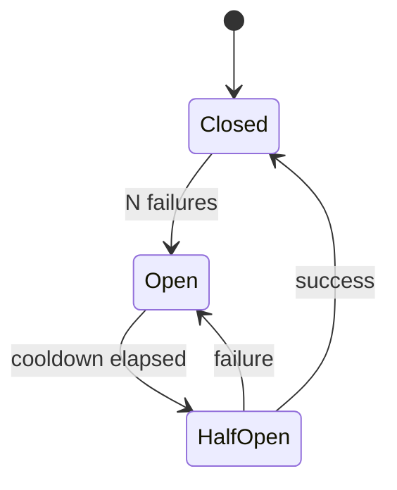

# Resilience

Five primitives compose for robust clients:

- **Timeout** — give up eventually.
- **Retry** — try again after backoff.
- **Circuit breaker** — stop hammering an unhealthy service.
- **Bulkhead** — isolate failing subsystems from healthy ones.
- **Rate limiter** — cap outgoing request frequency.

This page shows each individually and then how to stack them.

## 1. Timeouts

```verum
async fn call_with_budget(url: &Url) -> Result<Bytes, Error>
    using [Http]
{
    match timeout(5.seconds(), Http.get(url)).await {
        Result.Ok(resp) => resp.body().await.map_err(Error.from),
        Result.Err(_)   => Result.Err(Error.Timeout),
    }
}
```

`timeout(duration, future)` cancels the inner future if it hasn't
completed by `duration`. The cancellation is cooperative — the
inner future's own `.await` points are where the cancel fires.

### Deadline propagation

A **deadline** is the absolute time by which something must finish,
rather than a fresh-per-call timeout. Useful in RPC chains:

```verum
async fn handle(req: Request) -> Response
    using [Database, Clock]
{
    let deadline = Clock.now() + Duration.from_header(&req.headers)
        .unwrap_or(3.seconds());

    provide Deadline = deadline in {
        let user = lookup_user(req.id).await?;      // sees deadline
        let orders = fetch_orders(user.id).await?;  // sees deadline
        compose(user, orders)
    }
}

async fn fetch_orders(uid: UserId) -> List<Order>
    using [Database, Deadline]
{
    let remaining = Deadline.get() - Clock.now();
    if remaining <= Duration.ZERO {
        return Result.Err(Error.Deadline);
    }
    timeout(remaining, Database.query_orders(uid)).await?
}
```

A `Deadline` context distributes a single budget across nested calls.
The outermost call sets it; every inner call honours it.

## 2. Retry with exponential backoff

```verum
async fn robust(url: &Url) -> Result<Bytes, Error>
    using [Http]
{
    execute_with_retry_config(
        || async { Http.get(url).await?.body().await },
        RetryConfig {
            max_attempts: 5,
            initial_backoff_ms: 200,
            max_backoff_ms: 10_000,
            backoff_factor: 2.0,
            jitter: true,
            retry_on: |e| matches_transient_error(e),
        },
    ).await
}
```

### Jitter

Set `jitter: true`. Without jitter, *N* clients that fail at the same
instant will all retry at the same instant, hammering the server.
With jitter, each client retries at a random time in the window.

### Retry predicate

`retry_on` lets you choose which errors are worth retrying. Common
shape:

```verum
fn is_transient(e: &Error) -> Bool {
    match e {
        Error.Timeout => true,
        Error.Network(NetworkError.TemporaryFailure) => true,
        Error.Http(HttpError.Status(503 | 504 | 429)) => true,
        Error.Http(HttpError.Status(_)) => false,     // permanent
        _ => false,
    }
}
```

4xx (except 429) usually indicates a permanent caller bug; don't
retry.

## 3. Circuit breaker

```verum
let breaker = Shared.new(CircuitBreaker.new(CircuitBreakerConfig {
    failure_threshold: 5,
    reset_timeout_ms: 30_000,
    half_open_max_calls: 1,
}));

async fn call_breaker(b: &CircuitBreaker, url: &Url)
    -> Result<Bytes, Error>
    using [Http]
{
    if !b.is_call_allowed() {
        return Result.Err(Error.CircuitOpen);
    }
    match Http.get(url).await {
        Result.Ok(r)  => {
            match r.body().await {
                Result.Ok(v)  => { b.record_success(); Result.Ok(v) }
                Result.Err(e) => { b.record_failure(); Result.Err(Error.from(e)) }
            }
        }
        Result.Err(e) => { b.record_failure(); Result.Err(Error.from(e)) }
    }
}
```

State machine:



- **Closed**: calls flow; failures increment a counter.
- **Open**: calls fail fast; periodic cooldown.
- **HalfOpen**: limited trial calls; if they succeed, return to
  Closed; if any fail, back to Open.

Tune the thresholds to match your SLO. `failure_threshold: 5` over
`reset_timeout_ms: 30_000` says "five failures within 30 s trips the
breaker".

## 4. Bulkhead — isolation

A bulkhead is a concurrency cap that prevents one subsystem from
consuming all resources:

```verum
let db_sem = Shared.new(Semaphore.new(20));    // max 20 DB calls in flight
let ai_sem = Shared.new(Semaphore.new(2));     // max 2 AI calls (expensive)

async fn handle_request(req: Request) -> Response
    using [Database, AiClient]
{
    let db_permit = db_sem.acquire().await;
    let rows = Database.query(&req).await?;
    drop(db_permit);

    let ai_permit = ai_sem.acquire().await;
    let summary = AiClient.summarise(&rows).await?;
    drop(ai_permit);

    Response.new(summary)
}
```

Without `ai_sem`, a burst of AI calls could consume all task slots
and starve the database handlers. With it, AI calls queue while the
DB side stays responsive.

## 5. Rate limiter

```verum
let limiter = Shared.new(RateLimiter.token_bucket(
    rate: 100,        // 100 operations per second
    burst: 10,        // allow brief burst of 10
));

async fn outbound(req: &Request) -> Response using [Http] {
    limiter.acquire(1).await;     // throttle to rate
    Http.send(req).await
}
```

Token-bucket rate limiting caps the average rate while still allowing
brief bursts. For strict pacing (no bursts), use `RateLimiter.fixed_window(rate)`.

## The full stack — composing everything

```verum
async fn resilient_call(url: &Url, b: &CircuitBreaker, limiter: &RateLimiter)
    -> Result<Bytes, Error>
    using [Http]
{
    limiter.acquire(1).await;                            // rate limit
    timeout(10.seconds(),                                // global deadline
        execute_with_retry_config(
            || call_breaker(b, url),                    // retry + breaker
            RetryConfig::exponential(3, 200.ms())),
    ).await?
}
```

Inside-out: **rate limit → breaker → retry → timeout**. The rate
limiter is outermost so throttling applies even on retry storms. The
timeout is innermost inside the retry stack (each attempt has its
own budget) — swap if you want a global budget across retries.

## Cancellation plays nicely

All five primitives are cooperative with Verum's structured
cancellation:

```verum
nursery(timeout: 30.seconds()) {
    spawn resilient_call(&url_a, &breaker, &limiter);
    spawn resilient_call(&url_b, &breaker, &limiter);
}
// On timeout: both calls are cancelled; breakers/retries honour the
// cancellation and return promptly.
```

## Observability

Each primitive exposes metrics:

```verum
let metrics = breaker.metrics();
print(f"state: {metrics.state}");            // Closed | Open | HalfOpen
print(f"failure count: {metrics.failures}");
print(f"last trip: {metrics.last_trip_at}");

let rl_metrics = limiter.metrics();
print(f"throttled: {rl_metrics.throttled_count}");
```

Route these to a `Metrics` context (see
[`stdlib/sys`](/docs/stdlib/sys)) for dashboards.

## Testing resilience code

Use a `FakeClock` + injectable `Http` mock:

```verum
@test
async fn breaker_trips_after_five_failures() {
    let mut mock_http = MockHttp.new()
        .on_get(url, || Result.Err(HttpError.Timeout));
    let breaker = CircuitBreaker.new(CircuitBreakerConfig {
        failure_threshold: 5, ..Default.default()
    });

    provide Http = mock_http in {
        for _ in 0..5 {
            let _ = call_breaker(&breaker, &url).await;
        }
        assert!(!breaker.is_call_allowed());
    }
}
```

## See also

- **[`stdlib/async`](/docs/stdlib/async)** — `timeout`, `RateLimiter`,
  `CircuitBreaker`, `execute_with_retry_config`.
- **[HTTP client](/docs/cookbook/http-client)** — retries on real
  requests.
- **[TCP](/docs/cookbook/tcp)** — for lower-level socket resilience.
- **[Scheduler](/docs/cookbook/scheduler)** — bulkhead composition at
  the task-level.
- **[Performance](/docs/guides/performance)** — resilience vs. tail
  latency.
