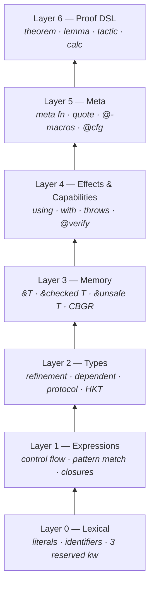

# Language Reference — Overview

This section is the **normative description** of Verum's language
surface. Where this section and the [grammar reference](/docs/reference/grammar-ebnf)
disagree, the grammar wins — but they should not disagree. Everything
documented here has a production in the grammar.

If you want the whirlwind tour, read [Getting Started → Tour](/docs/getting-started/tour).
If you want the machinery behind a feature, this is the place.

## The concentric layers of the language

Verum's concrete syntax stacks in six conceptual layers. Every layer
is independent, and every layer adds a precise kind of meaning.

| Layer | Name                        | Representative forms                                       |
|-------|-----------------------------|------------------------------------------------------------|
| **6** | Proof DSL                   | `theorem`, `lemma`, `tactic`, `calc`, `forall`, `exists`   |
| **5** | Meta                        | `meta fn`, `quote { … }`, `@`-macros, `@cfg`, splices      |
| **4** | Effects & Capabilities      | `using [...]`, `with [...]`, `throws`, `@verify`           |
| **3** | Memory                      | `&T`, `&checked T`, `&unsafe T`, CBGR                      |
| **2** | Types                       | refinement, dependent, protocol, HKT, generics             |
| **1** | Expressions                 | control flow, pattern matching, closures, comprehensions   |
| **0** | Lexical                     | literals, identifiers, operators, 3 reserved keywords      |



You can write Verum at any layer. Layer 0–1 alone gives you a clean
expression-oriented systems language. Add layer 2 for stronger types.
Add layer 4 for explicit effect tracking. The top two layers are
opt-in — you pay only for what you use.

## Pages in this section

### Lexical & syntactic structure

- **[Syntax](/docs/language/syntax)** — the lexical and syntactic
  shape of a Verum program. Keywords, literals, operators,
  top-level items.
- **[Tagged Literals](/docs/language/tagged-literals)** — `sql#`,
  `json#`, `rx#`, and ~40 other tags with compile-time validation.

### The type system

- **[Types](/docs/language/types)** — the type grammar: primitives,
  records, variants, tuples, functions, generics.
- **[Refinement Types](/docs/language/refinement-types)** — predicate
  subtyping, checked by SMT at compile time.
- **[Dependent Types](/docs/language/dependent-types)** — Σ, Π, path
  types, index refinements, value-dependent generics.
- **[Linearity](/docs/language/linearity)** — `linear` and `affine`
  types for exactly-once / at-most-once resources, enforced at
  compile time with zero runtime cost.
- **[Universes](/docs/language/universes)** — the `Type(n)` / `Prop`
  hierarchy, proof irrelevance, universe polymorphism, level
  arithmetic (`max`, `imax`).
- **[Row Polymorphism](/docs/language/row-polymorphism)** —
  extensible records with `{ x: Int | r }`, the lacks predicate,
  splat syntax, row-preserving transformations.
- **[Tensor Types](/docs/language/tensor-types)** — shape-typed
  multi-dimensional arrays (`Tensor<Float32, [3, H, W]>`) with
  compile-time shape checking and zero runtime overhead for shape.
- **[Protocols](/docs/language/protocols)** — Verum's interfaces.
  Methods, associated types, GATs, specialisation, negative bounds.
- **[Generics](/docs/language/generics)** — type parameters, bounds,
  kind annotations, rank-2 functions, HKT, universe polymorphism.
- **[Type Properties](/docs/language/type-properties)** — compile-time
  type metadata: `T.size`, `T.alignment`, `T.name`.
- **[Capability Types](/docs/language/capability-types)** —
  `Database with [Read]`, type-level access-control attenuation.

### Code organisation

- **[Functions](/docs/language/functions)** — definitions, modifiers
  (`pure`, `meta`, `async`, `cofix`, `unsafe`), generators (`fn*`),
  `throws`, `using`, `where ensures`.
- **[Patterns](/docs/language/patterns)** — the full pattern grammar.
  Literals, wildcards, variants, records, slices, ranges, `is` type
  tests, or/and patterns, guarded patterns.
- **[Active Patterns](/docs/language/active-patterns)** — user-defined
  pattern matchers: total `Even()`, parameterised `InRange(0, 100)()`,
  partial `ParseInt()(n)`.
- **[Destructuring](/docs/language/destructuring)** — patterns on the
  left of `let`, assignment, parameters; `let else`, if-let chains.
- **[Comprehensions](/docs/language/comprehensions)** — list, stream,
  map, set, generator. Unified clause syntax.
- **[Quantifiers](/docs/language/quantifiers)** — `forall` and `exists`
  expressions for specifications and proofs.
- **[Copatterns & Coinduction](/docs/language/copatterns)** — `cofix`
  functions, infinite data via observations, productivity.

### Memory

- **[Memory Model](/docs/language/memory-model)** — ownership, moves,
  borrowing, lifetimes, generation tags.
- **[References](/docs/language/references)** — the three-tier
  reference system `&T`, `&checked T`, `&unsafe T`.
- **[CBGR](/docs/language/cbgr)** — Capability-Based Generational
  References: the runtime machinery behind tier 0.

### Modules & contexts

- **[Modules](/docs/language/modules)** — `mount`, visibility levels,
  coherence, cogs.
- **[Context System](/docs/language/context-system)** — `using [...]`
  dependency injection; negative, conditional, transformed, named
  contexts; context groups.

### Computation

- **[Async & Concurrency](/docs/language/async-concurrency)** —
  `async` / `await`, `select`, `nursery`, `spawn`, `yield`,
  `for await`, stream combinators, structured concurrency.
- **[Error Handling](/docs/language/error-handling)** — `Result`,
  typed `throws`, `try`/`recover`/`finally`, `defer` / `errdefer`,
  `let else`.
- **[Metaprogramming](/docs/language/meta/overview)** — `meta fn`,
  `quote { ... }`, N-stage splicing, token trees, user-defined
  macros via `@`-prefix.
- **[Proof DSL](/docs/language/proof-dsl)** — theorems, lemmas,
  tactics, calculational proofs, `by auto` / `by smt`.

### Boundaries

- **[Attributes](/docs/language/attributes)** — `@derive`, `@verify`,
  `@repr`, `@cfg`, `@specialize`, and the full attribute vocabulary.
- **[FFI](/docs/language/ffi)** — `extern "C"` blocks, `ffi { ... }`
  with memory effects, thread safety, error protocols, ownership.

## Relating pages to grammar

Every page in this section is paired with one or more grammar
productions. For quick jumps:

| Feature                               | Page                        | Grammar section                  |
|---------------------------------------|-----------------------------|----------------------------------|
| Lexical layer                         | Syntax, Tagged Literals     | §1 (lexical grammar)             |
| Core types                            | Types                       | §2.3, 2.8                        |
| Refinement predicates                 | Refinement Types            | §2.3 (type_refinement)           |
| Σ / Π / path types                    | Dependent Types             | §2.3 (sigma_bindings, path_type, pi_type) |
| Linearity (`linear`, `affine`)        | Linearity                   | §2.4 (linearity_qualifier)        |
| Universe hierarchy                    | Universes                   | §2.7 (universe_type, universe_level_expr) |
| Row polymorphism                      | Row Polymorphism            | §2.5 (record_type, row_extension) |
| Tensor types                          | Tensor Types                | §2.7 (tensor_type_expr)           |
| Protocols                             | Protocols                   | §2.5 + 2.18                      |
| Generics, bounds                      | Generics                    | §2.4 + 2.4.x                     |
| `T with [Read]`                       | Capability Types            | §2.8 (capability_type)           |
| Functions                             | Functions                   | §2.4                             |
| Pattern grammar                       | Patterns                    | §2.14                            |
| Active patterns                       | Active Patterns             | §2.14 + 2.14.1                   |
| `forall` / `exists`                   | Quantifiers                 | §2.19.9                          |
| Comprehensions & streams              | Comprehensions              | §2.10, 2.11                      |
| Copatterns                            | Copatterns                  | §2.4 (copattern_body)            |
| Three-tier references                 | References, CBGR            | §2.8 (managed/checked/unsafe ref)|
| Modules and visibility                | Modules                     | §2.1, 2.2                        |
| Context system                        | Context System              | §2.4, 2.6                        |
| Async, nursery, select                | Async & Concurrency         | §2.12.1, 2.12.2, 2.12.3          |
| `try` / `recover` / `finally`         | Error Handling              | §2.12.1, 2.13                    |
| `meta fn`, `quote`, splices           | Metaprogramming             | §2.4, 2.12.0.1, 2.16             |
| Theorems, tactics, calc               | Proof DSL                   | §2.19                            |
| `@derive`, `@verify`, etc.            | Attributes                  | §2.1 (attribute_item)            |
| FFI                                   | FFI                         | §2.7                             |

## Core vocabulary

| Term          | Meaning                                                                                                     |
|---------------|-------------------------------------------------------------------------------------------------------------|
| **Item**      | Top-level declaration: function, type, implement, const, module, context, protocol, FFI, impl of an attribute. |
| **Refinement** | A predicate attached to a type. Every value of the type must satisfy it; verified by SMT at compile time.   |
| **Protocol**   | An interface: a set of method and associated-type signatures. Implemented with `implement ... for ...`.     |
| **Context**    | A typed capability injected into a function via `using [...]`. Explicit; no hidden globals.                 |
| **Capability** | A type-level permission: `T with [Read, Write]` narrows what can be done with `T`.                          |
| **Cog**        | A package — a distributable unit of Verum code with a `verum.toml` manifest.                                |
| **Tier**       | A level in the three-tier reference model: `&T` (tier 0), `&checked T` (tier 1), `&unsafe T` (tier 2).       |
| **CBGR**       | Capability-Based Generational References — the default memory-safety mechanism. ~0.93 ns per check (measured; target ≤ 15 ns). |
| **VBC**        | Verum ByteCode — the language's unified IR, interpreted or compiled to native via LLVM.                     |
| **Stage**      | Metaprogramming tier: 0 = runtime, 1 = first meta, N = meta-meta-… Each `quote` targets stage N − 1.         |
| **Framework axiom** | An external result postulated via `@framework(identifier, "citation")`. Every use surfaces in `verum audit --framework-axioms` — no hidden axioms. |
| **Kernel**     | `verum_kernel` — the LCF-style trusted checker. Every tactic, SMT backend, and elaboration step produces a proof term the kernel re-checks. **The sole member of Verum's trusted computing base** besides the Rust toolchain and registered axioms. |
| **TCB**        | Trusted Computing Base — the set of components whose bugs can accept false theorems. For Verum: Rust toolchain + `verum_kernel` + registered framework axioms. Enumerable by `verum audit --framework-axioms`. |

## Reading conventions

- `verum` fenced blocks are illustrative — some may elide context
  clauses or refinements for clarity. Complete examples are marked
  `// complete` in the code comment.
- Grammar snippets (in EBNF) are verbatim fragments of the [grammar reference](/docs/reference/grammar-ebnf).
- `→` indicates compilation or evaluation direction.
- `⊢` indicates a type-checking judgement.
- Layer annotations `(layer 2)` on a feature indicate where in the
  six-layer stack it lives.

## Three ways to enter the section

- **Systems-oriented reader**: start with
  **[Syntax](/docs/language/syntax)** → **[Types](/docs/language/types)**
  → **[Memory Model](/docs/language/memory-model)** → **[References](/docs/language/references)**.
- **Type-theory-oriented reader**: start with
  **[Types](/docs/language/types)** → **[Refinement Types](/docs/language/refinement-types)**
  → **[Dependent Types](/docs/language/dependent-types)** → **[Proof DSL](/docs/language/proof-dsl)**.
- **Concurrency-oriented reader**: start with
  **[Async & Concurrency](/docs/language/async-concurrency)** →
  **[Context System](/docs/language/context-system)** →
  **[Copatterns & Coinduction](/docs/language/copatterns)**.

The pages cross-reference; there is no strict linear order.

## A smallest well-formed program per layer

### Layer 0–1 only — an expression

```verum
fn main() {
    print("hello, world");
}
```

`print` is a built-in that does not require a context; user-defined
effects (Database, Logger, Clock, …) would appear in `using [...]`
clauses — see layer 4 below.

### Add layer 2 — refined types

```verum
type NonNegative is Int { self >= 0 };

fn double(n: NonNegative) -> NonNegative { n * 2 }
```

### Add layer 3 — references

```verum
fn sum(xs: &List<Int>) -> Int {
    let mut acc = 0;
    for x in xs { acc += x; }
    acc
}
```

### Add layer 4 — effects

```verum
fn read_config(path: &Path) -> IoResult<Config>
    using [FileSystem]
    where throws(IoError)
{
    let text = fs::read_to_string(path)?;
    Config.parse(&text)
}
```

### Add layer 5 — meta

```verum
meta fn derive_serialize<T>() -> TokenStream {
    let fields = @type_fields<T>();
    quote {
        implement Serialize for $T {
            fn write(&self, out: &mut Writer) {
                $[for f in fields { out.write(self.${f.name}); }]
            }
        }
    }
}
```

### Add layer 6 — proof

```verum
theorem double_monotone(a: Int, b: Int)
    requires a <= b
    ensures  2 * a <= 2 * b
{
    proof by omega
}
```

Every program — from `print("hi")` to a certified ledger — is the
composition of a subset of these six layers. Master them in any order;
revisit the others when the problem demands it.

## Ready?

Start with **[Syntax](/docs/language/syntax)**.
