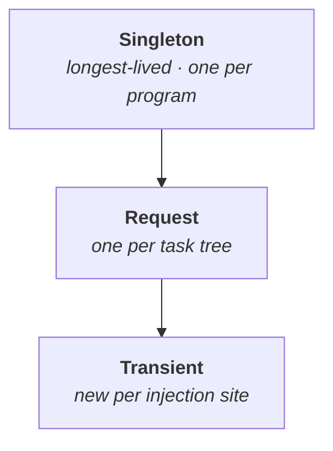

# `core.context` — Dependency injection primitives

The runtime side of the language-level context system. Users interact
via `using [...]` and `provide ... = ... in { ... }`; the types here
are what the compiler lowers those constructs to, plus a typed API for
building providers, layers, and scopes.

| File | Lines | What's in it |
|---|---:|---|
| `mod.vr` | 80 | re-exports and module-level docs |
| `scope.vr` | 170 | `Scope` (Singleton / Request / Transient), `ContextScope`, scope rules |
| `provider.vr` | 233 | `Provider<T>`, `ScopedProvider<T>`, `get_context`, `has_context` |
| `layer.vr` | 64 | `Layer` — declarative composition of multiple context providers |
| `error.vr` | 51 | `ContextError` (5 variants with error codes) |
| `standard.vr` | 662 | 10 standard context types with full method signatures |

See **[Language → context system](/docs/language/context-system)** for
the user-facing guide. For compile-time meta contexts, see
**[stdlib → meta](/docs/stdlib/meta)**.

---

## Two levels of DI

| Level | Resolution | Overhead | Use case |
|---|---|---|---|
| **Static** (`@injectable` / `inject`) | compile time | 0 ns | singletons, well-known backends |
| **Dynamic** (`context Name` / `provide` / `using`) | task-local slots | ~2–30 ns | request-scoped, late-bound, test-mockable |

### Static — `@injectable` / `inject`

```verum
@injectable(Scope.Singleton)
type ConnectionPool is { ... };

fn process(req: Request) {
    let pool: &ConnectionPool = inject ConnectionPool;  // 0 ns — resolved at compile time
}
```

### Dynamic — `provide` / `using`

```verum
context Logger { fn info(&self, msg: Text); ... }

fn handle(req: Request) using [Logger, Database] {
    Logger.info(f"handling {req.path}");
    Database.query("SELECT ...")?
}

fn main() using [IO] {
    provide Logger = ConsoleLogger.new() in
    provide Database = connect_db() in {
        handle(request);
    };
}
```

---

## Scopes (`scope.vr`)

```verum
type Scope is
    | Singleton     // one instance per program
    | Request       // one instance per task tree
    | Transient;    // new instance per injection site
```

### Scope hierarchy rules



A scope may only depend on scopes of equal or longer lifetime:

| Dependent scope | Can depend on |
|-----------------|---------------|
| `Singleton` | `Singleton` only |
| `Request` | `Singleton`, `Request` |
| `Transient` | any |

Violating this is compile error **E806: scope violation**.

```verum
implement Scope {
    fn can_depend_on(&self, dependency: Scope) -> Bool;
    fn name(&self) -> Text;       // "Singleton" / "Request" / "Transient"
    fn rank(&self) -> Int;        // Singleton=0, Request=1, Transient=2
}

type ContextScope is { scope: Scope, key: Text };
implement ContextScope {
    fn root() -> Self;
    fn enter(&self) -> Self;
    fn current_depth(&self) -> Int;
    fn parent(&self) -> Int;
}
```

---

## Error type (`error.vr`)

Five variants with associated error codes:

```verum
type ContextError is
    | NotFound { context_name: Text }
    | NotProvided { context_name: Text, function_name: Text }
    | TypeMismatch { context_name: Text, expected: Text, found: Text }
    | CircularDependency { chain: List<Text> }
    | ScopeViolation { dependent: Text, dependency: Text,
                       dependent_scope: Text, dependency_scope: Text };
```

| Error | Code | When |
|---|---|---|
| `NotFound` | — | context not in the environment |
| `NotProvided` | E3050 | `using [X]` declared but no `provide X` on any call path |
| `TypeMismatch` | — | provided value doesn't match the declared context type |
| `CircularDependency` | E805 | static DI graph has a cycle |
| `ScopeViolation` | E806 | long-lived scope depends on short-lived |

---

## Providers (`provider.vr`)

### `Provider<T>` — lazy factory with caching

```verum
type Provider<T> is {
    factory: fn() -> T,
    cached: Maybe<T>,
};

implement Provider<T> {
    fn new(factory: fn() -> T) -> Self;   // create from factory
    fn of(value: T) -> Self;              // create from pre-computed value
    fn get(&mut self) -> T;               // resolve (lazy; caches result)
    fn is_resolved(&self) -> Bool;
    fn reset(&mut self);                  // clear cache, next get() re-runs factory
}
```

### `ScopedProvider<T>` — provides and cleans up in a scope

```verum
type ScopedProvider<T> is { slot_id: Int, value: T };

implement ScopedProvider<T> {
    fn new(slot_id: Int, value: T) -> Self;
    fn run<R>(&self, body: fn() -> R) -> R;  // installs value for the duration of body
}
```

### Runtime accessors

These are what the compiler emits for calls like `Logger.info(...)`
inside `using [Logger]`:

```verum
get_context<T>(slot_id: Int) -> Maybe<T>       // O(1) slot read, ~2 ns
has_context(slot_id: Int) -> Bool
```

The slot-based lookup uses a fixed-size array (256 slots) in the
task-local `CapabilityContext`, giving O(1) access (~2 ns) instead
of O(n) stack scanning (~20 ns). The compiler assigns well-known
context types to compile-time slot indices.

---

## `Layer` — declarative wiring (`layer.vr`)

Layers group multiple `provide` bindings for modular application
assembly. The compiler resolves inter-layer dependencies and
generates optimal initialisation order.

```verum
layer DatabaseLayer {
    provide ConnectionPool = ConnectionPool.new(Config.get_url());
    provide QueryExecutor = QueryExecutor.new(ConnectionPool);
    provide Migrations = Migrations.new(ConnectionPool);
}

layer LoggingLayer {
    provide Logger = ConsoleLogger.new(Config.get_level());
    provide Metrics = PrometheusMetrics.new();
}
```

Compose and run:

```verum
let app_layer = Layer.new()
    .with_singleton::<Logger>(ConsoleLogger.new(LogLevel.Info))
    .with_singleton::<Clock>(SystemClock.new())
    .with_request::<Database>(|| connect_db())
    .with_request::<Metrics>(|| Metrics.tagged("req_id"))
    .with_transient::<Random>(|| Rng.from_os());

app_layer.run(async {
    let mut server = HttpServer.bind(&":8080").await?;
    server.serve(|req| handle(req)).await?;
    Result.Ok::<(), Error>(())
}).await.expect("server");
```

Layer merging:

```verum
let full = Layer.new()
    .merge(logging_layer)
    .merge(db_layer)
    .merge(metrics_layer);
```

---

## The 10 standard contexts (`standard.vr`)

All are `context protocol`s — you provide a concrete implementation
at the top of your program. Each one follows the same pattern:
declare with `using [Name]`, provide with `provide Name = impl`.

### `Logger` — structured logging (9 methods)

```verum
context Logger {
    fn log(level: LogLevel, message: Text);
    fn log_record(record: LogRecord);
    fn is_enabled(level: LogLevel) -> Bool;
    fn trace(message: Text);
    fn debug(message: Text);
    fn info(message: Text);
    fn warn(message: Text);
    fn error(message: Text);
    fn fatal(message: Text);
}
```

### `Database` — relational access (6 methods)

```verum
context Database {
    fn query(sql: Text, params: List<Text>) -> Result<QueryResult, Text>;
    fn execute(sql: Text, params: List<Text>) -> Result<Int, Text>;
    fn begin() -> Result<(), Text>;
    fn commit() -> Result<(), Text>;
    fn rollback() -> Result<(), Text>;
    fn is_connected() -> Bool;
}
```

### `Auth` — authentication & authorisation (4 methods)

```verum
context Auth {
    fn current_user() -> Maybe<AuthUser>;
    fn is_authenticated() -> Bool;
    fn has_permission(permission: Text) -> Bool;
    fn has_role(role: Text) -> Bool;
}
```

### `Config` — application configuration (5 methods)

```verum
context Config {
    fn get(key: Text) -> Maybe<Text>;
    fn get_int(key: Text) -> Maybe<Int>;
    fn get_bool(key: Text) -> Maybe<Bool>;
    fn get_or(key: Text, default: Text) -> Text;
    fn has(key: Text) -> Bool;
}
```

### `Cache` — key-value caching (5 methods)

```verum
context Cache {
    fn get(key: Text) -> Maybe<Text>;
    fn set(key: Text, value: Text, ttl: Maybe<Duration>);
    fn delete(key: Text) -> Bool;
    fn exists(key: Text) -> Bool;
    fn clear();
}
```

### `Metrics` — counters, gauges, histograms (5 methods)

```verum
context Metrics {
    fn increment(name: Text);
    fn increment_by(name: Text, amount: Float);
    fn gauge(name: Text, value: Float);
    fn histogram(name: Text, value: Float);
    fn timing(name: Text, duration_ms: Int);
}
```

### `Tracer` — distributed tracing (5 methods)

```verum
context Tracer {
    fn start_span(name: Text) -> Span;
    fn end_span(span: Span);
    fn add_attribute(key: Text, value: Text);
    fn add_event(name: Text);
    fn current_trace_id() -> Maybe<Text>;
}
```

### `Clock` — testable time (2 methods)

```verum
context Clock {
    fn now() -> Instant;
    fn system_time() -> SystemTime;
}
```

Mockable: in tests, `provide Clock = FakeClock.at(epoch())`.

### `Random` — testable randomness (5 methods)

```verum
context Random {
    fn int(max: Int) -> Int;
    fn int_range(min: Int, max: Int) -> Int;
    fn float() -> Float;
    fn bytes(count: Int) -> List<Byte>;
    fn bool() -> Bool;
}
```

### `FileSystem` — testable file operations (8 methods)

```verum
context FileSystem {
    fn read_text(path: Text) -> Result<Text, Text>;
    fn read_bytes(path: Text) -> Result<List<Byte>, Text>;
    fn write_text(path: Text, content: Text) -> Result<(), Text>;
    fn write_bytes(path: Text, content: List<Byte>) -> Result<(), Text>;
    fn exists(path: Text) -> Bool;
    fn remove(path: Text) -> Result<(), Text>;
    fn list_dir(path: Text) -> Result<List<Text>, Text>;
    fn create_dir(path: Text) -> Result<(), Text>;
}
```

---

## Async propagation rules

When a task spawns or suspends, what happens to its context stack?

| Event | Behaviour |
|---|---|
| `spawn task` | child clones the parent's context stack |
| `.await` | context stack preserved across suspension |
| generator `yield` / resume | stack snapshotted at yield, restored at resume |
| channel `send` / `recv` | **no** propagation — channels are data pipes |
| `nursery { spawn ... }` | each child inherits the nursery's stack |
| `provide X = v in { ... }` | `v` installed for the block, unbound on exit |

Implemented in `runtime::ctx_bridge` via `env_ctx_get`, `env_ctx_set`,
`env_ctx_end`.

---

## Negative and transformed contexts

Advanced forms of `using [...]`:

```verum
// Negative — explicitly forbid IO in this scope
fn pure_compute() using [!IO] { ... }

// Transformed — attenuate capabilities
fn audit(db: &Database) using [Database.readonly()] { ... }

// Conditional — only requested if a cfg flag is set
fn optionally_log() using [Logger if cfg.debug] { ... }

// Aliased — multiple contexts of the same type
fn forward(msg: Msg) using [Database as primary, Database as replica] { ... }
```

Negative contexts are enforced at compile time: a function that
declares `using [!IO]` cannot transitively call any function whose
`using` clause includes `IO`. Violations produce **E3050** (direct)
or **E3051** (transitive).

---

## CapabilityContext internals

From `core/runtime/env.vr` — the per-task structure that backs the
context system:

```verum
type CapabilityContext is {
    slots: [*mut Byte; 256],                   // O(1) slot array for well-known contexts
    dynamic_ctx: List<DynamicFrame>,          // provide/using runtime contexts
    middleware: List<Heap<dyn ContextMiddleware>>,
};
```

- **Slots (0–255)**: compile-time indices for standard context types.
  Lookup is a direct array index (~2 ns).
- **Dynamic frames**: for user-defined contexts that don't have a
  compile-time slot, `provide` pushes a frame and `using` scans
  the stack (~20 ns).
- **Middleware**: intercepts `provide` / access events for logging,
  tracing, or security checks.

```verum
type ContextMiddleware is protocol {
    fn on_provide(&self, type_id: TypeId, value: &dyn Any) -> Result<(), ContextError>;
    fn on_access(&self, type_id: TypeId) -> Result<(), ContextError>;
}
```

### Fork semantics

```verum
implement CapabilityContext {
    fn fork(&self) -> CapabilityContext;   // shallow clone for child tasks
    fn provide<T>(&mut self, value: &T);  // install a context value
    fn get_slot(slot_id: Int) -> Maybe<T>; // fast-path slot read
    fn get_dynamic<T>() -> Maybe<&T>;     // dynamic-frame scan
}
```

`fork()` is what `spawn` calls. The child shares slot references
with the parent (copy-on-write semantics) so context propagation
across `spawn` is cheap.

---

## Cross-references

- **[Language → context system](/docs/language/context-system)** — user-level surface.
- **[Language → context system → meta contexts](/docs/language/context-system#meta-contexts--the-compile-time-mirror)** — compile-time mirror.
- **[Stdlib → meta](/docs/stdlib/meta)** — the 14 meta capability contexts.
- **[Stdlib → runtime](/docs/stdlib/runtime)** — `ExecutionEnv`, `ctx_bridge`.
- **[Architecture → execution environment](/docs/architecture/execution-environment)** — how the four pillars compose.
