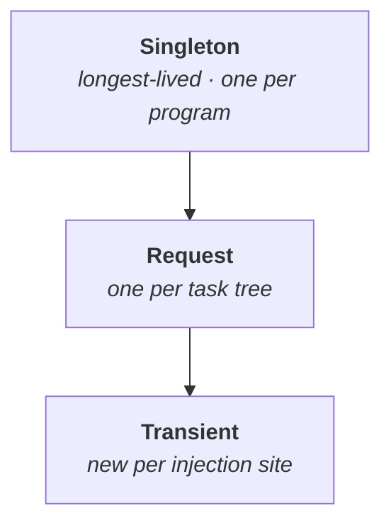

# `core.context` — Dependency injection primitives

The runtime side of the language-level context system. Users interact
via `using [...]` and `provide ... = ... in { ... }`; the types here
are what the compiler lowers those constructs to, plus a typed API for
building providers, layers, and scopes.

| File | Lines | What's in it |
|---|---:|---|
| `mod.vr` | 108 | re-exports and module-level docs |
| `scope.vr` | 200 | `Scope` (Singleton / Request / Transient), `ContextScope`, scope rules |
| `provider.vr` | 318 | `Provider<T>`, `ScopedProvider<T>`, `get_context`, `has_context` |
| `layer.vr` | 82 | `Layer` — declarative composition of multiple context providers (doc-only; compiler-side implementation) |
| `error.vr` | 103 | `ContextError` (5 variants with error codes) |
| `standard.vr` | 696 | 10 standard context types with full method signatures |

See **[Language → context system](/docs/language/context-system)** for
the user-facing guide. For compile-time meta contexts, see
**[stdlib → meta](/docs/stdlib/meta)**.

## Module status

Each `core.context.*` module carries an explicit conformance status — same
contract as [`core.base`](./base.md#module-status),
[`core.time`](./time.md#module-status), and
[`core.collections`](./collections.md#module-status). The status row is
the truth-table over the module's public API exercised by
`core-tests/context/<module>/` under both Tier 0 (interpreter) and Tier 2
(AOT). Disagreement between tiers is itself a test failure.

| Status | Meaning |
|---|---|
| **complete** | Every public method conformance-tested under interp + AOT; algebraic laws pinned. |
| **partial** | Subset conformance-tested + stable; remainder gated by upstream defects, documented per-module. |
| **regression-only** | Tests gate on language-level defects; few/no public-API tests pass yet. |
| **undocumented** | Snapshot from source; no runtime conformance pin yet. |

| Module | Status | Conformance suite |
|---|---|---|
| `scope.vr`     | **partial** | [core-tests/context/scope](https://github.com/verum-lang/verum/tree/main/core-tests/context/scope) — `Scope` ADT (variants / `name` / `rank` / 3×3 `can_depend_on`) + `ContextScope` depth chain. ~30 unit + ~20 property + integration + regression, GREEN under `--interp`. The cross-module `Transient`/`Request` collision is handled by qualifying as `Scope.<Variant>` (the established discipline). |
| `error.vr`     | **partial** | [core-tests/context/error](https://github.com/verum-lang/verum/tree/main/core-tests/context/error) — `ContextError` 5-variant ADT: construction, `message()`, `Display`/`Debug`, full `Eq` matrix. ~24 unit + ~15 property + integration + regression, GREEN under `--interp`. |
| `provider.vr`  | **partial** | [core-tests/context/provider](https://github.com/verum-lang/verum/tree/main/core-tests/context/provider) — `Provider<T>` lazy factory + `ScopedProvider.run` (TLS install/pop) + `get_context`/`has_context`. unit + property + **integration** (Text/List/Maybe/tuple/ContextLogLevel carriers) + **regression** (the `Maybe<T>` field-tracking + `Provider.of` soundness fixes) — all GREEN under `--interp`. Enhancements `map`/`flat_map`/`try_run` deferred (audit §3.1–3.2). |
| `standard.vr`  | **partial** | [core-tests/context/standard](https://github.com/verum-lang/verum/tree/main/core-tests/context/standard) — `ContextLogLevel` (severity/name/is_enabled/Eq/Ord/Clone/Debug + Display via bound-var) + `AuthUser` + `QueryResult` GREEN. Pinned `@ignore`'d: `Row.get`/`Row.get_index`/`Row` direct field read (CLASS-9 archive field-shift + `Maybe<&T>` archive-method SIGSEGV, audit §3.5/§3.7) and `f"{Type.Variant}"` Display non-dispatch (§3.6). The 10 `context Logger {} / …` protocols need `provide`/`using` runtime and are tested at the language level in [`vcs/specs/L2-standard/contexts/`](https://github.com/verum-lang/verum/tree/main/vcs/specs/L2-standard/contexts). |
| `layer.vr`     | **undocumented** | `layer.vr` is doc-only — layer composition is a compiler construct (`grammar/verum.ebnf` `layer_def`/`layer_expr`), lowered in `crates/verum_compiler`. No runtime Verum surface; behaviour is tested at the language level. See [core-tests/context/layer/audit.md](https://github.com/verum-lang/verum/tree/main/core-tests/context/layer/audit.md). |
| `mod.vr`       | **partial** | [core-tests/context/mod](https://github.com/verum-lang/verum/tree/main/core-tests/context/mod) — umbrella re-export reachability (`mount core.context.*`) + re-exported-type laws + re-export regressions, GREEN under `--interp`. |

The status table is the runtime truth, not the file's `lifecycle`
annotation: `lifecycle: Lifecycle.Theorem("v0.1")` is the *spec*
lifecycle (what the contract promises); the table above is the
*conformance* lifecycle (what the implementation delivers under
test today). They are aligned only when the status reads **stable**.

### Open upstream defects gating context test runs (2026-06-01)

The bare-variant collision (task #17/#39) and the `global_ctors` stage-3
stub cascade (task #47) that previously gated the whole suite are
**resolved** — `scope` / `error` / `provider` / `mod` and most of
`standard` are GREEN under `--interp`. Three codegen defects remain,
all in the cross-module / archive-loaded **CLASS-9** family, all needing a
compiler rebuild to fix:

* **Archive-method `Maybe<&T>` return SIGSEGV** — calling a stdlib
  (archive-loaded) record method that returns `Maybe<&T>` borrowed from a
  `self.<List-field>[i].as_ref()` element, then consuming it, SIGSEGVs the
  compiler during execution-compile. A byte-identical *locally-defined*
  record works. Blocks `Row.get` / `Row.get_index` / `Display for Row`.
  Pinned `@ignore`'d in
  [standard/regression_test.vr](https://github.com/verum-lang/verum/tree/main/core-tests/context/standard) §3.5.
* **`f"{Type.Variant}"` Display non-dispatch** — a direct variant
  constructor in an interpolation placeholder renders the variant name
  instead of dispatching the user `Display` impl; `let x = …; f"{x}"`
  (bound variable) dispatches correctly, and `:?` Debug works in both
  forms. Coverage uses the bound-var idiom; the broken form is pinned
  `@ignore`'d (§3.6).
* **Archive-record field-shift on direct field read** — reading an
  archive-loaded record's own fields from user code (`r.columns` /
  `r.values` on `Row`) mis-resolves the field index. The residual of the
  CLASS-9 field-shift family for record layouts with `List<Maybe<T>>`
  fields (§3.7).

These do not gate the bulk of the suite — they constrain only the `Row`
accessors and direct-constructor `Display` interpolation, both of which
are pinned with minimal repros and worked around to preserve coverage.

**Cross-tier (AOT) status**: the `--interp` numbers above are validated;
`--aot` is currently blocked stdlib-wide by in-flight codegen work, so the
`partial` status reflects the interpreter tier only. Of the two AOT
blockers: the parallel-codegen LLVM SIGSEGV (`verum test --aot` default
`parallel=true` was not thread-safe across per-test native compilation) is
**fixed** (unique per-test artifact paths, commit `f1c0510e3`); the
remaining blocker is a `MakeVariantTyped` field-count / tag ABI mismatch
that miscompiles ADT construction — `Scope.Singleton.name()` still returns
the wrong value under `--aot` (verified 2026-06-01). Promotion to
**complete** requires that mismatch fixed and the suite GREEN on both
tiers.

---

## Two levels of DI

| Level | Resolution | Overhead | Use case |
|---|---|---|---|
| **Static** (`@injectable` / `inject`) | compile time | 0 ns | singletons, well-known backends |
| **Dynamic** (`context Name` / `provide` / `using`) | task-local slots | ~2–30 ns | request-scoped, late-bound, test-mockable |

### Static — `@injectable` / `inject`

```verum
@injectable(Scope.Singleton)
type ConnectionPool is { ... };

fn process(req: Request) {
    let pool: &ConnectionPool = inject ConnectionPool;  // 0 ns — resolved at compile time
}
```

### Dynamic — `provide` / `using`

```verum
context Logger { fn info(&self, msg: Text); ... }

fn handle(req: Request) using [Logger, Database] {
    Logger.info(f"handling {req.path}");
    Database.query("SELECT ...")?
}

fn main() {
    provide Logger = ConsoleLogger.new(),
            Database = connect_db() {
        handle(request);
    };
}
```

---

## Scopes (`scope.vr`)

```verum
type Scope is
    | Singleton     // one instance per program
    | Request       // one instance per task tree
    | Transient;    // new instance per injection site
```

### Scope hierarchy rules


```mermaid
flowchart TD
    S["<b>Singleton</b><br/><i>longest-lived · one per program</i>"]
    R["<b>Request</b><br/><i>one per task tree</i>"]
    T["<b>Transient</b><br/><i>new per injection site</i>"]
    S --> R --> T
```

A scope may only depend on scopes of equal or longer lifetime:

| Dependent scope | Can depend on |
|-----------------|---------------|
| `Singleton` | `Singleton` only |
| `Request` | `Singleton`, `Request` |
| `Transient` | any |

Violating this is compile error **E806: scope violation**.

```verum
implement Scope {
    fn can_depend_on(&self, dependency: Scope) -> Bool;
    fn name(&self) -> Text;       // "Singleton" / "Request" / "Transient"
    fn rank(&self) -> Int;        // Singleton=0, Request=1, Transient=2
}

// Runtime depth-tracking record for `provide ... in { ... }` lexical
// nesting. `root()` is depth 0; `enter()` returns a NEW scope at depth+1
// (it does not mutate the receiver).
type ContextScope is { depth: Int, parent_depth: Int };
implement ContextScope {
    fn root() -> Self;            // depth 0, parent 0
    fn enter(&self) -> Self;      // depth+1, parent = self.depth
    fn current_depth(&self) -> Int;
    fn parent(&self) -> Int;      // parent depth (for LIFO cleanup)
}
```

---

## Error type (`error.vr`)

Five variants with associated error codes:

```verum
type ContextError is
    | NotFound { context_name: Text }
    | NotProvided { context_name: Text, function_name: Text }
    | TypeMismatch { context_name: Text, expected: Text, found: Text }
    | CircularDependency { chain: List<Text> }
    | ScopeViolation { dependent: Text, dependency: Text,
                       dependent_scope: Text, dependency_scope: Text };
```

`ContextError` is the **runtime** error type (returned/propagated when a
context cannot be resolved or provided):

| Variant | When |
|---|---|
| `NotFound` | context not present in the current environment |
| `NotProvided` | `using [X]` declared but no `provide X` reached this call |
| `TypeMismatch` | provided value's type doesn't match the declared context type |
| `CircularDependency` | dependency graph among providers has a cycle |
| `ScopeViolation` | a longer-lived scope depends on a shorter-lived one |

These are distinct from the **compile-time** diagnostic codes the type
checker emits for the static `@injectable` / `using` analysis (in
`crates/verum_types`): **E3050 / E3051 / E3052** (direct / transitive /
conflicting *negative-context* `!Ctx` violations) and **E808** (duplicate
`provide` for the same context in one scope). There is no 1:1 mapping
between the runtime `ContextError` variants and these compile-time codes —
they live at different layers.

---

## Providers (`provider.vr`)

### `Provider<T>` — lazy factory with caching

```verum
type Provider<T> is {
    factory: fn() -> T,
    cached: Maybe<T>,
};

implement Provider<T> {
    fn new(factory: fn() -> T) -> Self;   // create from factory
    fn of(value: T) -> Self;              // create from pre-computed value
    fn get(&mut self) -> T;               // resolve (lazy; caches result)
    fn get_ref(&mut self) -> &T;          // resolve + borrow without cloning
    fn is_resolved(&self) -> Bool;
    fn reset(&mut self);                  // clear cache, next get() re-runs factory

    // Functor / monad composition (eager: resolve self, then apply f).
    fn map<U, F: fn(T) -> U>(&mut self, f: F) -> Provider<U>;
    fn flat_map<U, F: fn(T) -> Provider<U>>(&mut self, f: F) -> Provider<U>;
}
```

`map` / `flat_map` are **eager**: they resolve `self` (running its
factory) and apply `f` immediately, returning an already-resolved
`Provider<U>`. A lazy variant that defers `f` until the derived provider
is first accessed needs environment-capturing closures and is tracked as
a follow-up.

### `ScopedProvider<T>` — provides and cleans up in a scope

```verum
type ScopedProvider<T> is { slot_id: Int, value: T };

implement ScopedProvider<T> {
    fn new(slot_id: Int, value: T) -> Self;
    fn run<R>(&self, body: fn() -> R) -> R;  // installs value for the duration of body
    // Fallible body: the slot is popped BEFORE the Result is returned,
    // so cleanup happens on both Ok and Err (safe to `?`-propagate).
    fn try_run<R, E>(&self, body: fn() -> Result<R, E>) -> Result<R, E>;
}
```

### Runtime accessors

These are what the compiler emits for calls like `Logger.info(...)`
inside `using [Logger]`:

```verum
get_context<T>(slot_id: Int) -> Maybe<T>       // O(1) slot read, ~2 ns
has_context(slot_id: Int) -> Bool
```

The slot-based lookup uses a fixed-size array (256 slots) in the
task-local `CapabilityContext`, giving O(1) access (~2 ns) instead
of O(n) stack scanning (~20 ns). The compiler assigns well-known
context types to compile-time slot indices.

---

## `Layer` — declarative wiring (`layer.vr`)

Layers group multiple `provide` bindings for modular application
assembly. The compiler resolves inter-layer dependencies and
generates optimal initialisation order.

```verum
layer DatabaseLayer {
    provide ConnectionPool = ConnectionPool.new(Config.get_url());
    provide QueryExecutor = QueryExecutor.new(ConnectionPool);
    provide Migrations = Migrations.new(ConnectionPool);
}

layer LoggingLayer {
    provide Logger = ConsoleLogger.new(Config.get_level());
    provide Metrics = PrometheusMetrics.new();
}
```

Compose with `+` (left-to-right; the compiler resolves the dependency
order and detects cycles at compile time):

```verum
layer AppLayer = DatabaseLayer + LoggingLayer;

fn main() {
    provide AppLayer;   // expands every `provide` in dependency order
    run_server();
}
```

:::note Doc-only module
`core/context/layer.vr` ships **no Verum types** — `layer { … }` and
`layer A = B + C;` are *compiler* constructs (grammar `layer_def` /
`layer_expr`), lowered in `crates/verum_compiler`. There is no runtime
`Layer.new().with_singleton(...).run(...)` builder type in the stdlib;
earlier revisions of this page advertised one that does not exist. A
value-level `Layer` builder is tracked as a deferred enhancement
([core-tests/context/layer/audit.md](https://github.com/verum-lang/verum/tree/main/core-tests/context/layer/audit.md) §4.1).
:::

---

## The 10 standard contexts (`standard.vr`)

All are `context protocol`s — you provide a concrete implementation
at the top of your program. Each one follows the same pattern:
declare with `using [Name]`, provide with `provide Name = impl`.

### `Logger` — structured logging (9 methods)

```verum
context Logger {
    fn log(level: ContextLogLevel, message: Text);
    fn log_record(record: ContextLogRecord);
    fn is_enabled(level: ContextLogLevel) -> Bool;
    fn trace(message: Text);
    fn debug(message: Text);
    fn info(message: Text);
    fn warn(message: Text);
    fn error(message: Text);
    fn fatal(message: Text);
}
```

`ContextLogLevel` is the context-system log severity (`Trace | Debug |
Info | Warn | Error | Fatal`) — distinct from `core.base.log.LogLevel`
(which has no `Fatal`). The duplication is intentional: different
audiences, different variant sets.

```verum
implement ContextLogLevel {
    fn severity(&self) -> Int;                          // 0=Trace .. 5=Fatal
    fn name(&self) -> Text;                             // "TRACE" .. "FATAL"
    fn is_enabled(&self, min: ContextLogLevel) -> Bool; // severity >= min
    fn from_severity(n: Int) -> Maybe<ContextLogLevel>; // inverse of severity()
}
```

`from_severity` round-trips with `severity()` on `0..=5`
(`from_severity(l.severity()) == Some(l)`), and returns `Maybe.None` for
any out-of-range ordinal — handy for serializing a level as its ordinal
(e.g. a Prometheus label).

### `Database` — relational access (6 methods)

```verum
context Database {
    fn query(sql: Text, params: List<Text>) -> Result<QueryResult, Text>;
    fn execute(sql: Text, params: List<Text>) -> Result<Int, Text>;
    fn begin() -> Result<(), Text>;
    fn commit() -> Result<(), Text>;
    fn rollback() -> Result<(), Text>;
    fn is_connected() -> Bool;
}
```

### `Auth` — authentication & authorisation (4 methods)

```verum
context Auth {
    fn current_user() -> Maybe<AuthUser>;
    fn is_authenticated() -> Bool;
    fn has_permission(permission: Text) -> Bool;
    fn has_role(role: Text) -> Bool;
}
```

### `Config` — application configuration (5 methods)

```verum
context Config {
    fn get(key: Text) -> Maybe<Text>;
    fn get_int(key: Text) -> Maybe<Int>;
    fn get_bool(key: Text) -> Maybe<Bool>;
    fn get_or(key: Text, default: Text) -> Text;
    fn has(key: Text) -> Bool;
}
```

### `Cache` — key-value caching (5 methods)

```verum
context Cache {
    fn get(key: Text) -> Maybe<Text>;
    fn set(key: Text, value: Text, ttl: Maybe<Duration>);
    fn delete(key: Text) -> Bool;
    fn exists(key: Text) -> Bool;
    fn clear();
}
```

### `Metrics` — counters, gauges, histograms (5 methods)

```verum
context Metrics {
    fn increment(name: Text);
    fn increment_by(name: Text, amount: Float);
    fn gauge(name: Text, value: Float);
    fn histogram(name: Text, value: Float);
    fn timing(name: Text, duration_ms: Int);
}
```

### `Tracer` — distributed tracing (5 methods)

```verum
context Tracer {
    fn start_span(name: Text) -> Span;
    fn end_span(span: Span);
    fn add_attribute(key: Text, value: Text);
    fn add_event(name: Text);
    fn current_trace_id() -> Maybe<Text>;
}
```

### `Clock` — testable time (2 methods)

```verum
context Clock {
    fn now() -> Instant;
    fn system_time() -> SystemTime;
    fn sleep(duration: Duration);
}
```

Mockable: in tests, `provide Clock = FakeClock.at(epoch())`.

### `Random` — testable randomness (5 methods)

```verum
context Random {
    fn int(max: Int) -> Int;
    fn int_range(min: Int, max: Int) -> Int;
    fn float() -> Float;
    fn bytes(count: Int) -> List<Byte>;
    fn bool() -> Bool;
}
```

### `FileSystem` — testable file operations (8 methods)

```verum
context FileSystem {
    fn read_text(path: Text) -> Result<Text, Text>;
    fn read_bytes(path: Text) -> Result<List<Byte>, Text>;
    fn write_text(path: Text, content: Text) -> Result<(), Text>;
    fn write_bytes(path: Text, content: List<Byte>) -> Result<(), Text>;
    fn exists(path: Text) -> Bool;
    fn remove(path: Text) -> Result<(), Text>;
    fn list_dir(path: Text) -> Result<List<Text>, Text>;
    fn create_dir(path: Text) -> Result<(), Text>;
}
```

---

## Async propagation rules

When a task spawns or suspends, what happens to its context stack?

| Event | Behaviour |
|---|---|
| `spawn task` | child clones the parent's context stack |
| `.await` | context stack preserved across suspension |
| generator `yield` / resume | stack snapshotted at yield, restored at resume |
| channel `send` / `recv` | **no** propagation — channels are data pipes |
| `nursery { spawn ... }` | each child inherits the nursery's stack |
| `provide X = v in { ... }` | `v` installed for the block, unbound on exit |

Implemented in `runtime.ctx_bridge` via `env_ctx_get`, `env_ctx_set`,
`env_ctx_end`.

---

## Negative and transformed contexts

Advanced forms of `using [...]`:

```verum
// Negative — explicitly forbid IO in this scope
fn pure_compute() using [!IO] { ... }

// Transformed — attenuate capabilities
fn audit(db: &Database) using [Database.readonly()] { ... }

// Conditional — only requested if a cfg flag is set
fn optionally_log() using [Logger if cfg.debug] { ... }

// Aliased — multiple contexts of the same type
fn forward(msg: Msg) using [Database as primary, Database as replica] { ... }
```

Negative contexts are enforced at compile time: a function that
declares `using [!IO]` cannot transitively call any function whose
`using` clause includes `IO`. Violations produce **E3050** (direct)
or **E3051** (transitive).

---

## CapabilityContext internals

From `core/runtime/env.vr` — the per-task structure that backs the
context system:

```verum
type CapabilityContext is {
    slots: [*mut Byte; 256],                   // O(1) slot array for well-known contexts
    dynamic_ctx: List<DynamicFrame>,          // provide/using runtime contexts
    middleware: List<Heap<dyn ContextMiddleware>>,
};
```

- **Slots (0–255)**: compile-time indices for standard context types.
  Lookup is a direct array index (~2 ns).
- **Dynamic frames**: for user-defined contexts that don't have a
  compile-time slot, `provide` pushes a frame and `using` scans
  the stack (~20 ns).
- **Middleware**: intercepts `provide` / access events for logging,
  tracing, or security checks.

```verum
type ContextMiddleware is protocol {
    fn on_provide(&self, type_id: TypeId, value: &dyn Any) -> Result<(), ContextError>;
    fn on_access(&self, type_id: TypeId) -> Result<(), ContextError>;
}
```

### Fork semantics

```verum
implement CapabilityContext {
    fn fork(&self) -> CapabilityContext;   // shallow clone for child tasks
    fn provide<T>(&mut self, value: &T);  // install a context value
    fn get_slot(slot_id: Int) -> Maybe<T>; // fast-path slot read
    fn get_dynamic<T>() -> Maybe<&T>;     // dynamic-frame scan
}
```

`fork()` is what `spawn` calls. The child shares slot references
with the parent (copy-on-write semantics) so context propagation
across `spawn` is cheap.

---

## Cross-references

- **[Language → context system](/docs/language/context-system)** — user-level surface.
- **[Language → context system → meta contexts](/docs/language/context-system#meta-contexts--the-compile-time-mirror)** — compile-time mirror.
- **[Stdlib → meta](/docs/stdlib/meta)** — the 14 meta capability contexts.
- **[Stdlib → runtime](/docs/stdlib/runtime)** — `ExecutionEnv`, `ctx_bridge`.
- **[Architecture → execution environment](/docs/architecture/execution-environment)** — how the four pillars compose.
