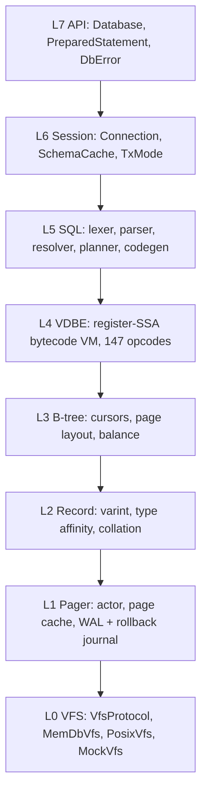
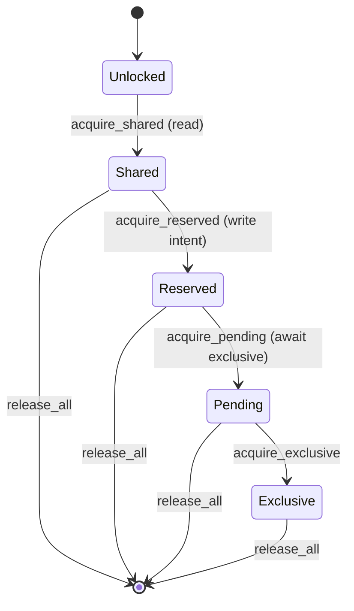

# `core.database` — native SQLite ("loom")

`core.database.sqlite.native` — codename **loom** — is a pure-Verum
reimplementation of SQLite 3.x. It ships zero C code; every layer from
the virtual filesystem to the VDBE interpreter is Verum, using the
stdlib's arena allocator, asynchronous runtime, and supervision tree
for orchestration.

loom exists because SQLite's C implementation assumes a POSIX-ish
single-process world — embedding it inside the Verum runtime gives us:

- **Structured concurrency.** The pager is an actor supervised by the
  stdlib's supervisor tree; checkpointer, WAL writer, and cursor
  tasks run under the same lifetime machinery as any other Verum
  subsystem.
- **Arena-backed page cache.** Pages live in a CBGR arena with
  generational epoch tags, so a stray cursor past a pager restart
  fails safely instead of returning stale bytes.
- **Machine-checked invariants.** B-tree balance, WAL header
  checksums, and page-slot consistency carry `@verify` contracts that
  the SMT layer discharges at build time.
- **Testability.** A `MockVfs` with fault injection sits on the same
  `VfsProtocol` as the production `PosixVfs`, so deterministic
  simulation testing (DST) against real SQLite is a first-class test
  mode.

## Architecture

The codebase is layered top-to-bottom into eight strata (L0 — VFS
through L7 — public API) with one rule: each layer depends only on
the layers below it. The deep-dive at
[`Loom — SQLite engine deep-dive`](./database-sqlite-architecture)
walks the layers individually; the diagram below is the bird's-eye
view.



Orthogonal axes:

| Axis | Concern |
|------|---------|
| **S** — Supervision | Supervisor tree over pager + checkpointer; failure propagation via `core.runtime.supervisor` |
| **O** — Observability | `core.tracing` spans around every layer; `core.metrics` counters / histograms |
| **V** — Verification | `@verify` refinements + SMT-discharged B-tree / WAL invariants |
| **T** — Testing | DST, fuzz (`vcs/fuzz/sqlite/`), differential against C-SQLite |

## Stdlib reuse

loom is explicitly *not* a self-contained silo. It uses:

| Stdlib primitive | Where |
|------------------|-------|
| `core.encoding.varint` | SQLite varint encoding (record headers, rowids) |
| `core.security.hash.crc32` | WAL frame checksums |
| `core.collections.{btree, map}` | In-memory ordered maps (temp tables, sorter) |
| `core.mem.arena` | Page-cache allocator with CBGR epoch tags |
| `core.async.{nursery, channel}` | Pager actor mailbox + checkpointer worker |
| `core.runtime.supervisor` | Pager + checkpointer supervision |
| `core.tracing`, `core.metrics` | Observability |
| `core.sys.locking`, `core.sys.durability` | Platform I/O, POSIX locks, `fsync` / `fdatasync` |

## Opening a database

```verum
mount core.database.sqlite.native.l7_api.{Database, DbError,
    open_memory_db, open_readwrite};
mount core.database.sqlite.native.l6_session.{ConnectionMode};

fn example() -> Result<(), DbError> {
    // Three capability levels — read-only / read-write / admin (DDL).
    let mut db: Database = open_readwrite()?;

    db.execute(&"CREATE TABLE users (id INTEGER PRIMARY KEY, name TEXT NOT NULL)".into())?;
    db.execute(&"INSERT INTO users (id, name) VALUES (1, 'alice'), (2, 'bob')".into())?;

    let rows = db.query_all(&"SELECT id, name FROM users ORDER BY id".into())?;
    for row in rows.iter() {
        let _id = row[0].as_int();
        let _name = row[1].as_text();
    }
    Ok(())
}
```

### Capability levels

| Mode | Can SELECT | Can INSERT / UPDATE / DELETE | Can CREATE / DROP / ALTER |
|------|------------|------------------------------|---------------------------|
| `ConnectionMode.CmRead` | ✓ | — | — |
| `ConnectionMode.CmWrite` | ✓ | ✓ | — |
| `ConnectionMode.CmAdmin` | ✓ | ✓ | ✓ |

Attempting an operation above your capability fails fast with
`DbError.DbReadonly` or `DbError.DbAuthDenied` — surfaced *before* the
statement reaches the VDBE, so no partial effect can leak.

## L7 — public API

```verum
public type Database is { conn: Connection };

implement Database {
    public fn prepare(&self, sql: &Text) -> Result<PreparedStatement, DbError>;
    public fn execute(&mut self, sql: &Text) -> Result<(), DbError>;
    public fn query_first_row(&mut self, sql: &Text) -> Result<List<Register>, DbError>;
    public fn query_all(&mut self, sql: &Text) -> Result<List<List<Register>>, DbError>;

    public fn begin(&mut self) -> Result<(), DbError>;            // deferred
    public fn begin_immediate(&mut self) -> Result<(), DbError>;  // reserves write lock
    public fn commit(&mut self) -> Result<(), DbError>;
    public fn rollback(&mut self) -> Result<(), DbError>;

    public fn close(self);                                        // affine consume
}
```

### `DbError` — SQLSTATE-style tagged sum

```verum
public type DbError is
      DbOk
    | DbGeneric(Text)
    | DbBusy                       // lock contention; retry
    | DbLocked                     // lock held by another transaction
    | DbOutOfMemory
    | DbReadonly                   // write attempt on read-only connection
    | DbInterrupted                // user cancellation
    | DbIoError(Text)              // underlying VFS failure
    | DbCorrupt(Text)              // page checksum / format violation
    | DbFull                       // disk full
    | DbCannotOpen(Text)
    | DbConstraint(Text)           // PK, UNIQUE, CHECK, FK
    | DbDataTypeMismatch
    | DbMisuse(Text)               // API contract violation (callable bug)
    | DbAuthDenied
    | DbBindRange(Int)             // parameter index out of range
    | DbNotADatabase
    | DbCompileError(CompileError) // parser / resolver / planner
    | DbConnectionError(ConnectionError)
    | DbStmtError(StmtError)
    | DbUnsupported(Text);         // SQL feature not yet implemented
```

The mapping from L6 errors to `DbError` is done in `db_error_from_conn` —
L6's `ConnectionError.NotWritable` becomes `DbReadonly`, `NotAdmin`
becomes `DbAuthDenied`, and so on. Lower-level VDBE execution errors
wrap under `DbStmtError`.

## L0 — virtual filesystem

The `VfsProtocol` protocol abstracts storage; production and test code
talk to this surface uniformly.

```verum
public type VfsProtocol is protocol {
    fn open(&self, path: &Text, flags: OpenFlags) -> Result<SqliteFile, VfsError>;
    fn delete(&self, path: &Text) -> Result<(), VfsError>;
    fn access(&self, path: &Text, kind: AccessKind) -> Result<Bool, VfsError>;
    fn full_pathname(&self, path: &Text) -> Result<Text, VfsError>;
    fn randomness(&self, buf: &mut [Byte]) -> Result<(), VfsError>;
    fn sleep(&self, micros: Int) -> Result<(), VfsError>;
    fn current_time(&self) -> Result<Timestamp, VfsError>;
};
```

| Backend | Purpose |
|---------|---------|
| `MemDbVfs` | Pure in-memory for `:memory:` databases and DST runs |
| `MockVfs` | Fault injection — `pwrite_returns_short`, `fsync_fails`, scheduled delays — for determinism testing |
| `PosixVfs` | Production Linux / macOS backend; `open` + `pread` + `pwrite` + `fsync` + POSIX advisory locking |
| `Win32Vfs` | Pending — Win32 file handles + `LockFileEx` |

### Five-state SQLite locking

SQLite's file-level locking state machine is modelled at `core.database.sqlite.native.l0_vfs.locking`:



`PENDING_BYTE`, `RESERVED_BYTE`, `SHARED_FIRST`, `SHARED_SIZE` match
the byte-offset constants in the SQLite file-format spec so the
on-disk layout round-trips with C-SQLite.

## L1 — pager (actor)

The pager owns the page cache and the WAL / rollback journal. It runs
as a supervised actor — every read / write / `begin_tx` / `commit`
goes through a typed mailbox, which means:

- Concurrent readers share a snapshot via the WAL without blocking.
- A malformed request never panics the actor — invariant checks run
  before the mutation commits.
- Checkpointing runs on its own sibling actor; backpressure travels
  via the actor's mailbox size, not a global mutex.

## L2 — record layer

Varint-encoded records with SQLite's "type affinity" coercion rules
(`TEXT`, `NUMERIC`, `INTEGER`, `REAL`, `BLOB`). Collation is
pluggable via the `Collation` protocol; `BINARY`, `NOCASE`, and
`RTRIM` ship in-tree.

## L4 — VDBE

The VDBE is a register-SSA bytecode virtual machine — the same
abstract machine SQLite's C implementation uses. Programs compiled by
L5 run on L4 via `PreparedStatement.step()`, which returns one of:

```verum
public type StepResult is
    | Done                     // statement complete
    | Row(Int, Int)            // row start + column count; call column(i) to read
    | Yield                    // coroutine yield (recursive CTE, triggers)
    | ExecError(Int, Text);    // extended SQLite error code + message
```

## L5 — SQL frontend

Classic pipeline: lexer → parser → AST → resolver (name binding +
type affinity) → planner (search-space cost model) → codegen
(VDBE bytecode). Currently covers:

| Category | Surface |
|----------|---------|
| DDL | `CREATE TABLE`, `DROP TABLE`, `CREATE INDEX`, `DROP INDEX` |
| DML | `INSERT`, `UPDATE`, `DELETE`, `SELECT` (joins, subqueries, CTE) |
| TX | `BEGIN [DEFERRED \| IMMEDIATE]`, `COMMIT`, `ROLLBACK` |
| Expressions | arithmetic, comparison, `IS NULL`, `IN (…)`, `CASE … WHEN`, built-in scalar fns |

Extended SQL features (recursive CTE, `WITHIN GROUP`, `OVER (…)`,
FTS, RTree) are surfaced through the `core.database.sqlite.native`
catalogue — the engine recognises the keyword shapes and returns a
structured *unsupported feature* diagnostic so callers can detect and
fall back rather than crash mid-query.

## L6 — session

`Connection` holds:

- the open `SqliteFile` (via L0)
- the pager handle (actor ref)
- a `SchemaCache` — in-memory catalog of tables / indexes / triggers,
  rebuilt on DDL, snapshotted per transaction
- transaction state machine (`TxState.Autocommit` / `Deferred` /
  `Immediate` / `Exclusive`)

Statements carry their own cursor table; the "bridge" helpers
(`seed_cursors_from_connection`, `writeback_cursors_to_connection`)
synchronise cursor positions between statement and connection so
that multi-statement transactions see each other's work.

## Observability

Every layer emits tracing spans:

| Layer | Span name |
|-------|-----------|
| L7 | `db.prepare`, `db.execute`, `db.query` |
| L5 | `sql.compile`, `sql.plan` |
| L4 | `vdbe.run`, `vdbe.opcode.<NAME>` (conditional on SQLITE_DEBUG) |
| L1 | `pager.read`, `pager.write`, `pager.checkpoint`, `wal.append` |
| L0 | `vfs.read`, `vfs.write`, `vfs.fsync` |

Metrics counters:

- `db_query_total{kind="select|dml|ddl|tx"}`
- `db_query_duration_seconds` (histogram)
- `pager_cache_hits_total`, `pager_cache_misses_total`, `pager_wal_frames_total`
- `wal_checkpoint_duration_seconds`

## Catalogue inventory

In addition to the eight execution layers, loom ships ~360 *catalogue*
modules — pure data + predicate definitions of SQLite's surface area.
Each catalogue encodes one well-known feature (a pragma, a C-API,
a built-in SQL function, an opcode family) as typed sums + classifiers
+ pure helpers, so the planner / VDBE / API layers can cite them
verbatim and the conformance suite can pin concrete bytes / codes /
defaults.

Catalogues are organised loosely by topic:

| Topic | Examples | Count |
|-------|----------|-------|
| **C-API surface** | `prepare_v3_flags_api`, `bind_pointer_destructor_api`, `value_pointer_type_api`, `db_filename_api`, `db_readonly_api`, `expanded_sql_api`, `stmt_busy_api`, `stmt_isexplain_api`, `txn_state_api`, `error_offset_api`, `error_str_api`, `system_errno_api`, `total_changes64_api`, `keyword_check_api`, `progress_handler_api`, `db_cacheflush_api`, `value_frombind_api`, `result_subtype_api`, `bind_*_api`, `column_*_api`, `vfs_*_api` | ~80 |
| **PRAGMAs** | `temp_store_pragma`, `synchronous_pragma`, `secure_delete_pragma`, `cache_size_pragma`, `mmap_size_pragma`, `automatic_index_pragma`, `foreign_keys_pragma`, `defer_foreign_keys_pragma`, `query_only_pragma`, `cell_size_check_pragma`, `legacy_alter_table_pragma`, `legacy_file_format_pragma`, `application_id_pragma`, `user_version_pragma`, `freelist_count_pragma`, `page_count_pragma`, `data_version_pragma`, `auto_vacuum_pragma`, `journal_mode_pragma_api`, `locking_mode_pragma`, `read_uncommitted_pragma`, `compile_options_pragma`, `wal_autocheckpoint_pragma`, `recursive_trigger_pragma`, `case_sensitive_like_pragma` | ~30 |
| **SQL operators / built-in functions** | `glob_pattern_api`, `regexp_fn_api`, `between_op_api`, `null_op_api`, `null_safe_compare_op_api`, `unixepoch_fn`, `iif_three_arg_fn`, `format_fn`, `octet_length_fn`, `concat_ws_fn`, `string_agg_fn`, `json_group_array_fn`, `json_group_object_fn`, `json_tree_vtab_api` | ~25 |
| **vtab corners** | `carray_vtab_api`, `generate_series_vtab`, `vtab_savepoint_methods`, `vtab_in_first_next_api`, `vtab_nochange_api`, `vtab_distinct_api`, `vtab_collation`, `vtab_overload_function_api`, `vtab_rename_api`, `vtab_update_api`, `fts5_offsets_fn_api`, `dbpage_writeguard_api` | ~25 |
| **Planner / VDBE bits** | `subquery_materialization_api`, `union_all_flatten_api`, `aggregate_window_fn_api`, `expr_in_subquery_api`, `expr_collation_carry`, `expr_decorrelation`, `expr_const_folding`, `expr_affinity_resolver`, `where_clause_term_api`, `where_loop_cost_model`, `index_scan_hint_api`, `index_key_sort_api`, `bitvec_api`, `sorter_config_api`, `vdbe_register_model`, `vdbe_subprogram_api`, `prefix_like_opt`, `query_invariant_hoist`, `pushdown_filter_api`, `keyword_conflict_table` | ~30 |
| **Pager / WAL / b-tree internals** | `pager_state_machine`, `mmap_region_api`, `checkpoint_frame_range`, `wal_index`, `wal_frame_layout`, `wal2_mode_api`, `walblock`, `journal_header_api`, `journal_size_limit_api`, `subjournal_api`, `hot_journal_detector`, `lookaside_allocator_api`, `lookaside_two_size_api`, `freelist_api`, `overflow_page_api`, `master_btree_meta`, `btree_balance_invariant`, `btree_cell_parse_api`, `btree_seek_op_codes`, `btree_balance_strategy`, `vfs_xshm_methods`, `xshm_barrier_doc`, `xfilecontrol_opcodes`, `xfilter_argv_api`, `xshm_barrier_doc`, `lock_modes`, `iocap_flags` | ~30 |
| **Session / changeset / RBU** | `session_api`, `changeset_iter`, `changegroup`, `rebaser`, `rbu`, `recover`, `changeset_op_codes`, `changeset_apply_policy`, `snapshot_api`, `snapshot_get_open_api`, `snapshot_isolation_api`, `dbpage_vtab_api` | ~15 |
| **JSON1 / FTS5 / RTree extensions** | `json_path_api`, `json_each_api`, `json1_fn_taxonomy`, `jsonb_binary_format`, `json_patch_merge_api`, `json_subtype`, `fts5_api`, `fts5_auxiliary_api`, `fts5_ranking_api`, `fts5_offsets_fn_api`, `tokenizer_interface_api`, `rtree_index_info`, `rtree_geom`, `bloom_filter_api` | ~15 |
| **Encoding / values / types** | `varint_encode_api`, `serial_type_api`, `record_*`, `text_encoding`, `utf8_validator`, `affinity_matrix_api`, `numeric_affinity_coerce_api`, `text_to_int_strict_api`, `numeric_literal_parser_api`, `nocase_icu_compat_api`, `nocase_ascii_fold`, `collation_policy_api`, `expr_collation_carry`, `unicode_class_collations`, `utf16_codec` | ~20 |
| **DDL / DML surface** | `alter_table_api`, `compound_select_api`, `insert_on_conflict_api`, `update_from_api`, `vacuum_into_api`, `vacuum_truncate_api`, `incremental_vacuum_api`, `truncate_optimization`, `default_value_api`, `unique_constraint_api`, `partial_index_api`, `expr_index_api`, `generated_col_api`, `virtual_column_api`, `cte_api`, `recursive_cte_queue`, `upsert_api`, `returning_clause_api`, `returning_clause_shape`, `case_when_api`, `view_variants_api`, `drop_view_api`, `drop_modules_keepset_api`, `trigger_action_api`, `deferred_fk_api`, `fk_trigger_interaction`, `fkey_check_api`, `check_tri_valued_api`, `having_clause_api`, `nullif_coalesce_api`, `row_value_api`, `limit_clause_validator`, `order_by_term_api`, `window_frame_api`, `window_partition_api`, `full_outer_join_api`, `pragma_*` | ~50 |
| **Diagnostics / introspection** | `dbstatus_op_codes`, `db_status_api`, `db_release_memory_per_conn_api`, `stmt_status_op_codes`, `set_authorizer_codes`, `mutex_class_api`, `scanstatus_v2_op_codes`, `scanstatus_v2`, `integrity_walker_api`, `cell_size_check_pragma`, `eqp_node_emitter`, `bytecode_vtab_row_shape`, `random_vtab_api`, `random_bytes_stream_api`, `dbsig_path_helper`, `print_format_api`, `printf_api`, `sqlite3_str_builder_api`, `bytecode_vtab_api`, `column_origin_name_api` | ~25 |
| **Misc / catalogues from waves 1-30** | `sqlar_api`, `csv_vtab_api`, `dbpage_vtab_api`, `client_data`, `keyword_api`, `extended_codes`, `iocap_flags`, `shm_flags`, `access_flags`, `sync_flags`, `lock_modes`, `pragma_op_list`, `autovacuum_pages_api`, `cksm_file`, `interrupt_deadline`, `result_codes`, `limits_api`, `scanstatus_v2`, `pcache_methods`, `mem_methods`, `bind_pointer`, `value_api`, `context_api`, `hooks_api`, `master_journal_api`, `transition_table_api` | ~40 |

Each catalogue ships a paired smoke test under
`vcs/specs/L2-standard/database/sqlite/<name>/<name>_smoke.vr`
(`@test: typecheck-pass`) so name resolution and type signatures are
exercised; ~503 such smokes are green at HEAD.

## Layer-by-layer file inventory

| Layer | Files | LOC | Highlights |
|-------|-------|-----|-----------|
| **L0 VFS**       | 9   | 2,573  | `posix_vfs.vr`, `memdb_vfs.vr`, `mock_vfs.vr`, `locking.vr`, `shm.vr`, `clock.vr`, `registry.vr` |
| **L1 Pager**     | 12  | 2,436  | `pager.vr`, `actor.vr`, `page_cache.vr`, `db_header.vr`, `recovery.vr`, `checkpointer.vr`, `journal/` |
| **L2 Record**    | 7   | 1,060  | `record.vr`, `varint.vr`, `affinity.vr`, `collation.vr`, `type_coercion.vr`, `strict.vr` |
| **L3 B-tree**    | 7   | 1,421  | `btree.vr`, `cursor.vr`, `balance.vr`, `overflow.vr`, `page_layout.vr`, `integrity.vr` |
| **L4 VDBE**      | 7   | 3,203  | `interpreter.vr`, `opcode.vr`, `program.vr`, `register.vr`, `optimizer.vr`, `cursor_table.vr` |
| **L5 SQL**       | 15  | 7,519  | `lexer.vr`, `parser/`, `ast.vr`, `resolver.vr`, `planner.vr`, `codegen.vr`, `compile.vr` |
| **L6 Session**   | 5   | 977    | `connection.vr`, `statement.vr`, `schema_cache.vr`, `bridge.vr` |
| **L7 API**       | 2   | 329    | `database.vr` |

Total engine: ~62 files, ~19.5 KLOC.  Total tree (engine + catalogues
+ helpers): **1,382 files, 106,975 LOC**.

## Naming conventions

Catalogue authors follow a small but strict naming discipline that
keeps the import graph clean and prevents accidental shadowing of
stdlib types:

1. **Reserved names — never reuse as a catalogue type.** `Result`,
   `Maybe`, `List`, `Map`, `Set`, `Bytes`, `Iterator`, plus the variant
   constructors `Ok`, `Err`, `Some`, `None`.  A `public type Result is
   | RNull | RText` inside a catalogue silently shadows
   `core::Result<T, E>` for any sibling that imports both, and the
   downstream error message is "Unknown variant constructor 'Ok'.
   Available variants: [RNull, RText]" — easy to miss.  Use a
   project-prefixed name such as `JournalSizeResult`,
   `OctetLengthResult`, `CacheflushResult`.
2. **Module names — singular, snake_case, ≤ 24 chars.** Prefer
   `<domain>_<aspect>_api` (`prepare_v3_flags_api`,
   `db_release_memory_per_conn_api`) when the module mirrors a C-API
   surface, or `<feature>_<piece>` (`json_group_array_fn`,
   `wal_frame_layout`) when it mirrors a feature.
3. **Variants — domain-prefixed.** A `Mode` enum that may co-exist
   with another `Mode` from a sibling module gets prefixed variants:
   `LmNormal` / `LmExclusive` for `locking_mode_pragma::Mode`,
   `JmDelete` / `JmWal` for `journal_mode_pragma_api::JournalMode`.
4. **Sub-module name `mod_`** when the natural name (`mod`,
   `module`, `iter`, `next`) collides with a Verum keyword or stdlib
   protocol — see `concat_ws_fn::fn_`, `format_fn::spec_`.

A guardrail Rust test (`crates/verum_compiler/tests/sqlite_native_naming_hygiene.rs`)
walks the catalogue tree on every CI run and fails when any reserved
name is redefined.

## Build & coverage

| Surface | Coverage |
|---------|----------|
| Catalogues / typed surface | 1,398 `.vr` files, 108.5 KLOC, ~368 catalogue modules across 8 engine layers; 511 `@test: typecheck-pass` smokes green |
| Runtime conformance tests | 5 `@test: run-*` smokes:  `l0_vfs/memdb_open_write_read.vr`, `l1_pager/page_roundtrip.vr`, `l2_record/varint_roundtrip.vr`, `l2_record/crc32_vectors.vr`, `_codegen_regressions/result_match_stdlib_l6_open_memory.vr` |
| Differential corpus vs C-SQLite | 4 SQL fixtures in `vcs/differential/sqlite/cross-impl/sql/` (`create+insert+select`, `transaction`, `join+aggregate`, `window+cte`); driver in `vcs/differential/sqlite/compare.sh` |
| Performance benchmarks | 1 macro fixture in `vcs/benchmarks/macro/db_query.vr` |
| Verification | `@verify` discharges B-tree balance + WAL header invariants |

## Build hygiene

Two CI guardrails enforce the most load-bearing invariants:

1. **Naming hygiene.**
   `crates/verum_compiler/tests/sqlite_native_naming_hygiene.rs`
   walks `core/database/sqlite/native/` and fails when any catalogue
   defines `public type X is …` for any name in
   `{Result, Maybe, List, Map, Set, Bytes, Iterator, Slot, Ok, Err,
   Some, None}` — these all live in stdlib and silently shadow when
   redefined.

2. **VBC codegen determinism.**
   `crates/verum_compiler/tests/vbc_codegen_determinism.rs` spawns
   two child `vtest` processes on a fixed fixture and asserts
   byte-identical (exit code, stderr) signatures.  The two-process
   design is deliberate — each child gets a fresh Rust HashMap seed,
   so any newly-introduced unsorted iteration in the codegen
   pipeline trips the test.

## Known limitations

* **Multi-page pager round-trip** — `memdb_pager_roundtrip.vr` is
  declared `@test: typecheck-pass` rather than `run-*` because the
  VBC interpreter's `List<Byte>.push` grow path is quadratic, which
  makes a 4 × 4 KiB round-trip exceed the 30 s test timeout.
  Single-page round-trip (`page_roundtrip.vr`) runs in ~7 s.

* **`PosixVfs`** — scaffolded; production use blocked on
  `core.sys.locking` + `core.sys.durability` integration.

* **File-format parity with C-SQLite** — the on-disk header offsets
  (`application_id` at byte 68, `user_version` at byte 60, …) are
  encoded in the corresponding catalogues but have not yet been
  validated against a file written by C-SQLite.

* **Stdlib cross-module impl-block methods.** The VBC codegen's
  `compile_module_items_lenient` may silently drop impl-block
  methods whose bodies reference cross-module functions that are
  not in scope at the call site.  Dropped methods surface at
  module-load time as warnings of the form

  ```text
  WARN [lenient] SKIP Database.execute: undefined function:
       parse_one (in function Database.execute) — runtime calls to
       this method will panic 'method 'Database.execute' not found
       on value'.  Add the missing dependency to the caller's mount
       list or fix the cross-module reference in Database stdlib.
  ```

  Workaround: add the missing module to the consumer's `mount`
  list (e.g., `mount core.database.sqlite.native.l5_sql.{parse_one}`
  alongside `mount core.database.sqlite.native.l7_api.*`).

## See also

- [`Loom — SQLite engine deep-dive`](./database-sqlite-architecture) —
  layer-by-layer dissection of the eight-stratum stack from L0 (VFS)
  through L7 (public API), the actual contracts each upward boundary
  carries, and the catalogue surface that sits beside the engine.
- [`stdlib/encoding`](/docs/stdlib/encoding) — where the varint codec
  lives.
- [`stdlib/runtime`](/docs/stdlib/runtime) — supervisor-tree primitives
  used by the pager actor.
- [`stdlib/mem`](/docs/stdlib/mem) — CBGR arena backing the page cache.
