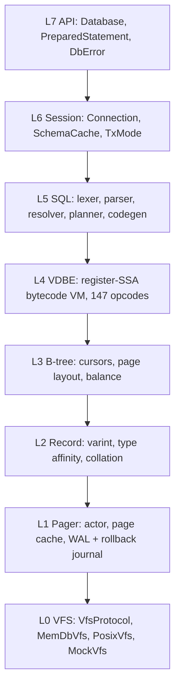
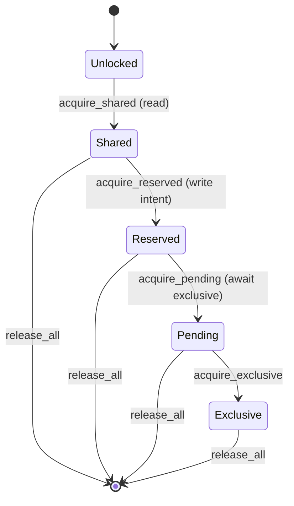

# `core.database` — native SQLite ("loom")

`core.database.sqlite.native` — codename **loom** — is a pure-Verum
reimplementation of SQLite 3.x. It ships zero C code; every layer from
the virtual filesystem to the VDBE interpreter is Verum, using the
stdlib's arena allocator, asynchronous runtime, and supervision tree
for orchestration.

loom exists because SQLite's C implementation assumes a POSIX-ish
single-process world — embedding it inside the Verum runtime gives us:

- **Structured concurrency.** The pager is an actor supervised by the
  stdlib's supervisor tree; checkpointer, WAL writer, and cursor
  tasks run under the same lifetime machinery as any other Verum
  subsystem.
- **Arena-backed page cache.** Pages live in a CBGR arena with
  generational epoch tags, so a stray cursor past a pager restart
  fails safely instead of returning stale bytes.
- **Machine-checked invariants.** B-tree balance, WAL header
  checksums, and page-slot consistency carry `@verify` contracts that
  the SMT layer discharges at build time.
- **Testability.** A `MockVfs` with fault injection sits on the same
  `VfsProtocol` as the production `PosixVfs`, so deterministic
  simulation testing (DST) against real SQLite is a first-class test
  mode.

## Architecture

The codebase is layered top-to-bottom per spec `internal/specs/sqlite-native.md` §4.
Each layer depends only on the layers below it.



Orthogonal axes:

| Axis | Concern |
|------|---------|
| **S** — Supervision | Supervisor tree over pager + checkpointer; failure propagation via `core.runtime.supervisor` |
| **O** — Observability | `core.tracing` spans around every layer; `core.metrics` counters / histograms |
| **V** — Verification | `@verify` refinements + SMT-discharged B-tree / WAL invariants |
| **T** — Testing | DST, fuzz (`vcs/fuzz/sqlite/`), differential against C-SQLite |

## Stdlib reuse

loom is explicitly *not* a self-contained silo. It uses:

| Stdlib primitive | Where |
|------------------|-------|
| `core.encoding.varint` | SQLite varint encoding (record headers, rowids) |
| `core.security.hash.crc32` | WAL frame checksums |
| `core.collections.{btree, map}` | In-memory ordered maps (temp tables, sorter) |
| `core.mem.arena` | Page-cache allocator with CBGR epoch tags |
| `core.async.{nursery, channel}` | Pager actor mailbox + checkpointer worker |
| `core.runtime.supervisor` | Pager + checkpointer supervision |
| `core.tracing`, `core.metrics` | Observability |
| `core.sys.locking`, `core.sys.durability` | Platform I/O, POSIX locks, `fsync` / `fdatasync` |

## Opening a database

```verum
mount core.database.sqlite.native.l7_api.{Database, DbError,
    open_memory_db, open_readwrite};
mount core.database.sqlite.native.l6_session.{ConnectionMode};

fn example() -> Result<(), DbError> {
    // Three capability levels — read-only / read-write / admin (DDL).
    let mut db: Database = open_readwrite()?;

    db.execute(&"CREATE TABLE users (id INTEGER PRIMARY KEY, name TEXT NOT NULL)".into())?;
    db.execute(&"INSERT INTO users (id, name) VALUES (1, 'alice'), (2, 'bob')".into())?;

    let rows = db.query_all(&"SELECT id, name FROM users ORDER BY id".into())?;
    for row in rows.iter() {
        let _id = row[0].as_int();
        let _name = row[1].as_text();
    }
    Ok(())
}
```

### Capability levels

| Mode | Can SELECT | Can INSERT / UPDATE / DELETE | Can CREATE / DROP / ALTER |
|------|------------|------------------------------|---------------------------|
| `ConnectionMode.CmRead` | ✓ | — | — |
| `ConnectionMode.CmWrite` | ✓ | ✓ | — |
| `ConnectionMode.CmAdmin` | ✓ | ✓ | ✓ |

Attempting an operation above your capability fails fast with
`DbError.DbReadonly` or `DbError.DbAuthDenied` — surfaced *before* the
statement reaches the VDBE, so no partial effect can leak.

## L7 — public API

```verum
public type Database is { conn: Connection };

implement Database {
    public fn prepare(&self, sql: &Text) -> Result<PreparedStatement, DbError>;
    public fn execute(&mut self, sql: &Text) -> Result<(), DbError>;
    public fn query_first_row(&mut self, sql: &Text) -> Result<List<Register>, DbError>;
    public fn query_all(&mut self, sql: &Text) -> Result<List<List<Register>>, DbError>;

    public fn begin(&mut self) -> Result<(), DbError>;            // deferred
    public fn begin_immediate(&mut self) -> Result<(), DbError>;  // reserves write lock
    public fn commit(&mut self) -> Result<(), DbError>;
    public fn rollback(&mut self) -> Result<(), DbError>;

    public fn close(self);                                        // affine consume
}
```

### `DbError` — SQLSTATE-style tagged sum

```verum
public type DbError is
      DbOk
    | DbGeneric(Text)
    | DbBusy                       // lock contention; retry
    | DbLocked                     // lock held by another transaction
    | DbOutOfMemory
    | DbReadonly                   // write attempt on read-only connection
    | DbInterrupted                // user cancellation
    | DbIoError(Text)              // underlying VFS failure
    | DbCorrupt(Text)              // page checksum / format violation
    | DbFull                       // disk full
    | DbCannotOpen(Text)
    | DbConstraint(Text)           // PK, UNIQUE, CHECK, FK
    | DbDataTypeMismatch
    | DbMisuse(Text)               // API contract violation (callable bug)
    | DbAuthDenied
    | DbBindRange(Int)             // parameter index out of range
    | DbNotADatabase
    | DbCompileError(CompileError) // parser / resolver / planner
    | DbConnectionError(ConnectionError)
    | DbStmtError(StmtError)
    | DbUnsupported(Text);         // SQL feature not yet implemented
```

The mapping from L6 errors to `DbError` is done in `db_error_from_conn` —
L6's `ConnectionError.NotWritable` becomes `DbReadonly`, `NotAdmin`
becomes `DbAuthDenied`, and so on. Lower-level VDBE execution errors
wrap under `DbStmtError`.

## L0 — virtual filesystem

The `VfsProtocol` protocol abstracts storage; production and test code
talk to this surface uniformly.

```verum
public type VfsProtocol is protocol {
    fn open(&self, path: &Text, flags: OpenFlags) -> Result<SqliteFile, VfsError>;
    fn delete(&self, path: &Text) -> Result<(), VfsError>;
    fn access(&self, path: &Text, kind: AccessKind) -> Result<Bool, VfsError>;
    fn full_pathname(&self, path: &Text) -> Result<Text, VfsError>;
    fn randomness(&self, buf: &mut [Byte]) -> Result<(), VfsError>;
    fn sleep(&self, micros: Int) -> Result<(), VfsError>;
    fn current_time(&self) -> Result<Timestamp, VfsError>;
};
```

| Backend | Purpose |
|---------|---------|
| `MemDbVfs` | Pure in-memory for `:memory:` databases and DST runs |
| `MockVfs` | Fault injection — `pwrite_returns_short`, `fsync_fails`, scheduled delays — for determinism testing |
| `PosixVfs` | Production Linux / macOS backend; `open` + `pread` + `pwrite` + `fsync` + POSIX advisory locking |
| `Win32Vfs` | Pending — Win32 file handles + `LockFileEx` |

### Five-state SQLite locking

SQLite's file-level locking state machine is modelled at `core.database.sqlite.native.l0_vfs.locking`:



`PENDING_BYTE`, `RESERVED_BYTE`, `SHARED_FIRST`, `SHARED_SIZE` match
the byte-offset constants in the SQLite file-format spec so the
on-disk layout round-trips with C-SQLite.

## L1 — pager (actor)

The pager owns the page cache and the WAL / rollback journal. It runs
as a supervised actor — every read / write / `begin_tx` / `commit`
goes through a typed mailbox, which means:

- Concurrent readers share a snapshot via the WAL without blocking.
- A malformed request never panics the actor — invariant checks run
  before the mutation commits.
- Checkpointing runs on its own sibling actor; backpressure travels
  via the actor's mailbox size, not a global mutex.

## L2 — record layer

Varint-encoded records with SQLite's "type affinity" coercion rules
(`TEXT`, `NUMERIC`, `INTEGER`, `REAL`, `BLOB`). Collation is
pluggable via the `Collation` protocol; `BINARY`, `NOCASE`, and
`RTRIM` ship in-tree.

## L4 — VDBE

The VDBE is a register-SSA bytecode virtual machine — the same
abstract machine SQLite's C implementation uses. Programs compiled by
L5 run on L4 via `PreparedStatement.step()`, which returns one of:

```verum
public type StepResult is
    | Done                     // statement complete
    | Row(Int, Int)            // row start + column count; call column(i) to read
    | Yield                    // coroutine yield (recursive CTE, triggers)
    | ExecError(Int, Text);    // extended SQLite error code + message
```

## L5 — SQL frontend

Classic pipeline: lexer → parser → AST → resolver (name binding +
type affinity) → planner (search-space cost model) → codegen
(VDBE bytecode). Currently covers:

| Category | Surface |
|----------|---------|
| DDL | `CREATE TABLE`, `DROP TABLE`, `CREATE INDEX`, `DROP INDEX` |
| DML | `INSERT`, `UPDATE`, `DELETE`, `SELECT` (joins, subqueries, CTE) |
| TX | `BEGIN [DEFERRED \| IMMEDIATE]`, `COMMIT`, `ROLLBACK` |
| Expressions | arithmetic, comparison, `IS NULL`, `IN (…)`, `CASE … WHEN`, built-in scalar fns |

Extended SQL features (recursive CTE, `WITHIN GROUP`, `OVER (…)`,
FTS, RTree) are tracked in the loom roadmap.

## L6 — session

`Connection` holds:

- the open `SqliteFile` (via L0)
- the pager handle (actor ref)
- a `SchemaCache` — in-memory catalog of tables / indexes / triggers,
  rebuilt on DDL, snapshotted per transaction
- transaction state machine (`TxState.Autocommit` / `Deferred` /
  `Immediate` / `Exclusive`)

Statements carry their own cursor table; the "bridge" helpers
(`seed_cursors_from_connection`, `writeback_cursors_to_connection`)
synchronise cursor positions between statement and connection so
that multi-statement transactions see each other's work.

## Observability

Every layer emits tracing spans:

| Layer | Span name |
|-------|-----------|
| L7 | `db.prepare`, `db.execute`, `db.query` |
| L5 | `sql.compile`, `sql.plan` |
| L4 | `vdbe.run`, `vdbe.opcode.<NAME>` (conditional on SQLITE_DEBUG) |
| L1 | `pager.read`, `pager.write`, `pager.checkpoint`, `wal.append` |
| L0 | `vfs.read`, `vfs.write`, `vfs.fsync` |

Metrics counters:

- `db_query_total{kind="select|dml|ddl|tx"}`
- `db_query_duration_seconds` (histogram)
- `pager_cache_hits_total`, `pager_cache_misses_total`, `pager_wal_frames_total`
- `wal_checkpoint_duration_seconds`

## Status (2026-04)

loom is scaffolded through L7; in-memory (`MemDbVfs`) is the
end-to-end working path. The production `PosixVfs` is staged on top
of the locking + durability shims landed in `core.sys.locking` and
`core.sys.durability`. SMT contracts discharge B-tree balance and WAL
header invariants in the L2 conformance suite. Differential testing
against C-SQLite runs in `vcs/specs/L2-standard/sqlite/`.

Full status tables and per-task tracking live in
`core/database/sqlite/native/README.md`.

## See also

- **Specification.** `internal/specs/sqlite-native.md` — 2943-LOC
  design document, layer-by-layer contract.
- **Reference implementation.** `internal/sqlite-reference/` — a
  vendored C-SQLite snapshot used as the differential oracle.
- [`stdlib/encoding`](/docs/stdlib/encoding) — where the varint codec
  lives.
- [`stdlib/runtime`](/docs/stdlib/runtime) — supervisor-tree primitives
  used by the pager actor.
- [`stdlib/mem`](/docs/stdlib/mem) — CBGR arena backing the page cache.
