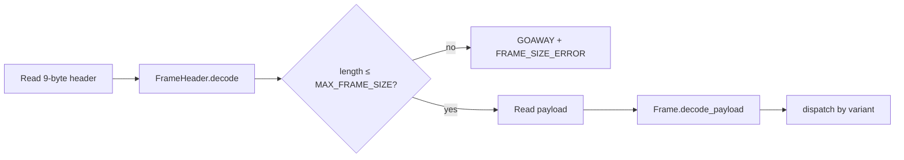
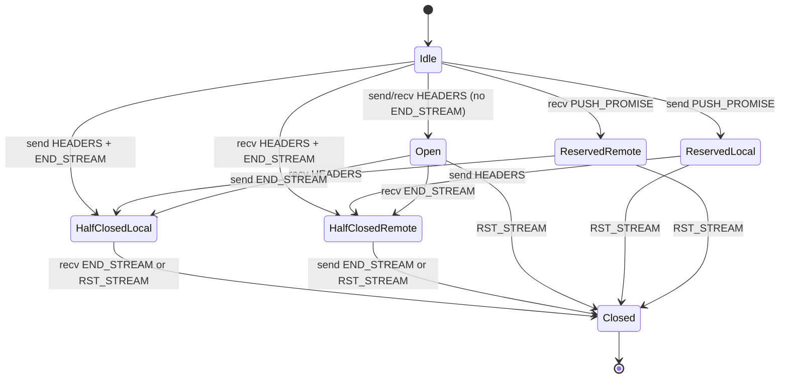

# `core.net.http2` — HTTP/2 + HPACK

Pure-Verum implementation of HTTP/2 (RFC 7540) and its sibling header
compression format HPACK (RFC 7541). `core.net.http2` supplies the
wire-level primitives — frame encode / decode, HPACK encoder /
decoder, stream state machine — from which a client, server, or
transparent proxy is assembled.

## Spec alignment

| Spec | Title | Coverage |
|------|-------|----------|
| [RFC 7540](https://datatracker.ietf.org/doc/html/rfc7540) | HTTP/2 | Frame layer, SETTINGS, stream FSM, GOAWAY, error codes |
| [RFC 7541](https://datatracker.ietf.org/doc/html/rfc7541) | HPACK | Static table (§A), dynamic table, Huffman (§B), integer codec (§5.1), literal forms (§6.1–§6.3) |
| [RFC 9113](https://datatracker.ietf.org/doc/html/rfc9113) | HTTP/2 (obsoletes 7540) | All clarifications carried forward; stream priority tree is deprecated and not implemented |

## Module layout

| Submodule | Purpose |
|-----------|---------|
| `core.net.http2` (mod) | `PREFACE` (24-byte magic), flat re-exports of the public surface below |
| `core.net.http2.error` | `Http2Error` scope-tagged variant, `ErrorCode` with all 14 RFC §7 constants |
| `core.net.http2.frame` | `FrameHeader`, `Frame` typed ADT, `FrameType`, `FrameFlags`, encode / `decode_payload` |
| `core.net.http2.settings` | `Settings`, `SettingId`, RFC §6.5.2 defaults, bounds-checking `apply` |
| `core.net.http2.huffman` | RFC 7541 §B canonical Huffman table (`@intrinsic`-backed) |
| `core.net.http2.static_table` | 61-entry HPACK static table (RFC 7541 §A) |
| `core.net.http2.hpack` | `HpackEncoder`, `HpackDecoder`, `HeaderField`, `DynamicTable`, `HpackError` |
| `core.net.http2.stream` | `StreamFsm`, `StreamState`, `StreamEvent`, `StreamTransitionError` |

## Connection preface

Every HTTP/2 connection opens with the client transmitting exactly
these 24 bytes (RFC 7540 §3.5) immediately after ALPN-negotiated TLS
completes:

```verum
mount core.net.http2.{PREFACE};

// PREFACE: [Byte; 24] — "PRI * HTTP/2.0\r\n\r\nSM\r\n\r\n"
stream.write_all(&PREFACE).await?;

let mut got: [Byte; 24] = [0; 24];
read_exact(&mut stream, &mut got).await?;
if got != PREFACE {
    return Err(Http2Error.BadClientPreface);
}
```

After the preface each peer sends a `SETTINGS` frame; SETTINGS are not
optional and appear before any other frame type.

## Frame pipeline



A minimal loop:

```verum
mount core.net.http2.{FrameHeader, Frame, Settings, SettingId,
                      Http2Error, ErrorCode, connection_error};

async fn run_frame_loop(
    mut stream: TcpStream,
    mut settings: Settings,
) -> Result<(), Http2Error> {
    loop {
        let mut hdr_buf: [Byte; 9] = [0; 9];
        read_exact(&mut stream, &mut hdr_buf).await?;
        let header = FrameHeader.decode(&hdr_buf)?;

        if (header.length as UInt32) > settings.max_frame_size {
            return Err(connection_error(
                ErrorCode.FRAME_SIZE_ERROR, &"over-limit".into(),
            ));
        }
        let payload = read_exact_owned(&mut stream, header.length).await?;
        let frame = Frame.decode_payload(&header, &payload)?;

        match frame {
            Frame.SettingsFrame { ack, params } => {
                if !ack {
                    for (id, value) in params.iter() {
                        settings.apply(*id, *value)?;
                    }
                    send_settings_ack(&mut stream).await?;
                }
            }
            Frame.HeadersFrame { stream_id, block_fragment, end_stream, .. } => {
                // HPACK decode + stream FSM step + app dispatch.
            }
            Frame.DataFrame { stream_id, data, end_stream, .. } => {
                // Flow-control accounting + body assembly.
            }
            Frame.GoAwayFrame { .. } => { return Ok(()); }
            _ => { /* PING, WINDOW_UPDATE, RST_STREAM handled by connection driver */ }
        }
    }
}
```

## Frame types (RFC 7540 §6)

| Type | Hex | Purpose | Valid stream id |
|------|-----|---------|-----------------|
| `DataFrame` | 0x0 | Application data; flow-controlled | stream ≠ 0 |
| `HeadersFrame` | 0x1 | Request / response header block | stream ≠ 0 |
| `PriorityFrame` | 0x2 | Advisory priority (deprecated in 9113) | stream ≠ 0 |
| `RstStreamFrame` | 0x3 | Terminate a single stream | stream ≠ 0 |
| `SettingsFrame` | 0x4 | Connection parameters / ACK | stream = 0 |
| `PushPromiseFrame` | 0x5 | Server-push reservation | stream ≠ 0 |
| `PingFrame` | 0x6 | Keepalive / RTT probe | stream = 0 |
| `GoAwayFrame` | 0x7 | Graceful connection shutdown | stream = 0 |
| `WindowUpdateFrame` | 0x8 | Flow-control credit | 0 or stream id |
| `ContinuationFrame` | 0x9 | HEADERS / PUSH_PROMISE tail | stream ≠ 0 |

A frame on the wrong stream id surfaces as a `Http2Error.ConnectionError`
with `ErrorCode.PROTOCOL_ERROR` — per §5.1.1, `stream 0` is reserved
for connection-scoped frames and cannot carry request/response data.

## `SettingId` and `Settings`

```verum
public type SettingId is { value: UInt16 };

implement SettingId {
    public const HEADER_TABLE_SIZE: UInt16      = 0x1;
    public const ENABLE_PUSH: UInt16            = 0x2;
    public const MAX_CONCURRENT_STREAMS: UInt16 = 0x3;
    public const INITIAL_WINDOW_SIZE: UInt16    = 0x4;
    public const MAX_FRAME_SIZE: UInt16         = 0x5;
    public const MAX_HEADER_LIST_SIZE: UInt16   = 0x6;
}
```

### Default values and bounds

| Parameter | RFC default | Bounds |
|-----------|-------------|--------|
| HEADER_TABLE_SIZE | 4096 | unsigned 32-bit, no hard upper bound |
| ENABLE_PUSH | 1 (true) | 0 or 1 — any other value is `PROTOCOL_ERROR` |
| MAX_CONCURRENT_STREAMS | unbounded | 0 disables new streams (legal) |
| INITIAL_WINDOW_SIZE | 65535 | ≤ 2³¹ − 1; overflow is `FLOW_CONTROL_ERROR` |
| MAX_FRAME_SIZE | 16384 | 2¹⁴ … 2²⁴ − 1; out of range is `PROTOCOL_ERROR` |
| MAX_HEADER_LIST_SIZE | unbounded | advisory — peers may still exceed |

`Settings.apply(id, value)` performs these bounds checks and returns
a `Http2Error.ConnectionError` on violation, so a misbehaving peer
cannot silently poison the connection state. Unknown `SettingId`s are
ignored (§6.5.2, MUST).

## HPACK

HPACK encodes a sequence of header fields as *representations*:

| Form | Prefix | §    | Use |
|------|--------|------|-----|
| Indexed header field | `0b1xxxxxxx` | 6.1   | Reference a static/dynamic table entry |
| Literal w/ incremental indexing | `0b01xxxxxx` | 6.2.1 | Emit + insert into dynamic table |
| Literal w/o indexing | `0b0000xxxx` | 6.2.2 | Emit without inserting |
| Literal never-indexed | `0b0001xxxx` | 6.2.3 | Emit; proxies must forward never-indexed |
| Dynamic table size update | `0b001xxxxx` | 6.3 | Shrink / grow the decoder's dynamic table |

### Encoder / decoder pair

```verum
mount core.net.http2.{HpackEncoder, HpackDecoder, HeaderField};

// One encoder per outbound direction; maintains dynamic table state.
let mut enc = HpackEncoder.new();
let mut headers: List<HeaderField> = List.new();
headers.push(HeaderField.new(":method".into(), "GET".into()));
headers.push(HeaderField.new(":scheme".into(), "https".into()));
headers.push(HeaderField.new(":path".into(), "/api/v1".into()));
headers.push(HeaderField.new(":authority".into(), "example.com".into()));
headers.push(HeaderField.new("accept".into(), "application/json".into()));

let mut block: List<Byte> = List.new();
enc.encode(&headers, &mut block);

// Never-indexed literals — §7.1 recommends this for Authorization /
// Cookie to mitigate CRIME-class timing attacks against shared caches.
enc.encode_never_indexed(
    &HeaderField.new("authorization".into(), "Bearer t0ken".into()),
    &mut block,
);

// One decoder per inbound direction.
let mut dec = HpackDecoder.new();
let parsed: List<HeaderField> = dec.decode(&block)?;
```

### Dynamic table sizing

The dynamic table starts at `DEFAULT_HEADER_TABLE_SIZE = 4096` bytes.
When the peer's SETTINGS advertise a different `HEADER_TABLE_SIZE`, the
decoder resizes immediately (§6.3). The encoder can schedule a resize
via `schedule_resize(new_max)` — the next `encode` call emits a §6.3
update representation ahead of the header block.

Per-entry size is `name_len + value_len + 32` (§4.1). Entries that
would individually exceed `max_size` are silently dropped rather than
evicting the entire table; callers MUST still emit the header literal
uncompressed.

## Static table (RFC 7541 §A)

61 entries covering common request / response fields
(`:method GET`, `:status 200`, `content-type`, `cache-control`, …).
Lookups in `core.net.http2.static_table` are O(1) by index and return
`Maybe<(Text, Text)>`. The table is frozen; new entries only arrive
in the dynamic table.

## Stream state machine (RFC 7540 §5.1)



```verum
mount core.net.http2.{StreamFsm, StreamEvent, StreamState};

let mut fsm = StreamFsm.new(3);  // client streams are odd
fsm.step(&StreamEvent.SendHeaders { end_stream: false })?;  // Idle → Open
fsm.step(&StreamEvent.SendData { end_stream: true })?;       // Open → HalfClosedLocal
fsm.step(&StreamEvent.RecvHeaders { end_stream: true })?;    // HalfClosedLocal → Closed
assert_eq(fsm.state(), StreamState.Closed);
```

Invalid transitions surface as `StreamTransitionError.InvalidTransition
{ state, event }`; the connection driver translates these to either a
stream-level `RST_STREAM` with `PROTOCOL_ERROR` or a connection-level
`GOAWAY` depending on severity (§5.4.1 vs §5.4.2).

### Stream-id allocation

| Role | Parity | Helper |
|------|--------|--------|
| Client-initiated | Odd | `next_client_stream_id(current) -> Maybe<UInt32>` |
| Server push | Even | `next_server_stream_id(current) -> Maybe<UInt32>` |

Both return `None` once the 31-bit id space (`0x7FFFFFFF`) is
exhausted — the driver MUST then send `GOAWAY` and close the
connection (RFC 7540 §5.1.1).

## Error model

```verum
public type Http2Error is
    | ConnectionError { code: ErrorCode, reason: Text }
    | StreamError { stream_id: UInt32, code: ErrorCode, reason: Text }
    | NeedMore
    | BadClientPreface
    | MalformedFrame(Text)
    | HpackError(Text)
    | FrameSizeExceeded { size: Int, limit: Int };
```

### `ErrorCode` constants (RFC 7540 §7)

| Hex | Name | Meaning |
|-----|------|---------|
| 0x00 | `NO_ERROR` | Clean shutdown |
| 0x01 | `PROTOCOL_ERROR` | Generic spec violation |
| 0x02 | `INTERNAL_ERROR` | Peer internal error |
| 0x03 | `FLOW_CONTROL_ERROR` | Window accounting inconsistent |
| 0x04 | `SETTINGS_TIMEOUT` | SETTINGS ACK took too long |
| 0x05 | `STREAM_CLOSED` | Received frames on a closed stream |
| 0x06 | `FRAME_SIZE_ERROR` | Frame exceeded MAX_FRAME_SIZE |
| 0x07 | `REFUSED_STREAM` | Server refused to process stream — safe to retry |
| 0x08 | `CANCEL` | Request is no longer needed |
| 0x09 | `COMPRESSION_ERROR` | HPACK state corrupted — connection-fatal |
| 0x0A | `CONNECT_ERROR` | CONNECT-method tunnel failed |
| 0x0B | `ENHANCE_YOUR_CALM` | Admission control — back off |
| 0x0C | `INADEQUATE_SECURITY` | TLS parameters too weak |
| 0x0D | `HTTP_1_1_REQUIRED` | Peer cannot speak HTTP/2 on this request |

`connection_error(code, reason)` and `stream_error(stream_id, code, reason)`
are the canonical constructors; they wrap the raw u32 code in
`ErrorCode.new` and clone the reason text.

## Flow control

`INITIAL_WINDOW_SIZE` (default 65535) bounds how much DATA each peer
may transmit before receiving a `WINDOW_UPDATE`. Each DATA frame
decrements both the stream-level and the connection-level window; a
window that would go negative is a `FLOW_CONTROL_ERROR`. The frame
layer tracks the raw credit integers; higher-level orchestration
(BDP-driven auto-tuning, per-stream prioritisation) sits above this
module and is typically implemented in the weft middleware layer.

## Deferred

- Full RFC 7540 §5.3 priority tree (deprecated in RFC 9113 in favour
  of the extensible-priorities scheme used by HTTP/3).
- Automatic BDP-based window auto-tuning (lives in the connection
  driver, not the wire layer).
- ALPN negotiation glue — `core.net.tls` surfaces the selected ALPN.

## See also

- [`stdlib/net/http3`](/docs/stdlib/net/http3/) — HTTP/3 + QPACK; shares
  the static-table layout philosophy.
- [`stdlib/net/tls`](/docs/stdlib/net/tls/) — TLS 1.3 handshake that
  carries the `h2` ALPN identifier.
- [`stdlib/compress`](/docs/stdlib/compress) — optional
  `permessage-deflate`-style bodies sit above HPACK, not inside it.
