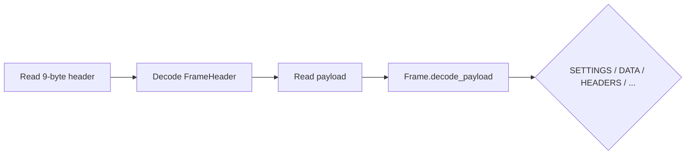

# `core.net.http2`

**Layer 5 — HTTP/2**

RFC 7540 HTTP/2 wire protocol plus RFC 7541 HPACK header compression.
Intended as the basis for HTTP/2 clients, servers, and intermediaries;
sits below any higher-level HTTP abstraction.

## Module layout

| Submodule | Purpose |
|-----------|---------|
| `http2.error` | `Http2Error` (connection / stream / protocol), `ErrorCode` constants |
| `http2.frame` | `FrameHeader`, `FrameType`, `FrameFlags`, typed `Frame` ADT, encode / decode_payload |
| `http2.settings` | `Settings`, `SettingId` + RFC 7540 §6.5.2 defaults and bounds |
| `http2.huffman` | HPACK Huffman codec (backed by @intrinsic canonical table) |
| `http2.static_table` | 61 entries of the HPACK static table (RFC 7541 §A) |
| `http2.hpack` | `HpackEncoder` / `HpackDecoder` + integer / string literal codecs |
| `http2.stream` | `StreamFsm` — RFC 7540 §5.1 state machine |

## Connection preface

```verum
// Client sends the 24-byte preface immediately after TLS handshake.
let preface = core.net.http2.PREFACE;  // [Byte; 24]
stream.write_all(&preface).await?;
```

## Frame pipeline



```verum
// Generic frame loop
loop {
    let mut hdr_buf: [Byte; 9] = [0; 9];
    read_exact(&mut stream, &mut hdr_buf).await?;
    let header = FrameHeader.decode(&hdr_buf)?;

    if header.length > settings.max_frame_size as Int {
        return Err(connection_error(ErrorCode.FRAME_SIZE_ERROR, &"over-limit".into()));
    }
    let payload = read_exact_owned(&mut stream, header.length).await?;
    let frame = Frame.decode_payload(&header, &payload)?;

    match frame {
        Frame.HeadersFrame { stream_id, block_fragment, end_headers, end_stream, .. } => {
            // ...HPACK decode + stream FSM step...
        }
        Frame.DataFrame { stream_id, data, end_stream, .. } => {
            // ...flow control + app dispatch...
        }
        Frame.SettingsFrame { ack, params } => {
            if !ack {
                for (id, value) in params.iter() {
                    settings.apply(*id, *value)?;
                }
                send_settings_ack().await?;
            }
        }
        _ => {}
    }
}
```

## Frame types

| Type | Hex | Purpose | Stream |
|------|-----|---------|--------|
| `DataFrame` | 0x0 | Application data | ≠ 0 |
| `HeadersFrame` | 0x1 | Request / response headers | ≠ 0 |
| `PriorityFrame` | 0x2 | Priority hint (advisory, deprecated) | ≠ 0 |
| `RstStreamFrame` | 0x3 | Terminate a single stream | ≠ 0 |
| `SettingsFrame` | 0x4 | Connection-level config | 0 |
| `PushPromiseFrame` | 0x5 | Server push | ≠ 0 |
| `PingFrame` | 0x6 | Keepalive | 0 |
| `GoAwayFrame` | 0x7 | Graceful connection shutdown | 0 |
| `WindowUpdateFrame` | 0x8 | Flow-control increment | any |
| `ContinuationFrame` | 0x9 | HEADERS / PUSH_PROMISE tail | ≠ 0 |

## HPACK

```verum
mount core.net.http2.*;

// Encoder — one per connection, maintains dynamic table
let mut enc = HpackEncoder.new();
let mut headers: List<HeaderField> = List.new();
headers.push(HeaderField.new(":method".into(), "GET".into()));
headers.push(HeaderField.new(":scheme".into(), "https".into()));
headers.push(HeaderField.new(":path".into(), "/api".into()));
headers.push(HeaderField.new(":authority".into(), "example.com".into()));

let mut block: List<Byte> = List.new();
enc.encode(&headers, &mut block);

// Never-indexed literals (for Authorization / Cookie per §7.1)
enc.encode_never_indexed(
    &HeaderField.new("authorization".into(), "Bearer …".into()),
    &mut block,
);

// Decoder
let mut dec = HpackDecoder.new();
let decoded = dec.decode(&block)?;
```

Dynamic-table size is `DEFAULT_HEADER_TABLE_SIZE` = 4096 bytes per
RFC 7540 §6.5.2. Call `set_max_table_size` on the decoder when the
peer's SETTINGS_HEADER_TABLE_SIZE advertises a different value. The
encoder can issue a `schedule_resize` which emits a §6.3 dynamic-table
size update on the next encode call.

## Stream state machine

Follows the RFC 7540 §5.1 diagram with 7 states and transitions keyed
on `StreamEvent { SendHeaders / RecvHeaders / SendData / RecvData /
SendPushPromise / RecvPushPromise / SendRstStream / RecvRstStream }`.

```verum
let mut fsm = StreamFsm.new(3);
fsm.step(&StreamEvent.RecvHeaders { end_stream: false })?;
fsm.step(&StreamEvent.SendHeaders { end_stream: false })?;
fsm.step(&StreamEvent.SendData { end_stream: true })?;
fsm.step(&StreamEvent.RecvData { end_stream: true })?;
assert_eq(fsm.state(), StreamState.Closed);
```

Invalid transitions surface as `StreamTransitionError.InvalidTransition
{ state, event }` — callers translate to a §7-level `PROTOCOL_ERROR`
connection-level error or a `RST_STREAM` frame depending on severity.

## Error model

`Http2Error` distinguishes three scopes:

- **`ConnectionError { code, reason }`** — emit GOAWAY + close.
- **`StreamError { stream_id, code, reason }`** — RST_STREAM that stream.
- **`NeedMore`** — read more bytes and retry.
- **`MalformedFrame(text)`** / **`HpackError(text)`** / **`FrameSizeExceeded`** — the caller translates to the appropriate scope per §7.

## Deferred

- Full flow-control accounting (WINDOW_UPDATE bookkeeping for
  streams + connection window).
- Stream prioritisation dependency tree (§5.3) — deprecated by RFC 9113.
- ALPN negotiation is handled in `core.net.tls`.
- permessage-deflate-style header compression beyond HPACK (QPACK in
  HTTP/3 is a separate module).
