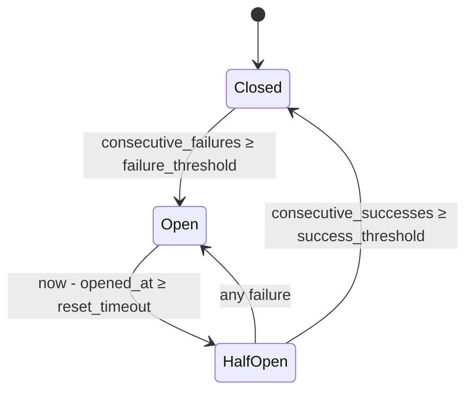

# `core.net.proxy` — reverse-proxy toolkit

`core.net.proxy` is the *composable-middleware* half of Verum's
reverse-proxy stack. Where `core.net.weft` provides the full server-
side framework (routing, middleware pipeline, request/response types,
arena management), `core.net.proxy` provides the individual resilience
primitives that show up in every production proxy: upstream pools,
health checks, load balancers, circuit breakers, retry layers, rate
limiters.

Each module is usable standalone — the circuit breaker can wrap a
database driver, the rate limiter can key on authenticated user — but
all of them compose cleanly inside a Weft middleware pipeline via the
shared `Layer` / `Handler` protocols.

## Design rationale

The six-building-block carve-up (rate-limit, retry, timeout,
upstream pool, health-check, circuit-breaker) is the convergent
shape every production L7 proxy ends up at — Envoy, HAProxy and
Pingora all expose the same set under different names. Sharing
that vocabulary (states, thresholds, budgets) makes the Verum
proxy components drop-in-compatible at the operational level:
operators reading an Envoy runbook can drive the Verum stack
without re-learning concepts.

## Module layout

| Submodule | Purpose |
|-----------|---------|
| `core.net.proxy.upstream_pool` | `Upstream`, `UpstreamPool`, `ConnectionLease` — per-origin TCP reuse |
| `core.net.proxy.health_check` | `HealthStatus`, `HealthProbe`, `HealthCheckLayer` — active + passive probing |
| `core.net.proxy.loadbalancer` | `LoadBalancer` (RoundRobin / Random / WeightedLeastConn), `UpstreamEntry` |
| `core.net.proxy.circuit_breaker` | `CircuitBreakerLayer` — Hystrix-style three-state FSM |
| `core.net.proxy.retry` | `RetryLayer`, `RetryBudget` — exponential backoff with global budget |
| `core.net.proxy.rate_limit` | `RateLimiter` protocol + `TokenBucket` / `LeakyBucket` / `SlidingWindow` |

## `Upstream` + pool

An *upstream* is an origin identified by `(scheme, host, port)` plus a
human label and a load-balancing weight:

```verum
mount core.net.proxy.upstream_pool.{Upstream, UpstreamPool, ConnectionLease};

let api = Upstream.new("https".into(), "api.example.com".into(), 443)
    .with_weight(10)
    .with_name("api-primary".into());

let pool = UpstreamPool.new();
```

### Acquire / release

```verum
let lease: ConnectionLease = pool.acquire(&api).await?;
lease.stream().write_all(&request).await?;
// drop(lease) returns the connection to the pool iff still healthy.
```

`ConnectionLease` is an RAII guard — its `Drop` impl routes the
connection back to `UpstreamPool` via a weak reference. Unhealthy
connections (per `ReusableConnection` checks) are dropped rather than
returned. Per-upstream bounded capacity plus an idle-timeout sweeper
prevent unbounded growth.

## Health checks

```verum
public type HealthStatus is { /* is_healthy, failure_count, last_probe_ms */ };

public type HealthProbe is protocol {
    fn probe(&self, upstream: &Upstream) -> Result<(), WeftError>;
};
```

Two modes:

| Mode | Mechanism |
|------|-----------|
| **Active** | `HealthProbe.probe` runs on a timer against every registered upstream; transitions `HealthStatus` on consecutive-success / consecutive-failure thresholds |
| **Passive** | Live traffic result feeds the status — a 5xx from a request flips the observed health, closing the feedback loop with the circuit breaker |

## Load balancers

```verum
public type LoadBalancer is
    | RoundRobin
    | Random
    | WeightedLeastConn;

public type UpstreamEntry is {
    upstream: Upstream,
    health: HealthStatus,
    in_flight: Shared<AtomicInt>,
};
```

| Policy | When to use |
|--------|-------------|
| `RoundRobin` | Uniform load, homogeneous upstreams — the simplest option |
| `Random` | Skewed load; avoids coordination cost and thundering-herd on a "next" counter |
| `WeightedLeastConn` | Mixed capacity; picks `argmin(in_flight / weight)` — Envoy / HAProxy default |

Every policy returns `Maybe<Upstream>` — `None` surfaces as
`WeftError.Overloaded` when every upstream is unhealthy. Maglev and
power-of-two-choices variants arrive alongside consistent hashing in
a Phase-3 follow-up.

## Circuit breaker (RFC-shaped three-state)



```verum
mount core.net.proxy.circuit_breaker.{CircuitBreakerLayer};

let breaker = CircuitBreakerLayer.new(
    /* failure_threshold   */ 5,
    /* reset_timeout_ms    */ 10_000,
    /* success_threshold   */ 3,
);
```

### Failure classification

The breaker counts an invocation as a *failure* iff **either**:

- The inner handler returned `Err(_)` AND the error's
  `ErrorCategory` is `Transient` or `Upstream` (per the net-framework
  spec §5.6 retryability matrix).
- The response status is `502 / 503 / 504`.

4xx responses are **not** failures — a malformed client request should
not trip the breaker for every other client. This is the key spec
insight that avoids the "blind retry on 400 Bad Request" bug class.

## Retry layer with budgets

```verum
mount core.net.proxy.retry.{RetryLayer, RetryBudget};
mount core.time.duration.{Duration};

let budget = RetryBudget.new(/* ceiling retries/sec */ 100);
let retry = RetryLayer.new(
    /* max_attempts   */ 3,
    /* backoff_base_ms */ 25,
    /* backoff_max_ms  */ 1000,
    Some(budget.clone()),
);
```

Exponential backoff: the *i*-th retry waits `2^i × backoff_base_ms`,
capped at `backoff_max_ms`. The optional `RetryBudget` is a shared
token bucket that prevents *retry storms* — when every upstream is
degraded, retrying just amplifies the outage. A typical configuration
is 10% of live RPS as headroom; the budget `refill`s periodically via
a timer task.

### Retryability

Only errors classified `ErrorCategory.Transient` or `Upstream` retry.
`Permanent` / `Client` / `Security` errors short-circuit immediately —
you never retry a `401 Unauthorized` or a `SIGABRT` from the upstream.

## Rate limiting

```verum
public type RateDecision is
      Admit
    | NotNow(Duration);  // retry-after for 429 responses

public type RateLimiter is protocol {
    fn try_admit(&mut self, cost: UInt64, now: Instant) -> RateDecision;
};
```

Three classic algorithms, all implementing `RateLimiter`:

| Limiter | Semantics | Use case |
|---------|-----------|----------|
| `TokenBucket` | Capacity *C*, refill rate *R* — allows bursts up to *C*, long-run rate *R* | Fair limits with tolerated bursts (API keys) |
| `LeakyBucket` | Fixed-rate drain through queue of capacity *C* — smooths output to exactly *R* req/s | Egress shaping, outbound rate matching |
| `SlidingWindow` | *N* events in the past *W* seconds with smoothed rollover | Strict "*N* per minute" quotas, no bursts |

A `cost` parameter lets callers charge non-uniform operations: e.g.
`try_admit(cost = 10)` for a heavy endpoint lets one request consume
ten tokens from the same bucket.

### Keyed limiters

```verum
public type KeyedRateLimiter<K> is { /* Map<K, Box<dyn RateLimiter>> */ };
```

Fan out one limiter per key — per-IP, per-authenticated-user,
per-API-token. The key space is bounded by capacity in the map plus an
LRU eviction policy so a malicious caller cannot exhaust memory with
fresh keys.

## Composition in a Weft pipeline

```verum
mount core.net.weft.service.{Layer};
mount core.net.proxy.{circuit_breaker.CircuitBreakerLayer,
                      retry.RetryLayer,
                      upstream_pool.UpstreamPool};

fn build_proxy(pool: UpstreamPool) -> Service {
    Service.builder()
        .layer(RateLimiter.token_bucket(1000, 1000))
        .layer(CircuitBreakerLayer.new(5, 10_000, 3))
        .layer(RetryLayer.new(3, 25, 1000, Some(RetryBudget.new(100))))
        .layer(UpstreamPool.as_layer(pool))
        .service(proxy_handler)
}
```

Each `Layer` implements the same protocol (wrap a `Handler`, produce
a new `Handler`), so the stacking order above reads from *inside out*:
rate-limit first, then circuit-break, then retry, then finally hit
the upstream pool.

## Performance notes

| Operation | Cost |
|-----------|------|
| `TokenBucket.try_admit` | 1 × atomic fetch-sub + clock read — ~15 ns |
| `CircuitBreaker` pass-through (Closed state) | 1 × atomic load — ~5 ns |
| `UpstreamPool.acquire` (hit) | 1 × Mutex + FIFO pop — ~80 ns |
| `UpstreamPool.acquire` (miss, open new TCP) | bounded by OS — 0.1 ms to 100 ms |
| `LoadBalancer.WeightedLeastConn.pick` | O(upstreams) — 1 atomic load / entry |

All atomics use `MemoryOrdering.AcqRel` on the consume path and
`Release` on the refill path — sufficient to prevent reordering
without penalising the hot path with `SeqCst`.

## Deferred

| Feature | Status |
|---------|--------|
| Maglev / consistent hashing | Phase 3 — blocked on cache-locality needs |
| Power-of-two-choices | Phase 3 |
| HTTP/2 multiplexing per upstream conn | Phase 3 — currently 1 request / TCP conn |
| KTLS / `io_uring send-zc` hand-off | Deferred to net-framework §6.17 |
| Observer-based passive health | Wired; surface API is staged |

## See also

- [`stdlib/net/weft`](/docs/stdlib/net/weft/overview) — the broader
  reverse-proxy framework in which these primitives sit.
- [`stdlib/net`](/docs/stdlib/net) — TCP, TLS, HTTP base layers.
- [`stdlib/metrics`](/docs/stdlib/metrics) — every layer here exposes
  Prometheus-shaped counters / histograms for visibility.
