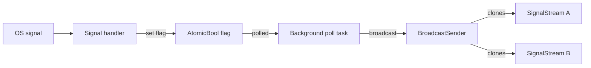

# `core.signal`

**Layer 3.3 — Async signal subscription**

Async-friendly wrappers over OS signal delivery. Backed by the
self-pipe + atomic-flag pattern: signal handlers set flags
asynchronously; a background poll task reads the flags and fans
events out through a broadcast channel.

This keeps user-facing API safe to call from any async context —
no signal-handler UB, no partial writes, no missed signals under
concurrent subscribers.

## Top-level one-shot awaits

```verum
mount core.signal.*;

// Wait for exactly one signal; return when it arrives.
public async fn ctrl_c();                // SIGINT
public async fn terminate();             // SIGTERM
public async fn hup();                   // SIGHUP

// Wait for ANY shutdown-class signal (SIGINT | SIGTERM | SIGHUP).
// Returns the signal that actually arrived so callers can distinguish
// reload-config (SIGHUP) from terminate (Int/Term).
public async fn shutdown_signals() -> Signal;
```

These are one-shot futures — `.await` resolves the first time the
signal fires. For a repeating stream, use `signal_stream` below.

## Explicit subscription

```verum
public fn signal_stream(signals: &[Signal]) -> SignalStream;
```

`Signal` is a sum type over the common POSIX signals (`Signal.Int`,
`Signal.Term`, `Signal.Hup`, `Signal.Usr1`, `Signal.Usr2`,
`Signal.Chld`, `Signal.Pipe`). An empty slice yields a stream that
terminates on first `.next()`. Multiple overlapping subscriptions
are fanned out — every subscriber sees every matching signal.

## `SignalStream`

```verum
public type SignalStream is { ... };

implement Stream for SignalStream { type Item = Signal; ... }
implement AsyncIterator for SignalStream { type Item = Signal; ... }
```

Use as an async iterator:

```verum
// Subscribe, then iterate. shutdown_signals().await is a one-shot
// convenience that returns the single Signal that fired; use
// signal_stream(...) when you want multiple fires.
let mut stream = signal_stream(&[Signal.Int, Signal.Term, Signal.Hup]);
for await _sig in stream {
    initiate_graceful_shutdown();
    break;
}
```

## Example — graceful HTTP server shutdown

```verum
mount core.signal.*;
mount core.net.shutdown.GracefulShutdown;
mount core.async.task.spawn_detached;

async fn serve(listener: TcpListener) {
    let shutdown = GracefulShutdown.new();
    let token = shutdown.token();

    spawn_detached(async move {
        let _sig: Signal = shutdown_signals().await;
        shutdown.initiate();
    });

    loop {
        match listener.accept_cancellable(&token).await {
            Err(_) => break,           // cancelled
            Ok(Err(_)) => continue,    // transient accept error
            Ok(Ok((stream, _))) => {
                let guard = shutdown.track();
                spawn_detached(async move {
                    serve_one(stream, &token).await;
                    drop(guard);
                });
            }
        }
    }

    let _ = shutdown.wait_drained(Duration.from_secs(30)).await;
}
```

## Architecture



- Signal handler does only a single `AtomicBool.set()` — async-
  signal-safe, no heap touch, no mutex.
- Poll task wakes every 20ms, scans the flag set, fans out via
  the process-global `BroadcastSender`.
- Each subscriber has its own buffered receiver — dropping one
  subscriber doesn't affect siblings.

## Platform notes

- Linux: signal handlers via `rt_sigaction` (sys/linux/syscall.vr)
- macOS: `sigaction` via libSystem (sys/darwin/libsystem.vr)
- Windows: mapped to `SetConsoleCtrlHandler` for Ctrl+C / Ctrl+Break;
  SIGHUP / SIGTERM not delivered — SignalStream for those returns
  immediately with no items.
