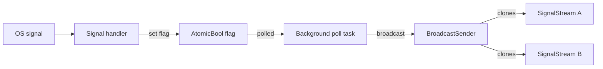

# `core.signal`

**Layer 3.3 — Async signal subscription**

Async-friendly wrappers over OS signal delivery. Backed by the
self-pipe + atomic-flag pattern: signal handlers set flags
asynchronously; a background poll task reads the flags and fans
events out through a broadcast channel.

This keeps user-facing API safe to call from any async context —
no signal-handler UB, no partial writes, no missed signals under
concurrent subscribers.

## Top-level shortcuts

```verum
mount core.signal.*;

pub async fn ctrl_c() -> SignalStream;            // SIGINT
pub async fn terminate() -> SignalStream;         // SIGTERM
pub async fn hup() -> SignalStream;               // SIGHUP
pub async fn shutdown_signals() -> SignalStream;  // SIGINT + SIGTERM
```

All four return a `SignalStream` you can iterate with `for await`.

## Explicit subscription

```verum
pub fn signal_stream(signals: &[Signal]) -> SignalStream;
```

`Signal` is an enum over the common POSIX signals (SIGINT, SIGTERM,
SIGHUP, SIGUSR1, SIGUSR2, SIGCHLD, SIGPIPE).

## `SignalStream`

```verum
public type SignalStream is { ... };

implement Stream for SignalStream { type Item = Signal; ... }
implement AsyncIterator for SignalStream { type Item = Signal; ... }
```

Use as an async iterator:

```verum
let signals = shutdown_signals().await;
for await _sig in signals {
    initiate_graceful_shutdown();
    break;
}
```

## Example — graceful HTTP server shutdown

```verum
mount core.signal.*;
mount core.net.shutdown.GracefulShutdown;
mount core.async.task.spawn_detached;

async fn serve(listener: TcpListener) {
    let shutdown = GracefulShutdown.new();
    let token = shutdown.token();

    spawn_detached(async move {
        shutdown_signals().await.next().await;
        shutdown.initiate();
    });

    loop {
        match listener.accept_cancellable(&token).await {
            Err(_) => break,           // cancelled
            Ok(Err(_)) => continue,    // transient accept error
            Ok(Ok((stream, _))) => {
                let guard = shutdown.track();
                spawn_detached(async move {
                    serve_one(stream, &token).await;
                    drop(guard);
                });
            }
        }
    }

    let _ = shutdown.wait_drained(Duration.from_secs(30)).await;
}
```

## Architecture



- Signal handler does only a single `AtomicBool.set()` — async-
  signal-safe, no heap touch, no mutex.
- Poll task wakes every 20ms, scans the flag set, fans out via
  the process-global `BroadcastSender`.
- Each subscriber has its own buffered receiver — dropping one
  subscriber doesn't affect siblings.

## Platform notes

- Linux: signal handlers via `rt_sigaction` (sys/linux/syscall.vr)
- macOS: `sigaction` via libSystem (sys/darwin/libsystem.vr)
- Windows: mapped to `SetConsoleCtrlHandler` for Ctrl+C / Ctrl+Break;
  SIGHUP / SIGTERM not delivered — SignalStream for those returns
  immediately with no items.
