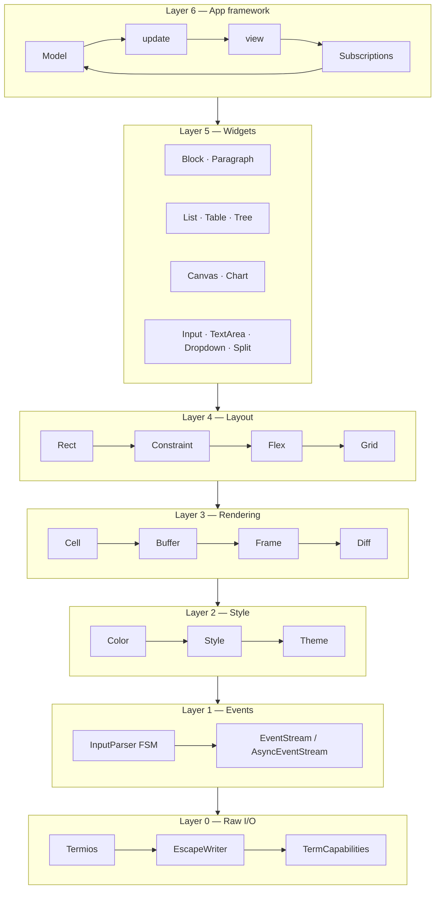

# Architecture

`core.term` is decomposed into seven layers. Each layer has a single
responsibility and depends only on the layers beneath it, so you can drop in
at the exact level of abstraction your program needs.

## Design principles

1. **Reification over magic.** Side effects are values (`Command`, `Subscription`) interpreted by the runtime — `update` stays pure.
2. **Use the language.** The framework is a consumer of `core.async` (channels, spawn, timers, cancellation) and `core.sync` (atomics, futex), not a re-implementation.
3. **Composable, not monolithic.** Widgets are plain types with a `render` method; layouts are pure functions from `Rect` + children to `List<Rect>`.
4. **Protocols over inheritance.** `Widget`, `StatefulWidget`, `Styled`, `Shape` are small protocols; composition replaces deep class hierarchies.
5. **Industrial-grade Unicode, always.** Grapheme clusters are the unit of cursor navigation and display width everywhere, not UTF-8 bytes.

## Layer 0 — Raw I/O

Module: `core.term.raw`

| File | Responsibility |
|---|---|
| `termios.vr` | POSIX termios state save/restore (`@ffi("libc")`) |
| `wincon.vr` | Windows Console Host / VT enable (`@ffi("kernel32")`) |
| `escape.vr` | `EscapeWriter` — CSI / OSC / DCS / SS3 helpers |
| `screen.vr` | Alternate screen enter/leave |
| `cursor.vr` | Cursor shape + visibility |
| `capabilities.vr` | `$TERM`/`$COLORTERM`/`$TERM_PROGRAM` → `TermCapabilities` |
| `clipboard.vr` | OSC 52 set/get |

The raw layer never allocates and never reads terminal input — it only
writes bytes. Reading is Layer 1's job.

## Layer 1 — Events

Module: `core.term.event`

A small pushdown-FSM input parser translates byte streams into structured
events (`Event.Key`, `Event.Mouse`, `Event.Resize`, `Event.Paste`,
`Event.FocusGained`, `Event.FocusLost`). Two front-ends exist:

* `EventStream` — synchronous, blocking or timed poll.
* `AsyncEventStream` — implements `AsyncIterator`; integrates with `select!` and `async for`.

Mouse events are parsed in SGR Extended (1006) format by default. The parser
also understands X10, Xterm normal, and urxvt encodings.

## Layer 2 — Style & color

Module: `core.term.style`

`Color` is a sum of `Base16 | Ansi256 | Rgb | Hsl | Lab`. The `ColorProfile`
of the target terminal is detected once at startup; `adapt_color()` lowers a
`Color` to the terminal's best approximation using CIELAB perceptual distance
rather than naive RGB-Euclidean distance, which preserves apparent brightness
and hue on 16-color shells.

Themes are first-class: a `Theme` assigns semantic roles (`surface`,
`primary`, `accent`, `error`, `success`, `muted`) rather than raw colors,
so an application can switch dark↔light at runtime by replacing the theme
rather than touching every widget.

## Layer 3 — Rendering

Module: `core.term.render`

The rendering engine is double-buffered. Each frame:

1. The application renders widgets into `next: Buffer`.
2. `flush_diff(prev, next)` emits the minimal escape sequences to transition
   the terminal from `prev` to `next`.
3. Buffers swap; the previous `next` becomes `prev`.

The diff algorithm has three fast paths:

* **Row-level skip** — a row equal in both buffers emits no bytes.
* **Natural advancement** — consecutive cells in the same row need no cursor motion.
* **CUF/CUB collapse** — any horizontal cursor jump becomes a single `ESC [ n C` / `ESC [ n D`.

The whole frame is wrapped in Mode 2026 synchronized output so the terminal
either shows the complete new frame or the complete previous one — never a
torn intermediate.

## Layer 4 — Layout

Module: `core.term.layout`

Three layout engines, each suited to a different problem:

* **`Constraint`** — linear solver for splitting a rectangle by `Length`, `Percentage`, `Ratio`, `Min`, `Max`, `Fill`. Fastest.
* **`Flex`** — full CSS Flexbox Level 1, including multi-line wrap, `flex-grow`, `flex-shrink`, and all `justify-content` / `align-items` / `align-content` variants.
* **`Grid`** — CSS Grid Level 1 with `fr` units, `minmax()`, and auto tracks.

All three return `List<Rect>` — the engine of choice is an implementation
detail that doesn't leak into the widgets.

## Layer 5 — Widgets

Module: `core.term.widget`

Every widget implements either `Widget` (stateless — pure function of
`(self, Rect, Buffer)`) or `StatefulWidget` (with an associated `State`
type). The library currently ships twenty widgets; see the [widget
index](../widgets/overview.md) for the full list.

## Layer 6 — App framework

Module: `core.term.app`

The Elm Architecture: `Model`, `update(msg) -> Command`, `view(frame)`,
`subscriptions() -> Subscription`. The runtime interprets `Command` and
`Subscription` as values — `update` is pure, all side effects are
reified and spawned on the async runtime with structured cancellation.

See [The Elm pattern in Verum](./elm-pattern.md) for a full treatment.
