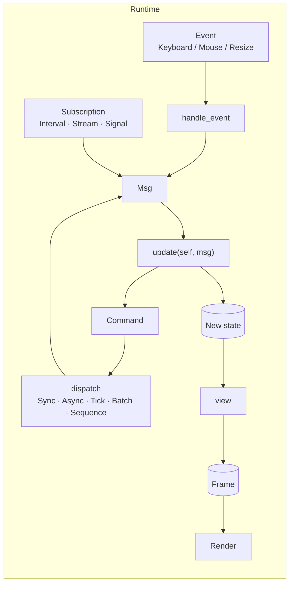
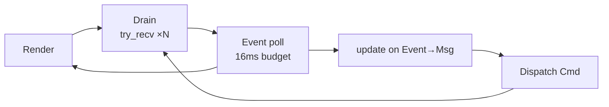

# The Elm pattern in Verum

Verum's TUI framework is built around The Elm Architecture (TEA): a pure
state-transition function, a pure view function, and a reified description
of the effects the runtime should perform. TEA is not just a stylistic
choice — it is what lets the framework give you structured concurrency,
deterministic tests, and safe cancellation for free.



## The `Model` protocol

```verum
public type Model is protocol {
    type Msg;

    fn init(&self) -> Command<Self.Msg> { Command.none() }
    fn update(&mut self, msg: Self.Msg) -> Command<Self.Msg>;
    fn view(&self, frame: &mut Frame);
    fn handle_event(&self, event: Event) -> Maybe<Self.Msg> { None }
    fn subscriptions(&self) -> Subscription<Self.Msg> { Subscription.None }
    fn on_quit(&mut self) {}
};
```

Only `update` and `view` are mandatory. The others have sensible defaults.

### `init`

Returns the first `Command` to dispatch at startup. Use it for loading
persisted state, priming caches, or registering a one-shot greeter tick.

### `update`

Must be **pure**. Given a `Msg`, update `self` and return a `Command`
describing *what the runtime should do next*. Don't perform I/O here;
reify it as `Command.Async(future)` or `Command.Tick(duration, msg)`.

### `view`

Must be **pure** and **deterministic** in `self`. Called at most once per
frame; no mutation outside the provided `Frame`.

### `handle_event`

Maps a low-level `Event` into a high-level `Msg`. Return `None` to ignore
the event. This method is also the place to filter out events you don't
care about — e.g. returning `None` for `Event.Mouse(_)` when your app is
keyboard-only.

### `subscriptions`

Declaratively describes message sources the runtime should keep alive for
you: timers, streams, signal handlers. Each returned `Subscription` is
hoisted to a detached task that observes the global `CancellationToken`.

### `on_quit`

Invoked after the event loop exits and before the terminal is restored.
Use it to flush state, log a final summary, etc.

## Commands — out-going effects

```verum
public type Command<Msg> is
    | Noop
    | Perform(fn() -> Msg)                          // sync thunk
    | Async(Heap<dyn Future<Output = Msg>>)         // async future
    | Batch(List<Command<Msg>>)                     // parallel fan-out
    | Sequence(List<Command<Msg>>)                  // serial chain
    | Tick(Duration, fn() -> Msg)                   // delayed thunk
    | Quit;                                         // exit runtime
```

### Builders

| Factory | Example |
|---|---|
| `Command.none()` | `Command.none()` |
| `Command.perform(thunk)` | `Command.perform(|| Msg.Loaded(read_file()))` |
| `Command.task(fut)` | `Command.task(async { fetch(url).await })` |
| `Command.batch([a, b])` | kicks both in parallel |
| `Command.sequence([a, b])` | `a` completes before `b` starts |
| `Command.tick(Duration.from_millis(500), || Msg.Timeout)` | one-shot |
| `Command.quit()` | graceful shutdown |

### Combinators

`Command` provides an applicative-style DSL:

```verum
let c = Command.task(load_profile())
    .and(Command.task(load_friends()))          // fan-out
    .then(Command.perform(|| Msg.Ready));       // serial
```

`and` absorbs `Noop` and flattens nested `Batch`es; `then` flattens nested
`Sequence`s. Both preserve ordering semantics.

## Subscriptions — incoming streams

```verum
public type Subscription<Msg> is
    | None
    | Interval(Duration, fn() -> Msg)
    | Every(Duration, fn(Instant) -> Msg)
    | Once(Duration, fn() -> Msg)
    | StreamSub(Heap<dyn Stream<Item = Msg>>)
    | Batch(List<Subscription<Msg>>);
```

Typical patterns:

```verum
// Fire a Tick every 60 ms for animations.
Subscription.interval(Duration.from_millis(60), || Msg.AnimationTick)

// Combine a clock and a filesystem watcher.
Subscription.batch([
    Subscription.every(Duration.from_secs(1), |t| Msg.Clock(t)),
    Subscription.from_stream(Heap(fs_watcher("./"))),
])
```

## Execution model

Internally, `run(model)` does `block_on(run_async(model))`. The async version
creates a `CancellationTokenSource`, an unbounded MPSC channel of `Msg`,
spawns the initial command on the runtime, and enters the event loop:



Drain is bounded per tick (default 64 messages) to prevent a message flood
from starving render. Frame budget defaults to 16 ms (≈ 60 FPS).

On exit — `Command.Quit`, `Ctrl+C`, or a `view` that raised — the runtime:

1. cancels the `CancellationToken` (all subscriptions/async commands wake
   up and observe cancellation on their next check);
2. invokes `model.on_quit()`;
3. restores terminal state (alt-screen leave, raw mode off, cursor show);
4. returns the loop's `IoResult<()>` to the caller.

## Testing `update`

Because `update` is pure, unit-testing is trivial:

```verum
#[test]
fn increments_counter() {
    let mut m = CounterModel { counter: 0 };
    let cmd = m.update(Msg.Increment);
    assert_eq(m.counter, 1);
    assert(cmd.is_noop());
}
```

The `view` function is equally testable against a mock `Frame`/`Buffer`.
Snapshot testing compares the resulting `Buffer.to_lines()` to a checked-in
expected output — see the [testing guide](../guides/testing-tui.md).
