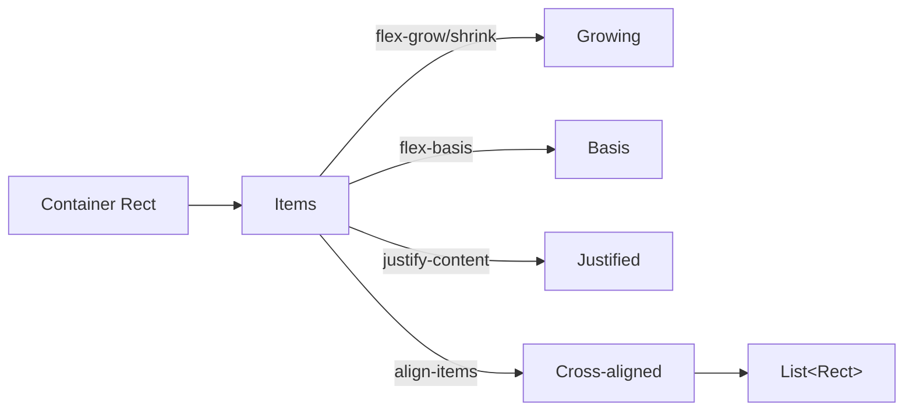

# Layout

`core.term.layout` ships three layout engines. They are not alternatives;
each is the right tool for a different shape of problem. All three share a
common output — `List<Rect>` — so you can freely mix them inside a single
view.

## `Rect`

```verum
public type Rect is { x: Int, y: Int, width: Int, height: Int };
```

Everything below returns `Rect`s and everything in the widget layer consumes
`Rect`s. The coordinate origin is the top-left of the terminal; `x` grows
right, `y` grows down.

Helpers:

```verum
rect.inner(margin)       // shrink by Margin on all sides
rect.right()             // x + width
rect.bottom()            // y + height
rect.is_empty()          // width == 0 || height == 0
```

## `Constraint` — linear splitter

The simplest engine: split one `Rect` along one axis by a list of sizing
rules.

```verum
public type Constraint is
    | Length(Int)
    | Min(Int)
    | Max(Int)
    | Percentage(Int)
    | Ratio(Int, Int)
    | Fill(Int);

let chunks = Layout.new()
    .direction(Direction.Vertical)
    .constraints([Constraint.Length(3), Constraint.Min(5), Constraint.Length(1)])
    .split(frame.size());
```

`Fill(n)` is the greedy variant: all `Fill` constraints share the remainder
weighted by `n`. `Min` and `Max` clamp. `Percentage(p)` takes `p/100` of the
parent. `Ratio(a, b)` takes `a / (a + b)` of the parent.

Use `Constraint` when you have a one-dimensional split (toolbar / main /
status line) and don't need wrapping.

## `Flex` — CSS Flexbox Level 1



Full CSS Flexbox:

* `FlexDirection`: `Row | RowReverse | Column | ColumnReverse`
* `FlexWrap`: `NoWrap | Wrap | WrapReverse`
* `JustifyContent`: `FlexStart | FlexEnd | Center | SpaceBetween | SpaceAround | SpaceEvenly`
* `AlignItems` / `AlignContent`: `Stretch | FlexStart | FlexEnd | Center | Baseline | SpaceBetween | SpaceAround`
* Per-item: `basis`, `grow`, `shrink`, `min_size`, `max_size`, `align_self`.

The grow/shrink algorithm follows the CSS spec precisely — items that hit
a `min_size` or `max_size` bound are frozen, then the remaining free space
is redistributed among the unfrozen items until everyone is frozen or there
is no more space to distribute.

```verum
let layout = FlexLayout.row()
    .justify(JustifyContent.SpaceBetween)
    .align_items(AlignItems.Center)
    .gap(1);

let items = [
    FlexItem.new().fixed(10),
    FlexItem.new().grow(1.0),
    FlexItem.new().fixed(15),
];

let rects = layout.compute(frame.size(), &items);
```

Use `Flex` for toolbars, horizontally-stretched rows, and any 1-D layout
that needs per-item growth control.

## `Grid` — CSS Grid Level 1

Two-dimensional tracks with the full CSS unit vocabulary:

```verum
public type GridTrack is
    | Fixed(Int)            // exact size
    | Fr(Int)               // fractional remainder
    | MinMax(Int, Int)      // lower..upper
    | Auto;                 // content size (fallback 1)

let grid = GridLayout.new()
    .columns([GridTrack.Fr(1), GridTrack.Fr(2), GridTrack.Fixed(20)])
    .rows([GridTrack.Fixed(3), GridTrack.Fr(1)])
    .gap(1);

let cells = grid.compute(frame.size());  // List<List<Rect>>, [row][col]
```

Use `Grid` for dashboards, forms with label/value columns, and anywhere
you want consistent rows *and* columns simultaneously.

## Shortcuts

The most common layouts are pre-cooked:

```verum
mount core.term.layout.shortcuts.*;

let (header, body, footer) = header_body_footer(area, 3, 1);
let (sidebar, main)        = sidebar_main(area, 25);
let (cells)                = equal_columns(area, 4);
let (rows)                 = equal_rows(area, 3);
let centered_area          = centered(area, 60, 20);  // 60×20 box in middle
```

## Responsive

```verum
public fn current_breakpoint(width: Int) -> Breakpoint;
```

Returns `Breakpoint.Mobile` (<80 cols), `Tablet` (<120), `Desktop` (<180),
`Wide` (≥180). Use this in `view()` to pick a different layout per size:

```verum
match current_breakpoint(area.width) {
    Mobile | Tablet => render_stacked(frame),
    _               => render_side_by_side(frame),
}
```

Combine with `Subscription.interval` to poll size changes, or hook directly
into `Event.Resize`.

## Choosing an engine

| Problem | Engine |
|---|---|
| "Toolbar + main + status bar" | `Constraint` |
| "Two columns, right side grows" | `Flex` |
| "Wrap cards to N per row" | `Flex` with `Wrap` |
| "Left pane fixed 30 cols, right fills" | `sidebar_main` shortcut |
| "Dashboard with header row + grid of cards" | `Constraint` + `Grid` |
| "Form with label column and input column" | `Grid` |
| "Resizable two-pane split" | [`Split`](../widgets/overview.md) widget |
