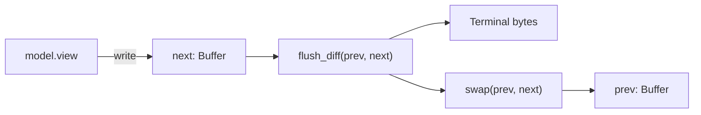

# Rendering

A `Frame` is a write-only view onto a `Buffer`. A `Buffer` is a flat
`List<Cell>` indexed by `y * width + x`. Every `Cell` stores an extended
grapheme cluster (UTF-8 text) plus its `Style`.

```
struct Cell {
    grapheme: Text,    // UAX #29 extended cluster, e.g. "a", "👨‍👩‍👧", "ñ́"
    style:    Style,
    skip:     Bool,    // second cell of a wide cluster
}
```

## Double buffering

The `Terminal` owns two buffers:



* `model.view(frame)` fills `next`.
* `flush_diff` walks `prev` and `next` cell-by-cell and emits the minimal
  escape sequences to transition `prev → next` on the real terminal.
* Buffers swap; the old `next` becomes the new `prev`.

## Diff algorithm

`flush_diff` has three fast paths:

| Fast path | Trigger | Emitted bytes |
|---|---|---|
| **Row skip** | Whole row equal in `prev` and `next` | 0 |
| **Natural advance** | Next cell is `(cursor_x + 1, cursor_y)` | 0 (just the cell) |
| **Single CUF/CUB** | Movement is horizontal within the same row | `ESC [ n C` or `ESC [ n D` |
| Fallback | Any other motion | absolute `CUP (y;x)` |

Style transitions are coalesced: successive cells with the same style share
one SGR sequence. When a modifier is *cleared* (e.g. going from bold to
non-bold), the algorithm emits `CSI 0 m` to reset and then re-establishes
the target style — most terminals have no single-byte "unbold" SGR.

## Synchronized output (Mode 2026)

The whole frame is wrapped:

```
ESC [ ? 2026 h   (begin synchronized update)
 … all the diff …
ESC [ ? 2026 l   (end)
```

Compliant terminals buffer the entire sequence and either commit atomically
or stay on the old frame — no tearing. Incompatible terminals ignore the
DECRQM and render as if it weren't there.

## Cell widths (Unicode)

`Cell.width()` is computed by `grapheme_width()`, which approximates UAX #11
+ UTS #51:

* **0 columns** — combining marks (Mn/Me, many scripts), ZWJ, variation
  selectors, BiDi format, soft hyphen.
* **2 columns** — East Asian Wide / Fullwidth, CJK Unified Ideographs,
  Hangul Syllables, Extended_Pictographic.
* **emoji presentation override** — a pictographic base + `U+FE0F` (VS16)
  is forced to 2 columns; a pictographic + `U+FE0E` (VS15) drops back to 1.
* **flags** — two Regional Indicator Symbols adjacent in the cluster render
  as 2 columns together.

Wide clusters occupy two adjacent cells; the second is marked `skip` so the
diff renderer does not emit a stray half-glyph.

## Viewport modes

```verum
public type Viewport is
    | Fullscreen                       // take over the whole terminal
    | Inline { height: Int }           // last `height` rows, scrollback above
    | Fixed(Rect);                     // explicit rect, for embedding
```

`Fullscreen` enters the alternate screen; `Inline` does not. An inline TUI
is a first-class citizen: output above the viewport remains as scrollback
after exit.

## Graphics protocols

Module: `core.term.render.graphics`

```verum
public type GraphicsRenderer is protocol {
    fn render_image(&mut self, data: &[Byte], format: ImageFormat, area: Rect) -> IoResult<()>;
    fn clear_images(&mut self, area: Rect) -> IoResult<()>;
};

public fn create_graphics_renderer(
    caps: &TermCapabilities,
    w: &mut (dyn EscapeWriter),
) -> Heap<dyn GraphicsRenderer>;
```

`create_graphics_renderer` auto-selects:

1. **Kitty graphics protocol** (base64 APC, preferred)
2. **Sixel** (DCS, Rgb24)
3. **iTerm2 inline images** (OSC 1337)
4. **Braille fallback** (U+2800..U+28FF, works everywhere)

## Performance knobs

* **Allocations.** `Buffer.new(w, h)` allocates one `Vec<Cell>` of size
  `w * h`; resizing is rare. Avoid building throwaway `Buffer`s per frame —
  mutate the frame's buffer in place.
* **Style patch order.** `buf.set_style(rect, style)` patches every cell;
  prefer passing the target style directly to `set_string` and `set_char`
  to skip the second pass.
* **Row skip sensitivity.** If your app redraws everything identically
  every frame, the row-level fast path ensures zero bytes are emitted and
  the loop blocks in `poll` for the whole frame budget.
