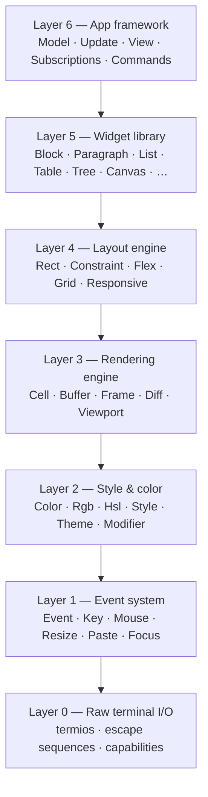

# `core.term` — Terminal / TUI framework

Verum's TUI framework is a seven-layer stack. Each layer is self-contained:
use raw mode for a shell, the rendering engine for a scripted output, or the
full application framework for an interactive app.



## What makes it production-grade

| Area | Verum `core.term` |
|---|---|
| **Async** | First-class: `Command.Async(Future)` lands directly in the runtime via `core.async`. Subscriptions run as detached tasks. |
| **Cancellation** | Every spawned task observes a `CancellationToken`; cleanup on `Quit` is automatic. |
| **Unicode** | Grapheme-cluster cursor & width (UAX #29 + UTS #51 approximation) — ZWJ emoji, skin tones, flags all render correctly. |
| **Layout** | CSS Flexbox Level 1 (`flex-grow`/`shrink`/`basis`) and CSS Grid Level 1, not just `Constraint`. |
| **Style** | CIELAB-perceptual adaptive color downscaling; TrueColor → 256 → 16 without perceptible drift. |
| **Graphics** | Kitty, Sixel, iTerm2, and Braille fallback — auto-detected from `TermCapabilities`. |
| **Diff render** | Double-buffered, row-level fast-path skip, cursor-motion minimisation, synchronized output (Mode 2026). |
| **Mouse / paste / focus** | SGR extended mouse, bracketed paste (Mode 2004), focus events (Mode 1004). |
| **Clipboard** | OSC 52 read & write, built into `raw::clipboard`. |
| **Accessibility** | OSC 133 semantic zones (Prompt / CommandInput / CommandOutput / CommandEnd / Live regions). |

## Quick start

```verum
mount core.term.prelude.*;

type Model is {
    counter: Int,
};

type Msg is Increment | Decrement;

implement Model for Model {
    type Msg = Msg;

    fn update(&mut self, msg: Msg) -> Command<Msg> {
        match msg {
            Increment => { self.counter = self.counter + 1; Command.none() }
            Decrement => { self.counter = self.counter - 1; Command.none() }
        }
    }

    fn view(&self, frame: &mut Frame) {
        let title = f"Counter: {self.counter} — press ↑/↓ / q to quit";
        let block = Block.new().title(title).borders(Borders.ALL);
        frame.render(block, frame.size());
    }

    fn handle_event(&self, event: Event) -> Maybe<Msg> {
        match event {
            Event.Key(ke) => match ke.code {
                KeyCode.Up   => Some(Increment),
                KeyCode.Down => Some(Decrement),
                _ => None,
            },
            _ => None,
        }
    }
}

fn main() -> IoResult<()> {
    run(Model { counter: 0 })
}
```

## Reading map

* **Concepts** — [architecture](./concepts/architecture.md), [Elm pattern](./concepts/elm-pattern.md), [event loop](./concepts/event-loop.md), [rendering](./concepts/rendering.md), [layout](./concepts/layout-system.md).
* **Widgets** — [index of every built-in widget](./widgets/overview.md) with minimal examples.
* **Guides** — [async commands & subscriptions](./guides/async-commands.md), [styling & themes](./guides/styling-theming.md), [layout recipes](./guides/layout-guide.md).
* **Examples** — [counter](./examples/counter.md), [TODO app](./examples/todo-app.md), [dashboard](./examples/dashboard.md).
* **Reference** — the full API surface organised by layer in the [reference section](./reference/api-widgets.md).
* **Comparisons** — [how `core.term` stacks up against Ratatui, Textual, Ink and Bubble Tea](./comparisons.md).
