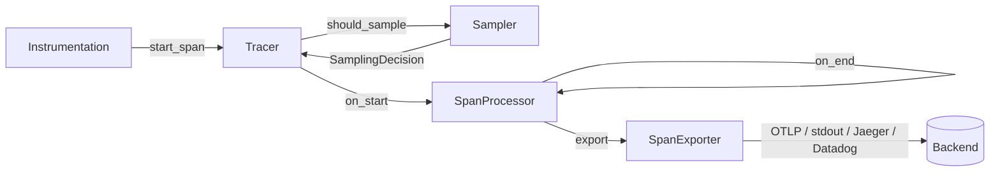

# `core.tracing` — distributed tracing

OpenTelemetry-compatible tracing primitives. `core.tracing` supplies
identifiers, contexts, spans, samplers, processors, exporters, and the
W3C Trace Context wire format. Weft (reverse-proxy middleware),
Spindle (database), and the database / RPC drivers all instrument
against this surface — third-party instrumentation MUST use it too so
spans from all layers stitch into a single trace.

## Spec alignment

| Spec | Scope |
|------|-------|
| [OTel Trace API](https://opentelemetry.io/docs/specs/otel/trace/api/) | `Span` API, `SpanKind`, status, attributes, events, links |
| [OTel Trace SDK](https://opentelemetry.io/docs/specs/otel/trace/sdk/) | `Sampler`, `SpanProcessor`, `SpanExporter` pipeline |
| [W3C Trace Context](https://www.w3.org/TR/trace-context/) | `traceparent` / `tracestate` HTTP header encoding |
| [OTel Resource](https://opentelemetry.io/docs/specs/otel/resource/sdk/) | Process-wide attributes (`service.name`, `service.version`) |

## Module layout

| Submodule | Purpose |
|-----------|---------|
| `core.tracing.id` | `TraceId` (128-bit), `SpanId` (64-bit), `generate_trace_id`, `generate_span_id` |
| `core.tracing.context` | `SpanContext`, `TraceFlags`, `TraceState`, `INVALID_SPAN_CONTEXT` |
| `core.tracing.attribute` | `AttributeValue` (Text / Bool / Int / Float / array), `AttributeSet` |
| `core.tracing.resource` | `Resource` — process-wide attributes |
| `core.tracing.sampler` | `Sampler` protocol, `SamplingDecision`, `SamplingResult`, `AlwaysOn`, `AlwaysOff`, `TraceIdRatio`, `ParentBased` |
| `core.tracing.span` | `Span`, `SpanKind`, `SpanStatus`, `StatusCode`, `SpanEvent`, `SpanLink`, `SpanData` |
| `core.tracing.exporter` | `SpanExporter` protocol, `NoopExporter`, `StdoutExporter`, `ExportResult` |
| `core.tracing.processor` | `SpanProcessor` protocol, `SimpleProcessor`, `BatchProcessor` |
| `core.tracing.tracer` | `Tracer`, `TracerProvider`, `get_tracer`, global registry |
| `core.tracing.propagation` | `TextMapPropagator` protocol, `W3CTraceContext`, `inject_traceparent`, `extract_traceparent` |

## Pipeline



The SDK separates *decision* (Sampler), *lifecycle* (Processor), and
*shipping* (Exporter) so each can be swapped independently.

## Minimal server setup

```verum
mount core.tracing.*;
mount core.tracing.processor.{BatchConfig};
mount core.time.duration.{Duration};

set_global_tracer_provider(
    TracerProvider.builder()
        .with_resource(Resource.service(&"weft-edge".into(), &"1.0".into()))
        .with_sampler(parent_based(always_on()))
        .with_processor(
            Heap.new(BatchProcessor.new(
                Heap.new(StdoutExporter.new()) as Heap<dyn SpanExporter>,
            )) as Heap<dyn SpanProcessor>,
        )
        .build()
);

let tracer = get_tracer(&"edge.handler".into(), &"1.0".into());
```

Call `set_global_tracer_provider` once at startup; `get_tracer(name,
version)` returns per-component tracers cheaply afterwards.

## Starting and ending spans

```verum
let parent = SpanContext.invalid();  // or extracted from inbound headers
let mut attrs = AttributeSet.new();
attrs.set("http.method".into(), AttributeValue.Text("GET".into()));
let links: List<SpanLink> = List.new();

let span = tracer.start_span(
    &"handle_request".into(),
    SpanKind.KindServer,        // role of this span in the trace
    attrs,
    links,
    &parent,
);

// Record incidents as the work progresses
span.set_attribute("http.status_code".into(), AttributeValue.Int(200));
span.add_event_now("request.validated".into());

// Finalise — future mutations on `span` are no-ops
span.set_status(SpanStatus.ok());
let finished: Maybe<SpanData> = span.end();
```

## Identifiers

| Type | Bytes | Hex digits |
|------|-------|------------|
| `TraceId` | 16 | 32 |
| `SpanId`  |  8 | 16 |

`generate_trace_id()` / `generate_span_id()` are allocation-free and
never return the all-zero "invalid" value. The generator seeds from
a per-process start-nanos stamp plus an atomic monotonic counter —
~20 ns per call, no syscall. Collisions across processes are
cryptographically negligible under the 128-bit / 64-bit domains.

## `SpanKind`

```verum
public type SpanKind is
    | KindInternal   // default — no specific role
    | KindClient     // outgoing request
    | KindServer     // incoming request
    | KindProducer   // emit a message for async delivery
    | KindConsumer;  // receive a message from async delivery
```

The kind informs the backend's UI layout (a "server → client"
link shows as a parent → child edge; a "producer → consumer" link
shows as a separate causal arrow even when the spans are in
different traces).

## `SpanStatus` / `StatusCode`

```verum
public type StatusCode is Unset | Ok | Error;

public type SpanStatus is { code: StatusCode, description: Maybe<Text> };

implement SpanStatus {
    public fn unset() -> SpanStatus;
    public fn ok() -> SpanStatus;
    public fn error(description: Text) -> SpanStatus;
}
```

`Unset` is the default; instrumentation MUST only set `Ok` or `Error`
when the work truly succeeded / failed — leaving `Unset` lets the
backend infer status from HTTP semantics or rpc metadata.

## Samplers

```verum
public type SamplingDecision is
    | Drop             // span not recorded, not sampled
    | RecordOnly       // recorded for internal aggregation, not exported
    | RecordAndSample; // recorded AND exported (sets sampled flag in traceparent)

public type SamplingResult is { decision: SamplingDecision, trace_state: TraceState };
```

| Sampler | Decision rule |
|---------|---------------|
| `AlwaysOn` | `RecordAndSample` always |
| `AlwaysOff` | `Drop` always |
| `TraceIdRatio(r)` | Deterministic by `trace_id` — sampled iff `trace_id_high < r · 2^64`; same ratio across services when they share `trace_id` |
| `ParentBased(root, …)` | Inherits parent sampled flag; consults `root` only for root spans |

Factory helpers: `always_on()`, `always_off()`, `trace_id_ratio(r)`,
`parent_based(root)` — each returns a `Heap<dyn Sampler>` ready to
hand to `TracerProvider.builder().with_sampler(...)`.

The sampler contract is *pure* — `should_sample(parent, trace_id,
name, kind, attributes)` MUST have no side effects, since it can be
invoked on any executor thread and is cached against the trace id.

## Processors

| Processor | Mode | When to use |
|-----------|------|-------------|
| `SimpleProcessor` | Synchronous — exports on `end()` | Tests, development, small services where latency isn't critical |
| `BatchProcessor` | Bounded channel + worker task | All production workloads |

`BatchProcessor.new(exporter)` spawns a detached worker task (via
`spawn_detached`). Configuration options:

```verum
public type BatchConfig is {
    max_queue_size: Int,           // hard cap; default 2048
    scheduled_delay: Duration,     // flush cadence; default 5 s
    max_export_batch_size: Int,    // per-export limit; default 512
    export_timeout: Duration,      // per-export deadline; default 30 s
};
```

When the queue is full, `on_end` drops the span — per OTel default
policy, it is better to lose a few spans than to stall the hot path.
`force_flush(timeout)` drains the batch buffer, e.g. during graceful
shutdown.

## Exporters

In-tree:

| Exporter | Format |
|----------|--------|
| `NoopExporter` | Discards everything — for tests that just want a valid `TracerProvider` |
| `StdoutExporter` | One line of JSON per span, Mutex-serialised writer |

Out-of-tree exporters — OTLP/gRPC, OTLP/HTTP, Jaeger, Zipkin,
Datadog — live in separate cogs and implement the `SpanExporter`
protocol:

```verum
public type SpanExporter is protocol {
    fn export(&self, spans: &List<SpanData>) -> ExportResult;
    fn shutdown(&self, timeout: Duration) -> ExportResult;
};

public type ExportResult is Success | Failure(Text);
```

## W3C Trace Context propagation

```verum
mount core.tracing.propagation.{W3CTraceContext, TextMapPropagator};

let prop = W3CTraceContext.new();

// Server side — inbound headers → parent SpanContext
let parent = prop.extract(&request.headers);

// Client side — outbound headers
let mut headers: List<(Text, Text)> = List.new();
prop.inject(&child_span.context(), &mut headers);
```

Header format:

```
traceparent: 00-<trace_id:32hex>-<span_id:16hex>-<flags:2hex>
tracestate:  vendor1=value1,vendor2=value2
```

| Field | Version | Format |
|-------|---------|--------|
| `traceparent` | `"00"` (only version defined) | 55-byte fixed-width hex |
| `tracestate` | any | CSV of `key=value`; `TraceState` enforces the W3C cap of 32 members, 256-char keys/values |

The `TextMapPropagator` protocol is pluggable — B3, X-Ray,
Jaeger-legacy, and custom formats slot in via the same two-method
contract. Weft's middleware layer consumes an injected propagator
via the context system; swapping formats is a single line of config.

## Attributes

`AttributeValue` covers Text / Bool / Int / Float, plus array-of-
primitive variants for list-valued attributes. Limits apply per OTel
SDK spec:

| Limit | Default |
|-------|---------|
| `ATTRIBUTE_COUNT_LIMIT` (per span, per resource, per event, per link) | 128 |
| `SPAN_EVENT_LIMIT` | 128 |
| `SPAN_LINK_LIMIT` | 128 |
| `ATTRIBUTE_VALUE_LENGTH_LIMIT` | unbounded (not a hard cap today) |

Over-limit additions are dropped silently — traces must never fail a
request because instrumentation mis-sized an attribute set.

## Performance notes

| Operation | Cost |
|-----------|------|
| `generate_trace_id` / `generate_span_id` | ~20 ns, no allocation, no syscall |
| `SpanContext.clone()` | ~5 ns (32-byte POD + trace-state Shared clone) |
| `tracer.start_span(...)` | 1 × `SpanInner` + 1 × `Shared<Mutex<…>>`; sampler adds ~10 ns for AlwaysOn, ~50 ns for ParentBased |
| `span.set_attribute(...)` | Mutex-guarded `AttributeSet.set` — bounded linear scan |
| `BatchProcessor.on_end` | single `try_send` on a bounded channel — ~80 ns under contention |
| `W3CTraceContext.inject` | hex-encode + list push; ~200 ns, no heap other than the two header strings |

## See also

- [`stdlib/metrics`](/docs/stdlib/metrics) — aggregate instrumentation;
  complementary to per-event traces.
- [`stdlib/context`](/docs/stdlib/context) — the tracer provider and
  propagator are registered as context resources.
- [`stdlib/net/weft`](/docs/stdlib/net/weft/overview) — server-side
  middleware that auto-injects a server-kind span per request.
