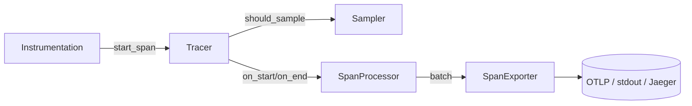

# `core.tracing`

**Layer 4.95 — Distributed tracing**

OpenTelemetry-compatible tracing primitives. Provides identifiers,
contexts, spans, samplers, processors, exporters, and W3C Trace Context
propagation. Intended as the substrate for the Weft and Spindle
frameworks and any first-party or third-party instrumentation.

## Module layout

| Submodule | Purpose |
|-----------|---------|
| `tracing.id` | `TraceId` (128-bit), `SpanId` (64-bit), generators |
| `tracing.context` | `SpanContext`, `TraceFlags`, `TraceState` |
| `tracing.attribute` | `AttributeValue` + `AttributeSet` |
| `tracing.resource` | `Resource` — process-wide attributes |
| `tracing.sampler` | `Sampler` + `AlwaysOn` / `AlwaysOff` / `TraceIdRatio` / `ParentBased` |
| `tracing.span` | `Span`, `SpanKind`, `SpanStatus`, `SpanEvent`, `SpanLink`, `SpanData` |
| `tracing.exporter` | `SpanExporter` + `NoopExporter` / `StdoutExporter` |
| `tracing.processor` | `SpanProcessor` + `SimpleProcessor` / `BatchProcessor` |
| `tracing.tracer` | `Tracer`, `TracerProvider`, `get_tracer`, global registry |
| `tracing.propagation` | `TextMapPropagator` + `W3CTraceContext` codec |

## Pipeline



## Minimal server setup

```verum
mount core.tracing.*;
mount core.tracing.processor.{BatchConfig};
mount core.time.duration.{Duration};

// Configure once at startup
set_global_tracer_provider(
    TracerProvider.builder()
        .with_resource(Resource.service(&"weft-edge".into(), &"1.0".into()))
        .with_sampler(parent_based(always_on()))
        .with_processor(
            Heap.new(BatchProcessor.new(
                Heap.new(StdoutExporter.new()) as Heap<dyn SpanExporter>,
            )) as Heap<dyn SpanProcessor>,
        )
        .build()
);

// Use anywhere
let tracer = get_tracer(&"edge.handler".into(), &"1.0".into());
```

## Starting and ending spans

```verum
let parent = SpanContext.invalid();             // or extracted from a header
let mut attrs = AttributeSet.new();
attrs.set("http.method".into(), AttributeValue.Text("GET".into()));
let links: List<SpanLink> = List.new();

let span = tracer.start_span(
    &"handle_request".into(),
    SpanKind.Server,
    attrs,
    links,
    &parent,
);

// Mutate
span.set_attribute("http.status_code".into(), AttributeValue.Int(200));
span.add_event_now("request.validated".into());

// Terminal
span.set_status(SpanStatus.ok());
let data = span.end();                          // Maybe<SpanData>
```

## Identifiers

| Type | Bytes | Hex length |
|------|-------|------------|
| `TraceId` | 16 | 32 |
| `SpanId`  |  8 | 16 |

Generators `generate_trace_id()` / `generate_span_id()` return
non-invalid identifiers using a per-process start-nanos seed plus an
atomic counter — ~20 ns per call, no syscall.

## Samplers

| Sampler | Decision |
|---------|----------|
| `AlwaysOn` | `RecordAndSample` always |
| `AlwaysOff` | `Drop` always |
| `TraceIdRatio(r)` | Deterministic — sample if `trace_id_high < r · 2^64` |
| `ParentBased(root, …)` | Inherits parent sampled bit; uses `root` for root spans |

Factory helpers: `always_on()`, `always_off()`, `trace_id_ratio(r)`,
`parent_based(root)` — each returns a `Heap<dyn Sampler>`.

## Processors

| Processor | Mode |
|-----------|------|
| `SimpleProcessor` | Synchronous, per-span export on `end()` |
| `BatchProcessor`  | Bounded channel + worker-task export with configurable `max_queue_size`, `scheduled_delay`, `max_export_batch_size`, `export_timeout` |

The worker task is spawned detached with `spawn_detached`. On queue-full
spans are dropped (per OTel default policy). `force_flush(timeout)`
drains the batch buffer.

## Exporters

In-tree: `NoopExporter`, `StdoutExporter` (line-oriented, Mutex-serialised).

Third-party exporters — OTLP/gRPC, OTLP/HTTP, Jaeger, Zipkin, Datadog —
live in separate cogs and implement the `SpanExporter` protocol.

## W3C Trace Context propagation

```verum
let prop = W3CTraceContext.new();

// Server side — extract from request
let ctx = prop.extract(&request.headers);

// Outgoing client call — inject
let mut headers: List<(Text, Text)> = List.new();
prop.inject(&child_span.context(), &mut headers);
```

Header format (per
[W3C Trace Context](https://www.w3.org/TR/trace-context/)):

```
traceparent: 00-<trace_id:32hex>-<span_id:16hex>-<flags:2hex>
tracestate:  vendor1=value1,vendor2=value2
```

Limits: `TraceState` enforces 32 members, 256-char keys/values per the
W3C spec. `TRACEPARENT_MAX_SIZE` is 55 bytes.

## Attributes

Attribute values support `Text | Bool | Int | Float` and array-of-primitive
variants. Per-span / per-resource count capped at
`ATTRIBUTE_COUNT_LIMIT = 128`; `SPAN_EVENT_LIMIT` and `SPAN_LINK_LIMIT`
are also 128 each.

## Performance notes

- `generate_trace_id` / `generate_span_id` are allocation-free.
- `SpanContext` is copy-cheap (bytes + two small Lists via Shared).
- Hot-path `tracer.start_span` allocates one `SpanInner` and one
  `Shared<Mutex<…>>`; sampler decision adds ~10 ns for `AlwaysOn` and
  ~50 ns for `ParentBased`.
- `BatchProcessor::on_end` is a single `try_send` on a bounded channel
  (~80 ns under contention).
