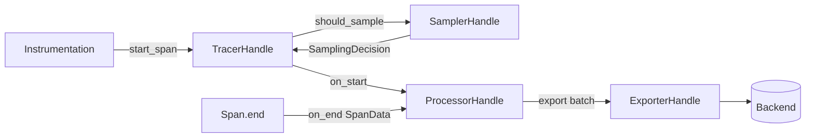

# `core.tracing` — distributed tracing

OpenTelemetry-compatible tracing primitives. `core.tracing` supplies
identifiers, span contexts, spans, samplers, processors, exporters,
and the W3C Trace Context wire format. It is designed as the single
tracing substrate for the platform: server middleware (Weft),
database drivers, and RPC layers are expected to instrument against
this surface so spans from every layer stitch into one trace.

The module follows the OpenTelemetry split between an **API**
(types instrumentation code touches: `Span`, `SpanContext`,
attributes) and an **SDK** (the configurable pipeline:
sampler → processor → exporter, wired through a `TracerProvider`).

Pipeline stages are selected through **handle enums** —
`SamplerHandle`, `ProcessorHandle`, `ExporterHandle`,
`IdGeneratorHandle`, `TracerHandle` — closed variant types covering
every in-tree implementation, each with a `…Custom` variant that
carries a user implementation of the corresponding public protocol
(`Sampler`, `SpanProcessor`, `SpanExporter`, `IdGenerator`). The
handles dispatch statically; the `…Custom` variants are the
forward-compatibility seam for protocol-object dispatch (see
[Current limitations](#current-limitations)).

## Spec alignment

| Spec | Scope |
|------|-------|
| [OTel Trace API](https://opentelemetry.io/docs/specs/otel/trace/api/) | `Span` API, `SpanKind`, status, attributes, events, links |
| [OTel Trace SDK](https://opentelemetry.io/docs/specs/otel/trace/sdk/) | Sampler / processor / exporter pipeline |
| [W3C Trace Context](https://www.w3.org/TR/trace-context/) | `traceparent` / `tracestate` HTTP header encoding |
| [OTel Resource](https://opentelemetry.io/docs/specs/otel/resource/sdk/) | Process-wide attributes (`service.name`, `service.version`) |

## Module layout

| Submodule | Public surface |
|-----------|----------------|
| `core.tracing.id` | `TraceId`, `SpanId`, `generate_trace_id`, `generate_span_id`, `IdGenerator` protocol, `DefaultIdGenerator`, `IdGeneratorHandle`, `default_id_generator`, `custom_id_generator` |
| `core.tracing.context` | `SpanContext`, `TraceFlags`, `TraceState` |
| `core.tracing.attribute` | `AttributeValue`, `AttributeKind`, `AttributeSet`, `ATTRIBUTE_COUNT_LIMIT` |
| `core.tracing.resource` | `Resource` — process-wide attributes |
| `core.tracing.data` | Frozen data layer: `SpanKind`, `SpanStatus`, `SpanStatusCode`, `SpanEvent`, `SpanLink`, `SpanData`, `TraceExportResult`, `ExportError`, `ExportErrorKind` |
| `core.tracing.sampler` | `Sampler` protocol, `SamplingDecision`, `SamplingResult`, `SamplerHandle`, `AlwaysOn`, `AlwaysOff`, `TraceIdRatio`, `ParentBased`, factory functions |
| `core.tracing.exporter` | `SpanExporter` protocol, `ExporterHandle`, `NoopExporter`, `StdoutExporter`, `InMemoryExporter` |
| `core.tracing.processor` | `SpanProcessor` protocol, `ProcessorHandle`, `SimpleProcessor`, `BatchProcessor`, `BatchConfig`, `CompositeProcessor` |
| `core.tracing.span` | `Span` (the live handle), `SpanInner`, `SPAN_EVENT_LIMIT`, `SPAN_LINK_LIMIT` |
| `core.tracing.tracer` | `Tracer` protocol, `TracerHandle`, `SdkTracer`, `NoopTracer`, `TracerProvider`, `TracerProviderBuilder`, `get_tracer`, `set_global_tracer_provider`, `global_tracer_provider` |
| `core.tracing.propagation` | `TextMapPropagator` protocol, `W3CTraceContext`, `inject_traceparent`, `extract_traceparent` |

The flat `core.tracing.*` namespace re-exports this entire surface;
the submodule paths above are the canonical form used on this page.

## Pipeline


```mermaid
flowchart LR
    I[Instrumentation] -->|start_span| T[TracerHandle]
    T -->|should_sample| S[SamplerHandle]
    S -->|SamplingDecision| T
    T -->|on_start| P[ProcessorHandle]
    Sp[Span.end] -->|on_end SpanData| P
    P -->|export batch| E[ExporterHandle]
    E --> Back[(Backend)]
```

The SDK separates *decision* (sampler), *lifecycle* (processor) and
*shipping* (exporter) so each can be swapped independently. A
`TracerProvider` owns one sampler, a list of processors (fanned out
through a composite when there is more than one), an id generator,
and one `Resource`; every tracer it hands out shares them.
`Span.end()` freezes the span into a `SpanData` and delivers it to
the attached processor — ending a span is what makes it exportable;
dropping a span without `end()` loses it, by design.

## Setup

```verum
mount core.tracing.tracer.{TracerProvider, set_global_tracer_provider, get_tracer};
mount core.tracing.resource.{Resource};
mount core.tracing.sampler.{always_on, parent_based};
mount core.tracing.processor.{ProcessorHandle};
mount core.tracing.exporter.{ExporterHandle};
mount core.time.duration.{Duration};

set_global_tracer_provider(
    TracerProvider.builder()
        .with_resource(Resource.service(&"weft-edge".into(), &"1.0".into()))
        .with_sampler(parent_based(always_on()))
        .with_processor(ProcessorHandle.simple(ExporterHandle.stdout()))
        .build()
);

let tracer = get_tracer(&"edge.handler".into(), &"1.0".into());

// ... on orderly exit:
let _ = global_tracer_provider().shutdown(Duration.from_secs(5));
```

Call `set_global_tracer_provider` once at startup. Afterwards
`get_tracer(name, version)` resolves the same `(name, version)` pair
to the same cached tracer. Notes on the global registry:

* The global slot is guarded by a mutex; both `set` and `get`
  acquire it. Resolve tracers once per component at startup rather
  than per request.
* Installing a new provider **replaces** the previous one without
  flushing its processors — call `shutdown` on the old provider
  first if it could hold buffered spans.
* If no provider is installed, `global_tracer_provider()` returns a
  no-op provider, so `get_tracer(...)` always succeeds and
  instrumented code never branches on "is tracing configured".
* A provider with **no processors** hands out no-op tracers: spans
  cost almost nothing, record nothing, and still propagate parent
  contexts.
* `ProcessorHandle.batch(...)` spawns its worker with
  `spawn_detached`, so batch export requires the async runtime.
  `ProcessorHandle.simple(...)` is fully synchronous.

## Identifiers

| Type | Bytes | Hex digits | Invalid sentinel |
|------|-------|------------|------------------|
| `TraceId` | 16 | 32 | all-zero |
| `SpanId`  |  8 | 16 | all-zero |

Both identifiers are plain fixed-size byte arrays
(`bytes: [UInt8; 16]` / `[UInt8; 8]`), constructed with
`from_bytes`, inspected with `as_bytes()`, checked with
`is_invalid()`, and compared with the `Eq` / `Hash` / `Display`
protocol implementations (`Display` renders the canonical lowercase
hex).

Hex codec:

* `to_hex()` produces the canonical lowercase form (32 / 16 chars)
  used by the `traceparent` header.
* `from_hex(&[Byte]) -> Maybe<TraceId | SpanId>` accepts upper- or
  lowercase digits and returns `Maybe.None` on wrong length or any
  non-hex byte.

Generation — `generate_trace_id()` / `generate_span_id()`:

* Identifiers draw 64-bit words from the platform CSPRNG intrinsic —
  the same source RFC 9562 UUIDs use — so they are truly random,
  satisfy the W3C Trace Context Level 2 randomness expectation, and
  spread uniformly across the low bits `TraceIdRatio` keys on.
* Even so, never treat a trace or span id as a security token.
  Deployments that need a different scheme (X-Ray formats, seeded
  test streams) install a custom generator:

```verum
public type IdGenerator is protocol {
    fn new_trace_id(&self) -> TraceId;
    fn new_span_id(&self) -> SpanId;
    fn description(&self) -> Text;
};
```

`IdGeneratorHandle` selects the source:
`default_id_generator()` (the SplitMix64 stream) or
`custom_id_generator(Shared.new(MyGen {}) as Shared<dyn IdGenerator>)`
(see the custom-stage note under
[Current limitations](#current-limitations)).

## `SpanContext`, `TraceFlags`, `TraceState`

`SpanContext` is the propagation-safe identity of a span:

```verum
public type SpanContext is {
    trace_id: TraceId,
    span_id: SpanId,
    flags: TraceFlags,
    trace_state: TraceState,
    is_remote: Bool,
};
```

* `SpanContext.invalid()` — the "no parent" sentinel (all-zero ids).
* `is_valid()` — true iff both ids are non-zero.
* `is_remote()` — true when the context was extracted from inbound
  headers rather than created in-process.
* `is_sampled()` — shorthand for `flags.is_sampled()`.
* `clone()` copies the ids and flags and deep-copies the
  `trace_state` entries (cheap in the common empty case).

`TraceFlags` wraps the single W3C flags byte: bit 0 is *sampled*,
bits 1–7 are reserved. `with_sampled(Bool)` returns an updated copy;
`to_byte()` feeds the header encoder.

`TraceState` is the W3C §3.3 vendor list — ordered `key=value`
members with the spec limits enforced at mutation time:

| Limit | Value |
|-------|-------|
| `TRACESTATE_MAX_MEMBERS` | 32 |
| `TRACESTATE_MAX_KEY_LEN` | 256 |
| `TRACESTATE_MAX_VALUE_LEN` | 256 |

`TraceState` is immutable-style: `with(key, value)` returns a new
state with the member **prepended** (the latest mutator comes first,
per W3C), replacing any previous member with the same key. Oversized
keys/values or a full list leave the state unchanged. `get(&key)`
returns the first match.

## Attributes

`AttributeValue` covers the OpenTelemetry value shapes — four
scalars plus four homogeneous arrays:

```verum
public type AttributeValue is
    | Text(Text)
    | Bool(Bool)
    | Int(Int)
    | Float(Float)
    | TextArray(List<Text>)
    | BoolArray(List<Bool>)
    | IntArray(List<Int>)
    | FloatArray(List<Float>);
```

`kind()` returns the matching `AttributeKind` tag (`KText`, `KBool`,
…) for exporters that dispatch on shape without destructuring.
`AttributeValue` and `AttributeSet` implement `Eq` (order-sensitive
for the set — insertion order is part of its contract).

`AttributeSet` is an insertion-ordered key/value collection:

* `set(key, value) -> Bool` replaces in place if the key exists,
  appends otherwise. It returns `false` — and **silently drops** the
  insert — once `ATTRIBUTE_COUNT_LIMIT` (128) entries are reached:
  tracing never fails a request because instrumentation mis-sized an
  attribute set. The indicator is for callers that track drop
  counts.
* `get(&key)` is a linear first-match scan — the intended scale is
  the OTel per-span attribute budget, not a general-purpose map.
* `entries()` exposes the ordered `(Text, AttributeValue)` pairs for
  exporters.

## `Resource`

A `Resource` identifies the entity producing telemetry and is
attached (shared, not copied) to every span the provider's tracers
start.

```verum
let res = Resource.service(&"checkout".into(), &"2.3".into())
    .with_attribute("deployment.environment".into(), AttributeValue.Text("prod".into()))
    .with_schema_url("https://opentelemetry.io/schemas/1.21.0".into());
```

* `Resource.service(name, version)` — the common
  `service.name` + `service.version` pair.
* `Resource.empty()`, `Resource.from_attributes(set)` — explicit
  forms.
* `merge(&other)` — returns a merged resource where `other`'s
  attributes win on key conflict and `other`'s `schema_url` takes
  precedence when present (per the OTel SDK merge rule).
* `Eq` compares attribute sets by value (keys AND values, in
  insertion order) plus the `schema_url`.

## Spans

### `SpanKind`

```verum
public type SpanKind is
    | KindInternal   // default — no specific role
    | KindClient     // outgoing request
    | KindServer     // incoming request
    | KindProducer   // emit a message for async delivery
    | KindConsumer;  // receive a message from async delivery
```

### `SpanStatus` / `SpanStatusCode`

```verum
public type SpanStatusCode is Unset | Ok | Error;

public type SpanStatus is {
    code: SpanStatusCode,
    description: Maybe<Text>,
};
```

Constructors: `SpanStatus.unset()`, `SpanStatus.ok()`,
`SpanStatus.error(description)`. Leave `Unset` unless the outcome is
definitively known — backends infer status from protocol semantics
otherwise. `set_status` enforces the OTel transition lattice:

| Current | `Ok` requested | `Error` requested |
|---------|----------------|-------------------|
| `Unset` | applied | applied |
| `Ok`    | ignored | applied |
| `Error` | ignored | ignored (final) |

### Starting a span

`start_span` takes the full argument set — name, kind, initial
attributes, links, and an explicit parent context. There are no
defaulted parameters; pass empty values explicitly:

```verum
mount core.tracing.data.{SpanKind, SpanStatus, SpanLink};
mount core.tracing.attribute.{AttributeSet, AttributeValue};
mount core.tracing.context.{SpanContext};

let parent = SpanContext.invalid();   // or extracted from inbound headers
let mut attrs = AttributeSet.new();
let _ = attrs.set("http.method".into(), AttributeValue.Text("GET".into()));
let links: List<SpanLink> = List.new();

let span = tracer.start_span(
    &"handle_request".into(),
    SpanKind.KindServer,
    attrs,
    links,
    &parent,
);
```

For a recording span the SDK tracer:

1. inherits the parent's `TraceId` when the parent is valid,
   generates a fresh one otherwise;
2. generates a new `SpanId`;
3. consults the sampler;
4. sets the *sampled* flag iff the decision was `RecordAndSample`
   and adopts the sampler's returned `TraceState`;
5. on `Drop`, returns a **non-recording span that still carries the
   valid context** — `traceparent` continuity survives sampled-out
   hops;
6. records `parent_span_id` when the parent is valid;
7. captures both the monotonic start instant and the wall-clock
   start time (the export anchor);
8. stamps the shared `Resource` and the tracer's instrumentation
   scope/version;
9. invokes `on_start(&context, parent)` on the provider's
   processors.

### Mutating a live span

```verum
span.set_attribute("http.status_code".into(), AttributeValue.Int(200));
span.add_event_now("request.validated".into());
span.add_event("cache.miss".into(), event_attrs);   // with attributes
span.add_link(SpanLink.new(other_ctx, AttributeSet.new()));
span.update_name("handle_request GET /orders".into());
span.record_exception(&"TimeoutError".into(), &"upstream timed out".into());
span.set_status(SpanStatus.ok());
```

Concurrency and lifecycle semantics:

* `Span` is a thread-safe handle. Its `SpanContext` is immutable and
  lives outside the lock — propagation and formatting never contend
  with mutators. Non-recording spans short-circuit every mutator
  before any lock.
* Mutation after `end()` is **silently ignored** — the OTel
  "frozen after end" contract. An atomic ended-flag provides the
  lock-free fast path; the authoritative check runs against the
  guarded state, which is updated copy-on-write (costs are bounded
  by the per-span limits).
* `is_recording()` is lock-free.
* Per-span caps: `SPAN_EVENT_LIMIT` = 128 events,
  `SPAN_LINK_LIMIT` = 128 links, attribute cap from
  `ATTRIBUTE_COUNT_LIMIT`. Over-cap additions are dropped silently.
* `record_exception(type, message)` emits an `"exception"` event
  with `exception.type` and `exception.message` attributes.
* `span.context()` returns a copy of the `SpanContext` at any point
  in the span's life, without locking.

### Ending a span

```verum
span.end();                    // freeze now + deliver to the processor
span.end_at(explicit_instant); // replay / tests
```

`end()` freezes the span at the given instant and **delivers the
immutable `SpanData` to the attached processor** — this is the step
that makes the span exportable. It is idempotent: subsequent calls
do nothing. Delivery currently runs while the span's internal lock
is held; in-tree processors never re-enter the span, and the lock is
per-span, so no interaction with other spans is possible.

`SpanData` is the exported form: name, context, `parent_span_id`,
kind, monotonic start/end instants (`duration()` is derived), the
wall-clock `start_system_time()` / `end_system_time()` anchors,
attributes, events, links, final status, the shared `Resource`, and
the instrumentation scope/version. Processors and exporters consume
`SpanData` only.

## Samplers

Head-based sampling decides at `start_span` time whether the span is
recorded and whether it is exported.

```verum
public type SamplingDecision is
    | Drop             // not recorded, not exported (context still propagates)
    | RecordOnly       // recorded for local inspection, never exported
    | RecordAndSample; // recorded AND exported (sets the sampled flag)

public type SamplingResult is {
    decision: SamplingDecision,
    trace_state: TraceState,   // adopted by the new span's context
};
```

`SamplerHandle` selects the sampler; factory functions build the
standard ones:

```verum
mount core.tracing.sampler.{always_on, always_off, trace_id_ratio, parent_based};

let sampler = parent_based(trace_id_ratio(0.05));
```

| Handle | Decision rule |
|--------|---------------|
| `always_on()` | `RecordAndSample` always |
| `always_off()` | `Drop` always |
| `trace_id_ratio(r)` | Deterministic by trace id: sampled iff the id's low 63 bits scale below `r · 2^63`; identical trace ids always agree, and `r = 1.0` is exact (no overflow corner) |
| `parent_based(root)` | Root spans consult `root`; child spans follow the parent's sampled flag (OTel default wiring: sampled parents → on, unsampled → off) |
| `custom_sampler(shared_dyn)` | User `Sampler` implementation — see the custom-stage note |

The builder's default, when `with_sampler` is not called, is
`parent_based(always_on())` — follow the parent, sample all local
roots.

The `Sampler` protocol contract is **pure**: `should_sample` must be
side-effect-free, since it runs inline on whatever thread starts the
span. `TraceIdRatio` keys on the LOW 8 bytes of the trace id (masked
to 63 bits) per the OTel consistent-probability guidance — the same
bytes W3C Trace Context Level 2 designates as random, and the bytes
the default id generator randomises.

## Processors

```verum
public type SpanProcessor is protocol {
    fn on_start(&self, context: &SpanContext, parent: &SpanContext);
    fn on_end(&self, span: SpanData);
    fn force_flush(&self, timeout: Duration) -> TraceExportResult;
    fn shutdown(&self, timeout: Duration) -> TraceExportResult;
};
```

`ProcessorHandle` selects the stage:

| Handle | Mode | When to use |
|--------|------|-------------|
| `ProcessorHandle.simple(exporter)` | Synchronous — `on_end` exports each sampled span as a batch of one | Development, tests, low-volume tools |
| `ProcessorHandle.batch(exporter)` / `batch_with(exporter, config)` | Bounded channel + detached worker task | Production workloads |
| `ProcessorHandle.composite(children)` | Fan-out; each child gets its own `SpanData` copy; results aggregate first-failure-wins | Multiple sinks |
| `ProcessorHandle.noop()` | Discards everything | Structural default |
| `ProcessorHandle.custom(shared_dyn)` | User `SpanProcessor` implementation — see the custom-stage note | — |

Exporters receive **sampled** spans only: both `simple` and `batch`
skip unsampled (`RecordOnly`) spans in `on_end`, per the OTel SDK
contract.

`BatchProcessor` configuration:

```verum
public type BatchConfig is {
    max_queue_size: Int,           // bounded channel capacity; default 2048
    scheduled_delay: Duration,     // flush cadence; default 5 s
    max_export_batch_size: Int,    // export threshold; default 512
    export_timeout: Duration,      // deadline handed to exporter flush/shutdown; default 30 s
};

let bp = ProcessorHandle.batch_with(
    ExporterHandle.stdout(),
    BatchConfig.default()
        .with_queue_size(4096)
        .with_max_export_batch_size(256)
        .with_scheduled_delay(Duration.millis(500)),
);
```

Batch-worker behaviour:

* `on_end` performs one non-blocking `try_send`; when the queue is
  full the span is **dropped**, per the OTel default policy — losing
  spans is preferred over stalling the hot path.
  `BatchProcessor.dropped_spans()` exposes the running drop count.
* The worker flushes when the buffered batch reaches
  `max_export_batch_size` and on a **deadline-based
  `scheduled_delay` cadence** (fixed intervals, immune to
  message-traffic timer resets).
* `force_flush(timeout)` / `shutdown(timeout)` are **drain
  barriers**: they enqueue a control message carrying a reply
  channel and wait for the worker's confirmation up to `timeout`.
  Failure modes are structured: `QueueFull` when the control message
  cannot be enqueued, `Timeout` when the worker misses the deadline,
  `ShutDown` when the worker is already gone.

## Exporters

```verum
public type SpanExporter is protocol {
    fn export(&self, spans: &List<SpanData>) -> TraceExportResult;
    fn force_flush(&self, timeout: Duration) -> TraceExportResult;
    fn shutdown(&self, timeout: Duration) -> TraceExportResult;
};
```

`ExporterHandle` selects the sink:

| Handle | Behaviour |
|--------|-----------|
| `ExporterHandle.noop()` | Discards everything |
| `ExporterHandle.stdout()` | One human-readable line per span; a mutex serialises concurrent batches |
| `ExporterHandle.in_memory(exp)` | Collecting test sink — inspect with `len()`, `take()`, `clear()`. NOTE: `clone()` currently yields an independent buffer (see limitation 2) |
| `ExporterHandle.custom(shared_dyn)` | User `SpanExporter` implementation — see the custom-stage note |

`ExporterHandle.stdout()` line shape:

```
[<trace_id>:<span_id>] <name> kind=SERVER status=OK dur_ns=1523000 attrs={http.method="GET", http.status_code=200}
```

Exports after `shutdown` fail with `ExportErrorKind.ShutDown`.
Wire-protocol exporters (OTLP/gRPC, OTLP/HTTP, Jaeger, Zipkin,
vendor formats) are out-of-tree by design: they live in separate
cogs and implement the three-method protocol. None ship inside
`core.tracing` today.

### Structured pipeline errors

Every stage reports through `TraceExportResult`:

```verum
public type TraceExportResult is Success | Failure(ExportError);

public type ExportErrorKind is
    Timeout | Transport | Serialization | QueueFull | ShutDown | Internal;

public type ExportError is {
    kind: ExportErrorKind,
    message: Text,
    retryable: Bool,
};
```

Constructors pin the retryability contract (`timeout` / `transport` /
`queue_full` are retryable; `serialization` / `shut_down` /
`internal` are permanent). `TraceExportResult.combine(other)`
aggregates multi-stage results first-failure-wins — the provider's
`force_flush` / `shutdown` and the composite processor use it.

## W3C Trace Context propagation

```verum
public type TextMapPropagator is protocol {
    fn inject(&self, context: &SpanContext, headers: &mut List<(Text, Text)>);
    fn extract(&self, headers: &List<(Text, Text)>) -> SpanContext;
    fn fields(&self) -> List<Text>;
};
```

`W3CTraceContext` is the canonical implementation over the
`traceparent` / `tracestate` header pair:

```verum
mount core.tracing.propagation.{W3CTraceContext, TextMapPropagator};

let prop = W3CTraceContext.new();

// Server side — inbound headers → parent SpanContext
let parent = prop.extract(&request_headers);   // is_remote == true

// Client side — outbound headers
let mut headers: List<(Text, Text)> = List.new();
prop.inject(&child_span.context(), &mut headers);
```

Header format:

```
traceparent: 00-<trace_id:32hex>-<span_id:16hex>-<flags:2hex>
tracestate:  vendor1=value1,vendor2=value2
```

Codec semantics:

* **Inject** writes nothing for an invalid context; `tracestate` is
  emitted only when non-empty.
* **Extract** matches header names ASCII-case-insensitively, parses
  strictly (exactly 55 bytes, version literally `"00"`, dashes at
  the fixed offsets, hex digits case-insensitive), rejects all-zero
  trace or span ids per the W3C mandate, and returns
  `SpanContext.invalid()` on any malformation — callers only ever
  branch on `is_valid()`. Extracted contexts are marked
  `is_remote = true`.
* **`tracestate` parsing** trims optional whitespace around each
  member, skips malformed members instead of failing the header,
  hard-caps accepted members at 32, and ignores headers longer than
  4096 bytes outright, so a hostile upstream cannot smuggle
  unbounded state.

Single-header convenience functions, useful at the edges where a
full header map isn't in play:

```verum
mount core.tracing.propagation.{inject_traceparent, extract_traceparent};

let value: Text = inject_traceparent(&ctx);   // "" when ctx is invalid
let ctx2 = extract_traceparent(&value);       // invalid context on parse failure
```

## Context-system integration

`core.context.standard` declares a `Tracer` **context** — the
dependency-injection seam for code that wants tracing without
naming a concrete tracer:

```verum
fn process_order(order: Order) using [Tracer, Database] {
    let span = Tracer.start_span("process_order");
    defer Tracer.end_span(span);

    Tracer.add_attribute("order.id", order.id.to_string());
    // ...
}
```

The context's `Span` type **is** `core.tracing.span.Span` — there is
no parallel definition. Tests provide a mock; production installs a
provider that delegates to `core.tracing.get_tracer(...)`. A
ready-made production provider bridging the context to the global
`TracerProvider` has not landed yet, so applications wire that
delegation themselves for now. See
[`stdlib/context`](/docs/stdlib/context) for the context system
itself.

## Limits reference

| Constant | Module | Value |
|----------|--------|-------|
| `ATTRIBUTE_COUNT_LIMIT` | `attribute` | 128 per `AttributeSet` |
| `SPAN_EVENT_LIMIT` | `span` | 128 |
| `SPAN_LINK_LIMIT` | `span` | 128 |
| `TRACESTATE_MAX_MEMBERS` | `context` | 32 |
| `TRACESTATE_MAX_KEY_LEN` / `TRACESTATE_MAX_VALUE_LEN` | `context` | 256 / 256 |
| Batch queue / batch size / delay / export timeout | `processor` | 2048 / 512 / 5 s / 30 s (defaults) |

All limit enforcement is *silent drop* — instrumentation never
throws, never blocks, never fails the traced request. The only
observable indicators are `AttributeSet.set`'s Bool return and
`BatchProcessor.dropped_spans()`.

## Performance notes

Design budgets for the hot path:

| Operation | Cost model |
|-----------|-----------|
| `generate_trace_id` / `generate_span_id` | two / one CSPRNG word draws via the platform intrinsic |
| Mutator on a non-recording / ended span | one Bool check + one relaxed atomic load, immediate return — no lock |
| Mutator on a recording span | mutex acquire + copy-on-write state update (bounded by the per-span limits) |
| `tracer.start_span` | one `SpanInner` + one `Shared<Mutex<…>>` allocation + inline sampler match + one wall-clock read |
| Batch `on_end` | single `try_send` on a bounded channel |
| Handle dispatch (sampler / processor / exporter) | one variant match — no dynamic lookup |
| `W3CTraceContext.inject` | fixed-width hex encode into two header strings |
| `SpanContext.clone()` | copies ids + flags; deep-copies trace-state entries (usually zero) |

## Current limitations

Stated plainly:

1. **Cross-handle shared-state observation is pending interpreter
   shared-identity support.** Cloning an `InMemoryExporter` (or any
   shared cell) currently yields an independent copy rather than a
   second handle onto the same buffer, so a test cannot yet observe
   the pipeline's sink through its own clone. The delivery chain
   itself — `end()` → processor → exporter cell — is verified live;
   the conformance tests that need cross-handle observation are
   pinned as ignored regressions and re-activate with no code change
   once shared identity lands.
2. **Custom (`…Custom`) pipeline stages cannot be invoked yet.**
   Protocol-object dispatch (`Shared<dyn Sampler>` and friends) is
   not operational in the VBC interpreter: constructing and
   configuring a custom stage works, but the first call into it
   panics. The closed-world handle variants cover every in-tree
   stage; the `…Custom` variants become live the moment the language
   gap closes, with no API change. Until then, third-party samplers
   / processors / exporters cannot run.
3. **`SpanProcessor.on_start` receives the span's context, not the
   live `Span`** — custom processors (once dispatchable) can
   observe span starts but not enrich the span in-place.
4. **In-tree exporters are `noop`, `stdout`, and `in_memory`.** OTLP
   and vendor exporters are separate cogs behind the `SpanExporter`
   protocol and inherit limitation 2 for now.
5. **No in-process "current span" propagation.** Parenting is
   explicit — pass the parent `SpanContext` to `start_span`;
   cross-process propagation via W3C headers is fully supported.
6. **The `Tracer` DI context has no ready-made production
   provider** — applications bridge it to `get_tracer` themselves.
7. **Batch-worker runtime behaviour and part of the AOT tier are
   still being conformance-pinned.** The identifier, context, span
   and sampler suites are green under AOT; the remaining suites track
   compiler work in flight.

## See also

- [`stdlib/metrics`](/docs/stdlib/metrics) — aggregate
  instrumentation; complementary to per-event traces.
- [`stdlib/context`](/docs/stdlib/context) — the context system that
  hosts the `Tracer` DI seam.
- [`stdlib/net/weft`](/docs/stdlib/net/weft/overview) — the
  server-side middleware layer this module is designed to
  instrument.
