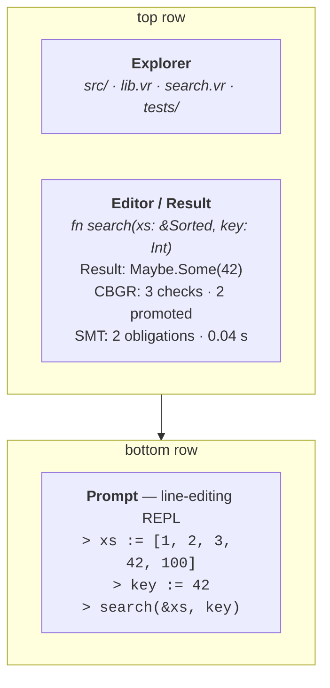

# Playbook TUI

`verum playbook` launches a terminal UI for interactive exploration
of a Verum project — a faster-feedback alternative to the
REPL + editor cycle.

Think of it as the IDE-on-the-terminal: everything you want to do to
a function (call it, test it, verify it, inspect its CBGR report,
profile it) one keystroke away.

## Launching

```bash
$ cd my-project
$ verum playbook
```

On first launch Playbook indexes the project, wires up an async
runtime, and starts an empty session in the project root's module.

## What it does

- **Discover** — auto-indexes functions, types, protocols in your
  project, plus their dependencies.
- **Invoke** — call functions interactively with typed argument
  prompts.
- **Inspect** — view results with pretty-printing for every stdlib
  type.
- **Profile** — measure execution time, allocations, SMT time per
  call.
- **Verify** — run `@verify(formal)` on the function at cursor; see
  obligations discharged live with per-obligation timing.
- **Replay** — re-run prior invocations with modified arguments.
- **Trace** — live-replay an invocation's VBC steps, seeing local
  values at each point.

## Layout



Three panels, always visible:

| Panel              | Role                                                                 |
|--------------------|----------------------------------------------------------------------|
| **Explorer**       | File tree on the left; select any file to view it.                   |
| **Editor / Result** | Top-right panel shows the current function's source and last result. |
| **Prompt**         | Bottom panel is a line-editing REPL.                                 |

## Navigation

| Key       | Action                                           |
|-----------|--------------------------------------------------|
| `Tab`     | Switch focus among explorer, editor, prompt.     |
| `Ctrl-P`  | Command palette.                                 |
| `Ctrl-F`  | Find function / type / protocol.                 |
| `Ctrl-R`  | Search command history.                          |
| `F5`      | Re-run current invocation.                       |
| `F7`      | Open function's source.                          |
| `F9`      | Toggle profiling panel.                          |
| `F10`     | Open CBGR tier report for this function.         |
| `F11`     | Open SMT trace for the latest verification.      |
| `Ctrl-C`  | Cancel running invocation.                       |
| `Ctrl-L`  | Clear prompt (no history loss).                  |
| `Esc`     | Leave search / dialog / modal.                   |

## Command palette

`Ctrl-P` opens a fuzzy-search menu. Common actions:

- **Run test module** — pick a file, execute every `@test` in it.
- **Verify selected function** — runs `@verify(formal)` on the
  cursor's function.
- **Explain refinement failure** — on a failed verification, open
  the counter-example explorer.
- **Open CBGR report** — show tier-analysis for the current function.
- **Toggle proof search trace** — stream tactic invocations live.
- **Export session as test** — turn the current invocation history
  into a `@test` file.
- **Profile current function** — benchmark with 10 000 warmup +
  100 000 iterations.
- **Switch runtime profile** — toggle between `debug`, `release`,
  `release-with-proofs`.

## The prompt language

The prompt accepts three forms:

### Bind a value

```
> xs := [1, 2, 3, 42, 100]
> key := 42
```

The name is declared in the session's scope. Types are inferred.

### Invoke a function

```
> search(&xs, key)
Result: Maybe.Some(3)
```

Arguments use ordinary Verum expressions — literals, name
references, or method chains.

### Evaluate an expression

```
> xs.len() + 1
6
```

Expressions that are not function calls evaluate and print.

## Session persistence

Playbook sessions are saved to `.verum/playbook/sessions/`. Each
session records every invocation, every bound value, and every
result.

To restore a session next time:

```bash
$ verum playbook --session last
$ verum playbook --session "2026-04-17-abc123"
```

### Export a session

```
> export session tests/playbook_session.vr
```

Generates a runnable test file from your exploration:

```verum
// tests/playbook_session.vr  (generated by verum playbook)
mount my_project.*;

@test
fn session_20260417_1423() {
    let xs = [1, 2, 3, 42, 100];
    let key = 42;
    assert_eq(search(&xs, key), Maybe.Some(3));
}
```

## Context bindings

Bind contexts interactively; they persist for the session:

```
> bind Database = postgres://localhost/dev
> bind Logger   = ConsoleLogger.new(LogLevel.Debug)
> bind Clock    = SystemClock.new()

> fetch_user(UserId(42))
User { id: 42, name: "Alice", email: "alice@example.com", ... }
```

The bindings propagate through every call. Call a function that
needs a different context and Playbook prompts you for it:

```
> send_email(UserId(42), "welcome")
? Email context not bound. Bind now?  (s)mtp  (m)ock  (f)ile  (n)one
> m
✓ bound Email = MockEmail.new()
Result: Result.Ok(())
```

## Verification in the TUI

Put the cursor on a function and press `F10`. The verification panel shows:

**Strategy:** `formal`

| Obligation                                                       | Time       | Solver  | Result |
|------------------------------------------------------------------|------------|---------|--------|
| `requires xs.is_sorted()`                                        | 18 ms      | Z3      | pass   |
| `ensures result.is_some() => xs[result.unwrap()] == key`         | 42 ms      | Z3      | pass   |
| `ensures result.is_none() => forall i in xs. xs[i] != key`       | 500 ms     | —       | **timeout** |

**Total:** 2 / 3 discharged, 1 timed out.

**Actions:**

| Key | Action                          |
|-----|---------------------------------|
| `a` | Explain failure (counter-example) |
| `r` | Retry with `thorough` strategy  |
| `e` | Edit the function in place      |

Press `a` for the counter-example, `r` to race more solvers, `e` to
edit the function without leaving Playbook.

## Integration with LSP

Playbook uses the same indexer as the LSP server — no duplicate
parsing. Changes to source files invalidate cached call results
automatically. Run `verum lsp` alongside Playbook in a second pane,
and your editor's inline diagnostics and Playbook's call results
stay in sync.

## Profiling

Press `F9` to toggle the profiling panel. Sample output for `search(&xs, key)`:

| Metric          | Value                                             |
|-----------------|---------------------------------------------------|
| wall time       | 18 ns  (2 000 000 iters, σ 1.1 ns)                |
| allocations     | 0                                                 |
| SMT time        | 0 (cached)                                        |
| CBGR checks     | 0  (all promoted)                                 |

**Most costly callees:**

| Function                    | Time    | Share |
|-----------------------------|---------|-------|
| `List.binary_search_by`    | 13 ns   | 72%   |
| `List.len`                 | 1 ns    | 6%    |

## Breakpoints and step-through

Playbook is not a full debugger, but it can step through VBC
execution for debugging:

```
> trace search(&xs, key)
step 1 / 27: call search(...)      locals: xs, key
step 2 / 27: let lo = 0            locals: xs, key, lo=0
step 3 / 27: let hi = xs.len()     locals: xs, key, lo=0, hi=5
...
```

Press space to advance, `b` to set a conditional breakpoint (e.g.
"when lo > 10").

## Command-line flags

```
verum playbook [options]
  --session NAME      Resume the named session.
  --no-verify         Skip verification on invocation (faster iteration).
  --profile PROFILE   Use a named build profile.
  --workspace PATH    Switch to a different workspace root.
  --bind K=V          Pre-bind a context before the TUI opens.
```

## See also

- **[REPL](/docs/tooling/repl)** — line-oriented interactive mode,
  without the TUI overhead.
- **[LSP](/docs/tooling/lsp)** — language server (same indexer).
- **[`stdlib/term`](/docs/stdlib/term)** — the 7-layer TUI framework
  Playbook uses.
- **[tutorials/cli-tool](/docs/tutorials/cli-tool)** — a program
  whose exploration benefits from Playbook.
