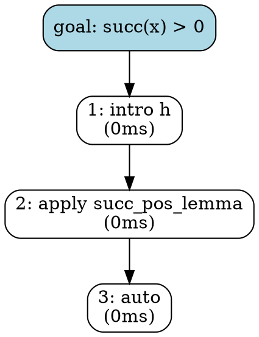

# `verum proof-repl` — Live proof REPL with stepwise feedback

`verum proof-repl` is a non-interactive batch driver for the
proof-REPL state machine.  Apply tactics, navigate with undo /
redo, request hints, and emit the resulting proof tree as
Graphviz DOT — all from the shell, with full kernel-grade
feedback on every step.

It's designed for three audiences:

- **Mathematicians** working out a proof step by step in a script
  file, replaying it deterministically.
- **IDE / TUI integrations** (the natural production consumer) that
  embed the same state machine and surface it as a pane.
- **CI scripts** that pin proof transcripts as regression tests.

## Mental model

A REPL session has three things:

1. A **theorem** (name + focused proposition) and a **lemma scope**
   the kernel checker uses to validate `apply NAME` steps.
2. A **history stack** of accepted tactics — every `apply` pushes
   on success.  `undo` pops the top to a redo stack; a fresh
   `apply` after `undo` clears the redo stack.
3. A **proof tree** — the directed acyclic graph of accepted
   steps, suitable for visualisation as Graphviz DOT.

Every command produces a typed response carrying the snapshot of
the new state plus the kernel verdict (Accepted / Rejected with
cause / NoOp / Hints / Tree).  Rejected steps **do not mutate the
state** — the LCF fail-closed contract carries through.

## Subcommand reference

```bash
verum proof-repl batch --theorem <T> --goal <G> [--lemma ...]
                       [--commands <FILE>] [--cmd <LINE>]…
                       [--format plain|json]

verum proof-repl tree  --theorem <T> --goal <G> [--lemma ...]
                       [--apply <STEP>]…
```

### `batch`

Run a sequence of REPL commands non-interactively.  Commands come
from a file (`--commands`) and / or repeated `--cmd` flags; the
two streams concatenate in CLI order (file first, then inline).

#### Command-script syntax

One command per line.  Blank lines and `#`-comments are skipped.

| Line | Command |
|---|---|
| `apply <tactic>` (or bare `<tactic>`) | Apply a tactic. |
| `undo` | Undo the last accepted step. |
| `redo` | Re-apply the most recently undone step. |
| `status` | Print the open-goal snapshot. |
| `show-goals` | Same as `status` (alias). |
| `show-context` | Same as `status` (hypotheses + lemmas in scope). |
| `visualise` (or `visualize`) | Render the current proof tree as DOT. |
| `hint` | Up to 5 ranked next-step suggestions. |
| `hint <N>` | Up to `N` suggestions. |
| `# anything` | Comment, skipped. |

Bare lines that don't match a keyword are treated as `apply
<line>` for ergonomics — `intro` and `apply intro` are equivalent.

#### Plain output

```bash
$ verum proof-repl batch \
    --theorem succ_pos \
    --goal "succ(x) > 0" \
    --lemma "succ_pos_lemma:::forall x. x > 0 -> succ(x) > 0" \
    --cmd "intro h" \
    --cmd "apply succ_pos_lemma" \
    --cmd "auto" \
    --cmd visualise
REPL transcript (4 command(s) executed):

  [  1] ✓ apply  intro h  (0ms)  history=1
  [  2] ✓ apply  apply succ_pos_lemma  (0ms)  history=2
  [  3] ✓ apply  auto  (0ms)  history=3
  [  4] visualise:
         digraph proof_tree { ... }

Summary:
  Accepted      3
  Tree          1

Final state:
  history_depth : 3
  redo_depth    : 0
  applied_steps : 3 step(s)
```

#### JSON output

The structured payload is suitable for IDE / CI consumption:

```json
{
  "schema_version": 1,
  "count": 4,
  "responses": [
    { "kind": "Accepted", "tactic": "intro h", "elapsed_ms": 0,
      "snapshot": { "theorem_name": "succ_pos", ... } },
    { "kind": "Accepted", "tactic": "apply succ_pos_lemma", ... },
    { "kind": "Accepted", "tactic": "auto", ... },
    { "kind": "Tree", "dot": "digraph proof_tree { ... }" }
  ],
  "summary": { "Accepted": 3, "Tree": 1 },
  "final_state": { "history_depth": 3, "redo_depth": 0, ... }
}
```

#### Exit code

`batch` exits non-zero on **any kernel rejection** — this is the
CI-friendly contract: a regression that breaks a previously-Accepted
transcript fails the build.

### `tree`

Apply a sequence of `--apply <STEP>` flags and emit the resulting
proof tree as Graphviz DOT.  Equivalent in spirit to `batch` with
all commands being `apply`, then a final `visualise`, but emits
just the DOT — no transcript, no summary.  Pipe to Graphviz:

```bash
verum proof-repl tree \
    --theorem succ_pos --goal "succ(x) > 0" \
    --lemma "succ_pos_lemma:::forall x. x > 0 -> succ(x) > 0" \
    --apply "intro h" \
    --apply "apply succ_pos_lemma" \
    --apply auto \
| dot -Tsvg -oproof.svg
```

Non-zero exit on any kernel rejection.

## Validation contract

| Rule | Error |
|---|---|
| `--theorem` empty | `--theorem must be non-empty` |
| `--goal` empty | `--goal must be non-empty` |
| `--format` not `plain`/`json` | `--format must be 'plain' or 'json'` |
| `--lemma` malformed (no `:::`) | `--lemma must be 'name:::signature[:::lineage]'` |
| Command-script syntax error | `line <N>: <error>` |
| Any kernel rejection during batch | non-zero exit, `REPL rejected '<tactic>': <reason>` |
| Any kernel rejection during tree | non-zero exit, `tree: kernel rejected '<tactic>': <reason>` |

## Lemma scope

The `--lemma name:::signature[:::lineage]` flag mirrors the
**[proof-drafting](/docs/tooling/proof-drafting)** surface: each
lemma in scope is recognised by the kernel checker as a valid
`apply NAME` target.  Lineage defaults to `repl`.

```bash
--lemma "succ_pos:::forall x. x > 0 -> succ(x) > 0:::core"
--lemma "add_comm:::∀ a b. a + b = b + a:::corpus"
```

## The proof-tree DOT format

Every accepted step becomes a node; edges chain successors:



Pipe to `dot -Tsvg` / `dot -Tpng` for visualisation; the rendered
graph can be embedded in the auto-paper output (see
**[Auto-paper generator](/docs/tooling/auto-paper)**).

## CI usage

Pin a proof transcript so a future change to the corpus surfaces
immediately:

```bash
# .github/workflows/proof-regression.yml
verum proof-repl batch \
    --theorem ring_add_comm \
    --goal "forall a b. a + b = b + a" \
    --commands proofs/ring_add_comm.repl
```

Any kernel-level regression or `apply` target rename produces a
non-zero exit, failing the build.  The `.repl` file is a
human-readable proof script — easy to diff, easy to review.

## Mental-model summary

- A REPL session walks the open-goal stack from the initial
  theorem to the empty stack, one `apply` at a time.
- Every command produces a typed response (Accepted / Rejected /
  Undone / Redone / NoOp / Hints / Tree / Status / Error).
- The history stack (with redo support) makes interactive
  exploration cheap: undo a wrong step, try a different one.
- The proof tree records every accepted step for visualisation +
  documentation.
- `batch` is the non-interactive driver; interactive TUI is a
  separate consumer of the same state machine.

## Cross-references

- **[Tactic catalogue](/docs/tooling/tactic-catalogue)** — the
  combinator surface every tactic must respect.
- **[Proof drafting](/docs/tooling/proof-drafting)** — when stuck
  on a goal, the REPL's `hint` command consumes the same
  suggestion engine.
- **[Proof repair](/docs/tooling/proof-repair)** — when a step
  fails, the repair engine produces ranked structured fixes.
- **[LLM tactic protocol](/docs/tooling/llm-tactic)** — the
  LCF-style fail-closed loop that lets LLMs propose tactics; the
  REPL kernel checker is the same surface.
- **[Auto-paper generator](/docs/tooling/auto-paper)** — every
  rendered theorem can embed its proof tree (DOT) for the paper
  draft.
