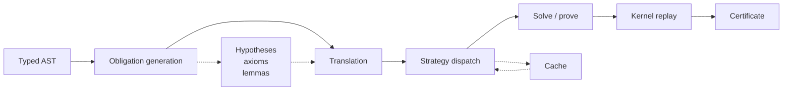

# Verification in Verum

> Verum is a verification-first language. Every piece of machinery the
> compiler exposes — types, contracts, refinements, proofs,
> univalence — collapses onto the same pipeline: *turn human intent
> into a proof obligation, discharge the obligation, register the
> witness in the trusted kernel.*

This page is the **deep architectural entry point**. It explains *what
problem verification solves in Verum*, *how the compiler encodes that
problem*, and *where each feature lives in the pipeline*. The
subsections that follow it are each a close-up of one layer; read
this page first, then navigate into the layer you need.

:::note Who should read this page
Anyone designing proofs, extending the solver, writing a framework
axiom, or auditing the trusted computing base. If you only want to
add a `requires`/`ensures` clause and move on, start at
[Contracts](./contracts.md) instead.
:::

---

## 1. The core thesis

Most languages treat verification as a *tool grafted onto a runtime
semantics*: write code, then bolt a Hoare-logic frontend, a contract
library, or a liquid-types checker on top. Verum inverts that
relationship — **the runtime semantics and the verification semantics
are one artefact**, derived from the same typed AST and ending in the
same kernel term. Consequently:

- A refinement annotation like `Int { self > 0 }` is not syntactic
  sugar for a runtime assertion — it is a **dependent typing
  judgement** that SMT translates into a proof obligation, and that
  the kernel records as an axiom witness once discharged.
- A `theorem` declaration is not a second-class "spec document" — it
  is a **first-class compilation unit** with parameters, imports,
  generics, proof body, and machine-checkable certificate.
- The `?` operator, the `throws` clause, and the `@logic` attribute
  are not runtime features with a verification extension; they are
  **verification primitives with a runtime implementation** chosen by
  the compiler per-obligation.

The payoff: *you never choose between expressive code and provable
code.* You write ordinary Verum and decide, per function or per
module, how much of it you want verified.

---

## 2. The two-layer dispatch model

Every proof obligation flows through **two independent layers**. The
first picks *what kind of guarantee you want*; the second picks
*which engine delivers it*. Confusing these layers is the single most
common source of misdirected bug reports — most "my proof is slow"
or "my proof doesn't run" issues are mismatches between intent and
engine.

### Layer 1 — `VerificationLevel`

Three-valued enum defined in `verum_verification::level`:

| Level      | Intent                                                 | Pipeline effect                                                                |
|------------|--------------------------------------------------------|--------------------------------------------------------------------------------|
| `Runtime`  | Check on execution; no proof required.                 | Compile refinement checks into bytecode guards. No SMT invocation.             |
| `Static`   | Prove at compile time; fail build if the proof fails.  | Invoke SMT; report failures through the diagnostic pipeline.                   |
| `Proof`    | Prove at compile time AND emit a certificate.          | Invoke SMT, replay through the trusted kernel, write the certificate to disk.  |

Level selection is per-declaration, per-file, or per-project. The
compiler defaults to `Static` for code with refinements and
`Runtime` otherwise; overrides live in `verum.toml` (project),
`#[verify(level = …)]` (declaration), or `--mode` (CLI).

### Layer 2 — `VerifyStrategy`

Seven-valued enum defined in `verum_smt::verify_strategy`:

| Strategy     | Operational meaning                                                                     |
|--------------|------------------------------------------------------------------------------------------|
| `Runtime`    | Skip the solver entirely; compile to an assertion.                                       |
| `Static`     | Single solver call; fastest. Used for simple LIA / bitvector obligations.                |
| `Formal`     | Single solver with rich tactics; default for anything non-trivial.                       |
| `Fast`       | Low timeout (3s default). Use for CI checkpoints.                                        |
| `Thorough`   | Long timeout (300s), portfolio race, full reflection unfolding.                          |
| `Certified`  | Portfolio + cross-validation + kernel replay; the most expensive strategy.               |
| `Synthesize` | Treat the ensures as a specification; synthesize the body via SyGuS.                     |

A single `VerificationLevel` admits many `VerifyStrategy` choices.
`Proof`-level verification requires `Formal`, `Thorough`, or
`Certified`. `Static` level admits all except `Runtime`.

### Valid combinations

```text
Level \ Strategy  Runtime  Static  Formal  Fast  Thorough  Certified  Synthesize
Runtime              OK       –       –      –       –          –           –
Static                –       OK      OK     OK      OK         –           OK
Proof                 –       –       OK     –       OK         OK          OK
```

`Certified` implies `Proof` (kernel replay is mandatory). `Runtime`
level cannot escalate to compile-time strategies; you must change the
level first. The compiler rejects invalid combinations at config
parse time, never silently at solve time.

---

## 3. The verification pipeline, end-to-end

Every obligation — whether from a refinement type, a `requires`
clause, an `ensures` clause, a loop invariant, or a `theorem` body —
travels the same five-stage pipeline:



### 3.1 Obligation generation

The typed AST pass in `verum_types` emits **IR-level proof
obligations** as it checks each declaration. Sources:

- **Refinement types.** Every `Int { p }`, `List<T> { p }`, or named
  refinement alias lowers to an obligation at each binding site:
  `p` must hold for every input, every assignment, and at every
  return.
- **Function contracts.** `requires p` becomes a hypothesis at the
  body entry; `ensures q` becomes the goal at body exit. Quantified
  clauses (`forall i in 0..len(xs)`) expand into a universally
  quantified formula.
- **Loop specifications.** `invariant p` must hold at every entry and
  exit of the loop body; `decreases m` must shrink on each
  iteration (a well-foundedness check).
- **Theorem declarations.** `theorem name(params) requires/ensures
  { proof }` compiles to a single obligation whose goal is the
  stated proposition and whose hypotheses are the `requires` clauses
  plus any `have` steps from the proof body.
- **Algebraic data type encoding.** Nullary and variant types emit
  structural axioms (disjointness, exhaustiveness) — see
  [ADT encoding](./adt-encoding.md).

Each obligation carries its **source span**, **provenance**
(`RefinementCheck | EnsuresClause | RequiresClause | Subgoal | Frame`),
and **hypothesis context** into the next stage. No obligation is
ever emitted without a real span — diagnostics always point at
something the user wrote.

### 3.2 Translation

The `verum_smt::translate` module turns an IR obligation into an
SMT-LIB formula. Key responsibilities:

- **Theory selection.** Int / Real / Bool / Bitvector / Array / String
  / Sequence — each term picks its native SMT sort.
- **Uninterpreted symbols.** User-defined functions without a
  `@logic` attribute become uninterpreted function symbols; their
  arguments' shapes are preserved but their bodies are hidden from
  the solver.
- **Refinement reflection.** Functions annotated `@logic` are
  unfolded into axioms that constrain the uninterpreted symbol;
  solvers can then reason about their behaviour. See
  [Refinement reflection](./refinement-reflection.md).
- **Variant encoding.** ADTs use the disjointness/exhaustiveness
  scheme described in [ADT encoding](./adt-encoding.md). The
  translator maintains a registry of variant tags per type so that
  patterns like `x is Cons(_, _)` become sound axioms.
- **Quantifier trigger selection.** `forall` / `exists` clauses get
  triggers chosen by matching term shapes; manual triggers via
  `@trigger(pattern)` are respected.
- **Pending-axiom channel.** Length additivity for concat, identity
  for empty collections, array read-through (`arr.update(i, v).at(i)
  == v`), and similar generic algebraic laws are emitted lazily only
  when the obligation references them.

### 3.3 Strategy dispatch

The capability router in `verum_smt::capability_router` classifies
the SMT formula by **which theories and quantifier patterns it
touches**, then consults the `VerifyStrategy` to choose a backend:

```text
Classification        → Preferred backend    → Fallback
--------------------    --------------------   --------------
LIA-only                the SMT backend
Nonlinear arith         the SMT backend (NLA tactic)       the SMT backend (farkas)
Strings                 the SMT backend (seq theory)
FMF/quantifiers         the SMT backend (fmf_enum)       the SMT backend (mbqi)
Arrays only             the SMT backend
Bitvector-heavy         the SMT backend                    (no symmetric BV on the SMT backend)
Nonlinear + quantifier  the SMT backend (portfolio)      the SMT backend (rlimit pass)
```

See [SMT routing](./smt-routing.md) for the full table. The router
is **transparent to the user** — you request a strategy, not a
solver. Changing the backend set (e.g., when the in-house Verum SMT
lands) doesn't require a single user-code change.

### 3.4 Solve / prove

Each strategy translates to a concrete solver invocation:

- `Static` / `Formal`: single `(check-sat)` call with a timeout.
- `Thorough`: a **portfolio race** — multiple SMT backends launched in
  parallel, first to return `unsat` wins; on disagreement the result
  is logged as `Split` and escalated.
- `Certified`: portfolio + proof-term extraction from the winning
  backend + kernel replay + certificate write.
- `Synthesize`: SyGuS-style function synthesis from the `ensures`
  clause; returns a candidate body + a certificate of its
  correctness.

Every call writes telemetry (theory taxonomy, backend, outcome,
time) to the session statistics cache; see `verum smt-stats`.

### 3.5 Kernel replay

Successful SMT proofs do not immediately become accepted theorems.
They enter the **trusted kernel** (`verum_kernel`) as an
`SmtCertificate` — a serialisable structure carrying the backend
name, an obligation hash, and a trace of rule tags. The kernel:

1. Verifies the certificate's backend is on an allow-list.
2. Reads the first rule tag (`0x01 refl`, `0x02 asserted`,
   `0x03 smt_unsat`, …) and constructs a `CoreTerm::Axiom` witness
   tagged with `framework = "backend:rule_name"`.
3. Records the obligation hash as citation metadata.
4. Returns the witness; the caller compares its hash to the
   obligation's expected hash before admitting the theorem.

The kernel is the **single trusted component** — ~2 000 LOC of
Rust, auditable, with zero calls back into user code. Everything
else — the SMT backends, the translator, the tactic engine,
framework-axiom registries — sits outside the kernel's trust
boundary. A lying solver cannot forge a theorem because the
certificate's trace must correspond to the obligation hash that the
compiler computed independently.

See [Trusted kernel](./trusted-kernel.md) for the full rule list
and certificate format.

---

## 4. Where each feature lives in the stack

```mermaid
flowchart TB
    User[User code<br/>contracts + proofs] --> Types[verum_types<br/>obligation emission]
    Types --> Translate[verum_smt::translate<br/>IR → SMT-LIB]
    Translate --> Router[capability_router<br/>theory taxonomy]
    Router --> the SMT backend[the SMT backend]
    Router --> the SMT backend[the SMT backend]
    Router --> Portfolio[portfolio race]
    the SMT backend --> Certificate[SmtCertificate]
    the SMT backend --> Certificate
    Portfolio --> Certificate
    Certificate --> Kernel[verum_kernel<br/>trusted LCF]
    Kernel --> Axiom[CoreTerm::Axiom]
    Axiom --> Module[module export]

    TacticDSL[tactic DSL<br/>verum_smt::proof_search] --> Certificate
    Logic[@logic functions<br/>refinement reflection] --> Translate
    Framework[framework_axioms<br/>stratified TCB] --> Kernel
    Cubical[cubical/HoTT<br/>univalence/paths] --> Kernel
```

- **Refinement types & `@logic`** → encoded as axioms in the
  translator; invisible to the kernel (they constrain uninterpreted
  symbols, not core terms).
- **`theorem`/`lemma` declarations** → obligations with real kernel
  terms; the tactic DSL produces `CoreTerm` values that the kernel
  checks directly.
- **`@framework(id, "citation")`** → the axiom has a framework tag;
  `verum audit --framework-axioms` enumerates the entire
  stratified TCB.
- **Cubical / HoTT** → additional kernel rules (`Refl`, `HComp`,
  `Transp`, `Glue`, `PathTy`) that the kernel accepts natively;
  erased during codegen.
- **SMT certificates** → trust-tagged; replay reconstructs a
  `CoreTerm::Axiom` with the backend+rule as framework tag.

---

## 5. Kinds of obligation, kinds of proof

Not every guarantee looks the same. Verum supports **four distinct
obligation families**, each with its own natural proof technique:

### 5.1 First-order propositional

`n > 0 && n < 100`, `xs.len() > 0`, `!(a && !a)`. Pure Boolean /
LIA / arithmetic. Every solver handles it; usually sub-millisecond.

### 5.2 Refinement + reflection

`safe_index(xs, i) requires i < len(xs)`. The predicate references
user functions (e.g., `len`). If the function is `@logic`, the
solver reasons symbolically; otherwise it becomes an opaque UF.

### 5.3 Inductive / structural

`length(append(xs, ys)) == length(xs) + length(ys)`. Needs
induction over `xs`. Verum offers three mechanisms:
- `proof by induction(xs)` — the tactic generates cases and base.
- Quantifier axioms via `@logic` unfolding — works for simple
  recursive laws when the solver's quantifier handling cooperates.
- Manual structured proof (`have` chain + `ind` tactic) for cases
  the solver can't close directly.

### 5.4 Equational / cubical

`transport(ua(e), x) == e.forward(x)`, `Path<A>(a, a) = a = a`. HoTT
paths, univalence, Glue types. Not discharged by SMT; the kernel
has native rules (`Refl`, `HComp`, `Transp`, `Glue`). See
[Cubical & HoTT](./cubical-hott.md).

### 5.5 Framework-axiom conditional

`Arnold stability proof depends on Lurie higher-topos foundations`.
The axiom is not checked — it is **explicitly trusted** with a
citation. `verum audit` lists every framework axiom in the
dependency cone, so the trust boundary is enumerable and
auditable.

---

## 6. The tactic DSL

A `proof { … }` block is a small program that produces a kernel term
incrementally. The grammar recognises 22 built-in tactic forms
(full reference in [Proofs](./proofs.md)):

**Decision procedures**: `auto`, `smt`, `omega`, `ring`, `field`,
`simp`, `blast`, `decide`.

**Structural**: `assumption`, `intro`, `split`, `left`, `right`,
`exists`, `witness`, `case`, `induction`.

**Cubical / HoTT**: `refl`, `transport`, `path`, `glue`, `hcomp`.

**Combinators**: `try`, `first`, `repeat`, `then`, `all`, `fail`,
`orelse`, `;`, `|`.

**Scaffolding**: `have`, `show`, `suffices`, `let`, `obtain`,
`calc`, `using`, `apply`, `rewrite`.

**Escape hatches**: `admit` (assume goal, marked in certificate),
`sorry` (assume goal, fails `--strict-admits`).

The tactic DSL is itself verifiable — tactics written with `@tactic
meta fn` are stage-1 meta-programs that quote goal structure and
emit `CoreTerm` values. See [Tactic DSL](./tactic-dsl.md) for
authoring custom tactics.

---

## 7. Framework-axiom stratification

Real-world theorems depend on external mathematical frameworks: a
quantum field theory proof rests on measure theory; a statistical
proof rests on Kolmogorov's axioms; a category theory result may
cite Lurie's HTT. Verum makes this dependency **explicit and
enumerable**:

```verum
@framework("baez_dolan", "Higher-Dimensional Algebra: An Octonionic
Hopf Algebra, §4.2")
public axiom baez_dolan_3brane_mass_unit(...): ...;
```

Running `verum audit --framework-axioms` lists every framework
axiom reachable from a module's public API, with citations. The
`--format json` output is machine-parseable for CI enforcement
(e.g., "PR is forbidden if it adds a new framework dependency").

Eleven framework families ship with the stdlib (71 axioms total):
`lurie_htt`, `schreiber_dcct`, `connes_reconstruction`,
`petz_classification`, `arnold_catastrophe`, `baez_dolan`,
`diakrisis`, `diakrisis_acts`, `diakrisis_biadjunction`,
`diakrisis_extensions`, `diakrisis_stack_model`. See
[Framework axioms](./framework-axioms.md) for the full inventory
and for authoring new ones.

---

## 8. Gradual migration strategy

A realistic project does not start fully verified. Verum's
gradient lets you climb:

1. **Prototype** — no annotations. Everything is `Runtime`-level;
   `check` and `run` work with zero SMT calls.
2. **Add refinements** — `Int { > 0 }` on a key parameter.
   Default escalates to `Static` level with `Formal` strategy;
   failing proofs surface as build errors. Sampling via
   `#[verify(level = Runtime)]` lets you defer individual failures.
3. **Add contracts** — `requires` / `ensures` on function
   signatures. Proof obligations expand; you may need `@logic` on
   a helper. Reflection is cheap.
4. **Write theorems** — `theorem sort_is_stable { proof by … }`.
   Now you're writing proofs, not just annotations.
5. **Certify** — `#[verify(strategy = Certified)]` on the
   theorems that matter most. Certificates land in
   `target/proofs/` and survive in CI artifact storage.
6. **Export** — `verum export-proofs --to lean` for
   cross-tooling verification.

See [CLI workflow](./cli-workflow.md) for the complete command
set; see [Proof corpora](./proof-corpora.md) for how
large-scale corpora are structured on Verum.

---

## 9. What verification does NOT do

Honesty is part of the design. The compiler **does not**:

- **Eliminate every bug.** Verification proves the *properties you
  write down.* Correctness of the specification itself is outside
  the system.
- **Eliminate the solver from the TCB by default.** `Formal` and
  `Thorough` strategies trust the SMT result. Only `Certified`
  strategy replays through the kernel. Choose accordingly.
- **Handle unbounded concurrent non-determinism.** Async reasoning
  is sequential (happens-before + well-founded
  scheduling); arbitrary preemption is not a first-class
  verification target. Use `@lock_ordering` to prove deadlock
  freedom for specific structures.
- **Replace testing.** Proofs cover the abstract machine; testing
  covers the concrete one (float precision, OS quirks, ABI
  edges). Run both.
- **Replace review.** A `@framework` axiom is as trustworthy as
  its citation. If the citation is wrong, the proof is vacuous.
  Framework axioms must be reviewed by the maintainer.

---

## 10. Reading sequence

If you're new to Verum verification and want the full picture,
read the subsections in this order:

1. [Contracts](./contracts.md) — the annotation language.
2. [Refinement reflection](./refinement-reflection.md) — how
   refinement types extend with user-defined logic.
3. [ADT encoding](./adt-encoding.md) — how sum types are axiomatised.
4. [SMT routing](./smt-routing.md) — how obligations reach a
   solver.
5. [Solver tuning](./solver-tuning.md) — every config knob
   the solver subsystem exposes, with copy-paste recipes for
   common workflows (latency-sensitive, CI, debugging,
   research).
6. [Proofs](./proofs.md) — the tactic DSL.
6. [Tactic DSL](./tactic-dsl.md) — authoring custom tactics.
7. [Trusted kernel](./trusted-kernel.md) — the LCF core.
8. [Counterexamples](./counterexamples.md) — what the solver
   returns when proof fails.
9. [Proof export](./proof-export.md) — envelope format,
   cross-tool import.
10. [Cubical & HoTT](./cubical-hott.md) — equational reasoning
    beyond SMT.
11. [Framework axioms](./framework-axioms.md) — stratified trust.
12. [Gradual verification](./gradual-verification.md) — the
    strategy spectrum (full reference).
13. [CLI workflow](./cli-workflow.md) — end-to-end command use.
14. [Proof corpora](./proof-corpora.md) — how large-scale
    proof corpora are structured on Verum.
15. [Proof-honesty audit](./proof-honesty.md) — `verum audit
    --proof-honesty` walker, classification semantics,
    `audit-reports/proof-honesty.json` schema, and the
    `core.math.*` carrier-protocol surface (DiakrisisPrimitive,
    DualLAbsCandidate, OpenQuestion, StrictInclusionWitness, ...).
16. [Coord-consistency + framework-soundness audits](./coord-consistency-audit.md)
    — `verum audit --coord-consistency` (M4.B; supremum-of-cited-coords
    gate) and `verum audit --framework-soundness` (M4.A; corpus-side
    K-FwAx classifier). CI gates closing the kernel-time vs audit-time
    soundness-gap.
17. [Operational coherence (VVA-6 stdlib preview)](./coherence.md) —
    `core/verify/coherence.vr` (M4.E): `CoherenceCert` carrier
    protocol + 3-way `CoherenceVerdict` sum + concrete
    `IdentityCoherenceCert` instance. The 12-variant
    `VerificationLevel` enum extension covering `coherent_static` /
    `coherent_runtime` / `coherent` strategies (ν = ω·2+3 / ω·2+4 / ω·2+5).

If you only have ten minutes, read
[Gradual verification](./gradual-verification.md) and
[Trusted kernel](./trusted-kernel.md). They together cover 80% of
the design.

---

## 11. The multi-kernel discipline

A *single* trusted kernel is the standard architecture for
proof assistants — Coq, Lean, HOL Light, Isabelle all run one.
Verum's discipline is structurally different: **three
independent kernel implementations** check every certificate,
with a differential-testing layer that fails the audit the
moment any pair disagrees.

The three kernels:

- **Trusted-base kernel** (`verum_kernel::proof_checker`) — an
  LCF-style implementation performing direct rule-matching with
  explicit substitution. Targets a small enough footprint to be
  read end-to-end.
- **NbE kernel** (`verum_kernel::proof_checker_nbe`) —
  normalisation-by-evaluation; compiles terms into a semantic
  `Value` representation and checks via β-reduction in the value
  world. Independent algorithmic specification; shares no code
  with the trusted base beyond the syntax-tree definitions.
- **kernel_v0 manifest verifier**
  (`verum_kernel::kernel_registry::KernelV0Kernel`) — a
  manifest-driven bootstrap kernel that anchors structural
  type-check, manifest audit-cleanness, the meta-soundness
  footprint, and per-rule strict-intrinsic dispatch. Orthogonal
  to the term-level algorithms above.

Differential testing across **three layers**:
- `verum audit --differential-kernel` runs the canonical 24-cert
  battery (`verum_kernel::canonical_battery`) through all three
  kernels and asserts unanimous agreement.
- `verum audit --differential-kernel-fuzz` chains 1–3 mutations
  per iteration (from an 11-variant grammar) over a 16-seed
  roster, auto-shrinks any disagreement to a minimal failing
  case, and surfaces per-mutation / per-seed / chain-length
  coverage instrumentation.
- `verum audit --differential-lean-checker` runs the same
  canonical battery through the Rust kernel and a Lean
  ReferenceChecker exe; cross-language verdict-by-verdict
  agreement asserted.

A single disagreement at any layer fails the audit. A *synthetic
always-accept kernel* registered alongside the real three acts as
a liveness pin: the audit's invariant requires it to *disagree*
on rejected certificates, ensuring the differential check is
non-vacuous.

Verum is the first production proof assistant to ship multiple
algorithmic kernels with continuous differential testing. See
[Three-kernel architecture](./two-kernel-architecture.md) for
the full mechanics.

---

## 12. Beyond the kernel — meta-soundness layers

The trusted-base + NbE + kernel_v0 trio is the L0/L1 floor.
Verum stacks three additional layers atop the kernels:

- **[Reflection tower](./reflection-tower.md)** —
  MSFS-grounded meta-soundness in four canonical stages
  (Base / Stable / Bounded / AbsoluteEmpty). MSFS
  Theorem 9.6 collapses the iterated levels (`k ≥ 1` realises
  the same theory); MSFS Theorem 8.2 bounds the tower's
  consistency-strength to one extra inaccessible; MSFS Theorem
  5.1 (AFN-T α) seals the absolute boundary as empty.
- **[Separation logic](./separation-logic.md)** — heap-aware
  spatial reasoning. Kernel-side `HeapPredicate` (6 arms) +
  Verum-side `SepAssertion` (13 arms) + a kernel↔verifier
  bridge with `BridgeFidelity` classification (`Faithful` vs
  `Approximating`).
- **Codegen attestation** — per-pass kernel-discharge status
  for the 6 codegen passes (VBC lowering, SSA construction,
  register allocation, linear-scan, LLVM emission, machine-code
  emission). `verum audit --codegen-attestation` reports
  `Discharged` / `AdmittedWithIou` / `NotYetAttested` per pass.
- **kernel_v0 self-hosted bootstrap** — a Verum-side
  description of every kernel rule under
  `core/verify/kernel_v0/`, with `verum audit --kernel-v0-roster`
  enforcing manifest↔filesystem agreement. The future
  three-way differential kernel will register the self-hosted
  Verum kernel as a third slot.

---

## 13. The full audit gate catalog

Every claim Verum makes is mechanically observable. As of the
current revision, `verum audit` exposes **~49 gates** organised
into eight bands. The `--bundle` aggregator combines them into a
single L4 load-bearing verdict.

**Kernel-soundness band** (12 gates): `--kernel-rules` ·
`--kernel-recheck` · `--kernel-soundness` ·
`--external-prover-replay` · `--differential-lean-checker` ·
`--kernel-v0-roster` · `--kernel-intrinsics` ·
`--kernel-discharged-axioms` · `--differential-kernel` ·
`--differential-kernel-fuzz` · `--reflection-tower` ·
`--codegen-attestation`.

**ATS-V band** (6 gates): `--arch-discharges` · `--arch-coverage` ·
`--arch-corpus` · `--counterfactual` · `--adjunctions` ·
`--yoneda`.

**Framework + citation band** (10 gates): `--framework-axioms` ·
`--framework-conflicts` · `--framework-soundness` ·
`--foundation-profiles` · `--accessibility` · `--soundness-iou` ·
`--dependent-theorems &lt;axiom&gt;` · `--apply-graph` ·
`--bridge-discharge` · `--bridge-admits`.

**Hygiene + coherence band** (8 gates): `--hygiene` ·
`--hygiene-strict` · `--coord` · `--coord-consistency` ·
`--no-coord` · `--coherent` · `--epsilon` · `--proof-honesty`.

**Cross-format + export band** (3 gates): `--round-trip` ·
`--cross-format` · `--owl2-classify`.

**Roadmap + coverage band** (6 gates): `--htt-roadmap` ·
`--ar-roadmap` · `--manifest-coverage` · `--mls-coverage` ·
`--verify-ladder` · `--ladder-monotonicity`.

**Tooling band** (3 gates): `--proof-term-library` ·
`--signatures` · `--docker`.

**Aggregator** (1 gate): `--bundle` — runs every gate above and
emits a single L4 load-bearing verdict.

See [Soundness gates](./soundness-gates.md) for the
predicate-level formalisation and
[ATS-V → audit protocol](../architecture-types/audit-protocol.md)
for the band-by-band detail and JSON schemas.

---

## Feature inventory

Every feature described across this verification section is
part of the shipping release:

**Verification core**

- **Two-layer dispatch** — `VerificationLevel` × `VerifyStrategy`
  with machine-checked policy table (`evaluate_attempt`). Nine
  strategies in the gradual ladder.
- **Refinement types + `@logic` reflection** — user functions
  lifted into solver axioms with unfold-budget knobs.
- **ADT encoding** — the SMT backend datatypes per variant with cached sort
  reuse.
- **Cubical / HoTT primitives** — `PathTy`, `HComp`, `Transp`,
  `Glue` as first-class kernel rules with subterm validation.
- **Tactic DSL** — block-form combinators, Quote/Unquote/GoalIntro
  meta-programming, cog-level tactic-package registry (Project
  &gt; ImportedCog &gt; Stdlib shadowing), 56-tactic stdlib across
  7 files.
- **Counterexample lifecycle** — extract → syntactic
  minimization (pure, always-on) → semantic minimization
  (delta-debugging, Thorough/Certified) → fix suggestions.
- **Trigger diagnostics** — W502 / W503 / W504 structural
  validation of every quantifier trigger.

**Trust boundary**

- **Trusted-base kernel** — LCF-style core with allowlist-gated
  SMT proof-tree replay (28 the SMT backend rules + 29 ALETHE rules),
  hierarchical composition via `CoreTerm::App`, UIP rejection
  for univalence preservation. Targeting &lt; 5 KLOC.
- **NbE kernel** — independent normalisation-by-evaluation
  implementation; differentially tested against the trusted base.
- **Reflection tower (MSFS-grounded)** — four-stage
  meta-soundness verification with MSFS Theorems 9.6 / 8.2 /
  5.1 as cited discharges.
- **Separation logic** — heap-aware spatial reasoning;
  6-arm kernel `HeapPredicate` + 13-arm Verum-side
  `SepAssertion` + audited bridge.
- **Codegen attestation** — per-pass kernel-discharge tracking
  across 6 codegen passes.
- **kernel_v0 self-hosted bootstrap** — Verum-side rule
  description with manifest audit.

**Outputs**

- **Proof export** — Lean / Coq / Dedukti / Metamath / Isabelle
  targets with cross-tool re-check CI matrix.
- **Program extraction** — Curry-Howard lifting of constructive
  proofs into runnable code (Verum / OCaml / Lean / Coq) via
  `@extract` / `@extract_witness` / `@extract_contract` plus the
  `realize="&lt;fn&gt;"` directive for native-binding wrappers.

**Observability**

- **Obligation-level profiling** — `--profile-obligation`
  breakdown with per-obligation timings.
- **Solver diagnostic side channels** — `--dump-smt` /
  `--solver-protocol` / `--lsp-mode` threaded through both multiple SMT backends backends.
- **`core.verify` stdlib** — user-facing surface mirroring the
  compiler's `VerificationLevel` / `ProofAttempt` /
  `VerificationOutcome` / certificate-envelope types.
- **SmtCertificate envelope v1** — `schema_version` gate,
  `verum_version` + `created_at` + free-form `metadata`,
  machine-checked schema validation on replay.
- **16-gate audit catalog** — every claim mechanically
  enumerable; bundle aggregator produces L4 load-bearing
  verdict.

## See also

- [Architecture → trusted kernel](../architecture/trusted-kernel.md)
  (hardware/ABI perspective on the same kernel)
- [Architecture → SMT integration](../architecture/smt-integration.md)
  (integration points for replacing backends)
- [Language → refinement types](../language/refinement-types.md)
  (surface syntax)
- [Tooling → CLI](../tooling/cli.md) (`verum verify`, `verum audit`,
  `verum smt-stats`, `verum smt-info`)
