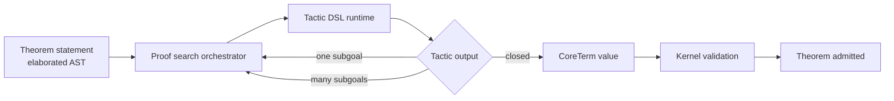

# Tactic DSL

> A tactic is a small program that takes a proof goal and produces
> a kernel term — or zero or more smaller goals. Verum's tactic
> DSL is first-class and reflective: tactics are written in
> Verum itself (as `@tactic meta fn`), they see goals as
> introspectable data, and they emit `CoreTerm` values that the
> kernel validates.

The built-in tactics described in [Proofs](./proofs.md) are just
the kernel of the DSL; anything a user can write, the stdlib can
write. This page is for authors of custom tactics — library
developers, framework integrators, and anyone who needs a proof
pattern that isn't in the standard set.

:::note
The tactic DSL is composable at multiple granularities:
surface tactic expressions (`auto; simp`), `@tactic`
declarations for reusable named tactics, and `@tactic meta
fn` for meta-programmed tactics that inspect and manipulate
the goal shape. Quote/unquote roundtrip is structurally
enforced for propositional and first-order terms; richer
quotation for dependent (Π/Σ/Path) terms is the natural
extension.
:::

---

## 1. The execution model

A tactic runs in **stage 1** — meta-programming stage. It
executes during the proof-search phase of `verum verify`, after
the typechecker has elaborated the theorem's statement and
before the kernel validates the proof term.



The tactic runtime supplies each tactic with:

- **Goal.** The current proof obligation: a `Proposition` plus a
  list of `Hypothesis` assumptions.
- **Context.** Scope information — type parameters in scope,
  reflected `@logic` functions available, framework axioms
  enumerable.
- **Cache.** A memo table for previously-proved subgoals (scoped
  to this proof search).

The tactic returns one of four outcomes:

| Outcome       | Semantics                                                      |
|---------------|----------------------------------------------------------------|
| `Closed(ct)`  | The tactic found a proof. `ct` is a `CoreTerm` that the kernel validates. |
| `Subgoals(g)` | The tactic decomposed the goal into zero or more subgoals.     |
| `Unknown`     | The tactic doesn't apply to this goal. Try the next one.       |
| `Failed(r)`   | The tactic applies but cannot proceed. `r` is a diagnostic.    |

---

## 2. Writing a tactic

```verum
@tactic
meta fn my_tactic(goal: &Goal) -> TacticResult {
    // introspect; emit Subgoals or Closed
}
```

`meta fn` marks the function as a stage-1 meta-program. `@tactic`
registers it with the proof-search orchestrator so it becomes
addressable by name in `proof by my_tactic`.

### 2.1 Goal introspection

A `Goal` has three accessors:

```verum
public type Goal is {
    prop: Proposition,
    hyps: List<Hypothesis>,
    scope: ScopeInfo,
};

public type Hypothesis is {
    name: Text,
    ty:   Proposition,
    src:  HypSource,  // UserRequires | Theorem(lemma_name) | Synthesized
};
```

`Proposition` is a discriminated view over `CoreTerm`:

```verum
public type Proposition is
    | Eq(Proposition, Proposition)         // propositional equality
    | And(List<Proposition>)
    | Or(List<Proposition>)
    | Imp(Proposition, Proposition)
    | ForAll(Text, Ty, Proposition)
    | Exists(Text, Ty, Proposition)
    | Atomic(CoreTerm);                    // escape hatch
```

`@quote` lifts a Verum expression into a `CoreTerm`:

```verum
@tactic
meta fn refl_if_identical(goal: &Goal) -> TacticResult {
    match goal.prop {
        Eq(lhs, rhs) if prop_eq(lhs, rhs) => {
            TacticResult.Closed(@quote(refl(?{goal.ty})))
        }
        _ => TacticResult.Unknown
    }
}
```

`@quote(expr)` builds a `CoreTerm` that stands for `expr` with
`?{…}` interpolations substituted. `prop_eq` is a stdlib helper
for structural equality on Propositions.

### 2.2 Subgoal emission

Structural tactics decompose the goal:

```verum
@tactic
meta fn split_conjunction(goal: &Goal) -> TacticResult {
    match goal.prop {
        And(conjuncts) => {
            let subgoals = conjuncts.iter().map(|p| Goal {
                prop: p.clone(),
                hyps: goal.hyps.clone(),
                scope: goal.scope.clone(),
            }).collect();
            TacticResult.Subgoals(subgoals)
        }
        _ => TacticResult.Unknown
    }
}
```

The subgoal list is consumed by the orchestrator; each subgoal is
then proved by the remaining tactic script.

### 2.3 Composition

Tactics compose via combinators:

```verum
// Try each tactic in turn; first success wins.
proof by first(refl_if_identical, split_conjunction, smt)

// Apply first, then apply second to each resulting subgoal.
proof by split_conjunction; auto

// Apply until no further progress.
proof by repeat(split_conjunction)

// Apply at most N times.
proof by repeat(n: 5, simp)
```

Combinators are themselves tactics. The built-in set
(see [Proofs](./proofs.md) §"Combinators") can be extended.

### 2.4 Rewriting

A rewrite tactic applies a lemma as a left-to-right rewrite:

```verum
@tactic
meta fn rewrite_with(goal: &Goal, lemma: &Text) -> TacticResult {
    // Look up the lemma's statement.
    let lemma_prop = goal.scope.lookup_lemma(lemma)?;
    // Expect it to be an equality l == r.
    let (lhs, rhs) = match lemma_prop {
        ForAll(_, _, Eq(l, r)) => (l, r),
        Eq(l, r) => (l, r),
        _ => return TacticResult.Failed("lemma is not an equality"),
    };
    // Find occurrences of lhs in the goal; replace with rhs.
    let rewritten = goal.prop.replace(lhs, rhs);
    if rewritten == goal.prop {
        TacticResult.Unknown   // nothing to rewrite
    } else {
        TacticResult.Subgoals([Goal { prop: rewritten, ..goal.clone() }])
    }
}
```

Verum's `rewrite` built-in is a specialization of this pattern;
user-defined variants (one-direction, limited depth,
conditional) follow the same recipe.

---

## 3. Tactic combinators: the algebra

The orchestrator treats tactics as values of type `Tactic` with a
small algebra:

```text
Tactic ::= atomic        -- any @tactic meta fn
        |  Tactic ; Tactic     -- sequence
        |  Tactic | Tactic     -- choice (first success wins)
        |  repeat(Tactic)
        |  try(Tactic)         -- never fails; Unknown on Failed
        |  all(Tactic)         -- apply to every subgoal
        |  first(ts: List<Tactic>)
        |  then(Tactic, Tactic)
        |  orelse(Tactic, Tactic)  -- Failed → try second
        |  fail(msg: Text)     -- never succeeds
```

Semantic laws (proved in `core/proof/tactics/laws.vr`):

- `t ; ok = t` (identity)
- `t | fail = t`
- `try(t) ≠ fail` (idempotent try)
- `repeat(fail) = ok` (vacuous repeat)
- `all(ok) = ok` (trivial all)

These laws let the orchestrator optimize tactic expressions (e.g.
hoist common prefixes out of `first`, simplify `try(try(t))` to
`try(t)`).

---

## 4. Stdlib tactics

The stdlib ships several tactic families. All are in
`core.proof.tactics`:

| Family                | File                         | Purpose                                      |
|-----------------------|------------------------------|----------------------------------------------|
| `basic`               | `basic.vr`                   | refl, assumption, intro, split, left, right. |
| `decision`            | `decision.vr`                | auto, smt, omega, ring, field, simp, blast.  |
| `structural`          | `structural.vr`              | exists, witness, case, induction.            |
| `cubical`             | `cubical.vr`                 | transport, path, glue, hcomp.                |
| `combinators`         | `combinators.vr`             | first, repeat, try, all, fail, orelse.       |
| `scaffolding`         | `scaffolding.vr`             | have, show, suffices, let, obtain, calc.     |
| `unfolding`           | `unfolding.vr`               | rewrite, unfold, reduce.                     |

Each file is independently reviewable. User-authored tactics land
in user cogs; tactics that deserve to be "the standard" go through
the stdlib RFC process.

---

## 5. Framework-axiom-aware tactics

A tactic may cite a `@framework` axiom as its closure step:

```verum
@tactic
@framework("baez_dolan", "HDA §4.2")
meta fn g2_symmetry(goal: &Goal) -> TacticResult {
    // Emits the Baez-Dolan theorem as an asserted axiom.
    let axiom_term = @quote(baez_dolan_aut_g2);
    TacticResult.Closed(axiom_term)
}
```

The `@framework` attribute on a tactic is **inherited** by every
theorem the tactic closes — i.e. any theorem ending with
`proof by g2_symmetry` carries the `baez_dolan` framework dep in
its certificate. `verum audit --framework-axioms --cone <mod>`
picks it up automatically.

See [Framework axioms](./framework-axioms.md) for the trust
model.

---

## 6. Diagnostics

### 6.1 Tactic failure diagnostic

When `Failed(reason)` propagates to the top, the build error
includes the failing tactic and its residual goal:

```text
error<E501>: tactic failed
  --> core/math/proofs/sort.vr:19:18
   |
17 |   ensures is_sorted(result)
18 | {
19 |     proof by split; all(induction_on_length)
   |                         ^^^^^^^^^^^^^^^^^^^^^ this tactic failed on subgoal 2
20 | }

Tactic stack:
    1. split               (produced 3 subgoals)
    2. all                 (applied induction_on_length to each)
    3. induction_on_length (failed at subgoal 2)

Residual goal:
    forall xs: List<Int>, x: Int.
        is_sorted(xs) -> length(xs) == 3
        -> is_sorted(insert_sorted(x, xs))

Hypotheses in scope:
    * xs: List<Int>         (from forall)
    * x: Int                (from forall)
    * h_sorted: is_sorted(xs)
    * h_len: length(xs) == 3

Suggested next tactics:
    - proof by split; cases(xs); all(auto)   (base + step manually)
    - proof by smt                           (brute force; may timeout)
    - proof by rewrite(insert_sorted_length); auto
```

The "suggested next tactics" are heuristics from
`tactic_heuristics.rs`; they are not guaranteed to close the
goal — they are starting points for the human.

### 6.2 Telemetry

`verum smt-stats --tactics` breaks down per-tactic usage:

```text
Tactic telemetry — session 2026-04-24
    auto           3,421  avg 12 ms
    smt              897  avg 847 ms
    induction        142  avg 312 ms
    rewrite          421  avg  8 ms
    simp             89   avg 4 ms
    ...
```

Useful for deciding which tactics deserve optimization effort or
for noticing when a new tactic's usage indicates widespread
adoption.

---

## 7. Extending the orchestrator

For rare cases where a single `@tactic meta fn` is not enough
(e.g. coordinated multi-step search that needs backtracking), you
can register a **tactic provider** — a stage-1 meta function that
registers multiple tactics at compile time:

```verum
@tactic_provider
meta fn register_ring_axioms() {
    for law in RING_LAWS {
        register_tactic(
            format("ring_{}", law.name),
            rewrite_one_way(law.lhs, law.rhs),
        );
    }
}
```

The provider runs during the proof-search initialization phase
and its registrations are visible to subsequent tactic scripts.
See [Metaprogramming → staging](../language/meta/staging.md) for
the stage semantics.

---

## 8. Testing tactics

Tactics are testable like any other Verum code:

```verum
@test
fn test_split_conjunction() {
    let goal = Goal {
        prop: And([Atomic(@quote(true)), Atomic(@quote(true))]),
        hyps: List.new(),
        scope: ScopeInfo.empty(),
    };
    match split_conjunction(&goal) {
        TacticResult.Subgoals(sub) => assert_eq(sub.len(), 2),
        _ => panic("expected Subgoals"),
    }
}
```

Tactic tests run at stage 1 (meta execution) via `verum test
--meta`; they do not produce runtime binaries.

---

## 9. Anti-patterns

Five patterns the linter flags with
`W501` (warning, tactic authorship):

1. **Unbounded `repeat` without progress check** — `repeat(smt)`
   may loop forever on unknown goals. Always bound with
   `repeat(n: 10, smt)` or use `try(repeat(smt))`.
2. **Tactic that depends on absolute hypothesis names** — users
   rename hypotheses; the tactic breaks silently. Use
   `hyps.find(|h| h.ty == expected_ty)` instead.
3. **Side effects from `@tactic meta fn`** — meta functions must
   be pure by definition; any I/O or mutation is a staging
   violation. The stage-checker rejects impure tactic bodies.
4. **Tactic with no diagnostic on `Failed`** — always include a
   reason string; "failed" alone is unhelpful.
5. **`@framework` attribute without citation** — empty citation
   means the trust boundary is not enumerable; `verum audit`
   flags this as a regression.

---

## 10. Meta-programming primitives

Three meta-programming tactic-expression variants form the
compile-time foundation of Ltac2-style proof-script
generation:

### 10.1 `Quote` / `` ` ``

```verum
let handle = quote { auto; simp }
// or with backtick syntax:
let handle = `(auto; simp)
```

`Quote(t)` returns a first-class value representing `t`
*without* executing it. The handle can be passed as an
argument to a user-defined tactic, composed with other
handles, or later invoked via `Unquote`. At compilation the
Quote node compiles to a `skip_strategy()` combinator — the
inner tactic's side effects do not fire until a matching
Unquote runs.

Semantic contract: `Quote(t)` is `t`-inert. The solver does
not observe `t`'s effects until Unquote.

### 10.2 `Unquote` / `$(…)`

```verum
tactic run_with_fallback(handle: Tactic) {
    try { $(handle) } else { smt }
}
```

`Unquote(handle)` splices the inner tactic into the current
proof context and executes it. The roundtrip invariant
`Unquote(Quote(t)) ≡ t` is structurally enforced —
`compile_tactic` pattern-matches `Unquote(Quote(_))` and
strips the intermediate wrapping, producing combinator-layer
output identical to compiling `t` directly.

### 10.3 `GoalIntro` / `goal_intro()`

```verum
tactic meta dispatch_by_shape() {
    let g = goal_intro();
    if g is Forall(_) {
        intro
    } else if g is Exists(_) {
        witness(...)
    } else {
        smt
    }
}
```

`goal_intro()` captures a snapshot of the current goal's
expression and returns a handle that meta-tactics can
destructure, inspect, or pass to another meta-tactic.
Subsequent tactics that modify the goal don't retroactively
update the snapshot — it's a value, not a view.

---

## 11. Algebraic laws and normalization

`verum_smt::tactic_laws` provides the algebraic laws every
combinator obeys + a `normalize()` fixed-point simplifier
that is funneled through `compile_tactic` on the hot path.
Every compiled tactic is in canonical form by the time it
reaches the executor.

### 11.1 The laws

| Law | Statement |
|-----|-----------|
| L1 AndThen left identity  | `skip ; t ≡ t` |
| L2 AndThen right identity | `t ; skip ≡ t` |
| L3 AndThen associativity  | `(a;b);c ≡ a;(b;c)` (canonical form: right-associated) |
| L4 OrElse left identity   | `fail \| t ≡ t` |
| L5 OrElse right identity  | `t \| fail ≡ t` |
| L7 Repeat zero-unfold     | `Repeat(t, 0) ≡ skip` |
| L8 Repeat one-unfold      | `Repeat(t, 1) ≡ t` |
| L9 OrElse-idempotent (Single) | `Single(k) \| Single(k) ≡ Single(k)` |

**Not** applied: `t ; t ≡ t`. Solver trace side-effects may
differ per invocation, so AndThen-idempotence is unsafe. L9
applies only to leaf Singles where the second invocation
can never run in practice (OrElse short-circuits on success).

### 11.2 Why normalization matters

A user-written tactic `Seq(GoalIntro, body)` compiles
pre-patch to `AndThen(skip, body)` and the executor dispatches
a no-op skip step before `body`. With normalize wired in,
every compile output is right-associated with skip/fail
identities removed — the shape the executor sees is the
shape the user wrote.

### 11.3 Identity elements

  * `skip()` — zero-iter Repeat of Simplify (succeeds, no effect)
  * `fail()` — `Single(Custom("fail"))` (always fails)

`skip` and `fail` are deliberately different shapes because
they're the absorbing elements for *different* monoids
(AndThen vs OrElse respectively).

---

## 12. Stdlib tactic library layout

The standard tactic library is organised across seven
topic-specific files under `core.proof.tactics`:

| File | Tactics | Count |
|------|---------|-------|
| `basic.vr`       | `refl`, `assumption`, `trivial`, `exact`, `by_axiom` | 5 |
| `arithmetic.vr`  | `omega`, `linarith`, `nlinarith`, `ring`, `field`, `norm_num` | 6 |
| `logical.vr`     | `intro`, `intro_as`, `split`, `left`, `right`, `witness`, `auto`, `smt`, `blast`, `by_contradiction` | 10 |
| `structural.vr`  | `induction`, `destruct`, `destruct_as`, `case`, `cases`, `induction_on` | 6 |
| `rewrite.vr`     | `simp`, `simp_with`, `rewrite`, `rewrite_reverse`, `unfold`, `fold`, `change`, `symm`, `trans`, `congr` | 10 |
| `combinators.vr` | `skip`, `fail`, `seq`, `orelse`, `repeat_n`, `repeat_until_done`, `first_of`, `all_goals`, `focus`, `try_tactic` | 10 |
| `meta.vr`        | `quote`, `unquote`, `goal_intro`, `hypotheses_intro` | 4 |

Total: 51 declared tactics. `mount core.proof.tactics.*`
pulls the whole library; topic-specific `mount
core.proof.tactics.arithmetic.*` is idiomatic when you only
want a subset.

---

## 13. Tactic-package registry

The cog-level tactic-package registry binds tactic names at
the dependency layer rather than the intrinsic layer. Four
consumer classes:

  1. **stdlib** (`Stdlib` scope) — `core.proof.tactics.*`
  2. **user project** (`Project` scope) — local `@tactic`
     declarations
  3. **imported cogs** (`ImportedCog` scope) — third-party
     tactic packages
  4. **verify CLI** — name lookup for every DSL reference

### 13.1 Shadowing

Lookup order:

```
Project > ImportedCog (registration order) > Stdlib
```

The first match wins. A project-local tactic always shadows
the stdlib or an imported cog with the same name. Shadowing
is explicit, not accidental — two imported cogs that both
define `auto` don't fight; the earlier-registered cog wins
deterministically.

### 13.2 Duplicate registration

Registering the same `(package, name)` twice fails with
`E701 duplicate_tactic_registration`. Registering a package
under two different scopes (e.g. once as `Project`, once as
`Stdlib`) fails with `E702 package_scope_conflict` —
usually a manifest-merge bug.

---

## 14. Extension points

- **Tactic packages via cog manifests**: `cog add @math/
  ring-proofs` wires an imported tactic package into the
  `ImportedCog` scope automatically.
- **SyGuS-driven tactic synthesis**: the `synthesize`
  strategy extends from function-body synthesis to proposing
  whole tactic compositions.
- **Quote/unquote for dependent types**: current quotation
  supports propositions and first-order terms; richer
  quotation for Π / Σ / Path terms is the natural extension.
- **Tactic profiling**: per-tactic flamegraph from a proof
  run, identifying which tactics dominate proof-search time.

---

## 11. See also

- [Proofs](./proofs.md) — the built-in tactic reference.
- [Trusted kernel](./trusted-kernel.md) — what every tactic
  ultimately produces.
- [Framework axioms](./framework-axioms.md) — the trust-tag
  system tactics inherit.
- [Metaprogramming](../language/meta/overview.md) — the
  stage-1 execution model that runs tactics.
- [Reference → tactics](../reference/tactics.md) — syntactic
  reference for `proof by …` blocks.
